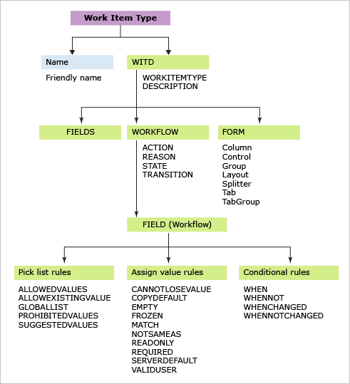

# Add or modify a work item type 

[!INCLUDE [version-lt-azure-devops](../includes/version-lt-azure-devops.md)]

Your project contains a number of work item types, based on the process used to create your project, such as [Agile](../boards/work-items/guidance/agile-process.md), [Basic](../boards/get-started/plan-track-work.md), [Scrum](../boards/work-items/guidance/scrum-process.md), or [CMMI](../boards/work-items/guidance/cmmi-process.md).  A work item type is the object you use to [track different types of work](../boards/work-items/about-work-items.md). 

> [!NOTE]    
> For Azure DevOps Services or for project collections that use the Inherited process model, see [Add and manage work item types](../organizations/settings/work/customize-process-work-item-type.md).

You can modify an existing work item type or add a custom work item type based on your team's tracking requirements or workflow processes. The most common reasons to modify a work item type are to add or modify the set of fields or field rules, change the workflow, or customize the work item form.   

See [Add or modify a field](add-modify-field.md) if you want to add a custom field or modify the field rules or attributes of an existing field. 

Most work item type customizations are made to the work item type XML definition, however, other customization are made through the Process Configuration definition or through the **witadmin** command line tool.  

> [!NOTE]    
> For Azure DevOps Services or for collections that use the Inherited process model, see [Add and manage work item types](../organizations/settings/work/customize-process-work-item-type.md).

#### Work item type definition  
- [Add or modify a field to an existing work item type](#modify-field)
- [Add a custom work item type, modify a work item type](#add-wit)
- [Change the workflow (states, reasons, transitions)](#modify-workflow)
- [Modify the work item form](/previous-versions/azure/devops/reference/xml/change-work-item-form-layout)

#### ProcessConfiguration definition  

- [Specify the work item type color](#change-wit-color)
- [Specify the work item type icon](#change-wit-color)  
- [Specify the workflow state color](#change-wit-color)
- [Add or remove a work item type from the backlog or task board](#change-wit-backlog-board)
- [Add a custom work item type to a backlog or board](add-wits-to-backlogs-and-boards.md)
- [Add a portfolio backlog](add-portfolio-backlogs.md)

#### Command line change
- [List work item types](witadmin/witadmin-import-export-manage-wits.md)
- [Deactivate or disable a work item type](#deactivate-wit)
- [Rename a work item type](#rename-wit) 
- [Delete a work item type](#delete-wit) 


## Prerequisites

::: moniker range=">= azure-devops-2019"

- To list work item types, you must have your **View project-level information** permission for the project in the collection set to **Allow**.  
- To add or customize a work item type by customizing a process template, you must be a member of the Project Collection Administrators group or have your **Edit process** permission set to **Allow**.    
::: moniker-end

::: moniker range="< azure-devops-2019"
- To list work item types, you must have your **View project-level information** permission for the project in the collection set to **Allow**.  
- To add or customize a work item type, you must be a member of the Project Administrators group or have your **Edit project-level information** permission set to **Allow**.
::: moniker-end

To get added as an administrator, see [Change project collection-level permissions](../organizations/security/change-organization-collection-level-permissions.md).


## How do modifications to work item types affect existing work items?

The following table summarizes the effect on existing work items when you modify fields or work item type definitions.

|Action|Effect on existing work items| 
|---|---| 
|Remove fields from a work item type|Data for the removed fields remains in the data store. However, no new data can be added, because you've removed them from the work item type definition.|  
|Rename a field|Data for the renamed fields remains in the data store under the new friendly name.| 
|Delete fields|Data for the deleted fields is removed from the data store.| 
|Rename a work item type|All data remains intact under the new name.| 
|Delete a work item type|All data for work items created as the deleted work item type is permanently removed with no chance for recovery.| 

If you want to completely remove the fields from the data store, use [`witadmin deletefield` command line tool](witadmin/manage-work-item-fields.md).
 

<a id="witadmin">  </a>  

## Import and export work item type definition files 

> [!NOTE]    
>If you use the Hosted XML process model, you need to import and export the process template used by your project. For details, see [Customize the work item tracking web form](customize-wit-form.md).

1. If you don't have administration permissions for your project, [get them](../organizations/security/change-organization-collection-level-permissions.md).   
   [!INCLUDE [temp](../includes/witadmin-run-tool-example.md)] 

2. Export the work item type definition file where you want to modify or add a field. Specify the name of the work item type and a name for the file.  

    `witadmin exportwitd /collection:CollectionURL /p:ProjectName /n:TypeName /f:"DirectoryPath/FileName.xml"`  

    An example of a *CollectionURL* is `http://MyServer:8080/tfs/TeamProjectCollectionName`.  

3. Edit the file. For details, see [Index to XML element definitions](/previous-versions/azure/devops/reference/xml/xml-element-reference).  

4. Import the definition file.  

   `witadmin importwitd /collection:CollectionURL /p:ProjectName /f:"DirectoryPath/FileName.xml"`  

5. Open the web portal or refresh the page to view the changes.  

   For more information about using `witadmin`, see [Import, export, and manage work item types](witadmin/witadmin-import-export-manage-wits.md).

<a id="add-wit">  </a>
<a id="edit-wit">  </a>
<a id="modify-wit">  </a>

## Add or modify a work item type 

To add a custom work item type or modify an existing work item type, you define or modify the XML definition file and then import it to your project [based on the process model you use](customize-work.md). You modify a work item type by specifying the elements defined within the three main sections of the definition file: **FIELDS**, **WORKFLOW**, and **FORM**.  



The easiest way to add a new work item type is to copy an existing work item type and then modify the definition file. 


<a id="modify-field">  </a>

## Add or modify a field, field rule, label, or empty text  

Any field that you want to use to track data must be added to the definition file. This is true for all but system fields (fields whose reference name start with **System.**). All System fields are defined for all work item types, whether or not you include them in the work item type definition. To learn more about each field, see [Work item field index](../boards/work-items/guidance/work-item-field.md).

You add fields and field rules to the **FIELDS** section. For the field to appear on the work item form, you must also add it to the **FORM** section of the definition.

For example, to add the work item ID to a form, specify the following XML syntax within the `FORM` section.

```xml
<Control FieldName="System.ID" Type="FieldControl" Label="ID" LabelPosition="Left" />
```

To learn more about defining fields, see [Add or modify a field](add-modify-field.md).

<a id="modify-workflow">  </a>

## Modify the workflow

**STATES**  and **REASONS** sections within the **WORKFLOW** specify the pick list values in the **State** and **Reason** fields. They track the status of work items. The **TRANSITIONS** section specifies the valid transitions between states, as shown in the following illustration. You specify both forward and regressive transitions.


You change the workflow to accomplish the following objectives:

-   Add or remove a state, reason, or transition  
-   Specify a value for field to be applied during a change in state, reason, or transition  
-   Specify a custom **ACTION** to automate field assignments based on a change in state, reason, or transition.  

When you customize the workflow, follow these two steps:   

1.  [Modify the WORKFLOW of the work item type definition](xml/change-workflow-wit.md).  

2.  [Modify the process configuration to map new workflow states to metastates](xml/process-configuration-xml-element.md).  

    This second step is required when you change the workflow for a work item type that appears on an Agile tool page. These work item types belong to either the Requirement or Task categories.   

<a id="workflow-rules">  </a>

### Workflow field rules

You can apply field rules when you change state, specify a reason, or during a workflow transition.

For example, by adding the **EMPTY** rule when the state is set to Active, you can automatically nullify the Closed Date and Closed By fields and make them read-only. This is useful when reactivating a work item from a closed state.

```xml
<STATE value="Active">
   <FIELDS>
. . .
      <FIELD refname="Microsoft.VSTS.Common.ClosedDate"><EMPTY/></FIELD>
      <FIELD refname="Microsoft.VSTS.Common.ClosedBy"><EMPTY/></FIELD>
   </FIELDS>
</STATE>  
```

Apply workflow field rules to accomplish the following actions:

-   Qualify the value a field can have by specifying **CANNOTLOSEVALUE**, **EMPTY**, **FROZEN**, **NOTSAMEAS**, **READONLY**, and **REQUIRED**  
-   Copy a value into a field by using **COPY**, **DEFAULT**, and **SERVERDEFAULT**  
-   Restrict who can modify a field  
-   Enforce pattern matching on a string field by using **MATCH**  
-   Conditionally apply rules based on values in other fields using **WHEN**, **WHENNOT**, **WHENCHANGED**, and **WHENNOTCHANGED**  
-   Limit rules to apply to specific users or groups. Most rules support the **for** or **not** attributes to focus who the rule does and doesn't apply to.    

For more information about applying workflow field rules, see [FIELD (Workflow) element reference](/previous-versions/azure/devops/reference/xml/field-workflow-element-reference) and [Rules and rule evaluation](../organizations/settings/work/rule-reference.md).  

<a id="modify-form">  </a>

## Customize the work item form  

The following illustrations highlight the most common elements on work item forms. You can customize all of them except the title area and form controls. The elements you use to customize the form depend on [whether or not the new form has been enabled by your admin](/previous-versions/azure/devops/reference/manage-new-form-rollout?view=tfs-2015&preserve-view=true).   


You can customize the form to accomplish the following objectives:  

- [Add or modify a field](/previous-versions/azure/devops/reference/xml/weblayout-xml-elements)
- [Change a field label](/previous-versions/azure/devops/reference/xml/weblayout-xml-elements)
- [Rearrange fields](/previous-versions/azure/devops/reference/xml/weblayout-xml-elements)
- [Add a group or page](/previous-versions/azure/devops/reference/xml/weblayout-xml-elements)
- [Add a group](/previous-versions/azure/devops/reference/xml/weblayout-xml-elements)
- [Add a custom control, group, or page](/previous-versions/azure/devops/reference/xml/weblayout-xml-elements)
- [Add informational text or hyperlinks](xml/provide-help-text-hyperlinks-web-content-form.md)
- [Embed HTML text or display dynamic reports](xml/provide-help-text-hyperlinks-web-content-form.md)
- [Add a links-control page](/previous-versions/azure/devops/reference/xml/linkscontroloptions-xml-elements) 


<a id="change-wit-backlog-board">  </a>

## Add or remove a work item type from the backlog or task board

The Agile planning tools&mdash;product backlog, sprint backlog, and task board pages&mdash;display specific work item types based on the process template used to create your project. You can add or remove work item types to appear on these pages. For example, if your project uses Scrum work item types, both product backlog items and bugs appear on the backlog pages. However, if your project was created using the Agile, CMMI, or other process template, bugs don't appear on your backlog or task board.

For example, you can add bugs from the product backlog page. 

To learn how to add or remove work item types from the backlog or task board, see [Add a work item type to a backlog and board](add-wits-to-backlogs-and-boards.md). To add a new work item type to support a portfolio backlog, see [Add a portfolio backlog level](add-portfolio-backlogs.md).


<a id="change-wit-color">  </a>

## Change the color, icon, or workflow state color of a work item type

In the web portal, work items appear in query results and on the backlog and board pages of the Agile tools. To change the color or icon associated with an existing work item type or add the color to use for a new work item type, [edit the process configuration](xml/process-configuration-xml-element.md#wit-colors). To change the color for a workflow state, you also [edit the process configuration](xml/process-configuration-xml-element.md#state-colors). 

 
  


## Change the type of an existing work item  

See [Bulk move work items and change the work item type](../boards/backlogs/move-change-type.md) for the features available to you based on your platform. 

<a id="deactivate-wit">  </a>

## Deactivate or disable a work item type  

If you want to restrict creation of a specific work item type to a group of users, [add the work item type to the Hidden Categories group](/previous-versions/azure/devops/reference/xml/use-categories-to-group-work-item-types) to prevent the majority of contributors from creating them. If you want to allow a group of users access, you [can create a hyperlink to a template](../boards/backlogs/work-item-template.md) that opens the work item form and share that link with those team members who you do want to create them.

> [!NOTE]   
> You can't add field rules to restrict the workflow as you can't apply rules to system fields. 


<a id="delete-wit">  </a>

## Delete a work item type 

To prevent team members from using a specific work item type to create a work item, you can remove it from the project. When you use `witadmin destroywitd*`, you permanently remove all work items that were created using that work item type as well as the work item type itself. For example, if your team doesn't use "Impediment", you can delete the work item type labeled "Impediment" from the Fabrikam Web Site project.

```
witadmin destroywitd /collection:"http://FabrikamPrime:8080/tfs/DefaultCollection" /p:"Fabrikam Web Site" /n:"Impediment" 
```

When you delete a work item type that belongs to a category, you must update the categories definition for the project to reflect the new name. For more information, see [Import, export, and manage work item types](witadmin/witadmin-import-export-manage-wits.md) and [Import and export categories](/previous-versions/azure/devops/reference/witadmin/witadmin-import-export-categories).

<a name="rename-wit" />

## Rename a work item type

To rename an existing work item type use `witadmin renamewitd`. For example, you can rename a work item type labeled "QoS Item" to "Service Agreement."

```
witadmin renamewitd /collection:"http://FabrikamPrime:8080/tfs/DefaultCollection" /p:"Fabrikam Web Site" /n:"QoS Item" /new:"Service Agreement"
```

When you rename a work item type that belongs to a category, you have to update the categories definition for the project to reflect the new name. In particular, the [backlogs and boards](../boards/backlogs/backlogs-boards-plans.md) will not work until you update the categories definition.

For more information, see [Import, export, and manage work item types](witadmin/witadmin-import-export-manage-wits.md) and [Import and export categories](/previous-versions/azure/devops/reference/witadmin/witadmin-import-export-categories).  


::: moniker range="tfs-2018"

## Enable features after upgrade 

What customizations can you make and still use the Configure Features Wizard to update my project after an on-premises upgrade?  

You can add custom work item types and change the form layout. The [Configure Features Wizard](/previous-versions/azure/devops/reference/upgrade/configure-features-after-upgrade?view=tfs-2017&preserve-view=true) will update your projects and you'll get access to the latest features.

Changing the workflow or renaming a work item type might require you to perform some manual operations when updating your project. To learn about other customizations that you can safely make and which you should avoid, see [Customize the work tracking experience: Before you customize, understand the maintenance and upgrade implications](on-premises-xml-process-model.md#before-you-customize).  
 
::: moniker-end

## Related articles

This article addressed how to add and customize work item types for Hosted XML and On-premises XML process models. For information on adding and customizing work item types for the Inherited process model, see [Customize a process](../organizations/settings/work/customize-process.md).  

Other related topics or resources: 

- [Rules and rule evaluation](../organizations/settings/work/rule-reference.md)
- [Guide to administrative tasks](../organizations/accounts/organization-management.md)  
- [ProcessConfiguration XML elements](xml/process-configuration-xml-element.md)
- [**witadmin** command-line tools](witadmin/witadmin-customize-and-manage-objects-for-tracking-work.md)
- [Customize the work tracking experience](customize-work.md)  
- [Customize cards on boards](../boards/boards/customize-cards.md)  
