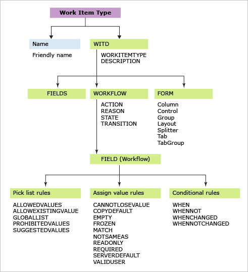
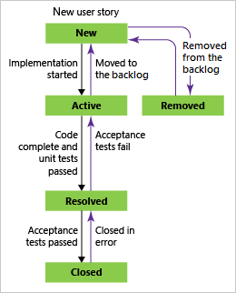
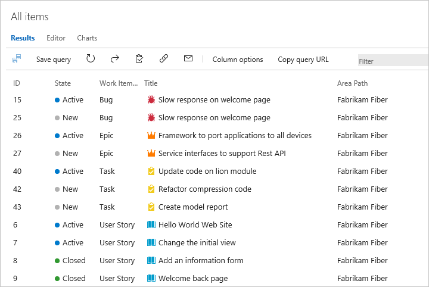

# Add or modify a work item type 

[!INCLUDE [version-lt-azure-devops](../includes/version-lt-azure-devops.md)]

Every project includes a set of work item types defined by its process—[Agile](../boards/work-items/guidance/agile-process.md), [Basic](../boards/get-started/plan-track-work.md), [Scrum](../boards/work-items/guidance/scrum-process.md), or [CMMI](../boards/work-items/guidance/cmmi-process.md).
Use work item types to [track different types of work](../boards/work-items/about-work-items.md).
Modify existing types or add custom ones to match your team's tracking requirements and workflow.

> [!NOTE]
> This article applies to the On-premises XML process model.
> For Azure DevOps Services or collections that use the Inherited process model, see [Add and manage work item types](../organizations/settings/work/customize-process-work-item-type.md).

Common reasons to customize a work item type include:

- Adding or modifying fields or field rules
- Changing the workflow (states, reasons, transitions)
- Customizing the work item form layout

To modify fields only, see [Add or modify a field](add-modify-field.md).

You can customize work item types through the XML definition file, the process configuration definition, or the **witadmin** command-line tool.
The following lists show what you can do with each approach.

#### Work item type definition
- [Add or modify a field](#modify-field)
- [Add or modify a work item type](#add-wit)
- [Change the workflow](#modify-workflow)
- [Modify the work item form](/previous-versions/azure/devops/reference/xml/change-work-item-form-layout)

#### Process configuration definition
- [Specify the work item type color](#change-wit-color)
- [Specify the work item type icon](#change-wit-color)
- [Specify the workflow state color](#change-wit-color)
- [Add or remove a work item type from the backlog or task board](#change-wit-backlog-board)
- [Add a custom work item type to a backlog or board](add-wits-to-backlogs-and-boards.md)
- [Add a portfolio backlog](add-portfolio-backlogs.md)

#### Command-line change
- [List work item types](witadmin/witadmin-import-export-manage-wits.md)
- [Deactivate or disable a work item type](#deactivate-wit)
- [Rename a work item type](#rename-wit)
- [Delete a work item type](#delete-wit)

## Prerequisites

| Category | Requirements |
|----------|-------------|
| **Permissions** | - To list work item types: **View project-level information** permission set to **Allow**.<br>- To add or customize a work item type: Member of the **Project Collection Administrators** group, or **Edit process** permission set to **Allow**. |

To get added as an administrator, see [Change project collection-level permissions](../organizations/security/change-organization-collection-level-permissions.md).

## How modifications to work item types affect existing work items

The following table summarizes the effect on existing work items when you modify fields or work item type definitions.

| Action | Effect on existing work items |
|---|---|
| Remove fields from a work item type | Data for the removed fields remains in the data store. However, the fields no longer appear in the work item type definition, so no new data can be entered. |
| Rename a field | Data for the renamed field remains in the data store under the new friendly name. |
| Delete fields | Data for the deleted fields is removed from the data store. |
| Rename a work item type | All data remains intact under the new name. |
| Delete a work item type | All data for work items created with the deleted work item type is permanently removed with no chance for recovery. |

To completely remove fields from the data store, use the [`witadmin deletefield` command-line tool](witadmin/manage-work-item-fields.md).

<a id="witadmin"></a>

## Import and export work item type definition files

> [!NOTE]
> If you use the Hosted XML process model, import and export the process template used by your project.
> For details, see [Customize the work item tracking web form](customize-wit-form.md).

1. If you don't have administration permissions for your project, [get them](../organizations/security/change-organization-collection-level-permissions.md).
   [!INCLUDE [temp](../includes/witadmin-run-tool-example.md)]

1. Export the work item type definition file where you want to modify or add a field.
   Specify the name of the work item type and a name for the file.

    `witadmin exportwitd /collection:CollectionURL /p:ProjectName /n:TypeName /f:"DirectoryPath/FileName.xml"`

    An example of a *CollectionURL* is `http://MyServer:8080/tfs/TeamProjectCollectionName`.

1. Edit the file.

1. Import the definition file.

   `witadmin importwitd /collection:CollectionURL /p:ProjectName /f:"DirectoryPath/FileName.xml"`

1. Open the web portal or refresh the page to view the changes.

   For more information about using `witadmin`, see [Import, export, and manage work item types](witadmin/witadmin-import-export-manage-wits.md).

<a id="add-wit"></a>
<a id="edit-wit"></a>
<a id="modify-wit"></a>

## Add or modify a work item type

To add a custom work item type or modify an existing one, define or modify the XML definition file and then import it to your project [based on the process model you use](customize-work.md).
The definition file has three main sections: **FIELDS**, **WORKFLOW**, and **FORM**.



The easiest way to add a new work item type is to copy an existing one and then modify the definition file.

<a id="modify-field"></a>

## Add or modify a field, field rule, label, or empty text

Add any field that you want to use to track data to the definition file.
This guideline applies to all but system fields (fields whose reference name starts with **System.**).
All system fields are defined for all work item types, whether or not you include them in the work item type definition.
For more information about each field, see [Work item field index](../boards/work-items/guidance/work-item-field.md).

Add fields and field rules to the **FIELDS** section.
For the field to appear on the work item form, add it to the **FORM** section of the definition.

For example, to add the work item ID to a form, specify the following XML syntax within the `FORM` section.

```xml
<Control FieldName="System.ID" Type="FieldControl" Label="ID" LabelPosition="Left" />
```

For more information about defining fields, see [Add or modify a field](add-modify-field.md).

<a id="modify-workflow">  </a>

## Modify the workflow

The **STATES** and **REASONS** sections within the **WORKFLOW** specify the pick list values in the **State** and **Reason** fields.
These sections track the status of work items.
The **TRANSITIONS** section specifies the valid transitions between states, as the following diagram shows.
You specify both forward and regressive transitions.



Change the workflow to accomplish the following objectives:

- Add or remove a state, reason, or transition.
- Specify a value for a field to apply during a change in state, reason, or transition.
- Specify a custom **ACTION** to automate field assignments based on a change in state, reason, or transition.

When you customize the workflow, follow these two steps:

1. [Modify the WORKFLOW of the work item type definition](xml/change-workflow-wit.md).

1. [Modify the process configuration to map new workflow states to metastates](xml/process-configuration-xml-element.md).

    This second step is required when you change the workflow for a work item type that appears on an Agile tool page.
    These work item types belong to either the Requirement or Task categories.

<a id="workflow-rules"></a>

### Workflow field rules

You can apply field rules when you change state, specify a reason, or during a workflow transition.

For example, by adding the **EMPTY** rule when the state is set to Active, you can automatically nullify the Closed Date and Closed By fields and make them read-only. This rule is useful when reactivating a work item from a closed state.

```xml
<STATE value="Active">
   <FIELDS>
. . .
      <FIELD refname="Microsoft.VSTS.Common.ClosedDate"><EMPTY/></FIELD>
      <FIELD refname="Microsoft.VSTS.Common.ClosedBy"><EMPTY/></FIELD>
   </FIELDS>
</STATE>  
```

Apply workflow field rules to accomplish the following actions:

- Qualify the value a field can have by specifying **CANNOTLOSEVALUE**, **EMPTY**, **FROZEN**, **NOTSAMEAS**, **READONLY**, and **REQUIRED**.
- Copy a value into a field by using **COPY**, **DEFAULT**, and **SERVERDEFAULT**.
- Restrict who can modify a field.
- Enforce pattern matching on a string field by using **MATCH**.
- Conditionally apply rules based on values in other fields by using **WHEN**, **WHENNOT**, **WHENCHANGED**, and **WHENNOTCHANGED**.
- Limit rules to apply to specific users or groups. Most rules support the **for** or **not** attributes to specify who the rule does or doesn't apply to.

For more information about applying workflow field rules, see [FIELD (Workflow) element reference](/previous-versions/azure/devops/reference/xml/field-workflow-element-reference) and [Rules and rule evaluation](../organizations/settings/work/rule-reference.md).

<a id="modify-form"></a>

## Customize the work item form

The following screenshot highlights the most common elements on work item forms.
You can customize all of them except the title area and form controls.
The elements you use to customize the form depend on [whether the new form is enabled](/previous-versions/azure/devops/reference/manage-new-form-rollout?view=tfs-2015&preserve-view=true).


Customize the form to accomplish the following objectives:

- [Add or modify a field](/previous-versions/azure/devops/reference/xml/weblayout-xml-elements)
- [Change a field label](/previous-versions/azure/devops/reference/xml/weblayout-xml-elements)
- [Rearrange fields](/previous-versions/azure/devops/reference/xml/weblayout-xml-elements)
- [Add a group or page](/previous-versions/azure/devops/reference/xml/weblayout-xml-elements)
- [Add a custom control, group, or page](/previous-versions/azure/devops/reference/xml/weblayout-xml-elements)
- [Add informational text or hyperlinks](xml/provide-help-text-hyperlinks-web-content-form.md)
- [Embed HTML text or display dynamic reports](xml/provide-help-text-hyperlinks-web-content-form.md)
- [Add a links-control page](/previous-versions/azure/devops/reference/xml/linkscontroloptions-xml-elements)

<a id="change-wit-backlog-board"></a>

## Add or remove a work item type from the backlog or task board

The Agile planning tools - product backlog, sprint backlog, and task board pages - display specific work item types based on the process template you use to create your project.
You can add or remove work item types from these pages.
For example, if your project uses Scrum work item types, both product backlog items and bugs appear on the backlog pages.
However, if your project uses the Agile, CMMI, or another process template, bugs don't appear on the backlog or task board.

To add or remove work item types from the backlog or task board, see [Add a work item type to a backlog and board](add-wits-to-backlogs-and-boards.md).
To add a new work item type to support a portfolio backlog, see [Add a portfolio backlog level](add-portfolio-backlogs.md).

<a id="change-wit-color"></a>

## Change the color, icon, or workflow state color of a work item type

In the web portal, work items appear in query results and on the backlog and board pages of the Agile tools.
To change the color or icon associated with an existing work item type or add the color for a new work item type, [edit the process configuration](xml/process-configuration-xml-element.md#wit-colors).
To change the color for a workflow state, [edit the process configuration](xml/process-configuration-xml-element.md#state-colors).



## Change the type of an existing work item

For the features available based on your platform, see [Bulk move work items and change the work item type](../boards/backlogs/move-change-type.md).

<a id="deactivate-wit"></a>

## Deactivate or disable a work item type

To restrict the creation of a specific work item type to a group of users, [add the work item type to the Hidden Categories group](/previous-versions/azure/devops/reference/xml/use-categories-to-group-work-item-types) to prevent most contributors from creating it.
To grant access to a specific group of users, [create a hyperlink to a template](../boards/backlogs/work-item-template.md) that opens the work item form and share that link with team members who need to create it.

> [!NOTE]
> You can't add field rules to restrict the workflow because you can't apply rules to system fields.

<a id="delete-wit">  </a>

## Delete a work item type

To prevent team members from using a specific work item type to create a work item, remove it from the project.
When you use `witadmin destroywitd`, you permanently remove all work items created with that work item type and the work item type itself.
For example, if your team doesn't use "Impediment," delete the work item type labeled "Impediment" from the Fabrikam Web Site project.

```
witadmin destroywitd /collection:"http://FabrikamPrime:8080/tfs/DefaultCollection" /p:"Fabrikam Web Site" /n:"Impediment"
```

When you delete a work item type that belongs to a category, update the categories definition for the project to reflect the deletion.
For more information, see [Import, export, and manage work item types](witadmin/witadmin-import-export-manage-wits.md) and [Import and export categories](/previous-versions/azure/devops/reference/witadmin/witadmin-import-export-categories).

<a id="rename-wit"></a>

## Rename a work item type

To rename an existing work item type, use `witadmin renamewitd`. For example, you can rename a work item type labeled "QoS Item" to "Service Agreement."

```
witadmin renamewitd /collection:"http://FabrikamPrime:8080/tfs/DefaultCollection" /p:"Fabrikam Web Site" /n:"QoS Item" /new:"Service Agreement"
```

When you rename a work item type that belongs to a category, update the categories definition for the project to reflect the new name.
The [backlogs and boards](../boards/backlogs/backlogs-boards-plans.md) don't work until you update the categories definition.

For more information, see [Import, export, and manage work item types](witadmin/witadmin-import-export-manage-wits.md) and [Import and export categories](/previous-versions/azure/devops/reference/witadmin/witadmin-import-export-categories).

## Related content

- [Customize a process](../organizations/settings/work/customize-process.md)
- [Rules and rule evaluation](../organizations/settings/work/rule-reference.md)
- [Guide to administrative tasks](../organizations/accounts/organization-management.md)
- [Customize the work tracking experience](customize-work.md)
- [Customize cards on boards](../boards/boards/customize-cards.md)
