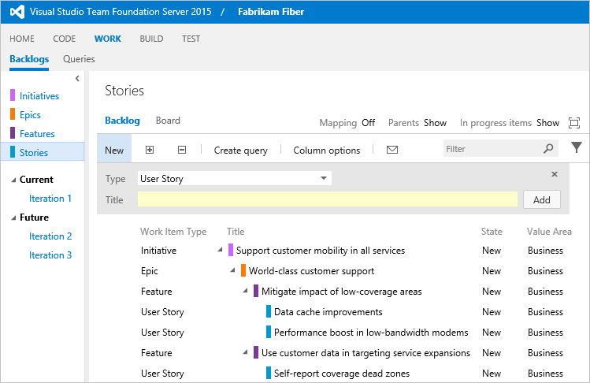
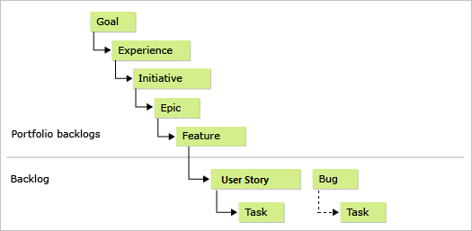

# Add a portfolio backlog level

[!INCLUDE [version-lt-eq-azure-devops](../includes/version-lt-eq-azure-devops.md)]

Your project includes two portfolio backlogs: Features and Epics.
If you need more portfolio backlogs, you can add them.

> [!IMPORTANT]
> This article applies to project customization for Hosted XML and On-premises XML process models.
> For the Inheritance process model, see [Customize your backlogs or boards for a process](../organizations/settings/work/customize-process.md).
>
> For an overview of process models, see [Customize your work tracking experience](customize-work.md).

Use portfolio backlogs to organize your backlog under business initiatives.
When you [organize your backlogs into portfolios](../boards/backlogs/organize-backlog.md), you get a hierarchical view of the work defined in lower-level backlogs, including work in progress across several teams.
Program managers can track the status of backlog items of interest and drill down to ensure that all work is represented.

> [!NOTE]
> If you didn't yet enable the Portfolio Backlogs feature for your on-premises Azure DevOps Server project, [do that first](/previous-versions/azure/devops/reference/upgrade/configure-features-after-upgrade?view=tfs-2017&preserve-view=true).

This example adds a third portfolio backlog, Initiative.
By using it, the management team can set priorities and view progress of work belonging to initiatives.

<a id="image-diff"></a>

> [!NOTE]
> The images in your web portal might differ from the images in this article.
> These differences result from updates made to your project and the process template used when creating your project&mdash;[Agile](../boards/work-items/guidance/agile-process.md), [Scrum](../boards/work-items/guidance/scrum-process.md), or [CMMI](../boards/work-items/guidance/cmmi-process.md).
> The basic functionality remains the same unless explicitly mentioned.



You can add up to five levels of portfolio backlogs.
Each team can [select which backlogs appear for them to work on](../organizations/settings/select-backlog-navigation-levels.md).

<a id="overview"></a>

## Process overview

The process to add another portfolio backlog differs slightly depending on the [process model](customize-work.md) you use.

- For **Hosted XML**: Export your process, add or update definition files, and then import that process to either update existing projects or use it to create a project.
- For **On-premises XML**: Export your work tracking definition files, update them, and then import them to your project.

This article walks you through adding a portfolio backlog to a project based on the [Agile process](../boards/work-items/guidance/agile-process.md) in these five steps:

1. [Export the files you need](#export-files)
1. [Create the Initiative work item type](#create-initiative)
1. [Update Categories with the Initiative Category](#update-categories)
1. [Update ProcessConfiguration to add the Initiative portfolio backlog](#update-processconfig)
1. [Update your project and verify your changes](#update-team-project)

You can apply the same steps if you work with a project based on the [Scrum](../boards/work-items/guidance/scrum-process.md) or [CMMI](../boards/work-items/guidance/cmmi-process.md) process.
When you're done, you can manage your portfolio of projects by grouping work within these four levels: User Stories (or Product backlog items or Requirements), Features, Epics, and Initiatives.

For more information, see [About processes and process templates](../boards/work-items/guidance/choose-process.md).
For an overview of the three process models, see [Customize your work tracking experience](customize-work.md).

<a id="export-files"></a>

## 1. Export the files you need

1. If you're not a member of the **Project Collection Administrators** group, [get added as an administrator](../organizations/security/change-organization-collection-level-permissions.md).
	You need these permissions to customize the project.
1. Get the files you need:

	- For **Hosted XML**: [Export the process you want to update](../organizations/settings/work/import-process/import-process.md).
		Save the files to a folder that you use to update these files and folders: Categories, ProcessConfiguration, and WorkItemTypes.
	- For **On-premises XML**: [Export the definition files you'll need](#import-export): Epic, Categories, and ProcessConfiguration.

<a id="create-initiative"></a>

## 2. Create a work item type named Initiative

The easiest way to create a work item type (WIT) is to copy an existing one, rename it, and edit it to support your requirements.
In this example, copy the Epic WIT and label it Initiative.

1. Copy the `Epic` WIT definition to an XML file labeled `Initiative`.
	The Epic.xml file is located in the WorkItem Tracking folder of the ProcessTemplate folder.

1. Edit the file named `Initiative`:

	1. Rename the WIT. Replace `WORKITEMTYPE name="Epic"` with `WORKITEMTYPE name="Initiative"`, and update the description.

		```xml
		<WORKITEMTYPE name="Initiative">
		   <DESCRIPTION>Initiatives help program managers to effectively manage and organize work across several teams</DESCRIPTION>
		   . . .
		</WORKITEMTYPE>
		```

	1. Add any [custom fields that you want to track](add-modify-field.md) using this WIT.

	1. Rename the `Tab` section named `Features` to `Epics` and replace `Filter WorkItemType="Feature"` with `Filter WorkItemType="Epic"`.

		```xml
		<Tab Label="Epics">
		<Control Type="LinksControl" Name="Hierarchy">
		   <LinksControlOptions>
		   <WorkItemLinkFilters FilterType="include">
		   <Filter LinkType="System.LinkTypes.Hierarchy" />
		   </WorkItemLinkFilters>
		   <WorkItemTypeFilters FilterType="include">
		      <Filter WorkItemType="Epic" />
		   </WorkItemTypeFilters>
		      <ExternalLinkFilters FilterType="excludeAll" />
		      <LinkColumns>
		          <LinkColumn RefName="System.ID" />
		          <LinkColumn RefName="System.Title" />
		          <LinkColumn RefName="System.AssignedTo" />
		          <LinkColumn RefName="System.State" />
		          <LinkColumn LinkAttribute="System.Links.Comment" />
		          </LinkColumns>
		   </LinksControlOptions>
		</Control>
		</Tab>
		```

		This change causes the tab control to exclusively show or link to epics as child work items of the initiative.


<a id="update-categories"></a>

## 3. Update categories with the initiative category

Add the initiative category.
This category adds the initiative backlog to process configuration.
The agile experience manages WITs according to categories.

Add the initiative category to the `Categories.xml` file (located in the WorkItem Tracking folder).

```xml
  <CATEGORY name="Initiative Category" refname="FabrikamFiber.InitiativeCategory">  
    <DEFAULTWORKITEMTYPE name="Initiative" />  
  </CATEGORY>  
```  

You can add this category anywhere within the definition file.
Since you're adding a custom category, label the category by using your company name.

<a id="update-processconfig"></a>

## 4. Update ProcessConfiguration to add the Initiative portfolio backlog

In this last step, add the Initiative portfolio backlog to the process and modify the Feature portfolio backlog to reflect the hierarchy between Initiatives and Features.
The process configuration determines the parent-child relationships among the portfolio backlogs.

1.  Edit the ProcessConfiguration file to add a new portfolio backlog within the ```PortfolioBacklogs``` section. (The ProcessConfiguration.xml file is located in the WorkItem Tracking/Process folder of the ProcessTemplate folder.)

    Add the Initiative Category by adding the following syntax. Replace the names, workflow state values, and default column fields to match those that you use. 

    ```xml
    <PortfolioBacklog category="FabrikamFiber.InitiativeCategory" pluralName="Initiatives" singularName="Initiative" workItemCountLimit="1000">
      <States>
        <State value="New" type="Proposed" />
        <State value="Active" type="InProgress" />
        <State value="Resolved" type="InProgress" />
        <State value="Closed" type="Complete" />
      </States>
      <Columns>
        <Column refname="System.WorkItemType" width="100" />
        <Column refname="System.Title" width="400" />
        <Column refname="System.State" width="100" />
        <Column refname="Microsoft.VSTS.Scheduling.Effort" width="50" />
        <Column refname="Microsoft.VSTS.Common.BusinessValue" width="50" />
        <Column refname="Microsoft.VSTS.Common.ValueArea" width="100" />
        <Column refname="System.Tags" width="200" />
      </Columns>
      <AddPanel>
        <Fields>
          <Field refname="System.Title" />
        </Fields>
      </AddPanel>
    </PortfolioBacklog>
    ```

    If you modified the workflow states, verify that each workflow state is mapped to one of the metastates of ```Proposed```, ```InProgress```, and ```Complete```.
    The last state within the workflow must map to ```Complete```.

1.  Edit the ```PortfolioBacklog``` element for the Epic Category to point to ```Initiative``` as the parent backlog.

    ```xml
    <PortfolioBacklog category="Microsoft.EpicCategory" pluralName="Epics"  
       singularName="Epic" parent="FabrikamFiber.InitiativeCategory"      
       workItemCountLimit="1000">   
       . . .  
    </PortfolioBacklog>
    ```

    Intermediate portfolio backlogs require specifying the parent category, which must be configured as a portfolio backlog.

1.  Add the color to use for Initiative to the ```WorkItemColors``` section.
    ```xml
        <WorkItemColor primary="FFCC66FF" secondary="FFF0D1FF" name="Initiative" />
    ```

    This assigns a bright pink as the primary color to use in list displays, and a paler pink for the secondary color (currently not used).

<a id="update-team-project"></a>

## 5. Update your project and verify access to the new portfolio backlog

1.  Update your project:
    - For **Hosted XML:** [Import your process](../organizations/settings/work/import-process/import-process.md).
    - For **On-premises XML:** [Import the definition files you updated](#import-export) in this order:
        a. Initiative.xml
        b. Categories.xml
        c. ProcessConfiguration.xml

1.  Open or refresh the web portal and confirm that Initiative appears as a portfolio backlog as expected.
    For more information, see [Organize your backlog](../boards/backlogs/organize-backlog.md).
1.  Grant [Advanced access](../organizations/security/change-access-levels.md) to users who need to exercise all the features available with portfolio backlogs.
    For **Hosted XML:** See [Assign licenses to users](../organizations/accounts/add-organization-users.md).


<a id="import-export"></a>

## Import and export definition files (on-premises only)

If you're updating a project that connects to an on-premises Azure DevOps Server, use the **witadmin** commands to import and export definition files.
You need to export the following files:
- Epic.xml
- Categories.xml (located in the WorkItem Tracking folder)
- ProcessConfiguration.xml (located in the WorkItem Tracking/Process folder)

[!INCLUDE [temp](../includes/process-editor.md)]

[!INCLUDE [temp](../includes/witadmin-run-tool-example.md)]

1. Enter the `witadmin` command, substituting your data for the arguments that are shown.
	For example, to import a WIT:

    ```
    witadmin importwitd /collection:CollectionURL /p:"ProjectName" /f:"DirectoryPath\WITDefinitionFile.xml"
    ```

    For *CollectionURL*, specify the URL of a project collection. For *ProjectName*, specify the name of a project defined within the collection.
    You must specify the URL in the following format: `http://ServerName:Port/VirtualDirectoryName/CollectionName`.

    For *DirectoryPath*, specify the path to the `WorkItem Tracking/TypeDefinitions` folder that holds the process template that you downloaded.
    The directory path must follow this structure: `Drive:\TemplateFolder\WorkItem Tracking\TypeDefinitions`.

    For example, import the ServiceApp WIT:

    ```
    witadmin importwitd /collection:"http://MyServer:8080/tfs/DefaultCollection" /p:MyProject /f:"DirectoryPath/ServiceApp.xml"
    ```

Use these commands to export and import categories and process configuration: 

```
witadmin exportwitd /collection:CollectionURL /p:"ProjectName" /n:TypeName /f:"DirectoryPath\WITDefinitionFile.xml"

witadmin importwitd /collection:CollectionURL /p:"ProjectName" /f:"DirectoryPath\WITDefinitionFile.xml"

witadmin exportcategories /collection:"CollectionURL" /p:"ProjectName" /f:"DirectoryPath/categories.xml"

witadmin importcategories /collection:"CollectionURL" /p:"ProjectName" /f:"DirectoryPath/categories.xml"

witadmin exportprocessconfig /collection:"CollectionURL" /p:"ProjectName" /f:"DirectoryPath/ProcessConfiguration.xml"

witadmin importprocessconfig /collection:"CollectionURL" /p:"ProjectName" /f:"DirectoryPath/ProcessConfiguration.xml"
```


## Related content

You can add up to five portfolio backlogs, including the default Feature and Epic backlogs.
In total, this structure gives you seven levels from the top-level portfolio backlog to task.



To add another work item type to your backlogs or boards, see [Add work item types to backlogs and boards](add-wits-to-backlogs-and-boards.md).

- [All WITD XML elements reference](/previous-versions/azure/devops/reference/xml/all-witd-xml-elements-reference)
- [Process configuration XML element reference](xml/process-configuration-xml-element.md)
- [Import, export, and manage work item types](witadmin/witadmin-import-export-manage-wits.md)
- [Import and export categories](/previous-versions/azure/devops/reference/witadmin/witadmin-import-export-categories)
- [Import and export process configuration](witadmin/witadmin-import-export-process-configuration.md)
- [Customize your work tracking experience](customize-work.md)

### Portfolio backlog hierarchy

What controls the hierarchy among portfolio backlogs?

The process configuration determines the hierarchy through the assignment of parent categories to portfolio backlog categories.
Only parent-child relationships are supported.
The uppermost category within the hierarchy doesn't contain a parent assignment.

### Portfolio backlogs and WIT categories

Can I define more than one WIT in a category that I use for a portfolio backlog?

Yes.
For example, you can add Goal and Initiative WITs to a portfolio backlog category.
The main restriction is to not add the same WIT to two different categories that you assign to one of the following sections for process configuration: a ```PortfolioBacklog```, ```RequirementBacklog```, or ```TaskBacklog```.

### Nesting of backlog items

**Can you nest backlog items in addition to using portfolio backlogs?**

While you can nest backlog items, nesting isn't recommended.
Drag-and-drop linking of nested backlog items isn't supported.
Instead, use [mapping of backlog items to portfolio items](../boards/backlogs/organize-backlog.md).

For examples of how hierarchically linked items that belong to the Requirements Category appear on the backlogs and boards, see [How backlogs and boards display hierarchical (nested) items](../boards/backlogs/resolve-backlog-reorder-issues.md).
