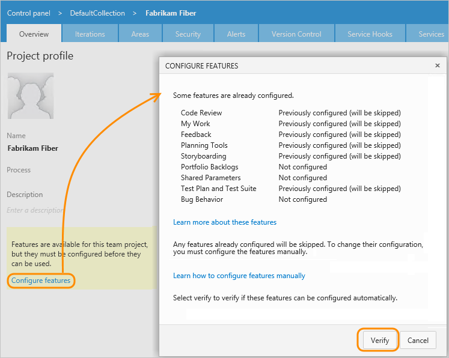
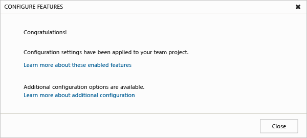

# Configure features after an upgrade

[!INCLUDE [temp](../_shared/version-tfs-2018-earlier.md)]


After upgrading your Team Foundation Server (TFS), you'll want to use the new features that were installed. Some of these features might require updates to your project. The Configure Features wizard is the easiest way to make this happen. 

> [!IMPORTANT] 
> The Configure Features Wizard has been deprecated for Azure DevOps Server 2019. You can only run the wizard on TFS 2018 and earlier versions. Projects defined on Azure DevOps Services [update automatically with each service upgrade](/azure/devops/release-notes/index).  

For information on upgrading your on-premises deployment, see [Upgrade get started guide](/azure/devops/server/upgrade/get-started). For updates made to process templates, see [Changes made to process templates](../boards/work-items/guidance/changes-to-process-templates.md). 

> [!NOTE]    
> If you're upgrading from TFS 2010 or an earlier version, review the steps outlined in [When upgrading from TFS 2008 or TFS 2010](upgrade-tfs-2008-or-2010.md). <br/>
If you need to upgrade TFS, [go to the downloads page](https://visualstudio.microsoft.com/downloads/). <br/> 
If you have several projects to update, you can [apply updates programmatically](#program-updates).  

<a id="RunConfigureFeaturesWizard"/>

## Run the Configure Features wizard

1. From the web portal home page, open the administration context.  

	  

	If you're not a project administrator, [get added as one](../organizations/security/add-users-team-project.md). Only project administrators or TFS administrators can run the wizard.

3. If you see a **Configure Features link**, run the wizard. 

	

	> [!NOTE]  
	> If Portfolio Backlogs shows as **Not configured**, then the wizard will add the Feature and Epic WIT and categories to the project and modify the process configuration to support portfolio backlogs. However, if it shows as **Previously configured (will be skipped)**, the wizard won't add the Epic WIT and portfolio backlog. To add the Epic portfolio backlog, you'll need to [add it manually](add-portfolio-backlogs.md).

	The features listed depend on the TFS version of software installed. To get the latest features, upgrade your server to the latest version. 

	If Test Plan and Test Suite are not configured, you'll need to [manually import the WIT definitions and migrate data](xml/update-a-team-project-manually-to-support-test-management.md).  

	If you don't see the **Configure Features** link, you can start using the [new features](new-features-added.md) as they're already enabled.

4. If you receive a message similar to the one shown below, you can configure your project. If more than one process template is available, accept the recommended version. 

	

	If the dialog box doesn't contain a **Configure** option, then you'll need to [apply the updates manually](add-features-manually.md).

5. In most cases, the wizard will configure all the new features and you'll receive a success message.

	

	Occasionally, the wizard will partially update your project and return error messages that require resolution. Make a note of the errors that you receive and perform [manual updates to resolve each error](https://msdn.microsoft.com/library/hh913787.aspx).  

## Apply updates manually
<a id="ApplyUpdatesManually">   </a>
 
When the wizard can't update a project, it returns a message indicating that there are no process templates available to support the update. 

  

When this occurs, you'll need to perform some manual updates according to one of the following options:

*	If your project is based on a process template other than those that TFS provides, [update the customized process template used to create the project](update-customized-process-template.md), and then run the Configure Features wizard. 

	TFS process templates correspond to Scrum, Agile, and CMMI  as described in [Choose a process](../boards/work-items/guidance/choose-process.md).

* If your project has been heavily customized, but not the process template, [add the new features manually](add-features-manually.md). 

* If your project was based on a v4.2 or earlier process template version, first [apply the updates to comply with TFS 2012 manually](xml/update-a-team-project-v4-dot-2-process-template.md). Then run the Configure Features wizard.

## Try this next
You'll be able to start using several of the new features after they've been enabled. However, a few features require [additional configuration, or provide configuration options](additional-configuration-options.md).  

In particular:

- To view and work with Epic and Feature portfolio backlogs, you may need to [select them for your team](../organizations/settings/select-backlog-navigation-levels.md) 
- To add the Epic portfolio backlog to your project or additional portfolio backlog levels, you can [add them manually](add-portfolio-backlogs.md).    
- To use Code Review and Feedback Request, you need to [configure an SMTP server for TFS](/azure/devops/server/admin/setup-customize-alerts).  
- To use Bugs Behavior, you must configure this option as described in [Show bugs on backlogs and boards feature](../organizations/settings/show-bugs-on-backlog.md). 
- To fully manage Epic and Feature portfolio backlogs or web-based test plans, you need to have [Advanced access](../organizations/security/change-access-levels.md).

<a id="related-notes"> </a>

## Related upgrade notes

The Configure Features wizard will work in most cases to update your project. In the event that you are upgrading from a much earlier version of TFS or you've customized your project, you'll need to make some manual updates.  

See the following resources as they relate to updating your project:  

- [New features added when you update TFS](new-features-added.md)
- [Update a customized process template to access new features](update-customized-process-template.md)
- [Add features using a manual update process](add-features-manually.md)
- [Before you upgrade TFS](upgrade-tfs-2008-or-2010.md)
- [Additional configuration options](additional-configuration-options.md)
- [Changes made to process templates to support new features](../boards/work-items/guidance/changes-to-process-templates.md)

If you have additional questions, you can post one or search for answers in the [Team Foundation Server - work tracking](http://social.msdn.microsoft.com/Forums/tfsworkitemtracking/threads) forum.


<a id="program-updates"> </a>

### Programmatically update several projects (TFS 2015, TFS 2013) 

If the projects were created from the same process template, you should be able to modify the source process template, upload it, and then batch update all projects defined for a project collection. Review the following resources: 
*	[Update a customized process template to access new features](update-customized-process-template.md)
*	[How to Configure Features for dozens of projects](http://blogs.msdn.com/b/visualstudioalm/archive/2012/05/31/how-to-configure-features-for-dozens-of-team-projects.aspx)
*	[Features4tfs CodePlex solution](https://features4tfs.codeplex.com/).

### Resolve warning or error messages related to the update of test management artifacts

See [Manual updates to support test plans and test suites](xml/update-a-team-project-manually-to-support-test-management.md).

### Understand how  the Configure Features wizard works 
 
The Configure Features wizard adds new objects to your project and might update a few existing objects, but does not change your data or the workflow. It adds the new objects based on the best match of settings defined  within the installed process templates and your project. The wizard references both updated customized process templates and the latest version of Microsoft process templates installed to your project collection and added during the upgrade process. If the wizard determines that there is more than one process template that could be used to configure features, it selects the one that best matches your existing project and that is the latest version. 

Here's what the Configure Features wizard does:

1. Scans the definitions in the project to determine which features are and aren't configured.  
2. Determines which process template stored in the project collection contains the best match of definitions to configure missing features.  
3. For each feature that can be configured, uploads the definitions for new objects or modifies existing definitions. To learn how the wizard configures each specific feature, see [Changes made to process templates](../boards/work-items/guidance/changes-to-process-templates.md).


### Required objects used by the Configure Features wizard  

The Configure Features wizard depends on the following objects to run and to successfully update your projects: 

* The ProcessTemplate file must include the version statement. If the version statement is not present, the Configure Features wizard cannot select the process template for updating a project. Also, the highest version number must be unique for each template ID. If more than one process template that specifies the same highest version number for the same template ID has been uploaded to TFS, then none of the process templates can be selected for updating a project.


  * For each field defined for a project collection, the following attributes must match:
      * Friendly name
      * Data type
      * Assignment to synchronize personal names with Active Directory (syncnamechanges).
      * Reporting attributes: reporting reference name, reporting name, reporting type, and reporting format

  * Reference names assigned to fields and link types must be unique within a project collection. 
  * Friendly names of the categories must be unique within a project.
  * Certain work item types (WITs) and categories are required for the wizard to configure a feature. If you have renamed or deleted any of these WITs or categories, the wizard will return the following messages: 

	```There are no process templates available with valid configuration settings for this project.```

	```Your project cannot be configured automatically.```  

	You'll have to rename or reinstate the missing WITs or categories to your project, and then rerun the wizard. Or, you can modify the process templates to add the features and then rerun the wizard. 

If any conflicts occur, you will need to [resolve the error message you receive](xml/resolve-errors-received-when-configuring-features.md).

