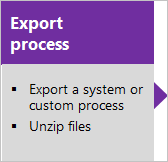

# Customize the work tracking web form  

[!INCLUDE [temp](../_shared/dev15-and-ts-version-header.md)]  


> [!IMPORTANT]  
> **Feature availability**: This topic applies to customizations you can make when you use the Hosted XML process model, or you've update your application-tier server to Team Foundation Server 2017 or later version (which uses the On-premises XML process model). For the Inheritance process model, see [Customize a process](../organizations/settings/work/customize-process.md). 
>
>For an overview of process models, see [Customize your work tracking experience](customize-work.md). 

Just as you have been able to customize the form layout for your work item types, you can continue to do so with the new web form. The new form makes available several features that are not available with the old form.  Your account or project collection administrator manages the [switch to the new form](manage-new-form-rollout.md). When the new form is enabled for the account or project collection, the WebLayout section is added to the XML definition for each WIT defined in the collection.  
 

> [!NOTE]    
> Prior to customizing the web form, your administrator must have [enabled the new form](manage-new-form-rollout.md). 

You customize transformed WITs in much the same way as you have previously.  The path is slightly different depending on your platform and previous customization choices. 


## Import/export XML definition files 

Use this sequence when you use the On-premises XML process model, i.e., you manage your TFS work tracking customization  through import of individual XML definition files. 

[](#witadmin)[](xml/weblayout-xml-elements.md)[](#witadmin)  


## Import/export process zip files 
Use this sequence when you use the Hosted XML process model, i.e., when you manage your work tracking customization by importing a process or process template. 

[](../organizations/settings/work/import-process/import-process.md#export-process)[](xml/weblayout-xml-elements.md)[](../organizations/settings/work/import-process/import-process.md)  


The main difference is that there are now two main layout sections within the **FORM** node. The first section, contained within the **Layout** element, defines the form layout when viewed through a client such as Visual Studio. The second section, contained within the **WebLayout** element, defines the form layout when viewed through a web browser. 

> [!div class="tabbedCodeSnippets"]
```XML
<FORM>
   <Layout HideReadOnlyEmptyFields="true" HideControlBorders="true">
       . . .  
   </Layout>
   <WebLayout>
       . . .  
   </WebLayout>
</FORM>
```

See the following topics to make the indicated customizations: 
 
- To customize the form for the web portal (**WebLayout** node), see [WebLayout and Control XML elements](xml/weblayout-xml-elements.md)
- To add a scoped links control to the form for the web portal (**LinksControlOptions**), see [LinksControlOptions XML elements](xml/linkscontroloptions-xml-elements.md)
- To customize the client form (**Layout** node), see [Layout XML elements](xml/layout-xml-element-reference.md).


<a id="witadmin">  </a>  
## Import and export WIT definition files 

> [!NOTE]   
> The **witadmin** command-line tool is not supported on Azure DevOps Services. Instead, you use [inherited processes](../organizations/settings/work/manage-process.md) to modify the work item type. 

0.  If you don't have administration permissions for your project, [get them](../organizations/security/set-project-collection-level-permissions.md).  
  
0.  Open a Command Prompt window according to the instructions provided in [witAdmin: Customize and manage objects for tracking work](/azure/devops/reference/witadmin/witadmin-customize-and-manage-objects-for-tracking-work#run-witadmin-tool). 

	For example:
  
    ```  
    %programfiles(x86)%\Microsoft Visual Studio\2017\Community\Common7\IDE\CommonExtensions\Microsoft\TeamFoundation\Team Explorer 
    ```  

0.  Export the WIT definition file where you want to modify or add a field. Specify the name of the WIT and a name for the file.  

        witadmin exportwitd /collection:CollectionURL /p:ProjectName /n:TypeName /f:"DirectoryPath/FileName.xml"  

    An example of a *CollectionURL* for an organization is https://dev.azure.com/*OrganizationName*.

1.  Edit the file. For details, see [WebLayout XML elements](xml/weblayout-xml-elements.md).  

2.  Import the WIT definition file.  

        witadmin importwitd /collection:CollectionURL /p:ProjectName /f:"DirectoryPath/FileName.xml"  

3.  Open either the web portal to view the changes. If the client is already open, refresh the page. 

    The latest updates are downloaded from the server, including the changes that you just imported. Wait several seconds until the refresh completes.

    For more information about using **witadmin**, see [Import, export, and manage work item types](witadmin/witadmin-import-export-manage-wits.md).


[!INCLUDE [temp](../_shared/process-editor.md)]  

<a id="resizing">  </a>  
## Layout and resizing 

The new web form resizes depending on the width available and the number of sections defined. At maximum width, in most web browsers, each section within a page will display within its own column. As the display width decreases, each section resizes proportionally as follows: 

- For four sections: 40%, 20%, 20%, and 20%  
- For three sections: 50%, 25%, and 25%  
- For two Sections: 66% and 33%  
- For one Section: 100%.  


When the display width won't accommodate the columnar display of each section, sections appear stacked within a column. 


## Related articles  

If you're new to WIT customization, see [Add and modify a WIT](add-modify-wit.md). 

- [Manage new form rollout](manage-new-form-rollout.md)
- [New work item experience](process/new-work-item-experience.md)
- [WebLayout and Control XML elements](xml/weblayout-xml-elements.md)


### Import warnings and errors

You'll receive a warning when you import a modified WIT definition if you add a **Control** element for a required field in only the **WebLayout** or **Layout** node, but not the other. 

You'll receive an error if you enable the new form, and then modify a WIT definition in which you delete the **WebLayout** node.  

