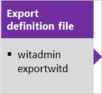
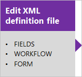
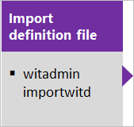
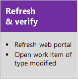
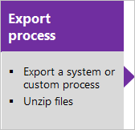
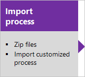

# Customize the work tracking web form  

[!INCLUDE [version-lt-azure-devops](../includes/version-lt-azure-devops.md)]  

This article applies to customizations you can make when you use the Hosted XML process model or the On-premises Xml process model for an on-premises Azure DevOps Server.  For the Inheritance process model, see [Customize a process](../organizations/settings/work/customize-process.md). For an overview of process models, see [Customize your work tracking experience](customize-work.md). 


## Import and export XML definition files 

Use this sequence when you use the On-premises XML process model and manage your work tracking customization through import of individual XML definition files. 

[](#witadmin)[](/previous-versions/azure/devops/reference/xml/weblayout-xml-elements)[](#witadmin)  


## Import and export process zip files 

Use this sequence when you use the Hosted XML process model and manage your work tracking customization by importing a process or process template. 

[](../organizations/settings/work/import-process/import-process.md#export-process)[](/previous-versions/azure/devops/reference/xml/weblayout-xml-elements)[](../organizations/settings/work/import-process/import-process.md)  


## FORM section

The main difference is that the **FORM** node now has two main layout sections. The first section, contained within the **Layout** element, defines the form layout when you view it through a client such as Visual Studio. The second section, contained within the **WebLayout** element, defines the form layout when you view it through a web browser. 

> [!div class="tabbedCodeSnippets"]
> ```XML
> <FORM>
>    <Layout HideReadOnlyEmptyFields="true" HideControlBorders="true">
>        . . .  
>    </Layout>
>    <WebLayout>
>        . . .  
>    </WebLayout>
> </FORM>
> ```

To make the indicated customizations, see the following topics: 
 
- To customize the form for the web portal (**WebLayout** node), see [WebLayout and Control XML elements](/previous-versions/azure/devops/reference/xml/weblayout-xml-elements).
- To add a scoped links control to the form for the web portal (**LinksControlOptions**), see [LinksControlOptions XML elements](/previous-versions/azure/devops/reference/xml/linkscontroloptions-xml-elements).
- To customize the client form (**Layout** node), see [Layout XML elements](/previous-versions/azure/devops/reference/xml/layout-xml-element-reference?view=tfs-2015&preserve-view=true).


<a id="witadmin">  </a>  

## Import and export definition files (On-premises XML process)

If you don't have administration permissions for your project, [get them](../organizations/security/change-organization-collection-level-permissions.md).  
  
1. Open a Command Prompt window by following the instructions in [witAdmin: Customize and manage objects for tracking work](witadmin/witadmin-customize-and-manage-objects-for-tracking-work.md#run-witadmin-tool). 

   For example:
  
   ```  
   %programfiles(x86)%\Microsoft Visual Studio\2017\Community\Common7\IDE\CommonExtensions\Microsoft\TeamFoundation\Team Explorer 
   ```  

2. Export the WIT definition file where you want to modify or add a field. Specify the name of the WIT and a name for the file.  

    ```
    witadmin exportwitd /collection:CollectionURL /p:ProjectName /n:TypeName /f:"DirectoryPath/FileName.xml"  
    ```

   An example of a <em>CollectionURL</em> for an organization is https:\//dev.azure.com/*OrganizationName*.

3. Edit the file. For details, see [WebLayout XML elements](/previous-versions/azure/devops/reference/xml/weblayout-xml-elements).  

4. Import the WIT definition file.  

    ```
    witadmin importwitd /collection:CollectionURL /p:ProjectName /f:"DirectoryPath/FileName.xml"  
    ```

5. Open either the web portal to view the changes. If the client is already open, refresh the page. 

   The latest updates are downloaded from the server, including the changes that you just imported. Wait several seconds until the refresh completes.

   For more information about using **witadmin**, see [Import, export, and manage work item types](witadmin/witadmin-import-export-manage-wits.md).


[!INCLUDE [temp](../includes/process-editor.md)]  

<a id="resizing"></a>  

## Layout and resizing 

The web form resizes depending on the width available and the number of sections defined. At maximum width, in most web browsers, each section within a page displays within its own column. As the display width decreases, each section resizes proportionally as follows: 

- For four sections: 40%, 20%, 20%, and 20%  
- For three sections: 50%, 25%, and 25%  
- For two sections: 66% and 33%  
- For one section: 100%  


When the display width can't accommodate the columnar display of each section, the form stacks the sections within a column. 

<a id="globallists"></a>  

## Global lists

Hosted XML manages global lists differently than Azure DevOps Server. It doesn't support the `witadmin` command or a separate global list file. In Hosted XML, you attach global lists to an existing work item type as illustrated in the following code snippet.  

```
<?xml version="1.0" encoding="utf-8"?>
<witd:WITD xmlns:witd="http://schemas.microsoft.com/VisualStudio/2008/workitemtracking/typedef" application="Work item type editor" version="1.0">
  <WORKITEMTYPE name="Shared Steps" refname="Custom.SharedSteps">
    <DESCRIPTION>Server-side data for reusable set of test steps. Version: B.02</DESCRIPTION>
    <GLOBALLISTS>
      <GLOBALLIST name="Foo">
        <LISTITEM value="No" />
        <LISTITEM value="Yes" />
        <LISTITEM value="Maybe" />
        <LISTITEM value="Not Sure" />
      </GLOBALLIST>
      <GLOBALLIST name="Bar">
        <LISTITEM value="Open" />
        <LISTITEM value="Closed" />
      </GLOBALLIST>
     </GLOBALLISTS>  
     ...
```

By default, the global lists attach to the Shared Steps work item type.

## Import warnings and errors

You receive a warning when you import a modified WIT definition if you add a **Control** element for a required field in only the **WebLayout** or **Layout** node, but not the other. 

You receive an error if you enable the new form, and then modify a WIT definition in which you delete the **WebLayout** node.


<a id="related"></a> 

## Related content  

- [Add and modify a WIT](add-modify-wit.md)
