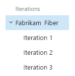
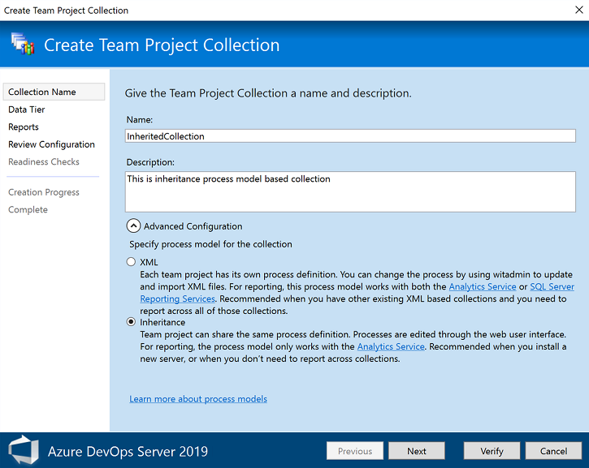

# Customize your work tracking experience 

[!INCLUDE [temp](../_shared/version-vsts-tfs-all-versions.md)]

As you plan and track your project, you'll find you may want to configure a feature or customize your experience to meet your team's tracking needs. You configure teams and team Agile tools through the web portal administration context. The method you use to customize projects, which impacts all teams, depends on the process model you use.  

Customizations you make occur at one of three levels:   

- **Team assets or tools**: Each team can customize or configure their specific tools, for details,see [About teams and Agile tools](../organizations/settings/about-teams-and-settings.md)
- **Project level**: Add or modify work item types, data fields, backlog levels, and other objects shared across teams  
- **Object level**: Grant or restrict access to work tracking tools, which includes setting permissions for objects and the project and assigning users or groups to specific access levels.  

> [!NOTE]    
>If you're new to the work tracking system, see [Get started with Agile tools to plan and track work](../boards/get-started/what-is-azure-boards.md). 


<a id="shared-resources"></a>
## Shared resources  

Each project provides a number of shared resources that support all teams added to the project. You configure these features through the user interface or the admin context of the web portal. To understand how the system uses area and iteration paths, see [About area and iteration paths](../organizations/settings/about-areas-iterations.md). 

> [!div class="mx-tdCol2BreakAll"]
> | Area path pick lists | Sprint/iteration pick lists |
> |-------------|----------| 
> |Change the [pick list of area paths](../organizations/settings/set-area-paths.md) to support grouping work items by team, product, or feature area.<br/>|Change the [pick list of iteration paths](../boards/sprints//define-sprints.md) to support grouping work into sprints, milestones, or other event-specific or time-related period. Activate sprints for each team.<br/> |
 

> [!div class="mx-tdCol2BreakAll"]
> |Shared queries | Tags | 
> |-------------|----------| 
> |Open shared queries or create your own<br/>query using the [query editor](../boards/queries/using-queries.md) to list work items<br/>or show hierarchical or dependent items.<br/ |[Add tags to work items](../boards/queries/add-tags-to-work-items.md) to filter backlogs and queries, or list items by tags<br/> |   
 

<a id="process-models"></a>

## Projects and process customizations  

Your project determines the objects available to track work and the configuration of Agile tools. Specifically, the project determines the work item types (WITs)&mdash;user stories, tasks, bugs&mdash; and the data fields used to capture information. Customized objects are shared across teams added to the project.  

> [!NOTE]    
>The method you use to customize work tracking depends on the process model you subscribe to: 
>- **Inheritance**: Supports WSIWIG customization, available for Azure DevOps Services and Azure DevOps Server 2019  
>- **Hosted XML**: Supports customization through import/export of process templates, available for a select number of customers of Azure DevOps Services who have opted into this model    
>- **On-premises XML**: Supports customization through import/export of XML definition files for work tracking objects and is available for all on-premises deployments       
 
The following table summarizes the differences between the three supported process models. For definitions of the main work tracking objects, see [Agile glossary](../boards/work-items/agile-glossary.md).  

<table width="90%">
<tr valign="bottom">
<th width="50%">Feature </th>
<th >[Inheritance](../organizations/settings/work/inheritance-process-model.md)</th>
<th >[Hosted XML](../organizations/settings/work/hosted-xml-process-model.md)</th>
<th >[On-premises XML](on-premises-xml-process-model.md)</th>
</tr>

<tbody valign="top" align="center">

<tr>
<td align="left">WYSIWYG editing</td>
<td></td>
<td> </td>
<td> </td>
</tr>

<tr>
<td align="left">Create inherited custom processes</td>
<td></td>
<td></td>
<td> </td>
</tr>

<tr>
<td align="left">Create custom process templates (see note 1)</td>
<td> </td>
<td></td>
<td></td>
</tr>

<tr>
<td align="left">Inherit changes in system processes (Agile, Scrum, CMMI)</td>
<td></td>
<td> </td>
<td> </td>
</tr>


<tr>
<td align="left">Updated process changes automatically apply to projects</td>
<td></td>
<td></td>
<td> </td>
</tr>

<tr>
<td align="left">Basic customizations supported (fields, workflow, work item types, backlog levels)</td>
<td></td>
<td></td>
<td></td>
</tr>

<tr>
<td align="left">Advanced customizations supported (custom link types, global lists, global workflow, team fields)</td>
<td> </td>
<td>(see note 2)</td>
<td></td>
</tr>

<tr>
<td align="left">Update Microsoft field mappings using the [**TFSFieldMapping**](xml/upload-or-download-the-microsoft-project-mapping-file.md) command-line tool</td>
<td></td>
<td></td>
<td></td>
</tr>

<tr>
<td align="left">Use the [**witadmin** command-line tools](witadmin/witadmin-customize-and-manage-objects-for-tracking-work.md) to edit projects</td>
<td> </td>
<td> </td>
<td></td>
</tr>

<tr>
<td align="left">Use the **witadmin** command-line tools to list information about projects</td>
<td></td>
<td></td>
<td></td>
</tr>

<tr>
<td align="left">REST API (read)</td>
<td></td>
<td></td>
<td></td>
</tr>

<tr>
<td align="left">REST API (write)</td>
<td></td>
<td> </td>
<td> </td>
</tr>

</tbody>
</table>

**Notes:**
1. A process determines the building blocks used to track work. A process template specifies an interdependent-related set of XML definition files that provide the building blocks and initial configuration for tracking work and other functional areas.     
2. Hosted XML customization supports adding and updating global lists with a process update (subject to limits on maximum size of each list). To learn more, see [Work tracking object limits](../organizations/settings/work/object-limits.md).  

<a id="choose-process-model" />
::: moniker range="azure-devops-2019"
## Choose the process model for your project collection 
For Azure DevOps Server 2019, you have a choice of process models. When you create a project collection, you'll need to choose between **XML** (On-premises XML process model) and **Inheritance** (Inheritance process model), as shown in the following dialog. 

> [!div class="mx-imgBorder"]  
>    

> [!IMPORTANT]  
> The choice you make is not reversible. Once the collection is created, you'll only be able to customize work tracking objects using the model selected. Also, there is no way to migrate existing project collections that use the On-premises XML process model to the Inheritance process model. 

To learn more about project collections, see [Manage project collections](/azure/devops/server/admin/manage-team-project-collections).

::: moniker-end

<a id="access-permissions"></a>
## Grant or restrict access to work tracking tools  

You can grant or restrict access to select features and functions through the web portal. When you add user accounts to your team, they're automatically added to the Contributor group. They then have access to most of the features they'll need to contribute to code, work tracking, builds, and test. However, the Contributor group doesn't allow users to create shared queries or to add area or iteration paths. You have to grant these permissions separately.  

For a simplified view of the most common, default permissions and access assignments, see [Permissions and access](../organizations/security/permissions-access.md). If you're new to managing permissions, see [Permissions and groups reference, Inheritance](../organizations/security/about-permissions.md#inheritance).

Otherwise, to grant or restrict access to select features or functions, review one of these topics: 
 

<table width="80%">
<tbody valign="top">
<tr>
<th width="35%">Customization area</th>
<th width="65%">Customization support</th>
</tr>
<tr>
<td>Manage access </td>
<td>
<ul>
<li>[About access levels](../organizations/security/access-levels.md)</li>
<li>[Add team members (Azure DevOps Services)](../organizations/accounts/add-team-members.md)</li>
<li>[Change access levels (on-premises deployments)](../organizations/security/change-access-levels.md)</li>
<li>[Add team members (on-premises deployments)](../organizations/settings/add-teams.md#add-team-members)</li>
</ul>
</td>
</tr>
<tr>
<td>Permissions   </td>
<td>
<ul>
<li>[Area path permissions](../organizations/security/set-permissions-access-work-tracking.md#set-permissions-area-path)</li>
<li>[Process permissions](../organizations/security/set-permissions-access-work-tracking.md#process-permissions)</li>
<li>[Work item query and folder permissions](../boards/queries/set-query-permissions.md)</li>
<li>[Dashboard permissions](../report/dashboards/dashboard-permissions.md#set-permissions)</li>
<li>[Plan permissions](../organizations/security/set-permissions-access-work-tracking.md#plan-permissions)</li>
<li>[Tagging permissions](../organizations/security/permissions.md#tags)</li>
<li>[Test permissions](../organizations/security/permissions.md#project_test)</li>
</ul>
</td>
</tr>
<tr>
<td>Shared resources </td>
<td>
<ul>
<li>[Alerts](../boards/queries/alerts-and-notifications.md)</li>
<li>[Area paths](../organizations/settings/set-area-paths.md)</li>
<li>[Iteration paths](../organizations/settings/set-iteration-paths-sprints.md)</li>
<li>[Queries](../boards/queries/using-queries.md)</li>
<li>[Tags](../boards/queries/add-tags-to-work-items.md)</li>
</ul>
</td>
</tr>
</tbody>
</table>
  
::: moniker range=">= tfs-2013 <= azure-devops-2019"
<a id="test-experience"></a>
## Customize the test experience

Several WITs support the test experience within the web portal **Test** pages and Test Manager client. You can customize these WITs as you would any other WIT. The following image illustrates the support link relationships.  

  

See the following resources for additional usage and customization information:

- [Test configurations and test variables](../test/test-different-configurations.md)  
- [Test resolution states](witadmin/tcm-customize-manage-test-experience.md) (TFS)
- [Failure types](witadmin/tcm-customize-manage-test-experience.md)  
- [Define the initial test management configuration (process template)](process-templates/define-initial-configuration-test-manager.md)
- [Query based on build and test integration fields](../boards/queries/build-test-integration.md)

::: moniker-end

<a id="person-name-field"></a>
## Change the pick list for a person-name field  
To add values for fields associated with user accounts such as **Assigned To** add users to a security group or by restricting access to a group or set of users. By default, the list for the Assigned To field contains the account names for all users and groups that have been added to the server. These accounts are often synchronized with Active Directory or Azure Active Directory. See [Add AD/Azure AD users or groups to a built-in security group](../organizations/security/add-ad-aad-built-in-security-groups.md). 

## Less common customizations   
You can only perform the following customizations when working with the Hosted XML or On-premises XML process models. The customizations made to process configuration apply to all teams added to the project.  

<a id="limits">  </a>
### Backlog and board limits (Hosted XML, On-premises XML) 

To limit the display load time to acceptable parameters, the task board is restricted to a maximum of 1000 work items. For details, see [Process configuration XML element reference](xml/process-configuration-xml-element.md). 

You can increase this value up to a maximum of 1500 by specifying a value for the `workItemCountLimit` attribute of the **TaskBacklog** element. For details, see [Process configuration XML element reference](xml/process-configuration-xml-element.md#backlog_page). 

> [!div class="tabbedCodeSnippets"]
```XML
<TaskBacklog category="Microsoft.TaskCategory" pluralName="Tasks" singularName="Task" workItemCountLimit="800" >
    . . .
</TaskBacklog>
```

<a id="assign-fields">  </a>
### Change field assignments (Hosted XML, On-premises XML) 

You can change the work item fields that are used in calculating capacity, burndown charts, forecasting, and velocity. Any change you make to one of the default assignments should correspond to a change made to the WIT used to define and capture information for that value. 

For example, if you change the `refname` assigned to `type="Activity"` then you should include the same field in the WIT definition assigned to the Task Category which captures the activity information. For details, see [Process configuration XML element reference](xml/process-configuration-xml-element.md#fields). 

The fields you assign are used by the following tools: 

| Tool | Field type |  
| ----- | ---------- |  
| Task board, capacity tools, sprint burndown | Remaining work | 
| Product and portfolio backlogs | Backlog priority | 
| Velocity and forecast | Effort (maps to Story Points, Effort, or Size) | 
| Task board, capacity tools | Remaining work | 
| Capacity tools | Activity (Task Activity or Discipline) | 


## Additional options 
Do you want to customize your tools in a way that's not supported?  

Here are a few options available to you:  

- Check out [Marketplace extensions](https://marketplace.visualstudio.com/vsts) to see if there's a tool available for your purposes  
- Determine if a [Service hook](../service-hooks/index.md) will satisfy your needs  
- Create your own tool using [REST APIs](../integrate/index.md)  
- Add a feature request to our [Developer Community page](https://developercommunity.visualstudio.com/content/idea/post.html?space=21).   

 

[add-team-members]: ../../organizations/settings/add-teams.md#add-team-members
[add-team-admin]: ../../organizations/settings/add-team-administrator.md

 
 


