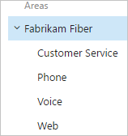
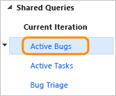
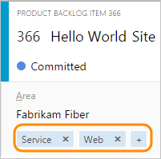
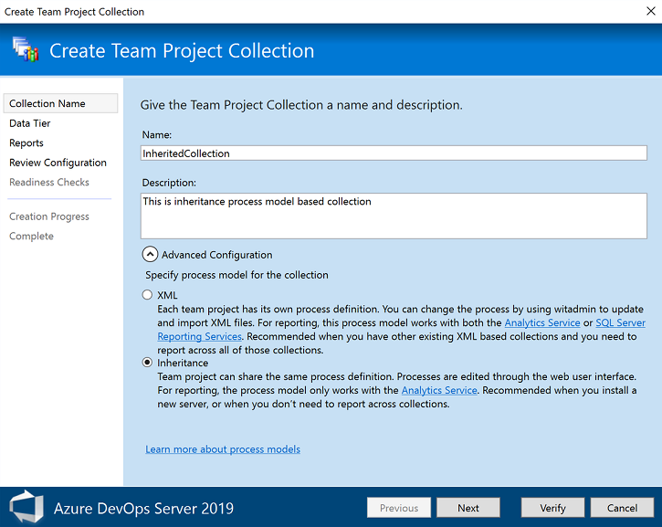

# Customize your work tracking experience 

[!INCLUDE [temp](../includes/version-vsts-tfs-all-versions.md)]

As you plan and track your project, you'll find you may want to configure a feature or customize your experience to meet your team's tracking needs. You configure teams and team Agile tools through the web portal administration context for Azure Boards. The method you use to customize projects, which impacts all teams, depends on the process model you use. 

If you're new to Azure Boards and work item tracking, see [What is Azure Boards?](../boards/get-started/what-is-azure-boards.md) and [Track work with user stories, issues, bugs, features, and epics](../boards/work-items/about-work-items.md). 

This article provides a high-level overview of the customizations you can make and how they differ for the three process models. For guidance on customizations to make to support business decisions, see [Configure and customize Azure Boards](../boards/configure-customize.md).

Customizations you make occur at one of these four levels:   


::: moniker range="azure-devops"
- **Project-level shared resources**: Define area and iteration paths which teams select to configure their backlogs and boards. Shared queries and work item tags are additional objects that once defined can be shared across the project.  
- **Team assets or tools**: Each team can configure their specific tools, such as backlogs, boards, and dashboards. For details, see [About teams and Agile tools](../organizations/settings/about-teams-and-settings.md). 
- **Organization-level process customization**: Customize the fields, work item types, and backlogs and boards available to all teams.   
- **Project and object-level permissions**: Grant or restrict access to work tracking tools, which includes setting permissions for objects and the project and assigning users or groups to specific access levels.  
::: moniker-end


::: moniker range="< azure-devops"
- **Project-level shared resources**: Define area and iteration paths which teams select to configure their backlogs and boards. Shared queries and work item tags are additional objects that once defined can be shared across the project.  
- **Team assets or tools**: Each team can configure their specific tools, such as backlogs, boards, and dashboards. For details, see [About teams and Agile tools](../organizations/settings/about-teams-and-settings.md). 
- **Collection-level process customization**:  Customize the fields, work item types, and backlogs and boards available to all teams. 
- **Project and object-level permissions**: Grant or restrict access to work tracking tools, which includes setting permissions for objects and the project and assigning users or groups to specific access levels.  
::: moniker-end
 

<a id="shared-resources"></a>

## Project-level shared resources  

Each project provides a number of shared resources that support all teams added to the project. You configure these features through the user interface or the admin context of the web portal. To understand how the system uses area and iteration paths, see [About area and iteration paths](../organizations/settings/about-areas-iterations.md). 

> [!div class="mx-tdCol2BreakAll"]
> | Area path pick lists | Sprint/iteration pick lists |
> |-------------|----------| 
> |Change the [pick list of area paths](../organizations/settings/set-area-paths.md) to support grouping work items by team, product, or feature area.<br/>|Change the [pick list of iteration paths](../boards/sprints//define-sprints.md) to support grouping work into sprints, milestones, or other event-specific or time-related period. Activate sprints for each team.<br/> |
 

> [!div class="mx-tdCol2BreakAll"]
> |Shared queries | Tags | 
> |-------------|----------| 
> |Open shared queries or create your own<br/>query using the [query editor](../boards/queries/using-queries.md) to list work items<br/>or show hierarchical or dependent items.<br/ |[Add tags to work items](../boards/queries/add-tags-to-work-items.md) to filter backlogs and queries, or list items by tags<br/> |   
 

<a id="person-name-field"></a>

### Identity fields, people-picker fields

The **Assigned To** and other Identity fields are supported by the people picker feature. For example, when you choose the **Assigned To** field from within a work item form, the people picker is activated. As shown in the following image, you simply start typing the name of the user you want to select, and search until you find a match. Users that you've previously selected appear in the list automatically. To select users that you haven't selected previously, simply enter their entire name or search against the full directory.  
 
> [!div class="mx-imgBorder"]  
>   

For organizations that manage their users and groups using Azure Active Directory (Azure AD) or Active Directory, people pickers provide support for searching all users and groups added to the AD, not just those added to the project. To learn more, see [Add AD/Azure AD users or groups to a built-in security group](../organizations/security/add-ad-aad-built-in-security-groups.md). 

::: moniker range="azure-devops"

To limit the scope of identities available for selection to just those users added to the project, you can do so using the **Project-Scoped Users** group. To learn how, see [Manage your project, Limit identity search and selection](../user-guide/project-admin-tutorial.md#limit-identity-selection). 

::: moniker-end

You can limit the values available to Identity fields within a work item by adding a custom rule. 

<a id="process-models"></a>

::: moniker range="azure-devops"
## Organization-level process customization   
::: moniker-end


::: moniker range="< azure-devops"
## Collection-level process customization   
::: moniker-end

Your project determines the objects available to track work and the configuration of Agile tools. Specifically, the project determines the work item types (WITs)&mdash;user stories, tasks, bugs&mdash; and the data fields used to capture information. Customized objects are shared across teams added to the project.  

> [!NOTE]    
>The method you use to customize work tracking depends on the process model you subscribe to: 
>- **Inheritance**: Supports WYSIWYG customization, available for Azure DevOps Services, Azure DevOps Server 2019, and Azure DevOps Server 2020.  
>- **Hosted XML**: Supports customization through import/export of process templates, available for a select number of customers of Azure DevOps Services who have opted into this model.     
>- **On-premises XML**: Supports customization through import/export of XML definition files for work tracking objects and is available for all on-premises deployments.        
 
The following table summarizes the differences between the three supported process models. For definitions of the main work tracking objects, see [Agile glossary](../boards/work-items/agile-glossary.md).  

---
:::row:::
   :::column span="3":::
      **Feature** 
   :::column-end:::
   :::column span="1":::
      **[Inheritance](../organizations/settings/work/inheritance-process-model.md)** 
   :::column-end:::
   :::column span="1":::
      **[Hosted XML](../organizations/settings/work/hosted-xml-process-model.md)**
   :::column-end:::
   :::column span="1":::
     **[On-premises XML](on-premises-xml-process-model.md)**
   :::column-end:::
:::row-end:::
---
:::row:::
   :::column span="3":::
      WYSIWYG editing
   :::column-end:::
   :::column span="1":::
      ✔️
   :::column-end:::
   :::column span="1":::
         
   :::column-end:::
   :::column span="1":::
       
   :::column-end:::
:::row-end:::
---
:::row:::
   :::column span="3":::
      Create inherited custom processes, Inherit changes in system processes (Agile, Basic, Scrum, CMMI)
   :::column-end:::
   :::column span="1":::
      ✔️
   :::column-end:::
   :::column span="1":::
         
   :::column-end:::
   :::column span="1":::
       
   :::column-end:::
:::row-end:::
---
:::row:::
   :::column span="3":::
      Create custom process templates (see note 1)
   :::column-end:::
   :::column span="1":::
         
   :::column-end:::
   :::column span="1":::
      ✔️
   :::column-end:::
   :::column span="1":::
      ✔️
   :::column-end:::
:::row-end:::
---
:::row:::
   :::column span="3":::
      Updated process changes automatically apply to projects
   :::column-end:::
   :::column span="1":::
      ✔️
   :::column-end:::
   :::column span="1":::
      ✔️
   :::column-end:::
   :::column span="1":::
       
   :::column-end:::
:::row-end:::
---
:::row:::
   :::column span="3":::
      Support to customize fields, work item types, form layout, workflow, custom rules, backlog levels, custom controls, test management 
   :::column-end:::
   :::column span="1":::
      ✔️
   :::column-end:::
   :::column span="1":::
      ✔️
   :::column-end:::
   :::column span="1":::
      ✔️
   :::column-end:::
:::row-end:::
---
:::row:::
   :::column span="3":::
      Global lists
   :::column-end:::
   :::column span="1":::
      Picklists
   :::column-end:::
   :::column span="1":::
      (see note 2)
   :::column-end:::
   :::column span="1":::
      ✔️
   :::column-end:::
:::row-end:::
---
:::row:::
   :::column span="3":::
      Support to customize link types, team fields, global workflow, and process configuration (see note 3)
   :::column-end:::
   :::column span="1":::
         
   :::column-end:::
   :::column span="1":::
       
   :::column-end:::
   :::column span="1":::
      ✔️
   :::column-end:::
:::row-end:::
---
:::row:::
   :::column span="3":::
      Initial configuration of permissions and security groups (see note 3)
   :::column-end:::
   :::column span="1":::
         
   :::column-end:::
   :::column span="1":::
      ✔️
   :::column-end:::
   :::column span="1":::
      ✔️
   :::column-end:::
:::row-end:::
---
:::row:::
   :::column span="3":::
      Update Microsoft field mappings using the [**TFSFieldMapping**](/previous-versions/azure/devops/reference/xml/upload-or-download-the-microsoft-project-mapping-file)command-line tool (see note 4)
   :::column-end:::
   :::column span="1":::
         
   :::column-end:::
   :::column span="1":::
      ✔️
   :::column-end:::
   :::column span="1":::
      ✔️
   :::column-end:::
:::row-end:::
---
:::row:::
   :::column span="3":::
      Use [**az boards** command-line tools](../cli/quick-reference.md#azure-boards) to edit projects and teams and list information
   :::column-end:::
   :::column span="1":::
         
   :::column-end:::
   :::column span="1":::
         
   :::column-end:::
   :::column span="1":::
      ✔️
   :::column-end:::
:::row-end:::
---
:::row:::
   :::column span="3":::
      Use the [**witadmin** command-line tools](witadmin/witadmin-customize-and-manage-objects-for-tracking-work.md) to edit projects and list project information
   :::column-end:::
   :::column span="1":::
         
   :::column-end:::
   :::column span="1":::
         
   :::column-end:::
   :::column span="1":::
      ✔️
   :::column-end:::
:::row-end:::
---
:::row:::
   :::column span="3":::
      REST API (read)
   :::column-end:::
   :::column span="1":::
      ✔️
   :::column-end:::
   :::column span="1":::
      ✔️
   :::column-end:::
   :::column span="1":::
      ✔️
   :::column-end:::
:::row-end:::
---
:::row:::
   :::column span="3":::
      REST API (write)
   :::column-end:::
   :::column span="1":::
      ✔️
   :::column-end:::
   :::column span="1":::
      ✔️
   :::column-end:::
   :::column span="1":::
       
   :::column-end:::
:::row-end:::
---


**Notes:**

1. A process determines the building blocks used to track work. A process template specifies an interdependent-related set of XML definition files that provide the building blocks and initial configuration for tracking work and other functional areas.     
2. Hosted XML customization supports adding and updating global lists with a process update (subject to limits on maximum size of each list). To learn more, see [Work tracking object limits](../organizations/settings/work/object-limits.md).  
3. The Inherited process model doesn't support customization of the following features available with customization of process templates. Instead, you customize these areas within the web portal on a project-by-project basis. Or, you can use REST APIs or the [Azure DevOps CLI command tool]((../cli/quick-reference.md).
	- Configure areas and iterations  
	- Work item queries  
	- Security groups and permissions   
	- Permissions and access to functional areas such as version control and build  
4. Support for Office Project integration with Azure DevOps is deprecated starting with Azure DevOps Server 2019. The TFSFieldMapping command is not supported for Azure DevOps Server 2019 nor for Azure DevOps Services. Starting with Visual Studio 2019, the Azure DevOps plug-in for Office no longer supports Office Project.

<a id="choose-process-model" />

::: moniker range=">= azure-devops-2019 < azure-devops"

## Choose the process model for your project collection 

For Azure DevOps Server 2019 and Azure DevOps Server 2020, you have a choice of process models. When you create a project collection, you'll need to choose between **XML** (On-premises XML process model) and **Inheritance** (Inheritance process model), as shown in the following dialog. 

> [!div class="mx-imgBorder"]  
>    

> [!IMPORTANT]  
> The choice you make is not reversible. Once the collection is created, you'll only be able to customize work tracking objects using the model selected. Also, there is no way to migrate existing project collections that use the On-premises XML process model to the Inheritance process model. 

To learn more about project collections, see [Manage project collections](/azure/devops/server/admin/manage-project-collections).

::: moniker-end


<a id="test-experience"></a>

## Customize the test experience

::: moniker range=">= azure-devops-2019"
Several work item types support the test experience within the web portal **Test** pages and Test Manager client. For an Inherited process, you can customize Test Plan, Test Suite, and Test Case, work item types as you would any other work item type. For an On-premises XML process, you can customize all test-related work item types&mdash;Test Plan, Test Suite, Test Case, Shared Steps, and Shared Parameters&mdash;as you would any other work item type. 
::: moniker-end


::: moniker range="<= tfs-2018"
Several work item types support the test experience within the web portal **Test** pages and Test Manager client. You can customize these work item types&mdash;Test Plan, Test Suite, Test Case, Shared Steps, and Shared Parameters&mdash;as you would any other work item type. 
::: moniker-end

The following image illustrates the supported link relationships.  

  

See the following resources for additional usage and customization information:

- [Test configurations and test variables](../test/test-different-configurations.md)  
- [Test resolution states](witadmin/tcm-customize-manage-test-experience.md) (TFS)
- [Failure types](witadmin/tcm-customize-manage-test-experience.md)  
- [Define the initial test management configuration (process template)](process-templates/define-initial-configuration-test-manager.md)
- [Query based on build and test integration fields](../boards/queries/build-test-integration.md)

::: moniker-end

## Less common customizations   

You can only perform the following customizations when working with the Hosted XML or On-premises XML process models. The customizations made to process configuration apply to all teams added to a project.  

<a id="limits">  </a>

### Backlog and board limits (Hosted XML, On-premises XML)

To limit the display load time to acceptable parameters, the task board is restricted to a maximum of 1000 work items. For details, see [Process configuration XML element reference](xml/process-configuration-xml-element.md). 

You can increase this value up to a maximum of 1500 by specifying a value for the `workItemCountLimit` attribute of the **TaskBacklog** element. For details, see [Process configuration XML element reference](xml/process-configuration-xml-element.md#backlog_page). 

> [!div class="tabbedCodeSnippets"]
> ```XML
> <TaskBacklog category="Microsoft.TaskCategory" pluralName="Tasks" singularName="Task" workItemCountLimit="800" >
>     . . .
> </TaskBacklog>
> ```

<a id="assign-fields">  </a>

###  Change field assignments (Hosted XML, On-premises XML)  

You can change the work item fields that are used in calculating capacity, burndown charts, forecasting, and velocity. Any change you make to one of the default assignments should correspond to a change made to the WIT used to define and capture information for that value. 

For example, if you change the `refname` assigned to `type="Activity"` then you should include the same field in the WIT definition assigned to the Task Category which captures the activity information. For details, see [Process configuration XML element reference](xml/process-configuration-xml-element.md#fields). 

The fields you assign are used by the following tools: 

| Tool | Field type |  
| ----- | ---------- |  
| Task board, capacity tools, sprint burndown | Remaining work | 
| Product and portfolio backlogs | Backlog priority | 
| Velocity and forecast | Effort (maps to Story Points, Effort, or Size) | 
| Task board, capacity tools | Remaining work | 
| Capacity tools | Activity (Task Activity or Discipline) | 


<a id="access-permissions"></a>

## Grant or restrict access to work tracking tools  

You can grant or restrict access to select features and functions through the web portal. When you add user accounts to your team, they're automatically added to the Contributor group. They then have access to most of the features they'll need to contribute to code, work tracking, builds, and test. However, the Contributor group doesn't allow users to create shared queries or to add area or iteration paths. You have to grant these permissions separately.  

For a simplified view of the most common, default permissions and access assignments, see [Permissions and access](../organizations/security/permissions-access.md). If you're new to managing permissions, see [Permissions and groups reference, Inheritance](../organizations/security/about-permissions.md#inheritance).

Otherwise, to grant or restrict access to select features or functions, review one of these topics: 
 

---
:::row:::
   :::column span="1":::
      **Manage access** 
      - [About access levels](../organizations/security/access-levels.md) 
      - [Add team members (Azure DevOps Services)](../organizations/security/add-users-team-project.md) 
      - [Change access levels (on-premises deployments)](../organizations/security/change-access-levels.md) 
      - [Add team members (on-premises deployments)](../organizations/settings/add-teams.md#add-team-members) 
   :::column-end:::
   :::column span="1":::
      **Permissions** 
      - [Area path permissions](../organizations/security/set-permissions-access-work-tracking.md#set-permissions-area-path)  
      - [Process permissions](../organizations/security/set-permissions-access-work-tracking.md)  
      - [Work item query and folder permissions](../boards/queries/set-query-permissions.md)  
      - [Dashboard permissions](../report/dashboards/dashboard-permissions.md#set-permissions)  
      - [Plan permissions](../organizations/security/set-permissions-access-work-tracking.md)  
      - [Tagging permissions](../organizations/security/permissions.md#tags)  
      - [Test permissions](../organizations/security/permissions.md#project_test)   
   :::column-end:::
   :::column span="1":::
      **Shared resources** 
      - [Alerts](../notifications/manage-your-personal-notifications.md) 
      - [Area paths](../organizations/settings/set-area-paths.md)  
      - [Iteration paths](../organizations/settings/set-iteration-paths-sprints.md)  
      - [Queries](../boards/queries/using-queries.md)  
      - [Tags](../boards/queries/add-tags-to-work-items.md)  
   :::column-end:::
:::row-end:::
---
  


## Additional customization options 

Do you want to customize your tools in a way that's not supported?  

Here are a few options available to you:  

- Check out [Marketplace extensions](https://marketplace.visualstudio.com/vsts) to see if there's a tool available for your purposes  
- Determine if a [Service hook](../service-hooks/overview.md) will satisfy your needs  
- Create your own tool using [REST APIs](../integrate/index.md)  
- Add a feature request to our [Developer Community page](https://developercommunity.visualstudio.com/content/idea/post.html?space=21).   

## Try this next
> [!div class="nextstepaction"]
> [Configure and customize Azure Boards](../boards/configure-customize.md?toc=/azure/devops/reference/toc.json&bc=/azure/devops/reference/breadcrumb/toc.json)  

## Related articles
 
- [Work item field index](../boards/work-items/guidance/work-item-field.md)
- [witadmin command-line tool](witadmin/witadmin-customize-and-manage-objects-for-tracking-work.md)
- [Naming restrictions and conventions](../organizations/settings/naming-restrictions.md?toc=/azure/devops/reference/toc.json&bc=/azure/devops/reference/breadcrumb/toc.json)
- [Work tracking, process, and project limits](../organizations/settings/work/object-limits.md?toc=/azure/devops/reference/toc.json&bc=/azure/devops/reference/breadcrumb/toc.json)

[add-team-members]: ../../organizations/settings/add-teams.md#add-team-members
[add-team-admin]: ../../organizations/settings/add-team-administrator.md