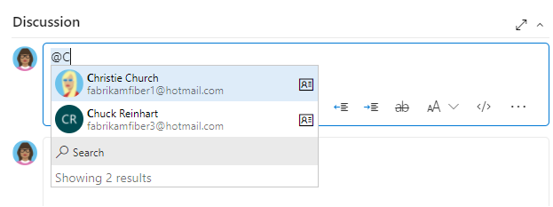

# Customize your work tracking experience 

[!INCLUDE [version-lt-eq-azure-devops](../includes/version-lt-eq-azure-devops.md)]

As you plan and track your project, consider configuring a feature or customizing your experience to align with your team's tracking requirements. The approach for customizing projects, which affects all teams, depends on the process model you’re using.

This article gives you an overview of the customizations available and how they vary across the three process models. For specific guidance on customizations to support business decisions, [Configure and customize Azure Boards](../boards/configure-customize.md). For more information, see [What is Azure Boards?](../boards/get-started/what-is-azure-boards.md) and [About work items](../boards/work-items/about-work-items.md). 

You can customize at the following levels of work tracking:   

::: moniker range="azure-devops"
- **[Project-level shared resources](#project-level-shared-resources)**: Define area and iteration paths which teams select to configure their backlogs and boards. Shared queries and work item tags are more objects that once defined can be shared across the project.  
- **Team assets or tools**: Each team can configure their specific tools, such as backlogs, boards, and dashboards. For more information, see [About teams and Agile tools](../organizations/settings/about-teams-and-settings.md). 
- **Project and object-level permissions**: Manage access to work tracking tools, which include setting permissions for objects and the project and assigning users or groups to specific access levels.  
- **Organization-level process customization**: Customize the fields, work item types, and backlogs and boards available to all teams. 
::: moniker-end

::: moniker range="< azure-devops"
- **Project-level shared resources**: Define area and iteration paths which teams select to configure their backlogs and boards. Shared queries and work item tags are more objects that once defined can be shared across the project.  
- **Team assets or tools**: Each team can configure their specific tools, such as backlogs, boards, and dashboards. For more information, see [About teams and Agile tools](../organizations/settings/about-teams-and-settings.md). 
- **Project and object-level permissions**: Manage access to work tracking tools, which include setting permissions for objects and the project and assigning users or groups to specific access levels.
- **Collection-level process customization**:  Customize the fields, work item types, and backlogs and boards available to all teams.  
::: moniker-end

<a id="shared-resources"></a>

## Project-level shared resources  

Each project provides many shared resources that support all teams within the project. You configure these features through the user interface or the admin context of the web portal. For more information, see the following articles:
- [About area and iteration paths](../organizations/settings/about-areas-iterations.md) 
- [Set area paths](../organizations/settings/set-area-paths.md) 
- [Change the pick list for an iteration path](../boards/sprints/define-sprints.md)
- [Create and edit queries](../boards/queries/using-queries.md)
- [Add tags to work items](../boards/queries/add-tags-to-work-items.md)

<a id="person-name-field"></a>

### People picker and identity fields

- The **Assigned To** and other **Identity** fields are supported by the people picker feature.
- When you choose the **Assigned To** field within a work item form, the people picker is activated.
- To select a user, start entering their name and search until you find a match.
- Previously selected users appear automatically in the list.
- For organizations using Microsoft Entra ID or Active Directory, people pickers allow searching all users and groups added to the AD (not just ones added to a specific project).
- To limit the scope of identities available for selection to project-specific users, use the **Project-Scoped Users** group.
- Custom rules can further restrict the values available for Identity fields within a work item.
 
> [!div class="mx-imgBorder"]  
>   

For more information, see the following articles:
- [Add Active Directory / Microsoft Entra users or groups to a built-in security group](../organizations/security/add-ad-aad-built-in-security-groups.md). 
::: moniker range="azure-devops"
- [Limit  identity search](../user-guide/manage-organization-collection.md#limit-user-visibility-for-projects-and-more). 
::: moniker-end

<a id="process-models"></a>
<a id="organization-level-process-customization'"></a>

::: moniker range="azure-devops"

## Organization-level process customization  
 
::: moniker-end

<a id="collection-level-process-customization'"></a>

::: moniker range="< azure-devops"

## Collection-level process customization  
 
::: moniker-end

Your project defines the work item types (WITs) available for tracking work and configures Agile tools. It specifies user stories, tasks, bugs, and the data fields used to capture information. Customized objects are shared across teams within the project.

> [!NOTE]    
>The method you use to customize work tracking depends on the process model you subscribe to: 
>- **Inheritance**: Supports WYSIWYG customization, available for Azure DevOps Services, Azure DevOps Server 2019, and Azure DevOps Server 2020.  
>- **Hosted XML**: Supports customization through import/export of process templates, available for a select number of customers of Azure DevOps Services who have opted into this model.     
>- **On-premises XML**: Supports customization through import/export of XML definition files for work tracking objects and is available for all on-premises deployments.        
 
The following table summarizes the differences between the three supported process models. For definitions of the main work tracking objects, see [Agile glossary](../boards/work-items/agile-glossary.md). For links to customization articles, see [Quick reference index for Azure Boards settings](quick-reference-index-boards-settings.md). 

---
:::row:::
   :::column span="3":::
      **Feature** 
   :::column-end:::
   :::column span="1":::
      **[Inheritance](../organizations/settings/work/inheritance-process-model.md)** 
   :::column-end:::
   :::column span="1":::
      **[Hosted XML](../organizations/settings/work/hosted-xml-process-model.md)**
   :::column-end:::
   :::column span="1":::
     **[On-premises XML](on-premises-xml-process-model.md)**
   :::column-end:::
:::row-end:::
---
:::row:::
   :::column span="3":::
      WYSIWYG editing
   :::column-end:::
   :::column span="1":::
      ✔️
   :::column-end:::
   :::column span="1":::
         
   :::column-end:::
   :::column span="1":::
       
   :::column-end:::
:::row-end:::
---
:::row:::
   :::column span="3":::
      Create inherited custom processes, Inherit changes in system processes (Agile, Basic, Scrum, CMMI)
   :::column-end:::
   :::column span="1":::
      ✔️
   :::column-end:::
   :::column span="1":::
         
   :::column-end:::
   :::column span="1":::
       
   :::column-end:::
:::row-end:::
---
:::row:::
   :::column span="3":::
      Create custom process templates (see note 1)
   :::column-end:::
   :::column span="1":::
         
   :::column-end:::
   :::column span="1":::
      ✔️
   :::column-end:::
   :::column span="1":::
      ✔️
   :::column-end:::
:::row-end:::
---
:::row:::
   :::column span="3":::
      Updated process changes automatically apply to all projects referencing the process
   :::column-end:::
   :::column span="1":::
      ✔️
   :::column-end:::
   :::column span="1":::
      ✔️
   :::column-end:::
   :::column span="1":::
       
   :::column-end:::
:::row-end:::
---
:::row:::
   :::column span="3":::
      Support for customizing fields, work item types, form layout, workflow, custom rules, backlog levels, custom controls, test management 
   :::column-end:::
   :::column span="1":::
      ✔️
   :::column-end:::
   :::column span="1":::
      ✔️
   :::column-end:::
   :::column span="1":::
      ✔️
   :::column-end:::
:::row-end:::
---
:::row:::
   :::column span="3":::
      Support for customizing link types, team fields, global workflow, and process configuration (see note 3)
   :::column-end:::
   :::column span="1":::
         
   :::column-end:::
   :::column span="1":::
       
   :::column-end:::
   :::column span="1":::
      ✔️
   :::column-end:::
:::row-end:::
---
:::row:::
   :::column span="3":::
      Initial configuration of Area paths, Iteration Paths, work item queries, security groups, and permissions (see note 3)
   :::column-end:::
   :::column span="1":::
         
   :::column-end:::
   :::column span="1":::
      ✔️
   :::column-end:::
   :::column span="1":::
      ✔️
   :::column-end:::
:::row-end:::
---
:::row:::
   :::column span="3":::
      Global lists
   :::column-end:::
   :::column span="1":::
      Picklists
   :::column-end:::
   :::column span="1":::
      (see note 2)
   :::column-end:::
   :::column span="1":::
      ✔️
   :::column-end:::
:::row-end:::
---

::: moniker range="azure-devops"
:::row:::
   :::column span="3":::
      Use [**`az boards`** command-line tools](../cli/quick-reference.md#azure-boards) to edit projects and teams and list information
   :::column-end:::
   :::column span="1":::
      ✔️  
   :::column-end:::
   :::column span="1":::
      ✔️  
   :::column-end:::
   :::column span="1":::
      ✔️  
   :::column-end:::
:::row-end:::
---
::: moniker-end
:::row:::
   :::column span="3":::
      Use the [**`witadmin`** command-line tools](witadmin/witadmin-customize-and-manage-objects-for-tracking-work.md) to list and export process information 
   :::column-end:::
   :::column span="1":::
      ✔️
   :::column-end:::
   :::column span="1":::
      ✔️
   :::column-end:::
   :::column span="1":::
      ✔️
   :::column-end:::
:::row-end:::
---
::: moniker range="< azure-devops"
:::row:::
   :::column span="3":::
      Use the [**`witadmin`** command-line tools](witadmin/witadmin-customize-and-manage-objects-for-tracking-work.md) to edit process information 
   :::column-end:::
   :::column span="1":::
         
   :::column-end:::
   :::column span="1":::
         
   :::column-end:::
   :::column span="1":::
      ✔️
   :::column-end:::
:::row-end:::
---
::: moniker-end
::: moniker range="< azure-devops"
:::row:::
   :::column span="3":::
      Use the [**`tcm fieldmapping`** command-line tool](witadmin/tcm-customize-manage-test-experience.md) to list and export test case management mapping for resolution types, bug filing, and failure types. 
   :::column-end:::
   :::column span="1":::
       
   :::column-end:::
   :::column span="1":::
       
   :::column-end:::
   :::column span="1":::
      ✔️
   :::column-end:::
:::row-end:::
---
::: moniker-end
:::row:::
   :::column span="3":::
      REST API (read)
   :::column-end:::
   :::column span="1":::
      ✔️
   :::column-end:::
   :::column span="1":::
      ✔️
   :::column-end:::
   :::column span="1":::
      ✔️
   :::column-end:::
:::row-end:::
---
:::row:::
   :::column span="3":::
      REST API (write)
   :::column-end:::
   :::column span="1":::
      ✔️
   :::column-end:::
   :::column span="1":::
      ✔️
   :::column-end:::
   :::column span="1":::
       (see note 5)
   :::column-end:::
:::row-end:::
---

**Notes:**

1. A process determines the building blocks used to track work. A process template specifies an interdependent-related set of XML definition files that provide the building blocks and initial configuration for tracking work and other functional areas.     
2. Hosted XML customization supports adding and updating global lists with a process update (subject to limits on maximum size of each list). For more information, see [Work tracking object limits](../organizations/settings/work/object-limits.md).  
3. The Inherited process model doesn't support customization of the following features available with customization of process templates. Instead, you customize these areas within the web portal on a project-by-project basis. 
	- Area and iteration paths 
	- Work item queries  
	- Security groups and permissions   
	- Permissions and access to functional areas such as version control and build 
	::: moniker range="< azure-devops"
	Or, you can use [REST APIs](/rest/api/azure/devops/wit/classification-nodes/create-or-update). 
	::: moniker-end
	::: moniker range="azure-devops"
	Or, you can use [REST APIs](/rest/api/azure/devops/wit/classification-nodes/create-or-update) or the [Azure DevOps CLI command tool](../cli/quick-reference.md). 
	::: moniker-end
4. Support for Office Project integration with Azure DevOps is deprecated and the `TFSFieldMapping` command isn't supported.
5. Use the REST API to [import and export process templates](/rest/api/azure/devops/processadmin/processes/import%20process%20template).

<a id="choose-process-model"></a>

::: moniker range="< azure-devops"

## Choose the process model for your project collection 

For Azure DevOps Server 2019 and Azure DevOps Server 2020, you can choose between **XML** (On-premises XML process model) and **Inheritance** (Inheritance process model), as shown in the following dialog. 

> [!div class="mx-imgBorder"]  
>    

> [!IMPORTANT]  
> The process choice you make is irreversible. Once it's set up, you can only customize work tracking objects based on the selected model. Also, existing project collections using the On-premises XML process model can't get migrated to the Inheritance process model. 

For more information, see [Manage project collections](/azure/devops/server/admin/manage-project-collections).

::: moniker-end

<a id="test-experience"></a>

## Customize the test experience

Several work item types support the test experience within the web portal **Test** pages and Test Manager client.
- For an **Inherited process**, you can customize the following work item types as you would any other work item type:
  - Test Plan
  - Test Suite
  - Test Case
- For an **On-premises XML process**, you can customize all test-related work item types, including:
  - Test Plan
  - Test Suite
  - Test Case
  - Shared Steps
  - Shared Parameters

The following example shows the supported link relationships.  

  

::: moniker range="< azure-devops"
For more information, see the following articles:
- [Test configurations and test variables](../test/test-different-configurations.md)
- [Failure types](witadmin/tcm-customize-manage-test-experience.md)  
- [Define the initial test management configuration (process template)](process-templates/define-initial-configuration-test-manager.md)
- [Query based on build and test integration fields](../boards/queries/build-test-integration.md)
::: moniker-end

## Less common customizations   

You can only perform the following customizations when working with the Hosted XML or On-premises XML process models. Customizations made to process configuration apply to all teams within a project.  

<a id="limits">  </a>

### Backlog and board limits (Hosted XML, On-premises XML)

To limit the display load time to acceptable parameters, the task board is restricted to a maximum of 1,000 work items. For details, see [Process configuration XML element reference](xml/process-configuration-xml-element.md). 

You can increase this value up to a maximum of 1500 by specifying a value for the `workItemCountLimit` attribute of the **TaskBacklog** element. For details, see [Process configuration XML element reference](xml/process-configuration-xml-element.md#backlog_page). 

> [!div class="tabbedCodeSnippets"]
> ```XML
> <TaskBacklog category="Microsoft.TaskCategory" pluralName="Tasks" singularName="Task" workItemCountLimit="800" >
>     . . .
> </TaskBacklog>
> ```

<a id="assign-fields">  </a>

###  Change field assignments (Hosted XML, On-premises XML)  

You can change the work item fields that are used in calculating capacity, burndown charts, forecasting, and velocity. Any change you make to one of the default assignments should correspond to a change made to the WIT used to define and capture information for that value. 

For example, if you change the `refname` assigned to `type="Activity"` then you should include the same field in the WIT definition assigned to the Task Category that captures the activity information. For details, see [Process configuration XML element reference](xml/process-configuration-xml-element.md#fields). 

The fields you assign are used by the following tools: 

| Tool | Field type |  
| ----- | ---------- |  
| Task board, capacity tools, sprint burndown | Remaining work | 
| Product and portfolio backlogs | Backlog priority | 
| Velocity and forecast | Effort (maps to Story Points, Effort, or Size) | 
| Task board, capacity tools | Remaining work | 
| Capacity tools | Activity (Task Activity or Discipline) | 

<a id="access-permissions"></a>

## Manage access to work tracking tools  

Manage access to specific features through permission settings. When you add user accounts to your team, they're automatically added to the Contributor group. They then have access to most of the features they'll need to contribute to code, work tracking, builds, and test. However, the Contributor group doesn't allow users to create shared queries or to add area or iteration paths. You have to grant these permissions separately.  

You can manage access with the following permission settings:
- When you add user accounts to your team, they’re automatically added to the **Contributor** group.
- The **Contributor** group provides access to most features needed for contributing to code, work tracking, builds, and testing.
- But, the **Contributor** group doesn’t allow users to:
  - Create shared queries
  - Add area or iteration paths
  - To grant these permissions separately, follow the appropriate steps.
- For a simplified overview of common default permissions and access assignments, see [Permissions and access](../organizations/security/permissions-access.md).
If you’re new to managing permissions, explore [Get started with permissions, access, and security groups, Permission inheritance and security groups](../organizations/security/about-permissions.md#permission-inheritance).

To manage access to specific features, see the following articles: 

---
:::row:::
   :::column span="1":::
      **Manage access** 
      - [About access levels](../organizations/security/access-levels.md) 
      - [Add team members (Azure DevOps Services)](../organizations/security/add-users-team-project.md) 
      - [Change access levels (on-premises deployments)](../organizations/security/change-access-levels.md) 
      - [Add team members (on-premises deployments)](../organizations/settings/add-teams.md) 
   :::column-end:::
   :::column span="1":::
      **Permissions** 
      - [Area path permissions](../organizations/security/set-permissions-access-work-tracking.md#set-permissions-area-path)  
      - [Process permissions](../organizations/security/set-permissions-access-work-tracking.md)  
      - [Work item query and folder permissions](../boards/queries/set-query-permissions.md)  
      - [Dashboard permissions](../report/dashboards/dashboard-permissions.md#set-permissions)  
      - [Delivery Plan permissions](../organizations/security/set-permissions-access-work-tracking.md)  
      - [Tagging permissions](../organizations/security/permissions.md)  
      - [Test permissions](../organizations/security/permissions.md#project_test)   
   :::column-end:::
   :::column span="1":::
      **Shared resources** 
      - [Alerts](../organizations/notifications/manage-your-personal-notifications.md) 
      - [Area paths](../organizations/settings/set-area-paths.md)  
      - [Iteration paths](../organizations/settings/set-iteration-paths-sprints.md)  
      - [Queries](../boards/queries/using-queries.md)  
      - [Tags](../boards/queries/add-tags-to-work-items.md)  
   :::column-end:::
:::row-end:::
---

## More customization options 

Choose from the following other customization options:  

- Check out [Marketplace extensions](https://marketplace.visualstudio.com/vsts) to see if there's a tool available for your purposes  
- [Develop your own extension](../extend/get-started/node.md)
- Determine if a [Service hook](../service-hooks/overview.md) satisfies your needs  
- Create your own tool using [REST APIs](../integrate/index.md)  
- Add a feature request to our [Developer Community page](https://developercommunity.visualstudio.com/content/idea/post.html?space=21).   

## Next steps
> [!div class="nextstepaction"]
> [Configure and customize Azure Boards](../boards/configure-customize.md?toc=/azure/devops/reference/toc.json&bc=/azure/devops/reference/breadcrumb/toc.json)  

## Related articles
 
- [Work item field index](../boards/work-items/guidance/work-item-field.md)
- [witAdmin command-line tool](witadmin/witadmin-customize-and-manage-objects-for-tracking-work.md)
- [Manage process templates](../boards/work-items/guidance/manage-process-templates.md)
- [Process templates overview](process-templates/overview-process-template-files.md)
- [Work tracking, process, and project limits](../organizations/settings/work/object-limits.md?toc=/azure/devops/reference/toc.json&bc=/azure/devops/reference/breadcrumb/toc.json)
