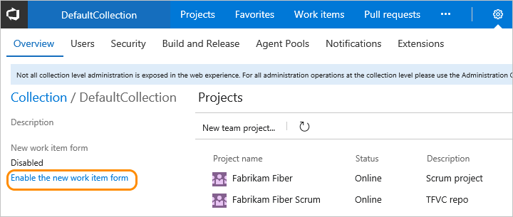
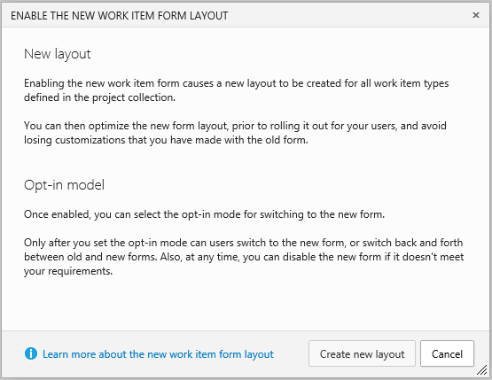
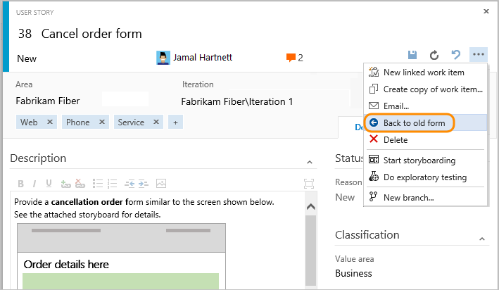

# Manage roll out of the new web form

**TFS 2017**

> [!IMPORTANT]  
> **Feature availability:** The new form and its corresponding features are available for the web portal for TFS 2017 and later versions.
> - For on-premises TFS 2017 and later versions, the new form is automatically available when you add projects to a collection. For existing projects, an admin is required to enable the new form as described in this article. (The reason the new form isn't automatically enabled for existing projects is to prevent overwriting customizations made to existing work item types.) 
> - For TFS 2015 and earlier versions, the new form isn't available. You must [upgrade to TFS 2017 or a later version](https://visualstudio.microsoft.com/downloads) to access the new form.

Enabling the new form initiates a transformation of the form definitions for all work item types (WITs) defined in your project collection. 

You start the rollout process by first enabling the new form. You can then review the transformed web form layouts and adjust as desired or add additional customizations. 

When you're ready to rollout the new form, you choose the opt-in model which enables your users to begin using the new form. Lastly, if you need to revert to the old web forms, you can do that.  


<a id="enable"></a>
## Enable the new form  

You enable the new form from the project collection admin page.     

1. To start, choose the  gear Settings icon to open the admin context for the project collection.  

	 

2. From the collection admin page, click **Enable the new work item form**. 

	

	If you don't see the option to enable, you aren't a member of the Project Collection Administrators group. To get added as one, see [Add an administrator](../organizations/security/set-project-collection-level-permissions.md).  

4. Click **Create new layout** to initiate the process of transforming the WIT definitions.  

	

<!---
You enable the new form from the project collection admin page.    

1. To start, open the admin context for the project.  

	  

2. From the collection admin page, click **Enable the new work item form**. 

	

	If you don't see the option to enable, you aren't a member of the Project Collection Administrators group. To get added as one, see [Add an administrator](../organizations/security/set-project-collection-level-permissions.md).  

4. Click Create new layout to initiate the process of transforming the WIT definitions.  

	  
-->

<a id="review"></a>
## Review the new web forms  

The default opt-in model is to enable the new forms for members of the Project Administrators group for all projects. Before you change the opt-in model, review the web forms to ensure they represent the fields and functions needed. 

Open a work item of each type to review the new form layout. Here, we open a user story. Switch to show the new form. 


 
Once you switch, all work item types for this project will display in the new form (unless you decide to [switch back](process/new-work-item-experience.md#switch-back)).  

  

If the work item is already open, refresh your browser to see the changes. 

To customize the layout, see [Customize the new form](customize-wit-form.md). 

<a id="opt-in"></a>
## Choose the opt-in model for rollout  
Once the new form layouts preview as expected, you can begin rollout. 

Choose the opt-in model that supports your needs. 
- Choose **Enable opt-in for all users** when you want to enable the opt-in feature and allow users to switch back to the old form
- Choose the **New form only** option when you want all users to begin using the new form immediately.  


If you choose **Enable opt-in for all users**, users will be able to choose when they convert to the new form view. 

  

As this switch is set on a per-user basis, other account users will continue to see the old form until they also choose to switch. After they make the switch, they can switch back.  

  

All work items automatically display using the new web form layout.  

Share the [New work item experience](process/new-work-item-experience.md) topic with your users so they can better understand the new controls and layout available to them.  

<a id="disable"></a>
## Disable the new form  

If you find that you need to revert to the old WIT forms, you can do so.  


Disabling the new form will remove the **WebLayout** section from the XML definition files for all WITs defined within all projects in the collection.  


## Related articles

- [New work item experience](process/new-work-item-experience.md) 
- [Customize the new form](customize-wit-form.md)  
- [WebLayout XML elements reference](xml/weblayout-xml-elements.md)  

### Best-effort transformation 

A best-effort transformation is made to maintain the field groupings and layout of your customized WIT definitions. The following types of transformations are made:  

**Transformed or added elements**  

<ul>
<li>If you have a **Layout** with ```Target=Web```, it is transformed to the **WebLayout** definition</li>
<li>If you simply have a single **Layout** section, a new section with the **WebLayout** definition is added</li>
<li>All parent **Tabs** are converted to a **Page**</li>
<li>All non-nested **Groups** within a **Tab** are converted to a **Group**; if you have more than four of these groups, some are combined into a single **Group** </li>
<li>All nested **Groups** within a **Group** remain a **Group** </li>
<li>All **HTMLFieldControl** and **WebPageControl** elements are moved to the first **Section** within a **Page**. </li>
</ul>

**Removed elements and attributes**  

<ul>
<li>All **Splitter** elements are removed </li>
<li><p>All elements within the form header and **Control** elements with the following type designations are removed from the **WebLayout** section:</p>
<ul>
<li>```AttachmentsControl```</li>
<li>```LinksControl``` </li>
<li>```WorkItemClassificationControl```</li>
<li>```WorkItemLogControl```</li>
</ul>
<p>They aren't required as the system now manages these elements, automatically adding them to the header section area within each work item form</p>
</li>
<li>The following attributes are removed from each **Control** and **Group** elements:
<ul>
<li>```ControlSpacing```</li>
<li>```FixedWidth``` </li>
<li>```LabelSpacing```</li>
<li>```Margin``` </li>
<li>```MinimumSize```</li>
<li>```Padding```</li>
<li>```PercentWidth``` </li>
</ul>
</li>
</ul>


### Revert process  

When you revert the process, the XML definitions for all WITs revert back to their original definitions. All users will only be able to see the old form layouts. 

<!---
###Visual Studio work item forms   

Certain new controls are added to the Layout section, such as the Development and Discussion section controls. However, these do not display unless XXX. 
-->