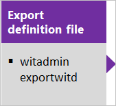
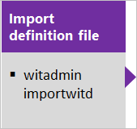

# On-premises XML process customization

[!INCLUDE [temp](../includes/version-header-tfs-only.md)]

The On-premises XML process model provides support for customizing work tracking objects and Agile tools for a project. With this model, you can update the XML definition of work item types, the process configuration, categories, and more. You can also update the attributes of fields. 

You customize your work tracking experience to support your business and reporting needs. The most common customizations include adding a custom field, modifying a work item form, or adding a custom work item type. 

[!INCLUDE [temp](../boards/includes/note-configure-customize.md)]

::: moniker range=">= azure-devops-2019"  

For Azure DevOps Server 2019 and later versions, you have a choice of process models. When you create a project collection, you'll need to choose between On-premises XML process model and Inheritance process model. To learn more, see [Customize work tracking, Choose the process model for your project collection](./customize-work.md?view=azure-devops-2019&preserve-view=true#choose-process-model).  

::: moniker-end

::: moniker range="<= tfs-2018"

Team Foundation Server uses the On-premises XML process model to support customizations. This model relies on updating and importing XML files using the **witadmin** command line tool. 
::: moniker-end  

> [!IMPORTANT]  
> To customize an Azure DevOps Services project, see [About process customization and inherited processes](../organizations/settings/work/inheritance-process-model.md). This article applies to on-premises deployments only.  

## Supported customizations  

You can perform the following tasks when you work with the On-premises XML process model. 

:::row:::
   :::column span="1":::
   **Area**
   :::column-end:::
   :::column span="1":::
   **Customization support**
   :::column-end:::
:::row-end:::

:::row:::
   :::column span="1":::
   Fields
   :::column-end:::
   :::column span="1":::
   - [Add or modify a field](add-modify-field.md)  
   - [Add a checkbox (Boolean) field (TFS 2017.2)](add-modify-field.md)  
   - [Add rules to a field](add-modify-field.md#add-rules)  
   - [Change a field label](add-modify-field.md#change-label)  
   - [Add a custom control field](add-modify-field.md#custom-control)  
   - [Remove a field from a form](add-modify-field.md#change-label)  
   - [Change a field attribute](add-modify-field.md#change-attribute)  
   - [Add fields that integrate with test, build, and version control](add-modify-field.md#integration-fields)  
   - [Delete a field](add-modify-field.md#delete-field)   
   :::column-end:::
:::row-end:::

:::row:::
   :::column span="1":::
   Pick lists
   :::column-end:::
   :::column span="1":::
   - [Area paths](../organizations/settings/set-area-paths.md) 
   - [Iteration paths](../organizations/settings/set-iteration-paths-sprints.md)  
   - [Add a custom pick list](add-modify-field.md#picklist)  
   - [Modify a pre-defined pick list](add-modify-field.md#picklist)  
   - [State or Reason fields (customize workflow)](xml/change-workflow-wit.md)  
   - [Person-name field (add users)](../organizations/security/add-users-team-project.md)   
   - [Resolution State & Failure Type](customize-work.md#test-experience)  
   - [Define global lists](xml/define-global-lists.md)   
   :::column-end:::
:::row-end:::

:::row:::
   :::column span="1":::
   Work item types
   :::column-end:::
   :::column span="1":::
   - [Add or modify a work item type](add-modify-wit.md)  
   - [Change the workflow (States, Reasons, Transitions)](xml/change-workflow-wit.md)  
   - [Customize the form](xml/change-work-item-form-layout.md)  
   - [Specify the WIT color](xml/process-configuration-xml-element.md#wit-colors)  
   - [Specify the WIT icon](xml/process-configuration-xml-element.md)  
   - [Specify the workflow state color](xml/process-configuration-xml-element.md#state-colors)   
   :::column-end:::
:::row-end:::

:::row:::
   :::column span="1":::
   Backlogs and process configuration
   :::column-end:::
   :::column span="1":::
   - [Add WITs to backlogs or boards](add-wits-to-backlogs-and-boards.md)  
   - [Add portfolio backlogs](add-portfolio-backlogs.md)  
   - [Configure the quick add panel](xml/process-configuration-xml-element.md#add)  
   - [Configure the default backlog columns](xml/process-configuration-xml-element.md#columns)  
   - [Set maximum number of task board items](xml/process-configuration-xml-element.md#number_items)  
   - [Set default weekend days (Scrum)](xml/process-configuration-xml-element.md#weekend_days)   
   - [Set default bug management behavior](xml/process-configuration-xml-element.md#behaviors)   
   - [Set default hidden backlogs](xml/process-configuration-xml-element.md#behaviors)   
   - [Process configuration](xml/process-configuration-xml-element.md)  
   - [Categories](xml/categories-xml-element-reference.md)  
   :::column-end:::
:::row-end:::

:::row:::
   :::column span="1":::
   Process template
   :::column-end:::
   :::column span="1":::
   - [Customize](process-templates/customize-process.md)  
   - [Manage (upload/download)](../boards/work-items/guidance/manage-process-templates.md)  
   - [Maintenance and upgrade implications](#before-you-customize)  
   :::column-end:::
:::row-end:::

:::row:::
   :::column span="1":::
   Link types
   :::column-end:::
   :::column span="1":::
   - [Add a custom link type](xml/link-type-element-reference.md)  
   - [Delete a custom link type](witadmin/manage-link-types.md)  
   - [Deactivate/activate a custom link type](witadmin/manage-link-types.md)  
   :::column-end:::
:::row-end:::

## Customization sequence   

When you manage an on-premises deployment, you perform most customizations using the following sequence. This sequence supports updating the XML definition for WIT, global lists, process configuration, and categories. This sequence supports individual updates through the import of their respective modified XML definition files. We recommend that you maintain your XML definition files in a repository for version control.  

  

In addition, you can use the **witadmin** tool to list objects, rename WITs, permanently remove WITs, and more.  
 

[!INCLUDE [temp](../includes/process-editor.md)]  

## Maintenance and upgrade implications
Before you customize, you should understand how your customizations may impact your project when you upgrade your application-tier server.  

Upgrades to an on-premises deployment can introduce new features that require updates to the objects used to track work. These objects include work item types, categories, and process configuration. Minimizing changes to the workflow for a WIT or the process configuration can help minimize the work you must do when you upgrade your deployment. 

To minimize the amount of manual work you'll need to do after an upgrade, understand which customizations support an easy update path and which do not. 

### Compatible for quick updating  

With the following customizations, you can use the Configure Features Wizard to automatically apply any changes to your project required for new features.

<ul>
<li>Fields: Add custom fields, customize a pick list, add or modify area and iteration paths, add rules to a field  </li>
<li>WITs: Add custom WITs, change the form layout</li>
<li>Categories: Add custom categories  </li>
<li>Agile tools: Customize the columns on the Kanban board, customize the quick add panel  </li>
<li>Office integration: Add or change how Project fields map to TFS fields   </li>
</ul>

To learn more about the Configure Features Wizard, see [Configure features after an upgrade](/previous-versions/azure/devops/reference/upgrade/configure-features-after-upgrade).

### Compatible, but may require manual updates

The Configure Features Wizard requires that specific work item types, workflow states, and fields exist in the project. When you make the following customizations, you might need to modify your custom process for the wizard to run, or you might have to update your project manually. 

<ul>
<li>Fields: Change attributes of an existing field, remove fields that are referenced in the process configuration </li>
<li>WITs: Change the workflow </li>
<li>Agile tools: Change the WITs defined for the Requirement Category, Task Category, or Feature Category.</li>
<li>Agile tools: Change the metastate mapping defined in the process configuration.  </li>
<li>Agile tools: Change a field specified for a <code>TypeField</code> in the process configuration.   </li>
</ul>

In addition, changes you make to WITs or the workflow could require updates to other artifacts provided with your process, such as Excel or SQL Server Reporting Services reports.
 

### Customizations to avoid
You should avoid making the following customizations because they can result in schema conflicts in the data warehouse or cause problems when updating projects after a TFS upgrade. 

*	Fields:  
	*	Change the friendly name of a field (a field specified within a WIT definition file)  
	*	Change one or more reporting attributes, or the attribute to synchronize person names with Active Directory of a default field  
*	WITs: Rename or delete WITs 
*	Categories: Change the name of default categories, or change the WITs specified within default categories  

To learn more about reporting attributes, see [Add or modify work item fields to support reporting](xml/add-or-modify-work-item-fields-to-support-reporting.md).

### Recommended practices  
*	Identify the best options for customizing WITs that support your tracking requirements. When you change objects that track work items, you should identify how these changes will affect existing and future projects.  
*	Put processes and all XML definition files under version control. Do not deploy objects that you define but have not stored in a repository.  
*	Test your customized objects just as you would test your software.  
*	Minimize the number of custom fields that you introduce. Minimize the number of fields that you make reportable.  

## Replace team area path with a team field  
The default configuration for projects associates each team with an area path. If your organization has several teams that work from a common backlog and across many product areas, this configuration might not fit how you want to organize your work. By adding a custom field to represent teams in your organization, you can reconfigure the agile planning tools and pages to support your teams and decouple assignment to teams and area paths.

[Use team fields instead of area paths to support teams](/previous-versions/azure/devops/reference/upgrade/use-team-fields-instead-area-paths) describes how to change the default configuration.

## Related articles

- [Customize work](customize-work.md) 
- [witAdmin: Customize and manage objects for tracking work](witadmin/witadmin-customize-and-manage-objects-for-tracking-work.md)