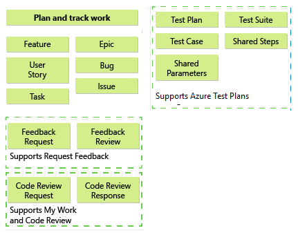
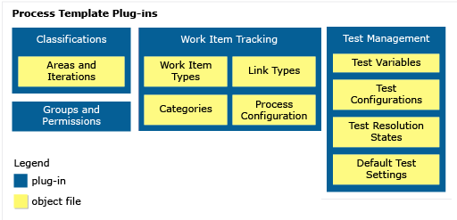
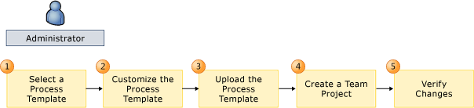

# Customize a process template

[!INCLUDE [version-lt-azure-devops](../../includes/version-lt-azure-devops.md)]
 
Process templates define the objects and processes available to you when you create a project. By customizing a process template, you customize one of more objects. Common types of customizations you can make include:  
  
- Add a new field to an existing work item type (WIT)  
- Modify the pick list of values for a field  
- Change the workflow states, reasons, transitions, and actions of a default or custom work item type  
- Edit the layout of a work item form  
- Add or remove a work item type  
- Change the process configuration or defaults associated with Azure Boards hubs  

> [!NOTE]    
> This article describes process templates used to create projects defined on Azure DevOps Services. If you're looking for **project templates** for software development, see [Creating Visual Studio templates](/visualstudio/ide/creating-project-and-item-templates).  
  
Default process templates define default configurations and work item types used by Azure Boards and Azure Test Plans. For example, the Agile process template defines the set of work item types shown in the following image.   
  
  
  
Many of these artifacts depend on work item types that are used to track work. For example, data fields defined in the definition of Feature, Bug, User Story, or Task are also used to define work item queries. In addition to these artifacts, you can also define the initial project areas and iterations, security configuration, and other default settings that support test plans.  
  
 After you create a project, you can change configurations and customize artifacts. However, by customizing the process template before you create your projects, all resulting projects that you create from it will match a standard set of team processes. The main reasons you might want to customize a process template include:  
  
-   You plan to create several projects and you want to minimize repetitive tasks that you'll have to implement later in each project that you create   
-   You want to make sure all teams adhere to certain standards by providing the templates and structures within the toolset your software development teams use 
-   You need to update a custom process template to support using the Configure Features wizard after an upgrade  
  
If you work with only a single project, then you might consider simply creating the project and customizing one or more objects later.  
  
## How are process templates used?  

The primary use of process templates is to create a project. For the Hosted XML process model, it is also used to update a project. A project provides the set of objects, artifacts, and configurations defined in the interdependent set of template files. You use your project to organize source code, track work and information, build software, and support test activities.  
  
 **Hosted XML process model**   
-   [Create a project](../../organizations/projects/create-project.md)
-   [Add or refresh a process](../../organizations/settings/work/import-process/import-process.md)   
  
**On-premises XML process model**    
-   [Create a project](../../organizations/projects/create-project.md)  

## Where should I start?  

 Before you start customizing a process template, you'll want to become familiar with what you can configure and customize and then plan your changes accordingly.  
  
-   If you're new to process templates, first [review the default process templates](../../boards/work-items/guidance/choose-process.md).  
  
-   If you want to become familiar with the file structure of a process template, [review a description for each file](/previous-versions/azure/devops/reference/process-templates/overview-process-template-files) or [download a process template](../../boards/work-items/guidance/manage-process-templates.md).  
  
     You can modify the processes for your project after it is created. As you work with a project, the initial settings that the process template defined may no longer meet your needs.  
  
-   If you're most interested in customizing objects used to track work, which includes test plans, test suites, and test cases, review [Customize your work tracking experience](../customize-work.md). The customizations you make by modifying an XML definition file for a project are the same types of customizations you make in a process template file.  
  
     If you want to [add or modify types of work items](../add-modify-wit.md), you can achieve this without changing the whole process template. You can make and test changes by using an existing project. For the On-premises XML process model, you can use the **witadmin exportwitd** and **importwitd** command-line tools to download and upload the XML definition files for work item types.  

-   If you're considering making extensive customizations, [review how the changes you make will impact maintenance and upgrade of your projects](../on-premises-xml-process-model.md#before-you-customize).  
  
 

##  Process template files and functional areas you can customize  

Process templates consist of nine plug-ins. Each plug-in defines a set of tasks that execute and the screens that appear when you create a project. Tasks set permissions, create folders, upload files, activate sites, or set other configurable variables. Plug-ins also specify the dependencies that a task has on the successful completion of other tasks.  
  
  
  
::: moniker range="< azure-devops-2022"

> [!IMPORTANT]  
>When you create a project from the web portal, several process template files are ignored. Specifically, the files that would create a Report Manager site aren't supported. To support reporting for a project collection, see [Add reports to a team project](/previous-versions/azure/devops/report/admin/add-reports-to-a-team-project).   
::: moniker-end

To customize a process template, you customize one or more files associated with a functional area. While customizing any one object is fairly simple, you'll want to make sure that you don't break any inter-dependencies when you customize.  The [ProcessTemplate.xml plug-in file](/previous-versions/azure/devops/reference/process-templates/define-root-tasks-process-template-plug-in) defines which plug-ins to include in the template. This file contains all the task groups that you want to run to create a project. Each task group references a subordinate XML plug-in file where the specific tasks for that plug-in are defined.     
  

- **Teams, groups, permissions, & area and iteration paths** 
	::: moniker range="> tfs-2018"
	- [Area and iteration paths](/previous-versions/azure/devops/reference/process-templates/define-classification-plug-in) 
	- [Groups, teams, members, and permissions](/previous-versions/azure/devops/reference/process-templates/configure-initial-groups-teams-members-permissions)
	::: moniker-end
	::: moniker range="tfs-2018"
	- [Area and iteration paths](/previous-versions/azure/devops/reference/process-templates/define-classification-plug-in) 
	- [Groups, teams, members, and permissions](/previous-versions/azure/devops/reference/process-templates/configure-initial-groups-teams-members-permissions)
	- [Microsoft Project mapping file](/previous-versions/azure/devops/reference/xml/map-microsoft-project-fields-to-tf-fields) 
	::: moniker-end

- **Work item tracking**  
	- [WIT definitions](/previous-versions/azure/devops/reference/process-templates/add-wit-definitions-process-template) 
	- [Categories](/previous-versions/azure/devops/reference/process-templates/add-type-wit-category-definitions-process-template) 
	- [Process configuration](../xml/process-configuration-xml-element.md) 
	- [Link types](/previous-versions/azure/devops/reference/process-templates/add-link-type-definitions-to-a-process-template)  

- **Test management** 
	- [Test environments, configurations, resolution states, and settings](/previous-versions/azure/devops/reference/process-templates/define-initial-configuration-test-manager)
  
### Plug-in dependencies  

Many objects rely on the definition of other objects within a process template. For an overview of required plug-ins and plug-in dependencies, see [Define dependencies for task groups and tasks](/previous-versions/azure/devops/reference/process-templates/define-dependencies-plug-ins-groups-tasks).  
  
### Plug-in and naming restrictions 

When you add objects to a process template, make sure that you label them correctly so that you avoid XML validation errors.  
 
- Restrictions are put on the names or labels of most Team Foundation objects. For an overview of naming restrictions that apply to process templates, security groups, area and iteration nodes, work item types, and work item fields, see [Naming restrictions](../../organizations/settings/naming-restrictions.md).  
  
- Most process template components that you customize will affect only the project that you create by using the process template. The exceptions to this rule are global lists, link types, and work item fields. These objects are defined for a project collection.  
  
- Each work item field has an associated field reference name that uniquely identifies each field. The reference name cannot be changed after it is assigned.  
 
	::: moniker range="< azure-devops-2022"
     In addition,if you are using SQL Server Reporting Services for your project collection, the reporting name assigned to a work item field must match across all work item types that are defined for the project collection. If they do not, validation errors might occur when you upload the process template, or conflicts might occur in the data warehouse databases.  
	::: moniker-end
     Work item field names, link type names, and global lists are scoped to a project collection. If you customize any of these objects, the change will be reflected in all projects that are defined in the collection and in the work item types that contain that work item field.  
- The maximum size of a process template is two gigabytes. When you customize a process template, make sure that your changes don't increase its size beyond that value.  

 

##  Steps to customize a process template  

Customizing a process template is an iterative process. You will need a project collection that is defined on a server that is running Azure DevOps Server where you can test your process template to make sure that it was customized correctly.  
  
 To customize a process template, you first download an existing process template, modify or add files, upload the process template files, and then verify your changes.  
  
   
  
|Step|Task|  
|----------|----------|  
||[Download a process template](../../boards/work-items/guidance/manage-process-templates.md). Before you can customize a process template, you must download it to your local computer.   To minimize the modifications that you must make, [select a template](../../boards/work-items/guidance/choose-process.md) that most closely matches your team processes. In general, you choose a process template based on types of work items and workflow.|  
||**Modify or add files**. You customize a process template by modifying, deleting, or adding files that are defined for a process template. You customize a plug-in or definition file by modifying its XML content. Each plug-in file and type definition file must conform to its XML schema definition.   The first time that you customize a process template, make a small change. If you make many changes without a good understanding of how the changes may affect your template, you risk encountering multiple mistakes that will be difficult to debug.   Make sure that the name of your process template is unique. If you download a process template, make changes, and upload it, you must change its name or it will over-write the existing process template from the project collection.|  
||[Upload a process template](../../boards/work-items/guidance/manage-process-templates.md). After you have customized your template, upload it to the project collection where you will create the project.   Ideally, you should use a project collection that is not used by other projects. By working in a test-bed project collection, you avoid introducing a change that might collide with existing team processes that are still under development. Also, you will want the project collection to support the same resources that you want to access, such as a project portal and a reporting site.   Make sure that the name of your process template is unique. If you downloaded a process template from a project collection, made a change, and are now uploading the template, you must change its name or delete the existing process template from the project collection.   The upload process performs a verification check to make sure that the XML is valid. If you receive any errors when you try to upload the process template, the changes that you made will have caused the error. Review your changes, and correct any XML syntax errors that you find.|  
||[Create a project](../../organizations/projects/create-project.md). To test new process templates, you must create a project. If any errors occur, view the log for project creation. It contains a list of the tasks that it tried to run and shows which tasks failed. You can map failed tasks back to the XML to determine the cause of the errors.   You can clean up unnecessary projects by using the [TFSDeleteProject command-line tool](../../organizations/projects/delete-project.md).|  
||**Verify changes to process templates**. Before you put your process template in production mode and use it as the basis for several projects, you should verify that it is well-defined. You perform this task by systematically verifying that each object and artifact works as expected. |  
  
 

## Related articles 

- [Process templates overview](index.md)
- [Process template and plug-in files](/previous-versions/azure/devops/reference/process-templates/overview-process-template-files) 
- [Configure features after an upgrade](/previous-versions/azure/devops/reference/upgrade/configure-features-after-upgrade)
- [Process template plug-ins: Index to XML elements](/previous-versions/azure/devops/reference/process-templates/process-template-plug-ins-xml-elements-index)
- [XML element reference](../xml/xml-element-reference.md)   
  
### Tools that support customizing a process template 

You can customize a process template using one of the following tools: 

- Any text editor or XML editor to modify XML files.  
- The Process Editor Tool.  
	Based on the version of Visual Studio you have installed, get the Process Editor Tool from one of the following extensions. 

	[!INCLUDE [temp](../../includes/process-editor-tool.md)]
