# Assign permissions to support TFS-Project Server integration

[!INCLUDE [temp](../../_shared/tfs-ps-sync-header.md)]

 Assigning permissions is the first step in configuring Team Foundation Server and Project Server to support data synchronization. You must grant permissions to several accounts&mdash;administrators, service accounts, and team members. You must also make sure that specific service accounts have access as a Shared Services Provider (SSP) for the server that hosts SharePoint Products for Project Server.  
  
 You should grant permissions after you have installed Team Foundation Server Extensions for Project Server Integration. For more information, see [System and setup requirements](system-and-setup-requirements.md).  
  
## Before you begin  
 Before you begin, you'll want to know which Project Web Access or Project Web App (PWA) instances and TFS project collections will participate in data synchronization. You'll also want to have answers to the following questions.  
  
###   Do you have all the permissions you need to assign permissions?  
 Make sure you belong to the following groups:  
  
-   **Team Foundation Administrators** group, required to grant TFS permissions. You must also have access to the **Team Foundation Administration Console**. [Add accounts to administer TFS](../../organizations/security/set-project-collection-level-permissions.md).  
  
-   **Administrator for Project Web App**  for each instance of PWA, required to grant Project Server permissions. You must also have access to Project Server through PWA.  
  
-   **Administrators** security group for the SQL Server databases for Project Server, required to grant permissions to the PWA Reporting and Publishing databases.  
  
-   **Farm Administrators** group, the administrators group for the Web application that supports Project Server, or the **SharePoint Administration** group, required to grant SSP permissions. Group membership will depend on the security architecture of your deployment.  
  
-   Administrator on the local computer, required to use `stsadm.exe`.  
  
###   Is the authentication mode set correctly for your version of Project Server?  
  
-   **For Project Server 2010**:  
  
     The SharePoint web application for the instance of PWA must be set to **Classic Mode Authentication**. Classic Mode Authentication uses Windows authentication. User accounts are treated by SharePoint Server 2010 as Active Directory Domain Services (AD DS) accounts.  
  
     You will not be able to register the PWA if its authentication is set to Claims Based Authentication. If you're not sure which authentication mode is set, or you need to switch authentication modes, [jump to this section](#auth2010).  
  
-   **For Project Server 2013**:  
  
     Two permissions are supported: SharePoint Permission mode and Project Permission mode. Both these modes use Claims Based authorization. The permissions that you need to assign differ, depending on the permission mode that is set.  
  
     SharePoint permissions mode creates SharePoint groups that directly correspond to the default security groups found in Project Server permission mode. These groups are used to grant users varying levels of access to projects and Project Server functionality. SharePoint permission mode is new for Project Server 2013.  
  
     New Project Web App instances use the SharePoint permission mode by default. In an on-premises installation, the mode can be changed for a given instance of Project Web App by using the **Set-SPProjectPermissionModeWindows** PowerShell cmdlet.  
  
     Project Server permission mode provides a set of customizable security groups and other functionality that is distinct from SharePoint groups. This security platform operates independent from the SharePoint permissions in the farm and allows you to fine tune the permission levels for Project Web App users. This is the same permission mode that was available in Project Server 2010.  
  
     For a comparison of features supported in each security mode, see [Plan user access in Project Server 2013](http://technet.microsoft.com/library/fp161361\(v=office.15\).aspx).  
  
     If you're not sure which Permission mode is set, or you need to switch Permission modes, [jump to this section](#perm2013).  
  
###   Have you created Windows groups to effectively manage user accounts?  
 To minimize manually adding users to TFS and Project Server, create Windows or Active Directory groups. You can then add these groups to TFS groups, Project Server, and SharePoint sites which have pre-defined permissions. Also, you can synchronize resources with Active Directory across multiple domains and forests.  
  
 For more information, see [Manage security group synchronization with Active Directory in Project Server 2013](http://technet.microsoft.com/library/gg750243.aspx).  
  
##   1. Identify all the service and user accounts that you need to assign permissions to  
 Identify the service accounts, user accounts, or Active Directory groups that have been configured and will need access to the resources that support data synchronization between TFS and Project Server.  
  
###   Service accounts  
 Identify the following service accounts:  
  
-   **Service account for TFS**  

     [Open the Team Foundation Administration console](/azure/devops/server/ref/command-line/open-admin-console). If a Network Service account is used, [change it to a domain account](/azure/devops/server/admin/change-service-account-password).  
  
-   **Service account for the Project Server Event Handler**  
  
     On the machine where Project Server is installed, open **Computer>Manage Services** and find **Microsoft Project Server Events Service**.  
  
-   **Service account(s) that run the Project server web application pool(s)**  
  
     There might be more than one service account, depending on the number of PWA instances that will participate in TFS data synchronization. You need to identify both the SharePoint appPool hosting PWA and the PSI service appPool. A GUID appPool name could be associated with the PSI service appPool.  
  
    1.  Open SharePoint Central Site Administration, Application Management, Manage Service Application, Project Server Application.  
  
         Find the SharePoint site that hosts the PWA instance. Make a note of the number. It might be under one or more ports, for example, SharePoint 80, or SharePoint web app.  
  
    2.  Open IIS manager, expand sites, and find the SharePoint websites that correspond to the PWA that you identified.  
  
        -   **For Project Server 2010**: Open Advanced settings for the application Pool and you'll find the account identity for the AppPool.  
  
        -   **For Project Server 2013**: Expand SharePoint web services and expand each GUID until you find the one that contains project PSI service. In Advanced settings, identify the Application Pool, which is a GUID pool name.  
  
               
  
             Under IIS, AppPools, find the account used to run this GUID application pool.  
  
             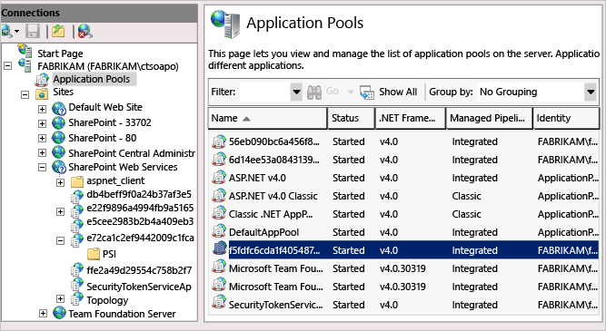  
  
### User accounts  
 Identify the following user accounts or groups:  
  
-   User account(s) who will run the `TFSProjectServer registerPWA` command  
  
-   User account(s) who will map components to support TFS-Project Server integration, but not register PWAs  
  
-   Users of Project Professional  
  
-   Users assigned as project resources or have TFS work items assigned to them  
  
     These users submit status updates that flow into the status queue for the project manager  
  
 Depending on the role, you grant permissions to each PWA instance that participates in data synchronization to the SharePoint server, to the enterprise resource pool, and to TFS.  
  
##   2. Grant permissions to access each PWA instance  
 Do the following tasks, based on the version and permission mode used in your deployment. You must add accounts for each PWA instance that you will register and map to a project.  
  
|Task|Set for these configuration:|  
|----------|----------------------------------|  
|[2-1. Grant Global permissions to the TFS Service account](#global)| |  
|[2-2. Grant Category permissions to the TFS Service account](#category)| |  
|[2-3. Add accounts to a PWA security group](#pwa):   -   TFS Service account -   Service account(s) for the Project Server web application pool -   User accounts that configure the integration -   Accounts of users of Project Professional: **Project Manager**  or **Portfolio Managers** -   User accounts assigned as resources in the project plan: **Team Members**| |  
|[2-4. Add accounts to a PWA security group (SharePoint mode)](#pwa_sp)   -   TFS Service account -   Service account(s) for the Project Server web application pool -   Service account for the Project Server Event Handler, add  to Administrators for PWA -   User accounts that configure the integration -   Accounts of users of Project Professional: **Project Manager**  or **Portfolio Managers** -   User accounts assigned as resources in the project plan: **Team Members**||  
|[2-5. Add user accounts to the Active Directory Enterprise Resource Pool](#pool)|  |  
  
###   2-1 Grant Global permissions  
 **Required for:**  and   
  
1.  From the PWA Settings page, open Manage Users, and then New User.  
  
2.  Add the TFS service account.  
  
3.  Type the required information in each field. Note the following:  
  
    1.  Clear the check box for **User can be assigned as a resource** because the account is a service account.  
  
    2.  For **User Authentication**, type the name of the service account for TFS.  
  
    3.  Assign the following **Global** permissions:  
  
        -   Admin: Manage Enterprise Custom Fields, Manage Server Events, Manage Site Services, and Manage Users and Groups.  
  
        -   General: Log On, New Task Assignment, and Reassign Task.  
  
        -   Project: Build Team on New Project.  
  
        -   Views: View Approvals, View Project Center, View Resource Center, and View Task Center.  
  
4.  Save your changes.  
  
###   2-2 Grant Category permissions  
 **Required for:**  and   
  
1.  From the home page for PWA, in the Quick Launch area, choose **Server Settings**.  
  
2.  Next, choose **Manage Categories** and then **New Category**.  
  
3.  Type a name for the service account category, for example, type **Servicing Account**.  
  
4.  Under **Available Users**, choose the name of the service account for Team Foundation Server, and then choose **Add**.  
  
     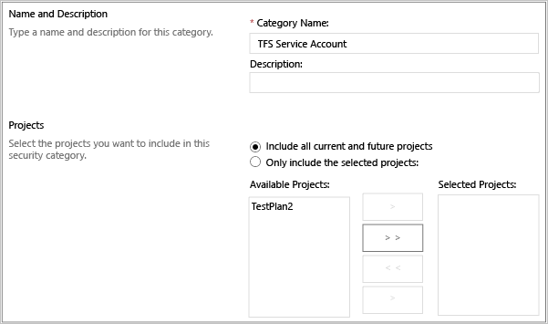  
  
5.  Under Projects, choose **All current and future projects in Project Server database**, and then click **Save**.  
  
6.  Add the TFS service account and select the checkboxes for these **Category** permissions:  
  
    -   Project: Open Project and View Project Site  
  
    -   Resource:  View Enterprise Resource Data  
  
       
  
###   2-3 Add accounts to a PWA security group  
 **Required for:**  and   
  
1.  From the PWA Settings page, open Manage Users, New User, and then type the required information in each field:  
  
    -   Clear the check box for **User can be assigned as a resource** if the account is a service account.  
  
    -   For **User Authentication**, type the account name of the user or service account for TFS.  
  
    -   Clear the check box for **Resource can be leveled** if the account is an administrator or a service account.  
  
2.  For **Security Groups**, add the account or group to one of the default groups:  
  
    1.  **Administrators**: TFS service account and the accounts of users who configure the integration, ones who register or unregister PWAs.  
  
    2.  **Project Managers**: users who work with Project Professional and PWA.  
  
    3.  **Team Members**: users who are assigned as a resource and who are assigned to TFS work items.  
  
3.  If you have customized Category permissions, verify that team members have the following Security Categories: **Create New Task or Assignment**, **Create Object Links**, **Open Project**, **View Project Site**, and **View Project Schedule in Project Web App**(Project Server 2010).  
  
       
  
     For Project Server 2013, Permission mode, select:  Open Project,  View Project Site, and View Project Schedule in Project Web App.  
  
     To modify the category permissions for a selected user in a category, select the category in the **Selected Categories** list, and then select **Allow** for the permissions that you want to allow.  
  
4.  Save your changes.  
  
 For more information, see [Add a user account in Project Server 2010](http://go.microsoft.com/fwlink/?LinkId=207279) or [Plan user access in Project Server 2013](http://go.microsoft.com/fwlink/?LinkId=262117)..  
  
###   2-4 Add accounts to a PWA security group (SharePoint mode)  
 **Required for:**   
  
1.  From the PWA home page, open **Site settings** from the gear icon.  
  
       
  
2.  Open Site Collection Administrators and add the TFS service account.  
  
3.  Open **People and groups**.  
  
     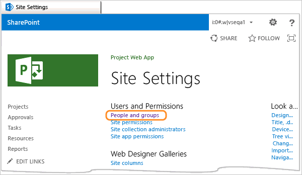  
  
4.  Choose the group to which you want to add accounts.  
  
     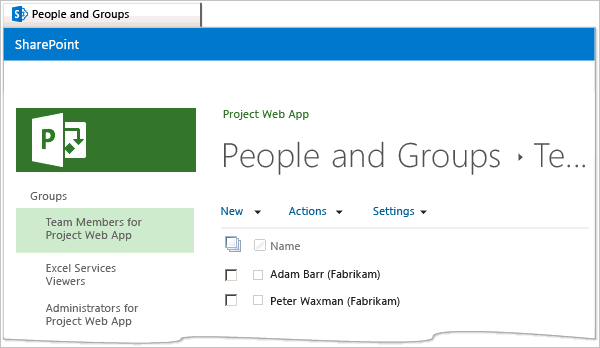  
  
    1.  **Team Members for Project Web App**: accounts assigned as resources in the project plan or to the Assigned To field for a work item. Or, add the Active Directory group used to manage these resources.  
  
    2.  **Administrators for Project Web App**: the service accounts for Team Foundation Server, the Project Server web application pool, and Project Server Event Handler. Also, add the accounts of users who configure the integration by running the **TfsAdmin ProjectServer RegisterPWA/UnRegisterPWA** commands  
  
    3.  **PWA Site Collection Administrators** : the accounts of users who configure the integration by running the **TfsAdmin ProjectServer RegisterPWA/UnRegisterPWA** commands  
  
    4.  **Project Managers for Project Web App**: accounts of users of Project Professional.  
  
    > [!TIP]
    >  To view all the default groups, choose **More**. To view permissions assigned to each group, choose **Settings, View Group Permissions**. To learn more, see [Plan user access in Project Server 2013](http://go.microsoft.com/fwlink/?LinkId=262117).  
  
5.  On the group page, choose **New, Add users**.  
  
6.  Type the name of each account or Active Directory group to add to the selected group.  
  
     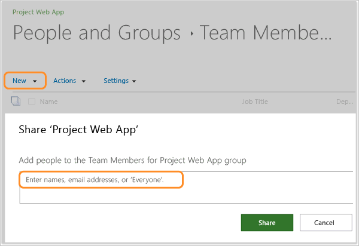  
  
7.  Choose **Share**.  
  
###   2-5 Add user accounts to the Active Directory Enterprise Resource Pool  
 **Required for:** , , and   
  
1.  From the PWA settings page, under Operational policies, choose Active Directory resource pool synchronization.  
  
       
  
2.  Add the Active Directory group of TFS team members to the enterprise resource pool.  
  
     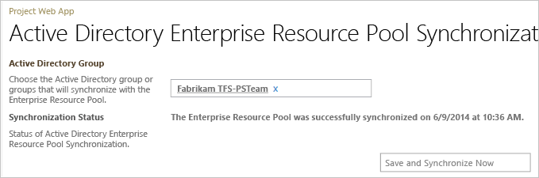  
  
##   3. Grant SharePoint Server permissions  
 Grant the specified permissions using SharePoint Central Administration. Or, you can use Windows PowerShell.  
  
|Task|Set for these configurations:|  
|----------|-----------------------------------|  
|[3-1. Grant Full Control Connect permissions to start the Project Server Service Application](#full_control)   -   TFS service account -   Service account for the Project Server Event Handler| |  
|[3-2. Add TFS service account to the Site Collection Administrators for the SharePoint site](#site_collection)||  
  
###   3-1 Grant Full Control Connect permissions to start the Project Server Service Application  
 **Required for:**  and   
  
1.  On to the SharePoint server for Project Server, open **SharePoint Central Administration**, and under **Application Management**, choose **Manage service applications**.  
  
       
  
2.  Highlight the row for **Project Server Service Application** by clicking within the row but not the name of the application. In the ribbon, choose **Permissions**.  
  
       
  
3.  Type the name of the service account for TFS, and then choose **Add**.  
  
4.  Make sure that the name of the newly added service account is highlighted, and then select the **Full Control** check box. Choose **OK**.  
  
     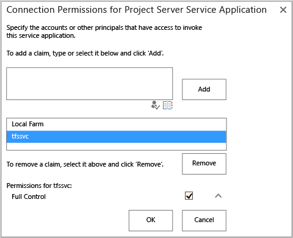  
  
5.  Repeat steps 3 and 4, this time add the service account for Service account for the Project Server Event Handler.  If there is more than one service account, make sure you add it.  
  
 For more information, see [Restrict or enable access to a service application](http://technet.microsoft.com/library/ff463596.aspx).  
  
###   3-2. Add TFS service account to the Site Collection Administrators group  
 **Required for:**   
  
1.  On to the SharePoint server for Project Server, open  **SharePoint 2013 Central Administration**, and choose **Site settings** from the gear icon.  
  
       
  
2.  Choose **Site collection administrators**.  
  
     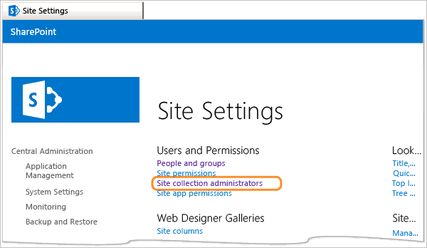  
  
3.  Type the name of the TFS service account, and choose OK when done.  
  
##   4. Grant Project Server database permissions  
 **Required for:** , , and   
  
 Grant permissions to both the service account for TFS and the service account for the Project Server web application pool to update the database or databases for each PWA instance. This step is required for all deployments, both Project Server 2010 and Project Server 2013.  
  
1.  On the data-tier server for Project Server, open **SQL Server Management Studio**.  
  
2.  In the **Server type** list, select **Database Engine**.  
  
3.  In **Server name**, type the name of the server that hosts the databases for Project Server, and then choose **Connect**.  
  
    > [!NOTE]
    >  If SQL Server is installed on a cluster, type the name of the cluster, not the computer name. If you have specified a named instance, type the server and instance name in the following format: *DatabaseServer\InstanceName*.  
  
     SQL Server Management Studio opens.  
  
4.  Expand **Databases**, right-click or open the context menu for the database for the instance of PWA, and then choose **Properties**:  
  
    -   For Project Server 2010:  **PWA_Reporting** or **PWA_Publishing**  
  
    -   For Project Server 2013: **ProjectWebApp**  
  
5.  On the **Permissions** page. add the service account for TFS, (required for Project Server 2010 and Project Server 2013, Permission mode).  
  
     For SQL Server 2008: Choose **Add** to add an account.  
  
     For SQL Server 2012: Choose **Search** to add an account.  
  
     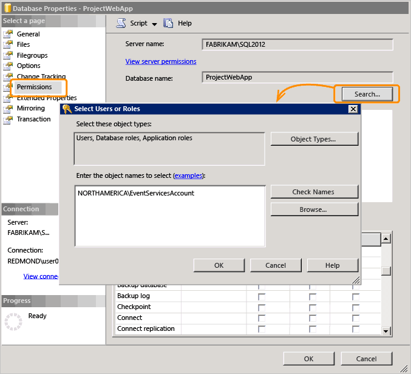  
  
6.  Grant these permissions based on the database you've selected:  
  
    -   For Project Server 2010: **PWA_Reporting**:  **Alter any Schema**, **Create Table**, **Delete** , **Execute**, **Insert**, **Select**, and **Update**.  
  
    -   For Project Server 2010: **PWA_Publishing**: **Select**  
  
    -   For Project Server 2013: **ProjectWebAppAlter any Schema**, **Create Table**, **Delete** , **Execute**, **Insert**, **Select**, and **Update**.  
  
       
  
7.  Repeat steps 5 through 6, this time add the service account of the Project Server web application pool. This is required for all deployments.  
  
8.  Repeat steps 4 through 7 for each instance of PWA that will participate in data synchronization with TFS.  
  
##   5. Add user accounts to Team Foundation Administrators group  
 **Required for:** , , and   

1.  On the application-tier server, [Open the Team Foundation Administration Console](/azure/devops/server/command-line/open-admin-console), and open **Group Membership**.  
  
       
  
2.  Open **Team Foundation Administrators**.  
  
3.  Choose Windows User or Group and then choose Add.  
  
     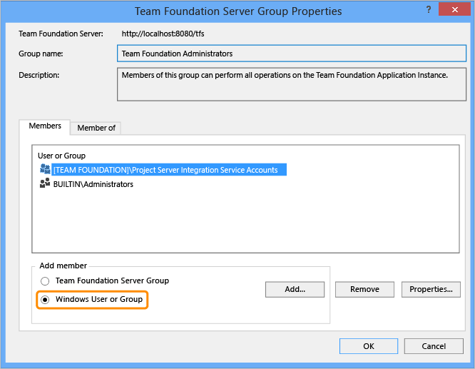  
  
4.  Enter the name of the accounts of users who configure the integration by running the **TfsAdmin ProjectServer RegisterPWA/UnRegisterPWA** commands.  
  
       
  
##   6. Grant Administer Project Server integration permissions  
 **Required for:** , , and   
  
 Accounts of users who configure the TFS-Project Server integration require Administer Project Server Integration permission set to allow. Set this for each project collection that you map to a PWA.  
  
 From the Security page for the project collection, either open the permissions for a user account or a Windows account that you've added to TFS for administering project server integration. Set the permissions for Administer Project Server Integration to Allow.  
  
 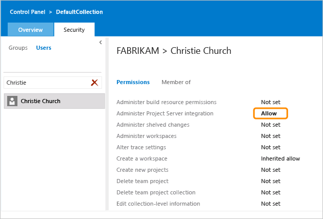  
  
##   7. Add accounts to Team Foundation groups  
 **Required for:** , , and   
  
 Accounts of users who work in Project Professional or TFS require permissions to view or contribute to TFS.  
  
 From the TFS web portal administration Security page for the project, you can add accounts to either the project collection or each project. Add accounts or the Active Directory groups to the appropriate roles.  
  
   
  
 Verify that user accounts or groups have been added to the following TFS groups for each project that will participate in data synchronization:  
  
-   **Contributor** role: Team members who work in a TFS project that is integrated with Project Server. This includes all user accounts assigned as resources in the project plan or to the Assigned To field for a work item. These users submit status updates that flow into the status queue for the project manager.  
  
-   **Reader** role: Users who modify enterprise project plans that are mapped to a project.  
  
 For more info, see [Add users to projects](../../organizations/security/add-users-team-project.md).
  
## Permission checklist  
 Use the following checklist to review that all permissions have been set according to your version and authentication mode. Remember that permissions must be granted to accounts for all PWA instances, projects, and project collections that will participate in data synchronization between TFS and Project Server. If you customize a role or security categories for a role, you might inadvertently remove required permissions.  
  
|Account|Permissions|Project Server 2010|Project Server 2013 (Permission mode)|Project Server 2013 (SharePoint mode)|Application|  
|-------------|-----------------|-------------------------|---------------------------------------------|---------------------------------------------|-----------------|  
|Service Account for TFS|[Global](#global) and [Category](#category) permissions||||PWA|  
||[Administrators for Project Web App group](#pwa)||||PWA||PWA|  
||[Site Collection Administrators group](#site_collection)||||SharePoint Central Administration|  
||[Connect permissions to the Project Server Service Application (Full Control)](#full_control)||||SharePoint Central Administration|  
||[PWA_Reporting and PWA_Publishing databases](#grant_db_permissions)||||SQL Server Management Studio|  
||[ProjectWebApp database](#grant_db_permissions)||||SQL Server Management Studio|  
|Service account for the Project Server web application pool (Note 1)|[Administrators for PWA group](#pwa)||||PWA|  
||[PWA_Reporting and PWA_Publishing databases](#grant_db_permissions)||||SQL Server Management Studio|  
||[ProjectWebApp database](#grant_db_permissions)||||SQL Server Management Studio|  
vice account for the Project Server Event Handler|[Connect permissions to the Project Server Service Application (Full Control)](#full_control)||||SharePoint Central Administration|  
||[Administrators for PWA group](#pwa)||||PWA|  
|User accounts who will configure the integration and run the **TFSProjectServer registerPWA** command|[Administrators for PWA group](#pwa)||||PWA|  
||[Site Collection Administrators group](#site_collection)||||SharePoint Central Administration|  
||[Team Foundation Administrators group](#add_tfadmingroup)||||Team Foundation Administration Console|  
||[Administer Project Server integration](#twa_apsi)||||TFS web portal |  
|User accounts who will map components to support TFS-Project Server integration, but not register PWAs|[Administer Project Server integration](#twa_apsi)||||TFS web portal |  
rs of Project Professional|[Project Manager group for each PWA instance](#pwa)||||PWA|  
||[TFS Readers group](#add_twa)||||TFS web portal |  
|Users assigned as project resources or have TFS work items assigned to them|[Team Members for the PWA App group](#pwa)||||PWA|  
||[Plan groups, categories, and RBS in Project Server 2013 (Note 2)](http://msdn.microsoft.com/library/cc197354.aspx) (Note 2)||||PWA|  
||[Enterprise project pool and to the project resource pool for the project plan](#pool)||||PWA|  
||[TFS Contributors group](#add_twa)||||TFS web portal |  
  
 **Notes:**  
  
1.  Some deployments might have more than one service account for the Project Server Web Application Pool. See [Service accounts](#service_accounts) to determine the service accounts for these application pools.  
  
2.  The Security Categories assigned to Team Members by default are sufficient; however, if these categories have been customized, then some permissions might have been removed. The following categories are required: **Create New Task or Assignment**, **Create Object Links**, **Open Project**, **View Project Site**, and **View Project Schedule in Project Web App** (Project Server 2010), and **Open Project**, **View Project Site**, and **View Project Schedule in Project Web App** (Project Server 2013, Project permission mode).  
  
## Q & A  

   
###  Q: How do I determine or change the Authentication mode in SharePoint 2010?  
 **A:** From SharePoint 2010 Central Administration site, open Manage web applications from the Application Management section, and then open the PWA application.  
  
 Verify that Classic Mode Authentication is selected.  
  
   
  
 If it isn't, you'll need to [create a new PWA instance that uses Windows-Classic authentication](http://technet.microsoft.com/library/gg276326.aspx).  
  
 
###  Q: How do I determine the Permission mode in SharePoint 2013?  
 **A:** From the PWA home page, use the gear icon to open **PWA settings**.  
  
 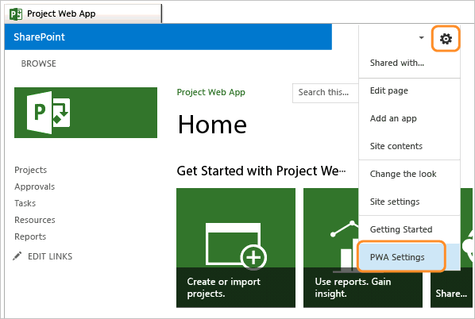  
  
 If SharePoint Permissions mode is set, you'll see this page:  
  
   
  
 If Project Permissions mode is set, you'll see this page, which includes a section titled **Security**. You'll also see additional links:  
  
   
  
### Q: How do I switch permission modes in Project Server 2013?  
 **A:** By default, PWA apps are created using SharePoint permission mode.  
  
 If you switch from SharePoint permission mode to classic Project Server permission mode, you have to manually configure your security permissions structure in Project Server 2013.  Switching between SharePoint permission mode and Project Server permission mode deletes all security-related settings.  
  
 To switch permission mode, see [Set-SPProjectPermissionMode](http://technet.microsoft.com/library/jj219486.aspx).  
  
### Q: What other resources are available?  
 **A**: You might find answers to additional questions from the following resources:  
  
|Project Server 2010|Microsoft Project Server 2013|  
|-------------------------|-----------------------------------|  
|-   [Manage users in Project Server 2010](http://go.microsoft.com/fwlink/?LinkId=207275) -   [Plan for administrative and service accounts (Project Server 2010)](http://go.microsoft.com/fwlink/?LinkId=207273) -   [Plan groups, categories, and RBS in Project Server 2010](http://technet.microsoft.com/library/cc197354.aspx) -   [Manage security groups in Project Server 2010](http://go.microsoft.com/fwlink/?LinkId=207274) -   [Project Server 2010 global permissions](http://go.microsoft.com/fwlink/?LinkId=207276) -   [Project Server 2010 default group permissions](http://go.microsoft.com/fwlink/?LinkId=207277) -   [Add resources to the enterprise resource pool](http://go.microsoft.com/fwlink/?LinkId=203356) -   [Active Directory Resource Pool Synchronization (Project Server 2010 settings)](http://technet.microsoft.com/library/gg982985.aspx)|-   [Plan user access in Project Server 2013](http://go.microsoft.com/fwlink/?LinkId=262117) -   [Plan for administrative and service accounts (Project Server 2013)](http://go.microsoft.com/fwlink/?LinkId=262110) -   [Plan groups, categories, and RBS in Project Server 2013](http://go.microsoft.com/fwlink/?LinkId=262111) -   [Manage security groups in Project Server 2013](http://go.microsoft.com/fwlink/?LinkId=262112) -   [Manage security group synchronization with Active Directory in Project Server 2013](http://go.microsoft.com/fwlink/?LinkId=262113) -   [Manage users in Project Server 2013](http://go.microsoft.com/fwlink/?LinkId=262114) -   [Manage Active Directory Resource Pool synchronization in Project Server 2013](http://go.microsoft.com/fwlink/?LinkId=262115) -   [Default group permissions in Project Server 2013](http://go.microsoft.com/fwlink/?LinkId=262116)|  
  
## Related articles  
 [Configuration quick reference](configuration-quick-reference.md)   
 [Configure TFS-Project Server integration](configure-tfs-project-server-integration.md)   
 [Synchronization process overview](synchronization-process-overview.md)   
 [Administer TFS-Project Server integration](administrate-integration-tfs-project-server.md)
