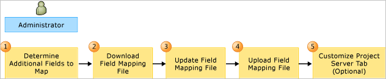

# Customize the field mapping between TFS and Project Server

[!INCLUDE [temp](../../_shared/tfs-ps-sync-header.md)]

<a name="top"></a> 
To synchronize data between an enterprise project plan and a project, you must associate the work-item fields in Visual Studio Team Foundation Server (TFS) with the fields in Microsoft Project Server. You can add fields and specify how they synchronize by customizing the field mappings. You can map both built-in and custom fields in Project. For example, you can share data that does not relate to schedules (such as cost centers, team names, or health status) if you add the fields that store these types of data to the mappings.  
  
 You maintain one set of field mappings for each project collection that hosts projects that you want to synchronize with Project Server. You must define the field mappings for each project collection that you have mapped to an instance of Project Web Access or Project Web App (PWA). You can upload the default mappings, or you can customize a mapping file and upload it. To upload the default mappings, see [Upload Mappings](#upload) later in this topic.  
  
> [!NOTE]
>  The mappings for the integration of TFS and Project Server are distinct from the mapping file for Microsoft Project. For more information, see [Customize the Microsoft Project field mapping file](https://msdn.microsoft.com/library/ms404686.aspx).  
  
 As the following illustration shows, you customize the mappings in five steps:  
  
   
Customizing the Field Mappings Between Team Foundation Server and Project Server  
  
> [!NOTE]
>  You can update the mapping file as often as you want. The fields that appear on the **Project Server** tab are updated for each type of work item that participates in data synchronization. You must not manually change the definitions for the **Project Server** tab. For more information, see [Customize the Project Server Tab](#customizetab) later in this topic.  
  
  
> [!NOTE]
>  For a demonstration video, see the following page on the Microsoft website: [Managing Field Mappings for Integration of Team Foundation Server and Project Server](http://go.microsoft.com/fwlink/?LinkId=222613).  
  
 **Requirements**  
  
 To complete the procedures in this topic, you must have the **Administer Project Server integration** permission set to **Allow**. In addition, the TFS service account must be granted the **Administer Project Server integration**. For more information, see [Assign permissions](assign-permissions-support-tfs-project-server-integration.md).  
  
##  <a name="dmappings"></a> Default mappings  
 The mappings determine which fields get synchronized when a user updates information in TFS or Project Server. Each of the following synchronization types has its own set of mappings:  
  
-   For **publish synchronization**, the data in Project Server updates the data in TFS. You use the **targetToTfs** element to specify the field in Project Server that updates the field in TFS.  
  
-   For **status synchronization**, the data in TFS is submitted to the status queue in Project Server. You use the **tfsToTarget** element to specify the field that updates the status queue field in Project Server.  
  
 For more information about these two types of synchronization, see [Synchronization process overview](synchronization-process-overview.md).  
  
 The following table lists the default set of fields that are mapped between TFS and Project Server. The table also indicates which types of work items use the fields based on the default process templates that TFS provides. You should not modify these mappings if you are mapping to a project that was created from a process template that is based on Agile Software Development or Capability Maturity Model Integration (CMMI) Process Improvement. If you are mapping to a project that was created from the Scrum process template, you will need to make some modifications as [Required Changes to Make When Mapping to a Team Project That Was Created From the Scrum Process Template](#scrummodifications) describes later in this topic.  
  
 For more information about mappings and the synchronization process, see [Field mapping reference](field-mapping-xml-element-reference.md).  
  
|Team Foundation field|Project Server field|Status Queue field|Work item types in Agile|Work item types in CMMI|Work item types in Scrum|  
|----------------------|--------------------|----------------|------------------------------|-----------------------------|------------------------------|  
|Title|Task Name|Title|All|All|All|  
|Assigned To|Resources|Resources|All|All|All|  
|Completed Work|Task Actual Work|Resource Actual Work|Task|Task|None|  
|Remaining Work|Task Remaining Work|Resource Remaining Work|Task|Task|Task|  
|Original Estimate|Baseline Work||Task|Bug, Change Request, Issue, Requirement, Risk, and Task|None|  
|Start Date|Task Start|Resource Start|Task and User Story|Task and Requirement|None|  
|Finish Date|Task Finish|Resource Finish|Task and User Story|Task and Requirement|None|  
  
###  <a name="scrummodifications"></a> Required changes to make when mapping to a project that was created from the Scrum process template  
 There are two changes you must make to enable data flow from a project created from a [Scrum process](../../boards/work-items/guidance/scrum-process.md) process template. You must add the Completed Work and Original Estimate fields to the Task work item type, and you must remove the elements that require the Remaining Work field to be empty when a team member changes the state to **Done** or **Removed**.  
  
##### To update the Scrum task type definition  
  
1.  Open a Command Prompt window where either Visual Studio or Team Explorer is installed and enter:  
  
    ```  
    cd %programfiles(x86)%\Microsoft Visual Studio 12.0\Common7\IDE  
    ```  
  
     On a 32-bit edition of Windows, replace **%programfiles(x86)%** with **%programfiles%**.  
  
2.  To export the type definition for Task, type the following command, substituting your data for the arguments that are shown here, where *CollectionURL* specifies the URL of a project collection, *ProjectName* specifies the name of a project defined within the collection, and "*DirectoryPath\FileName.xml*" specifies the name and location for the file to export. Then choose **Enter**.  
  
    ```  
    witadmin exportwitd /collection:CollectionURL /p:"ProjectName" /n:"Task" /f:"DirectoryPath\FileName.xml"  
    ```  
  
3.  In a text editor or in Visual Studio, open the file you exported.  
  
4.  Within the `FIELDS` definition section, add this code snippet before the element for Remaining Work:  
  
    > [!div class="tabbedCodeSnippets"]
	```XML
    <FIELD name="Completed Work" refname="Microsoft.VSTS.Scheduling.CompletedWork" type="Double" reportable="measure" formula="sum">  
       <HELPTEXT>The number of units of work that have been spent on this task</HELPTEXT>  
    </FIELD>  
    <FIELD name="Original Estimate" refname="Microsoft.VSTS.Scheduling.OriginalEstimate" type="Double" reportable="measure" formula="sum">  
       <HELPTEXT>Initial value for Remaining Work - set once, when work begins. </HELPTEXT>  
    </FIELD>  
    ```  
  
5.  Within the `<WORKFLOW>` section, remove the following code snippet from both `<STATE value="Done">` and `<STATE value="Removed">` definitions:  
  
    > [!div class="tabbedCodeSnippets"]
	```XML 
    <FIELD refname="Microsoft.VSTS.Scheduling.RemainingWork">  
       <EMPTY />  
    </FIELD>  
    ```  
  
6.  Within the `<FORM>` section, add the following `Control` elements:  
  
    > [!div class="tabbedCodeSnippets"]
	```XML
    <Control FieldName="Microsoft.VSTS.Scheduling.OriginalEstimate" Type="FieldControl" Label="Original Estimate:" LabelPosition="Left" />  
    <Control FieldName="Microsoft.VSTS.Scheduling.CompletedWork" Type="FieldControl" Label="Completed:" LabelPosition="Left" />  
    ```  
  
7.  Save and close the file.  
  
8.  Import the file, substituting your data for the arguments that are shown.  
  
    ```  
    witadmin importwitd /collection:CollectionURL  /p:"ProjectName" /f:"DirectoryPath\FileName.xml"  
    ```  
  
9. Refresh your project or work items page to verify the changes.  
  
 For more information, see [Export and import work item types](https://msdn.microsoft.com/library/ms404856.aspx), [Modify a field or add a custom field](../../reference/add-modify-field.md), and [Design and customize a work item form](../../reference/xml/design-work-item-form.md).  
  
##  <a name="dadditional"></a> Determine additional fields to map  
 Determine the following information for each field that you want to synchronize in addition to the default fields:  
  
-   The reference name of the TFS field. If you want to synchronize a field in Project Server with a field that you must create in TFS, first create the field in each type of work item that you are synchronizing. For more information, see [Index of work item fields](../../boards/work-items/guidance/work-item-field.md) and [Modify a field or add a custom field](../../reference/add-modify-field.md).  
  
-   The name of the field in Project Server that will update the TFS field. For a list of available fields, see [Restrictions on mapping fields](restrictions-mapping-ps-fields.md).  
  
-   The name of the TFS field to be updated in Project Server and the name of the field in Project Server that will update the mirror field in TFS.  
  
-   Whether to display the fields on the work item form. You set the value of the `displayTfsField` attribute to `true` for fields that you want to appear on the work-item form. You set the value of the `displayTfsMirror` attribute to `true` for work-item form.  
  
-   Whether to resolve data conflicts by allowing the value of the TFS field to overwrite the value of the field in Project Server or to maintain both values. This decision determines the value of the `onConflict` attribute. When **onConflict=PsWins** is set, the value of the field in Project Server overwrites the value of the field in Team Foundation. For more information, see [Field Elements and Attributes](field-mapping-xml-element-reference.md#feandattributes).  
  
-   Additional values that you must define to support pick lists or custom lookup tables in Project Server.  
  
### Restrictions on data that you can map  
 After you determine which fields you want to map, note the following restrictions:  
  
-   You can send only task-level information, pjTask* fields, from Project Server to TFS.  
  
-   You can send only resource-level information, pjResource* fields, from TFS to the status queue of Project Server.  
  
-   The Title field is the only field that you can send both to TFS and to the status queue.  
  
-   Rollup is automatically calculated for the Assigned To, Completed Work, and Remaining Work fields. You cannot map additional fields and have rollup calculated for them. For more information, see [Work with resource rollup](work-with-resource-rollup.md).  
  
-   You must make sure that the data types or units of each field that you map conform to the field mapping criteria for standard and custom enterprise fields. For more information, see [Restrictions on mapping fields, Data Types and Field Mapping Criteria](restrictions-mapping-ps-fields.md).  
  
-   You can map fields that are associated with pick lists in TFS. However, you must create lookup tables in Project Server to match the pick lists. You cannot automatically synchronize pick lists and lookup tables.  
  
 For more information, see [Restrictions on mapping fields](restrictions-mapping-ps-fields.md).  
  
### Example: mapping the team name to appear in Project  
 In the following example, the custom string field in TFS, MyCompany.MyOrg.DevTeamName, is mapped to an enterprise custom text field in Project Server, My Company Team Name. You can use this example to display in Project Professional the name of the team that is associated with a task.  
  
> [!div class="tabbedCodeSnippets"]
```XML
<field tfsName="MyCompany.MyOrg.DevTeamName" tfsMirrorName="Mirror.MyCompany.MyOrg.DevTeamName" displayTfsField="false" displayTfsMirror="false" onConflict="DoNothing">  
   <tfsToTarget>  
      <target provider="ProjectServerStatusQueue" name=" My Company Team Name" />  
   </tfsToTarget>  
   <targetToTfs>  
       <target provider="ProjectServerPublished" name=" My Company Team Name" />  
   </targetToTfs>  
</field>  
```  
  
 Neither field appears on the work item form. Also, if the values do not match, each field retains its own value.  
  
### Example: displaying the area and iteration paths in Project  
 You can map the **Area** (System.AreaPath) and **Iteration** (System.IterationPath) fields in TFS so that they appear in your project plans. Because these tree path fields change frequently, you should map them as text fields in Project. Project managers who use these fields must manually enter the full area path or iteration path.  
  
> [!IMPORTANT]
>  The current implementation of TFS and Project Server integration does not support automatic synchronization of allowed value lists, pick lists, global lists, or tree path lists that are defined for mapped fields between the two server products. For the best experience, you must make manual entries in the project plan that match those in TFS. If you specify an entry that is not valid, a validation dialog box will appear when you publish the plan.  
  
 To add the Area and Iteration fields to a project plan, perform the following actions:  
  
1.  Add two customer enterprise fields to Project Server, and label them as **Area (TFS)** and **Iteration (TFS)**.  
  
     For more information, see the following page on the Microsoft website: [Creating Lookup Tables and Enterprise Custom Fields](http://go.microsoft.com/fwlink/?LinkId=209696).  
  
2.  Export the field mappings from the project collection where the projects are defined.  
  
     For more information, see [Download Mappings to a File](#downloadmappings) later in this topic.  
  
3.  Add the following code to the file:  
  
    > [!div class="tabbedCodeSnippets"]
	```XML
    <field tfsName="System.AreaPath" tfsMirrorName="Mirror.System.AreaPath" displayTfsField="true" displayTfsMirror="true">  
      <tfsToTarget>  
         <target provider="ProjectServerStatusQueue" name="Area (TFS)" />  
      </tfsToTarget>  
      <targetToTfs>  
         <target provider="ProjectServerPublished" name="Area (TFS)" />  
      </targetToTfs>  
    </field>  
    <field tfsName="System.IterationPath" tfsMirrorName="Mirror.System.IterationPath" displayTfsField="true" displayTfsMirror="true">  
      <tfsToTarget>  
         <target provider="ProjectServerStatusQueue" name="Iteration (TFS)" />  
      </tfsToTarget>  
      <targetToTfs>  
         <target provider="ProjectServerPublished" name="Iteration (TFS)" />  
      </targetToTfs>  
    </field>    
    ```  
  
4.  Import the updated field mappings file as [Upload Mappings](#upload) describes later in this topic.  
  
5.  Synchronize your project plan with Project Server.  
  
6.  Add the two new columns for the new fields, Area (TFS) and Iteration (TFS), to your project plan  
  
 Changes made to the **Area** and **Iteration** fields in Team Foundation will be synchronized with these fields in your project plan. Also, you can update these fields in Project and publish your changes to Team Foundation if you specify values that have been defined in Team Foundation.  
  
##  <a name="downloadmappings"></a> Download the mappings to a file  
  
> [!NOTE]
>  You can download mappings only from a project collection to which they have been uploaded. If you want to download the default mappings to a file, you must first upload the default mappings, as described in [To upload the default mappings](#upload) later in this topic. As an alternative, you can copy the contents of the default mappings. For more information, see [Field mapping reference](field-mapping-xml-element-reference.md).  
  
#### To download the mappings to a file  
  
1.  To run the **TfsAdmin** command-line tool, open a Command Prompt window where either Visual Studio or Team Explorer is installed and enter:  
  
    ```  
    cd %programfiles%\Microsoft Visual Studio 11.0\Common7\IDE  
    ```  
  
     On a 64-bit edition of Windows, replace **%programfiles%** with **%programfiles(x86)%.**.  
  
2.  Type the following command, and then choose Enter.  
  
    ```  
    TfsAdmin ProjectServer /DownloadFieldMappings /collection:tpcUrl /filePath:MappingFile  
    ```  
  
     Replace *tpcUrl* with the uniform resource locator (URL) of the project collection, and replace *MappingFile* with the path and name of the file that you will customize.  
  
3.  Wait until the following messages appear:  
  
     **Downloading** *MappingFile* **to Team Project Collection** *tpcUrl*.  
  
     **You have successfully downloaded field mapping file** *MappingFile* **to Team Project Collection** *tpcUrl*.  
  
##  <a name="updatemappings"></a> Update the mappings  
 For each field that you want to add to the mapping file, you specify the `field` element and its subelements and attributes. For more information, see [Field mapping reference](field-mapping-xml-element-reference.md).  
  
##  <a name="upload"></a> Upload the mappings  
 You upload mappings by using the **UploadFieldMappings** command. You can upload the default mappings by using the `/usedefaultfieldmapping` option. Otherwise, you must specify a file that contains the mapping elements.  
  
#### To upload the default mappings  
  
1.  At the command prompt, type the following command, and then choose ENTER.  
  
    ```  
    TfsAdmin ProjectServer /UploadFieldMappings /collection:tpcUrl /usedefaultfieldmappings  
    ```  
  
     Replace *tpcUrl* with the URL of the project collection.  
  
2.  Wait until the following messages appear:  
  
     **Uploading default field mappings to** *CollectionUri*.  
  
     **You have successfully uploaded field mappings to collection** *CollectionUri*.  
  
#### To upload the mappings from a file  
  
1.  At the command prompt, type the following command, and then choose ENTER.  
  
    ```  
    TfsAdmin ProjectServer /UploadFieldMappings /collection:tpcUrl /filePath:MappingFile /force  
    ``` 
 
	Replace *tpcUrl* with the URL of the project collection, and replace *MappingFile* with the path and name of your custom mapping file. Specify **/force** if you are updating the existing mappings.  
  
2.  Wait until the following messages appear:  
  
     **Uploading** *MappingFile* **to Team Project Collection** *tpcUrl*.  
  
     **You have successfully uploaded field mapping file** *MappingFile* **to Team Project Collection** *tpcUrl*.  
  
##  <a name="customizetab"></a> Customize the Project Server tab  
 When you associate an enterprise project plan with a project, the Project Server tab is added to the work item form, as the following illustration shows. The tab is added to only those types of work items that you specify to participate in data synchronization. You customize this tab by setting the `displayTfsField` or `displayTfsMirror` attributes to `true` for those fields that you want to have appear on the form.  
  
   
Project Server tab  
  
> [!IMPORTANT]
>  The field mappings that are defined for the project collection determine the fields that appear on the **Project Server** tab. After this tab has been added to a work item type for a project, you can update it by modifying the field mappings for the collection. If you manually customize the work item form by adding fields to the **Project Server** tab or changing its location on the form, the tab may not get automatically updated with future changes that you make to the field mappings. If this condition occurs, you can modify the tab manually. For more information, see [Added elements to WIT definitions](xml-elements-added-to-wit-definition.md).  
  
 For more information about each default field that appears on the **Project Server** tab, see [Project Server fields that support data synchronization](project-server-fields-added-to-tfs.md).  
  
## Related articles  
 [Specify work item types](specify-wits-to-synchronize.md)   
 [Configure TFS-Project Server integration](configure-tfs-project-server-integration.md)   
 [Administer TFS-Project Server integration](administrate-integration-tfs-project-server.md)