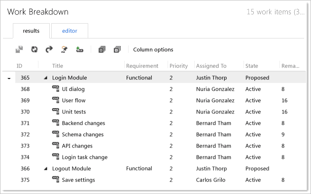

# Manage project details in an enterprise project plan mapped to a project

[!INCLUDE [temp](../../_shared/tfs-ps-sync-header.md)]

 As a project manager, you can manage both business requirements and implementation tasks in Microsoft Project Professional. As work progresses, development teams can update their tasks as they work in Team Foundation. Both project managers and development teams can manage their workflows independently while collaborating fully and communicating more easily when changes that affect the schedule occur. The synchronization engine for Visual Studio Team Foundation Server and Microsoft Project Server maintains scheduling data for the requirements and tasks in the mapped enterprise project plan and project.  
  
> [!NOTE]
>  If you want to manage only deliverables by using Project Server, see [Top-down planning of business requirements](top-down-plan-mapped-team-project.md).  
  
 Before you can synchronize data between your project plan and a project, you must first associate them. For more information, see [Associate enterprise projects and projects](manage-associations-enterprise-projects.md). Before you associate the plan with the project, you should review [Recommended Configurations to Support Managing Project Details](#Requirements), which is provided later in this topic.  
  
> [!NOTE]
>  The process and activities that this topic describes require that your deployment of Team Foundation Server has been configured to integrate with Project Server 2010 or Project Server 2013. For more information, see [Configure TFS-Project Server integration](configure-tfs-project-server-integration.md).  
  
  
> [!NOTE]
>  For a demonstration video, see the following page on the Microsoft website: [Top-Down Planning of Business Requirements within an Enterprise Project using Team Foundation Server and Project Server](http://go.microsoft.com/fwlink/?LinkId=222611). Some details may differ between the procedures demonstrated in the video and those described here because this video was made for the previous release of Team Foundation Server  
  
 **Requirements**  
  
 To perform the procedures in this topic, the following permissions must be assigned:  
  
-   To publish tasks from an enterprise project plan to Team Foundation, the resource who is assigned to the task must be a member of the **Contributors** group for the project.  
  
-   To update work items in Team Foundation and submit them to Project Server, Team Foundation users must be members of the **Contributors** group for the project. Those users must also be members of the **Team Members** group for Project Web Access or Project Web App (PWA) or must have the Open Project and View Project Site permissions in Project. They must also be added to the enterprise resource pool for Project Server and the resource pool for the enterprise project plan.  
  
 For more information, see [Assign permissions](assign-permissions-support-tfs-project-server-integration.md).  
  
##   Process overview  
 As the following illustration shows, the project manager initiates the process by planning the requirements and tasks in Project Professional. The synchronization engine creates corresponding work items in Team Foundation for each submitted task. The team lead reviews the plan together with the development team and updates work estimates. Each team member can update their work effort as they complete tasks.  
  
   
  
 Project automatically calculates the rollup of remaining and completed work based on the tasks that are linked to each requirement. As team members update tasks, status updates are submitted for approval, and when the project manager approves them, flow into Project. Project then automatically calculates the rollup for the requirements in the project. The status updates for these rollups then appear in the instance of PWA for the approval of the project manager.  
  
 The following table summarizes the tasks that are performed.  
  
|||  
|-|-|  
|**Project Manager**|As a project manager, you perform the following tasks in Project Professional or your instance of PWA:    Define the project plan that contains both deliverables and tasks. Deliverables may correspond to requirements or user stories, depending on the process template that your product team used to create the project.    Save and publish your plan to Project Server.    Approve or reject status updates as work progresses.    Continuously publish updates to the plan on Project Server.|  
|**Synchronization Engine**|For each deliverable or task that is set to publish in the plan, the synchronization engine performs the following actions:    Updates the project by creating a work item for each task that is published in the mapped project plan. The engine also creates a link that binds the task in Project Server to the work item in Team Foundation.    Creates a status update for each mapped field in each published task as changes occur in Team Foundation. These updates appear in the approval queue for the project manager to review.    Updates work items in the project based on whether the project manager approved or rejected the status update.|  
|**Team Lead**|In Team Foundation, the team lead and team members perform the following tasks:    Review the work items that are added to the project.    Update the work items as work progresses by changing the **Remaining Work** and **Completed Work** fields for each task.    Respond to work items with a rejected status by modifying work items and resubmitting to Project Server.|  
  
##   Recommended configurations  
 To support the process that was outlined in the previous section, you must map the enterprise project plan to the project. The following table describes the recommended configurations for both the project and mapping. For more information, see [Associate enterprise projects and projects](manage-associations-enterprise-projects.md).  
  
|Area to configure|Recommended configuration|Notes|  
|-----------------------|-------------------------------|-----------|  
|Process template for project|Microsoft Solutions Framework (MSF) for Capability Maturity Model Integration (CMMI) Process Improvement|The CMMI template provides requirement and task types of work items. You can use the backlog and board pages to manage your backlog and plan and run your sprints. Or, you can use shared queries that you open in Excel to quickly define and link requirements and tasks. **Note:**  You can also use a customized CMMI process template or other template and customize it to meet your needs.|  
|Project mapping|`/workItemTypes:Requirement,Task`|When you map the enterprise project plan to the project, specify requirement and task as the work item type items to participate in synchronization. You can also disallow fixed work for tasks. Fixed work is one of three types of tasks that you can use in Project. For more information, see [Change the task type Project uses to calculate task duration](http://go.microsoft.com/fwlink/?LinkId=203354).|  
|Field mappings|`/useDefaultFieldMappings`|You can use default field mappings. No additional field mappings are required.|  
|Resource Names|You must add team members to the Team Members group for each instance of PWA, or you must grant them the Open Project and View Project Site permissions in Project. For more information, see [Assign permissions](assign-permissions-support-tfs-project-server-integration.md).   Also, you must add all valid users in Team Foundation who are assigned requirements, deliverables or tasks in Project to the enterprise resource pool for Project Server and the resource pool for the enterprise project plan.|You must grant permissions to all user accounts that are assigned as resources in the project plan or that are named in the Assigned To field for a work item. These users submit status updates that flow into the status queue for the instance of PWA.   All names that are assigned to the **Resource Names** field must be recognized as valid contributors of the project.|  
|Project managers|Accounts of users of Project Professional must be granted the **View Project-level information** permission or assigned as members of the **Reader** group in Team Foundation for projects to which they will publish.|You must grant project managers permissions to modify work items for those projects that are mapped to their enterprise project plans.|  
  
##   Project manager tasks  
 As a project manager, you can define, schedule, and monitor progress on your project by engaging in the following activities:  
  
-   [Define requirements and tasks, and set a baseline](#DefineRequirementsTasks)  
  
-   [Approve or reject status updates](#ApproveStatus)  
  
-   [Review detail updates and progress](#ReviewProgress)  
  
 You can also view the assignment of work to resources. For more information, see [Work with resource rollup](work-with-resource-rollup.md).  
  
###   Define requirements and tasks, and set a baseline  
 When you define your project plan, you will want to define parent requirements and child tasks. As the following illustration shows, two requirements are defined, and each has several tasks. For each requirement and task, you must assign one value for **Resource Names**, set **Work Item Type**  to **Requirement** or to **Task**, and set **Publish to Team Project** to **Yes**.  
  
> [!NOTE]
>  In Team Foundation, you can assign only one person to a work item at a time. The **Assigned To** field can contain only one person name. In Project Professional, you can assign multiple resources to a task. However, tasks that you publish to Team Foundation Server can contain only one active assignment. For more information, see [Work with resource rollup](work-with-resource-rollup.md).  
  
   
  
> [!IMPORTANT]
>  Text30 is the default Project field that is associated with the **Work Item Type** column that is used in synchronizing tasks with work items. If you ever connect the project plan to Team Foundation Server by using the **Choose Team Project** option on the Team ribbon menu, an additional Project field, which is labeled **Work Item Type**, becomes available. This field, with a default Project field of Text24, supports mapping of project plans that are bound to Team Foundation but does not support synchronizing plans. The Text24-based field contains the full list of work item types for the project. You can verify that you have the correct field by pointing to it and verifying that **Text30** appears.  
  
 After you publish your project plan, you cannot change the value that is assigned to **Publish to Team Project**. That is, all tasks that you publish to Team Foundation must continue to be published, or you must delete them from the project plan. In addition, you maintain the assignments of work to resources and the task hierarchy in your project plan. You cannot modify the task hierarchy in Team Foundation, but you can reassign tasks to team members in the project.  
  
 You should publish only those tasks that you want to have tracked in Team Foundation. For example, you should not publish the summary tasks **Project Schedule** and **Development**, which the previous illustration shows, to Team Foundation because they have no work to track.  
  
 To maintain control of your schedule, you can set a baseline to track the team progress against the target schedule. For more information, see the following page on the Microsoft website: [Create or update a baseline or an interim plan](http://go.microsoft.com/fwlink/?LinkId=203362).  
  
 After you have set the baseline, you can save and publish the project plan to Project Server. The baseline value appears as the **Original Estimate** for a work item in Team Foundation. As the following illustration shows, a status notification in the lower-left corner indicates when publishing is completed.  
  
   
  
> [!NOTE]
>  When you publish your plan, the Team Foundation add-in to Project Professional checks whether all data that is required to the work item in Team Foundation satisfies the validation rules for the type of work item. If a required field is not defined or if a value is not allowed, you must resolve those errors. For more information, see [Resolve validation errors](resolve-validation-errors.md).  
  
###   Approve or reject status updates  
 As the team makes progress, status updates appear in your approval queue. At a glance, you can see which requirements and tasks have been updated and the details of each update. As the following illustration shows, you can click a status update to review its details.  
  
   
  
 When you click a status update, the Task Details window opens, as the following illustration shows. You can review the changed values for each field that is mapped for synchronization.  
  
   
  
> [!NOTE]
>  To update your enterprise project plan with the changes that are submitted from Team Foundation, you must accept the updates.  
  
 You can accept or reject an update and, if you are using Project Server 2010, add a comment. For example, you may reject an update because you disagree with an estimate, a team member specified an inaccurate value, or you want to request that tasks be reassigned so that the work will be accomplished more quickly.  
  
###   Review detail updates and progress  
 As team members make progress, they update the **Remaining Work** and **Completed Work** fields for each task. These values appear as **Remaining Work** and **Actual Work** in your project plan for each requirement and task that you published to Team Foundation. After you approve the status updates, you can view the updates to your project schedule. As the following illustration shows, two tasks have been completed, and several tasks have not yet been started.  
  
   
  
 When a task takes longer than was first estimated, you can determine whether changes to estimates affect the critical path. You can alert the team lead if an adverse effect to the schedule has occurred and the project tasks must be adjusted.  
  
##   Development team tasks  
 You can use the task board page in the TFS web portal or the Work Breakdown shared query to review and update work that is assigned to your team. Because the project manager owns the project plan and schedule, you and your team are required to perform the following tasks:  
  
-   [Review work breakdown](#ReviewWorkBreakdown)  
-   [Add and estimate additional tasks](#AddWork)   
-   [Update remaining and completed work](#UpdateWork)   
-   [Address rejected updates](#AddressUpdates)  
  
 If you open a work item in Team Explorer, the **History** field shows when the synchronization engine created the work item, as the following illustration shows.  
  
   
  
###   Review the work breakdown  
 In the web portal or Team Explorer, you can open the Work Breakdown query, and review the work items that have been added to your project from Project Server. This query lists all requirements that are not closed and their child requirements or tasks. As the following illustration shows, tasks are listed under their requirements, and the parent-child hierarchical link relationships are locked (). That is, you cannot modify how tasks are grouped under requirements. Only the project manager from the project plan can modify the task hierarchy.  
  
   
  
 Because the project manager set a baseline, values appear for both **Remaining Work** and **Original Estimate**, as the following illustration shows.  
  
   
  
###   Add and estimate additional tasks  
 If you require additional tasks to implement a requirement, you can quickly define and estimate them by using the Work Breakdown query, by working in the work item form for the requirement, or exporting the list to Excel. As the following illustration shows, you can open the shortcut menu for a requirement and then choose **Link selected items to a new work item**.  
  
   
Shortcut menu for a work item (TFS web portal)  
  
   
  
 In the **Add New Linked Work Item to Requirement** window, select **Child** for the **Link type**, select **Task** for the **Work item type**, type a **Title** for the task, and then choose **OK**.  
  
   
  
 The work item form for the task appears and is automatically linked to the requirement. In the form, for **Assigned To**, select the team member who will work on the task, and then type the estimated work for **Remaining Work**.  
  
 As an alternative, you can use the sprint task board in the web portal as described in [Task board](../../boards/sprints/task-board.md). Or, you can open the Work Breakdown query in Excel and quickly define linked tasks and estimate work. For more information, see [Bulk add or modify work items with Excel](../../boards/backlogs/office/bulk-add-modify-work-items-excel.md).  
  
 After you have added missing tasks for the requirement, you can refresh the Work Breakdown query. Make sure that you set the **Submit to Project Server** field to **Yes**. The next status update for the requirement will transmit new requirements and tasks to the enterprise project plan. You can bulk edit several tasks to define select fields. See [Submit user stories to Project Server](make-agile-team-progress-visible-to-the-pmo.md#SubmitStories).  
  
> [!IMPORTANT]
>  When you submit multiple levels of work items to Project Server, the first level must be approved and published to Project Server before the next level can be submitted. For example, you can submit a batch of new work items that includes three levels of child items. In that case, the project manager would need to publish the project plan four times for all work items to be synchronized with Project Server.   
  
###   Update remaining and completed work  
 As work progresses, each team member should update **Remaining Work** and **Completed Work** for each of their tasks. They can do this using the task board in the TFS web portal or by using Team Explorer. If more time is required to complete a task, the team member can add more time to the remaining work. Updates to these fields automatically appear in the approval queue for the project manager and are reflected in the rollup of the parent requirement.  
  
   
  
 As an alternative, as team lead, you can open the Work Breakdown query in Excel and update several tasks at the same time.  
  
###   Address rejected updates  
 When a project manager rejects a status update to either a requirement or a task, the information appears in the **History** field, and the **Last Approval Status** field on the **Project Server** tab indicates **rejected**. After an update to a work item has been rejected, the work item can no longer be synchronized. You must address the rejection status to resume synchronization of the work item. You can create a query to find work items whose update status was rejected. For more information, see [Monitor work item submissions and resolve rejections](monitor-submissions-resolve-rejections.md).  
  
## Related articles  
 [Understand how updates to specific fields are managed](understand-how-updates-to-specific-fields-managed.md)   
 [Resolve validation errors](resolve-validation-errors.md)   
 [Manage projects](manage-projects.md)