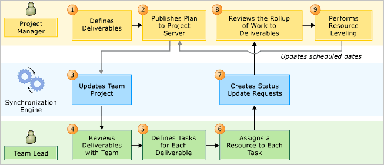
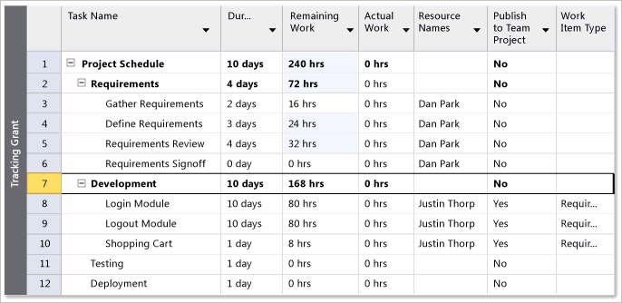
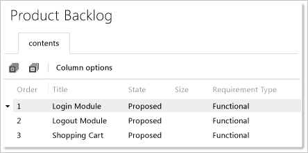

# Top-down planning of business requirements within an enterprise project plan mapped to a project
[!INCLUDE [temp](../../_shared/tfs-ps-sync-header.md)]

 As a project manager, you can manage the high-level business requirements in Microsoft Project Server while the development team manages task details in Visual Studio Team Foundation Server. You can define requirements and view the rollup of resources and effort, and you can also view the impact on the schedule as the development team defines, estimates, and updates its detailed tasks. The synchronization engine for Team Foundation Server and Project Server maintains scheduling data and resource usage for requirements in the mapped enterprise project plan and project.  
  
> [!NOTE]
>  If you want to manage both the deliverables and the tasks by using Project Server, see [Manage project details](manage-project-details.md).  
  
 Before you can perform top-down planning in an enterprise project plan, you must first associate it with the project. For more information, see [Associate enterprise projects and projects](manage-associations-enterprise-projects.md). Before you associate the plan with the project, you should review [Recommended Configurations to Support Top-Down Planning](#Requirements) later in this topic.  
  

  
> [!NOTE]
>  For a demonstration video, see the following page on the Microsoft website: [Top-Down Planning of Business Requirements within an Enterprise Project using Team Foundation Server and Project Server](http://go.microsoft.com/fwlink/?LinkId=222610). Some details may differ between the procedures demonstrated in the video and those described here because this video was made for the previous release of Team Foundation Server.  
  
 **Requirements**  
  
 To perform the procedures in this topic, the following permissions must be assigned:  
  
-   To publish tasks from an enterprise project plan to Team Foundation, the resource who is assigned to the task must be a member of the **Contributors** group for the project.  
  
-   To update work items in Team Foundation and submit them to Project Server, users must be members of the **Contributors** group for the project. Also, users must be members of the **Team Members** group for Project Web Access or Project Web App (PWA) or must have the Open Project and View Project Site permissions in Project.  
  
 For more information, see [Assign permissions](assign-permissions-support-tfs-project-server-integration.md).  
  
##   Process Overview of Top-Down Planning by Using Project Server  
 As the following illustration shows, 10 main steps occur in the synchronization of requirements between the project plan and the project.  
  
   
  
 The synchronization engine maintains scheduling data for requirements in both the project plan and project. Team Foundation automatically calculates the rollup of remaining and actual work by resource based on the tasks that are linked to each requirement. As team members update tasks, the roll-up values are automatically updated for the requirements in the project, and status updates appear in the instance of PWA for the approval of the project manager. The following table summarizes the tasks that are performed.  
  
|||  
|-|-|  
|**Project Manager**|As a project manager, you perform the following tasks in Project or PWA:    Define deliverables, features, or requirements in your enterprise project plan.    Save and publish the project plan to Project Server.    Review the progress of each deliverable, and adjust the schedule based on updated information.    Set a baseline, and track progress against the baseline.|  
|**Synchronization Engine**|For each requirement that is set to publish, the synchronization engine performs the following tasks:    Creates a requirement work item in the project that is mapped to the enterprise plan. The engine also creates a link that binds the requirement in Project to the work item in Team Foundation.    Creates a status update as updates occur in Team Foundation for each mapped field for each published requirement. These updates appear in the approval queue for the project manager to review.|  
|**Team Lead**|In Team Foundation, the team lead and team members perform the following tasks:    Review the deliverables that are added to the project.    Define the tasks that are required to implement each deliverable, and verify that each task is linked to its deliverable.    Estimate the work that is required for each task, and define it as **Remaining Work**.    Update the **Remaining Work** and **Completed Work** fields for each task.|  
  
  
##   Recommended Configurations to Support Top-Down Planning  
 To support the process that was outlined in the previous section, you must map the enterprise project plan to the project. The following table describes the recommended configurations for both the project and mappings. For more information, see [Associate enterprise projects and projects](manage-associations-enterprise-projects.md).  
  
|Area to configure|Recommended configuration|Notes|  
|-----------------------|-------------------------------|-----------|  
|Process template for project|Microsoft Solutions Framework (MSF) for Capability Maturity Model Integration (CMMI) Process Improvement|The CMMI template provides requirement and task types of work items. You can use the backlog and board pages to manage your backlog and plan and run your sprints. Or, you can use shared queries that you open in Excel to quickly define and link tasks to requirements.|  
|Project mapping|`/workItemTypes:Requirement`|When you map the enterprise project plan to the project, specify the requirement as the work item type. You can also disallow fixed work for tasks. Fixed work is one of three types of tasks that you can use in Project. For more information, see [Change the task type Project uses to calculate task duration](http://go.microsoft.com/fwlink/?LinkId=203354).|  
|Field mapping|`/useDefaultFieldMappings`|You can use the default field mappings. No additional field mappings are required.|  
|Resource Names|You must add team members to the Team Members group for each instance of PWA, or you must grant them the Open Project and View Project Site permissions in Project. For more information, see [Assign permissions](assign-permissions-support-tfs-project-server-integration.md).   Also, you must add all team members to the enterprise resource pool and the resource pool for the project plan.|You must grant permissions to all user accounts that are assigned as resources in the project plan or that are named in the Assigned To field for a work item. These users submit status updates that flow into the status queue for the instance of PWA.   All names that are assigned to the **Resource Names** field must be recognized as valid contributors of the project.|  
|Project managers|Accounts of users of Project Professional  must be granted **View Project-level information** or assigned as members of the **Reader** group in Team Foundation for projects to which they will publish.|You must grant project managers permissions to modify work items for those projects that are mapped to their enterprise project plans.|  
  
##   Project Manager Tasks and Best Practices  
 Best or required practices are provided for the following tasks that the project manager performs:  
  
-   [Define Requirements](#definerequirements)  
  
-   [Approve Status Updates](#ApproveUpdates)  
  
-   [Review the Schedule, and Set a Baseline](#ReviewSchedule)  
  
-   [Preview Updates and Impacts on Critical Path](#determineimpacts)  
  
 In addition to these activities, you can also view the assignment of work to resources. For more information, see [Work with resource rollup](work-with-resource-rollup.md).  
  
###   Define Requirements  
 When you define requirements, you should assign them to the development team lead. As the following illustration shows, you must also set the **Publish to Team Project** field to **Yes**, and the **Work Item Type** field to **Requirement**. If only one type of work item is mapped for the project, it is set automatically.  
  
> [!NOTE]
>  If you expect the development lead to provide work estimates, you should set either the Remaining Work field to 0 hours or the Duration field to 0 days.  
  
   
  
> [!IMPORTANT]
>  Text30 is the default Project field that is associated with the **Work Item Type** column that is used in synchronizing tasks with work items. If you ever connect the project plan to Team Foundation Server by using the **Choose Team Project** option on the Team ribbon menu, an additional Project field that is also labeled **Work Item Type**, becomes available. This field, with a default Project field of Text24, supports mapping of project plans that are bound to Team Foundation but does not support synchronizing plans. The Text24-based field contains the full list of work item types for the project. You can verify whether you have the correct field by pointing to it and verifying whether **Text30** appears.  
  
 You should set only those requirements that you want to have tracked in Team Foundation.  After you have completed the requirement definitions, you can save and publish the project plan to Project Server. As the following illustration shows, a status notification in the lower-left corner indicates when the publishing is completed.  
  
> [!NOTE]
>  When you publish your plan, the Team Foundation add-in to Project validates the data that you specified. If a required field is not defined or if a value is not allowed, you must resolve those errors. For more information, see [Resolve validation errors](resolve-validation-errors.md).  
  
   
  
###   Approve Status Updates  
 As the team makes progress on the requirements, status updates appear in your approval queue. As the following illustration shows, you can view the updates to your published requirements and the resources that are assigned to tasks. At a glance, you can see which tasks have been updated and the details of each update.  
  
   
  
 You can click a status update to open the Task Details window, as the following illustration shows. You can review the changed values for each field that is mapped for synchronization.  
  
   
  
> [!NOTE]
>  To update your enterprise project plan with the changes that are submitted from Team Foundation, you must accept the updates.  
  
 You can accept or reject an update and add a comment. For example, you may reject an update because you disagree with an estimate, a team member entered an inaccurate value, or you want to request that tasks are reassigned so that the work is accomplished more quickly.  
  
###   Review the Schedule, and Set a Baseline  
 After you have approved the status updates, you can update the schedule and balance workload in Project, and you can set a baseline that is based on the estimates. As the following illustration shows, the estimates that are defined for the Shopping Cart requirement appear in Project.  
  
   
  
 To maintain control of your schedule, you set a baseline to track the team progress against the target schedule. For more information, see the following page on the Microsoft website: [Create or update a baseline or an interim plan](http://go.microsoft.com/fwlink/?LinkId=203362).  
  
###   Preview Updates and Impacts on the Critical Path  
 As team members make progress, they update the **Remaining Work** and **Completed Work** fields for each task. These values roll up for each requirement that is published to Team Foundation. Before you approve the updates, you can preview the impact that the updates will have on the critical path by clicking **Preview Updates** in the **Approval Center**.  
  
 After you approve the status updates, you can view the updates to your project schedule. When a requirement takes longer than estimated, you can determine whether changes to estimates affect the critical path.  
  
 You can alert the team lead when an adverse effect to the schedule will occur and the project tasks must be adjusted.  
  
##   Development Team Tasks and Best Practices  
 As a contributor to a project, you can use the backlog, task board, and work item pages in the TFS web portal to perform the following tasks:  
  
-   [Review the New Requirements](#review)  
  
-   [Define, Estimate, and Link Tasks to Each Requirement](#DefineTasks)  
  
-   [Update Remaining and Completed Work](#updateremaining)  
  
-   [Address Rejected Updates to Requirements](#addressrejectedupdates)  
  
###   Review the New Requirements  
 New requirements published to Project Server automatically appear in the project. Open the backlog page in the web portal and identify the requirements that have been added. For example, the following illustration shows that three requirements have been added to the project.  
  
   
Product Backlog Page  
  
 By opening the work item in Team Explorer, you can view the **History** field to see when the synchronization engine created the work item, as the following illustration shows.  
  
   
History of work item added by Project Server Sync  
  
###   Define and Estimate Tasks That Are Linked to Each Requirement  
 Once the requirement has been added to Team Foundation Server, and then added to an iteration, you can quickly define and estimate tasks by using the sprint backlog page in the web portal. As shown in the following illustration,  choose the ,  type a **Title** for the task and assign it to a team member,  type a value for the work required in **Remaining Work**, and then  choose the **Save and Close** button. The task automatically links to the requirement with the Parent-Child link.  
  
   
  
 .  
  
 The following illustration shows how the tasks have been divided for two requirements assigned to Iteration 0. For more information, see [Sprint planning](../../boards/sprints/assign-work-sprint.md)  
  
> [!NOTE]
>  The **Remaining Work** field for the parent work items automatically show the sum of all work defined for its child tasks.  
  
   
  
 As an alternative, you can open the Work Breakdown query in Excel and quickly define linked tasks and estimate work. See [Bulk add or modify work items with Excel](../../boards/backlogs/office/bulk-add-modify-work-items-excel.md).  
  
###   Update Remaining and Completed Work  
 As work progresses, each team member should update the **Remaining Work** and **Completed Work** fields for each of their tasks. If more time is required to complete a task, additional time is added to the Remaining Work field.  Updates are reflected in the rollup of the requirement.  
  
###   Address Rejected Updates to Requirements  
 When a project manager rejects a status update to a requirement, the information appears in the **History** field, and the **Last Approval Status** field on the **Project Server** tab indicates **rejected**. After an update to a work item has been rejected, the work item can no longer be synchronized. You must address the rejection status before the work item can be synchronized again. You can create a team query to find work items whose update statuses were rejected. For more information, see [Monitor submissions and resolve rejections](monitor-submissions-resolve-rejections.md).  
  
## Related articles  
- [Understand how updates to specific fields are managed](understand-how-updates-to-specific-fields-managed.md)   
-  [Synchronization process overview](synchronization-process-overview.md)   
- [Manage projects](manage-projects.md)