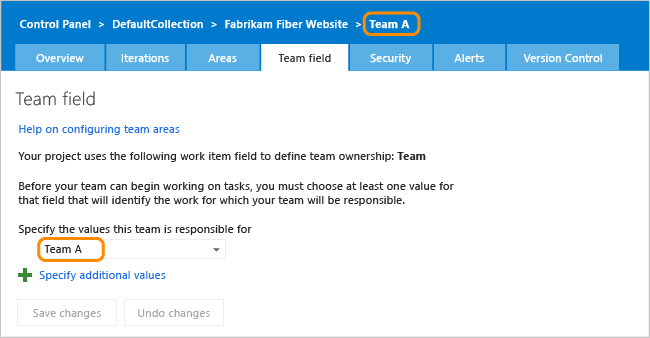
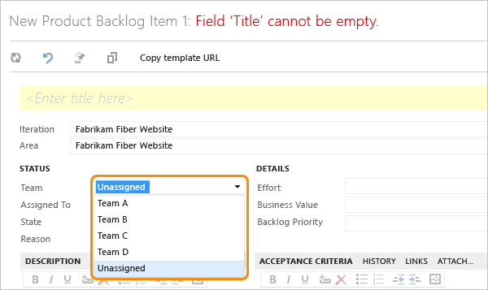
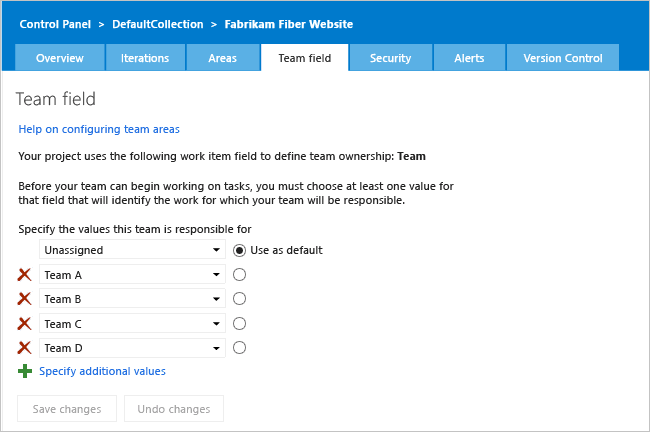

# Use team fields instead of area paths to support teams

[!INCLUDE [temp](../_shared/version-header-tfs-only.md)]

> [!IMPORTANT]  
> **Feature availability:** Team fields are only supported for on-premises TFS. Also, you can use a Team field or Area Paths to configure Team-scoped tools, but not both. 

The default configuration for projects configures each team as an area path. For information on adding a team, see [Add teams](../organizations/settings/add-teams.md).

If your organization has several teams that work from a common backlog and across many product areas, this configuration might not fit how you want to organize your work. By adding a custom field to represent teams in your organization, you can reconfigure the agile planning tools and pages to support your teams and decouple assignment to teams and area paths.

Many features available through the web portal for TFS are scoped to a team. Teams access their set of team-scoped features by choosing their team context. Each team gets access to a suite of Agile tools and team assets. These tools provide teams the ability to work autonomously and collaborate with other teams across the enterprise. To learn more, see [Manage teams and configure team tools](../organizations/settings/manage-teams.md).


When you customize your project to support team fields, the Team field tab appears in the administration page for the project and each team.

[!INCLUDE [temp](../_shared/image-differences.md)] 



> [!NOTE]    
>This topic describes how to reconfigure a project that is based on the Scrum process template. If your project is based on another process template and that template is compatible with TFS 2013 or later version, you can make similar changes. Even if you've used the default configuration, you can reconfigure your project. 


<a id="globallist">  </a>  
### 1. Create a global list to manage teams 

0. If you aren't a member of the **Project Administrators** group, [get those permissions](../organizations/security/set-project-collection-level-permissions.md).

[!INCLUDE [temp](../_shared/witadmin-run-tool-example.md)]

0.  Export the global list for the project collection.

        witadmin exportgloballist /collection:"http://MyServer:8080/tfs/DefaultCollection" /f:Directory/globallist.xml"

    Add the global list definition for your team. Include a value you'll want to use for items not yet assigned to a team. If your global list is empty, simply copy the following code, paste into the XML file, and modify to support your team labels.


```XML
<?xml version="1.0" encoding="utf-8"?>
<gl:GLOBALLISTS xmlns:gl="http://schemas.microsoft.com/VisualStudio/2005/workitemtracking/globallists">
   <GLOBALLIST name="Teams">
    <LISTITEM value="Unassigned"/>
    <LISTITEM value="Team A"/>
    <LISTITEM value="Team B"/>
    <LISTITEM value="Team C"/>
    <LISTITEM value="Team D"/>
   </GLOBALLIST>
</gl:GLOBALLISTS>
```

0.  Import the global list definition.

        witadmin importgloballist /collection:"http://MyServer:8080/tfs/DefaultCollection" /f:Directory/globallist.xml"

    Note that global lists are defined for all projects within a project collection.


<a id="addteamfield">  </a>  
### 2. Add a custom team field to work item types

Add a custom team field to all work item types (WITs) that are included in the Feature Category, Requirement Category, and Task Category. And, if you've upgraded to TFS 2013.3 or later version, add the custom team field to all WITs included in the Test Plan Category.

1.  Export the work item type definitions. For Scrum, export the type definitions for the feature, product backlog item, bug, and task.

        witadmin exportwitd /collection:"http://MyServer:8080/tfs/DefaultCollection" /p:MyProject /n:"Product Backlog Item" /f:Directory/pbi.xml
        witadmin exportwitd /collection:"http://MyServer:8080/tfs/DefaultCollection" /p:MyProject /n:Bug /f:Directory/bug.xml
        witadmin exportwitd /collection:"http://MyServer:8080/tfs/DefaultCollection" /p:MyProject /n:Task /f:Directory/task.xml 
        witadmin exportwitd /collection:"http://MyServer:8080/tfs/DefaultCollection" /p:MyProject /n:"Test Plan" /f:Directory/TestPlan.xml

2.  For each type, add a custom Team field that references the global list.

        > [!div class="tabbedCodeSnippets"]
		```XML
        <FIELDS>
        . . . 
           <FIELD name="Team" refname="MyCompany.Team" type="String" reportable="dimension">
              <HELPTEXT>Name of the team that will do the work.</HELPTEXT>
                <ALLOWEXISTINGVALUE />
                  <ALLOWEDVALUES >
                    <GLOBALLIST name="Teams" />
                </ALLOWEDVALUES >
                <DEFAULT from="value" value="Unassigned" />
              </FIELD>
        . . . 
        </FIELDS>
		```

    > [!TIP]  
    >Name your custom field to distinguish it from other system fields. Do not use "System" as a prefix for `refname`. And, keep the `name` and `refname` labels to 128 characters and 70, respectively.

3.  Add the **Team** field to the [Layout section](xml/layout-xml-element-reference.md) of the work item form. You'll also need to edit the [**WebLayout** section](xml/weblayout-xml-elements.md) of the WIT definition. 

        > [!div class="tabbedCodeSnippets"]
		```XML
        <FORM>
        . . . 
          <Group Label="Status">
              <Column PercentWidth="100">
                 <Control FieldName="MyCompany.Team" Type="FieldControl" Label="Team" LabelPosition="Left" EmptyText="&lt;None&gt;" />
                 <Control Type="FieldControl" FieldName="System.AssignedTo" Label="Assi&amp;gned to:" LabelPosition="Left" />
                 <Control FieldName="System.State" Type="FieldControl" Label="Stat&amp;e" LabelPosition="Left" />
                 <Control FieldName="System.Reason" Type="FieldControl" Label="Reason" LabelPosition="Left" ReadOnly="True" />
              </Column>
          </Group>
        . . . 
        </FORM>
		```

    Optionally, move the Area Path field to appear before or after the Iteration Path.

4.  Import the updated type definitions.

        witadmin importwitd /collection:"http://MyServer:8080/tfs/DefaultCollection" /p:MyProject /f:Directory/pbi.xml
        witadmin importwitd /collection:"http://MyServer:8080/tfs/DefaultCollection" /p:MyProject /f:Directory/bug.xml
        witadmin importwitd /collection:"http://MyServer:8080/tfs/DefaultCollection" /p:MyProject /f:Directory/task.xml
        witadmin importwitd /collection:"http://MyServer:8080/tfs/DefaultCollection" /p:MyProject /f:Directory/TestPlan.xml

<a id="processconfig">  </a>  
### 3. Change process configuration to reference the team field

1.  Export the ProcessConfiguration XML definition.

        witadmin exportprocessconfig /collection:"http://MyServer:8080/tfs/DefaultCollection" /p:MyProject /f:Directory/ProcessConfiguration.xml

2.  Replace `System.AreaPath` for the field used to specify `type="Team"`.

        <TypeField refname="MyCompany.Team" type="Team" />

3.  (Optional) Add the Team field to the quick add panel for the backlog page.  
  

```XML
  <RequirementBacklog category="Microsoft.RequirementCategory" parent="Microsoft.FeatureCategory" pluralName="Stories" singularName="User Story">
    <AddPanel>
      <Fields>
      <Field refname="System.Title" />
      <Field refname="MyCompany.Team " />
      </Fields>
    </AddPanel> 
  . . .
```

4.  Import the definition file.

        witadmin importprocessconfig /collection:"http://MyServer:8080/tfs/DefaultCollection" /p:MyProject /f:Directory/ProcessConfiguration.xml

<a id="config-teamfield">  </a>  
### 4. Configure the Team field for each team

Create and configure teams in the web portal to both match and reference the Team field. Each team, including the project, Fabrikam Fiber Website, must be configured with a default value for the Team field.

1.  Refresh your web portal, and from the project home page, open a product backlog item, PBI or user story. Verify that the changes appear as you expect and that you can select a team.

    

2.  If you haven't yet created teams to match those that are in your global list, do that now. See [Multiple teams, Add another team](../organizations/settings/add-teams.md).

    

    If you have previously created teams, they will continue to exist. You can rename them as needed.

3.  Open the product backlog or the task board for the project. You'll see an error indicating you'll need to select a team area.

    

4.  On the administration page, open the **Team field** tab and select the value or values from the global list that you want to associate with the default team.

    

    To support rollup of all teams to the default team, all teams are selected.

    

5.  Next, configure each team within the hierarchy of teams with the Team field value that matches their name.

    

    Repeat this step for all sub teams within the hierarchy.

### Assign work to teams using the Team field

From the product backlog page for the project, you can create backlog items and assign them to teams by opening each item and selecting the Team field. Assigned items will show up on the team's backlog, and they can then work with them using their sprint backlog and task board.


For backlog items you create from a team's backlog page, TFS assigns the default value associated with the team to the Team field.


## Related articles

- [Add a team, add team members](../organizations/settings/add-teams.md)
- [Customize a process template](process-templates/customize-process.md)  
- [**witadmin** command-line tools](witadmin/witadmin-customize-and-manage-objects-for-tracking-work.md).
- [ProcessConfiguration XML element reference](xml/process-configuration-xml-element.md) 


### Q: Why don't teams that I add to a project show up in the Team field?

**A:** Teams that you [add to a project from the Overview page of the project](../organizations/settings/add-teams.md), will not show up in the pick list of the custom field that you created to capture teams. You must update the global list that you created in [Create a global list to manage teams](#globallist) for new teams to appear.


### Q: How do I configure features for an upgraded project that has been customized to use team fields?

**A:** Before you can [configure features for an upgraded project](configure-features-after-upgrade.md) that you have customized to use team fields, you'll need to customize the latest process template with the same changes outlined in this topic. Here are the basic steps:

1.  Upgrade TFS [to the latest version](https://visualstudio.microsoft.com/downloads).

2.  [Download the process template](../boards/work-items/guidance/manage-process-templates.md) that corresponds to the template used to create your project.

  > [!IMPORTANT]  
  >Make sure that you download the process template from the upgraded server. Also, the Visual Studio client version you use for both the download process and using **witadmin** must match the server version. For example, if you have upgraded to TFS 2015, you need to work from Visual Studio 2015. If you use an older version of Visuals Studio, you may get errors during the upload process. 

3.  Modify the ProcessTemplate file, and update the process template name and version number. For example:

```XML
<?xml version="1.0" encoding="utf-8"?>
<ProcessTemplate>
  <metadata>
    <name>Microsoft Visual Studio Scrum 2013.3 with Team Field</name>
    <description>This template is for teams who follow the Scrum methodology and use Scrum terminology.</description>
    <version type="6B724908-EF14-45CF-84F8-768B5384DA45" major="3" minor="60" />
```

4.  As described earlier in this topic, [Add a custom team field to work item types](#addteamfield), update the WIT definitions for the work item types assigned to the Feature, Requirements, and Task categories. For the Scrum process template, this corresponds to the Feature, Product Backlog Item, Bug, Task, and Test Plan WITs.

5.  As described in [Change process configuration to reference the team field](#processconfig), update the ProcessConfiguration file to use the custom team field.

6.  [Upload the process template](../boards/work-items/guidance/manage-process-templates.md) that you just modified.

7.  [Configure features](configure-features-after-upgrade.md) using the wizard. Upon verify, the wizard should select the process template that you uploaded in the previous step.


### Credits

Guidance for [customizing teams decoupled from area paths](https://nkdagility.com/team-foundation-server-2012-teams-without-areas/) was developed in partnership with [Martin Hinshelwood](https://nkdagility.com/about-martin-hinshelwood/
), a devops consultant and Developer Technologies MVP.
