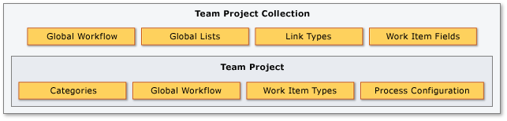

# witAdmin: Customize and manage objects for tracking work 

[!INCLUDE [version-lt-eq-azure-devops-plus-witadmin](../../includes/version-lt-eq-azure-devops-plus-witadmin.md)]

You can change how you track your team's progress by creating and customizing objects that track work items. By using the **witadmin** command-line tool, you can create, delete, import, and export objects such as categories, global lists, global workflow, types of links, and types of work items. You can also delete, list, or change the attributes of work item fields.  

::: moniker range="< azure-devops"
In addition, for on-premises Azure DevOps Servers, you can manage the resolution types, bug, and failure types used with test case management with the [**tcm fieldmapping**](#tcm) command.  
::: moniker-end

As the following illustration shows, you manage categories and types of and work items for each project. You manage global lists, types of links, and fields in work item for each project collection. You can customize global workflow for a project or a collection.  
  
  
  
[!INCLUDE [temp](../../includes/process-editor.md)]

For most commands, you must be a member of the Project Administrators or Project Collection Administrators groups. For more information, see [Change project collection-level permissions](../../organizations/security/change-organization-collection-level-permissions.md). 

[!INCLUDE [temp](../../includes/witadmin-run-tool.md)]  

 

### Global parameters
  
 You can use the following parameters to display help text for `witadmin`.  
  
|Parameter|Description|  
|---------------|-----------------|  
|`/?` or `help`|Displays the syntax and parameters for the `witadmin` command-line tool.|  
|`command /help` or  `command /?`|Displays the syntax and parameters for the `witadmin` command that you specify.|  

 
### XML definition files  

You customize all work tracking objects&mdash;such as, work item types, process configuration, global lists&mdash;by updating their XML definitions. If you're new to work tracking customization, see [Customize your work tracking experience](../customize-work.md).  

You run **witadmin** commands against Azure DevOps Services or an on-premises Azure DevOps Server. As shown in the command lists below, only **witadmin** commands that list or export files are supported for the Azure DevOps Services. 

## [Work item types](witadmin-import-export-manage-wits.md)

Work items are used to track anything you need to track. Each work item is based on a work item type. Each work item types defines the fields available in which to store information. The available work item types depend on the process you used when your project was created (Agile, Scrum, Basic, or CMMI). To learn more, see [Track your work items in Azure Boards user stories, issues, bugs, features, and epics](../../boards/work-items/about-work-items.md).

For the Inherited process model, you can add and delete work item types from the web portal. To learn how, see [Add and manage work item types(Inheritance process)](../../organizations/settings/work/customize-process-work-item-type.md).

---
:::row:::
   :::column span="2":::
      **Command** 
   :::column-end:::
   :::column span="1":::
      **Azure DevOps Services** 
   :::column-end:::
   :::column span="1":::
      **Azure DevOps Server**
   :::column-end:::
:::row-end:::
---
:::row:::
   :::column span="2":::
   `destroywitd`: Delete a work item type   
   :::column-end:::
   :::column span="1":::
       
   :::column-end:::
   :::column span="1":::
      ✔️
   :::column-end:::
:::row-end:::
:::row:::
   :::column span="2":::
   `exportwitd`: Export a work item type file  
   :::column-end:::
   :::column span="1":::
      ✔️
   :::column-end:::
   :::column span="1":::
      ✔️
   :::column-end:::
:::row-end:::
:::row:::
   :::column span="2":::
   `importwitd`: Import a work item type file  
   :::column-end:::
   :::column span="1":::
       
   :::column-end:::
   :::column span="1":::
      ✔️
   :::column-end:::
:::row-end:::
:::row:::
   :::column span="2":::
   `listwitd`:  List work item types    
   :::column-end:::
   :::column span="1":::
      ✔️
   :::column-end:::
   :::column span="1":::
      ✔️
   :::column-end:::
:::row-end:::
:::row:::
   :::column span="2":::
   `renamewitd`: Change the display name for a work item type  
   :::column-end:::
   :::column span="1":::
       
   :::column-end:::
   :::column span="1":::
      ✔️
   :::column-end:::
:::row-end:::
---
 

## [Fields](manage-work-item-fields.md)

Fields are used to track the status and information associated with work items. Fields are defined for an organization or collection. 
To learn more about fields, see [Work item fields and attributes](../../boards/work-items/work-item-fields.md). To look up the description of a specific field, see [Field descriptions for default and work item fields used in process templates](../../boards/work-items/guidance/work-item-field.md).
 
For the Inherited process model, you can view and delete fields from the web portal. To learn how, see [Add and manage fields (Inheritance process)](../../organizations/settings/work/customize-process-field.md).

---
:::row:::
   :::column span="2":::
      **Command** 
   :::column-end:::
   :::column span="1":::
      **Azure DevOps Services** 
   :::column-end:::
   :::column span="1":::
      **Azure DevOps Server**
   :::column-end:::
:::row-end:::
---
:::row:::
   :::column span="2":::
   `deletefield`: Delete a field  
   :::column-end:::
   :::column span="1":::
       
   :::column-end:::
   :::column span="1":::
      ✔️
   :::column-end:::
:::row-end:::
:::row:::
   :::column span="2":::
   `listfields`: List field attributes  
   :::column-end:::
   :::column span="1":::
      ✔️
   :::column-end:::
   :::column span="1":::
      ✔️
   :::column-end:::
:::row-end:::
::: moniker range="< azure-devops-2019"
:::row:::
   :::column span="2":::
   `indexfield`: Turn field indexing on/off  
   :::column-end:::
   :::column span="1":::
       
   :::column-end:::
   :::column span="1":::
      ✔️
   :::column-end:::
:::row-end:::
::: moniker-end
:::row:::
   :::column span="2":::
   `changefield`: Change a field attribute 
   :::column-end:::
   :::column span="1":::
      
   :::column-end:::
   :::column span="1":::
      ✔️
   :::column-end:::
:::row-end:::
:::row:::
   :::column span="2":::
   `renamewitd`: Change a WIT display name   
   :::column-end:::
   :::column span="1":::
       
   :::column-end:::
   :::column span="1":::
      ✔️
   :::column-end:::
:::row-end:::
---
 

## [Categories](/previous-versions/azure/devops/reference/witadmin/witadmin-import-export-categories)

Categories associate one or more work item types as belonging to the same category. Azure Boards relies on default category definitions, many of which specify a single work item type per category. To learn about categories and how they're used, see [Use categories to group work item types](../xml/use-categories-to-group-work-item-types.md).  
 
 
---
:::row:::
   :::column span="2":::
      **Command** 
   :::column-end:::
   :::column span="1":::
      **Azure DevOps Services** 
   :::column-end:::
   :::column span="1":::
      **Azure DevOps Server**
   :::column-end:::
:::row-end:::
---
:::row:::
   :::column span="2":::
   `exportcategories`:  Export the Categories file   
   :::column-end:::
   :::column span="1":::
      ✔️
   :::column-end:::
   :::column span="1":::
      ✔️
   :::column-end:::
:::row-end:::
:::row:::
   :::column span="2":::
   `importcategories`:  Import the Categories file   
   :::column-end:::
   :::column span="1":::
      
   :::column-end:::
   :::column span="1":::
      ✔️
   :::column-end:::
:::row-end:::
---

## [Link types](/previous-versions/azure/devops/reference/witadmin/manage-link-types)

You use different link types to manage the various relationships between work items. For On-premises XML and Hosted XML process models, you can define custom link types. To learn more about default link types, see [Manage dependencies, link work items](../../boards/queries/link-work-items-support-traceability.md) and [Reference guide for link types](../../boards/queries/link-type-reference.md).  

---
:::row:::
   :::column span="2":::
      **Command** 
   :::column-end:::
   :::column span="1":::
      **Azure DevOps Services** 
   :::column-end:::
   :::column span="1":::
      **Azure DevOps Server**
   :::column-end:::
:::row-end:::
---
:::row:::
   :::column span="2":::
   `deletelinktype`:  Delete a link type  
   :::column-end:::
   :::column span="1":::
       
   :::column-end:::
   :::column span="1":::
      ✔️
   :::column-end:::
:::row-end:::
:::row:::
   :::column span="2":::
   `exportlinktype`:  Export a link type file 
   :::column-end:::
   :::column span="1":::
      ✔️
   :::column-end:::
   :::column span="1":::
      ✔️
   :::column-end:::
:::row-end:::
::: moniker range="< azure-devops-2019"
:::row:::
   :::column span="2":::  
   `importlinktype`:  Import a link type file
   :::column-end:::
   :::column span="1":::
       
   :::column-end:::
   :::column span="1":::
      ✔️
   :::column-end:::
:::row-end:::
::: moniker-end
:::row:::
   :::column span="2":::  
   `listlinktypes`:  List the defined link types
   :::column-end:::
   :::column span="1":::
      ✔️
   :::column-end:::
   :::column span="1":::
      ✔️
   :::column-end:::
:::row-end:::
:::row:::
   :::column span="2":::   
   `reactivatelinktype`: Reactivate or rename a link type  
   :::column-end:::
   :::column span="1":::
       
   :::column-end:::
   :::column span="1":::
      ✔️
   :::column-end:::
:::row-end:::
---
 

## [Global lists](/previous-versions/azure/devops/reference/witadmin/manage-global-lists-for-work-item-types)

Global lists are pick lists that you can include within one or more fields and work item type definitions. You can share list items among several work item types for a collection of projects by including the list items in one or more **GLOBALLIST** elements. To learn more, see [GLOBALLIST XML element reference](../xml/define-global-lists.md).  

---
:::row:::
   :::column span="2":::
      **Command** 
   :::column-end:::
   :::column span="1":::
      **Azure DevOps Services** 
   :::column-end:::
   :::column span="1":::
      **Azure DevOps Server**
   :::column-end:::
:::row-end:::
---
:::row:::
   :::column span="2":::
   `destroygloballist`*: Delete a global list 
   :::column-end:::
   :::column span="1":::
      
   :::column-end:::
   :::column span="1":::
      ✔️
   :::column-end:::
:::row-end:::
:::row:::
   :::column span="2":::  
   `exportgloballist`: Export the global list  
   :::column-end:::
   :::column span="1":::
      ✔️
   :::column-end:::
   :::column span="1":::
      ✔️
   :::column-end:::
:::row-end:::
:::row:::
   :::column span="2":::  
   `importgloballist`: Import the global list  
   :::column-end:::
   :::column span="1":::
       
   :::column-end:::
   :::column span="1":::
      ✔️
   :::column-end:::
:::row-end:::
:::row:::
   :::column span="2":::   
   `listgloballist`: List all global list names 
   :::column-end:::
   :::column span="1":::
       ✔️
   :::column-end:::
   :::column span="1":::
      ✔️
   :::column-end:::
:::row-end:::
---
  

::: moniker range="< azure-devops"

## [Global workflow](/previous-versions/azure/devops/reference/witadmin/witadmin-import-export-global-workflow)

With global workflow, you can define and update fields and global lists that apply to all work item types in a project or collection. To learn more, see [Global workflow XML element reference](../xml/global-workflow-xml-element-reference.md).  

---
:::row:::
   :::column span="2":::
      **Command** 
   :::column-end:::
   :::column span="1":::
      **Azure DevOps Services** 
   :::column-end:::
   :::column span="1":::
      **Azure DevOps Server**
   :::column-end:::
:::row-end:::
---
:::row:::
   :::column span="2":::
   `exportglobalworkflow`: Export the global workflow file
   :::column-end:::
   :::column span="1":::
       
   :::column-end:::
   :::column span="1":::
      ✔️
   :::column-end:::
:::row-end:::
:::row:::
   :::column span="2":::  
   `importglobalworkflow`: Import the global workflow file  
   :::column-end:::
   :::column span="1":::
      
   :::column-end:::
   :::column span="1":::
      ✔️
   :::column-end:::
:::row-end:::
---
::: moniker-end

## [Process configuration](witadmin-import-export-process-configuration.md)
 
Process configuration defines the default configuration and functional capabilities that your teams can access using Azure Boards. The configuration determines the work item types that appear on the product backlog, sprint backlogs, Kanban board, and task board. To learn about process configuration and what you can customize, see [ProcessConfiguration](../xml/process-configuration-xml-element.md). 

 
For the Inherited process model, you can customize backlogs from the web portal. To learn how, see [Customize your backlogs or boards (Inheritance process)](../../organizations/settings/work/customize-process-backlogs-boards.md).
 
---
:::row:::
   :::column span="2":::
      **Command** 
   :::column-end:::
   :::column span="1":::
      **Azure DevOps Services** 
   :::column-end:::
   :::column span="1":::
      **Azure DevOps Server**
   :::column-end:::
:::row-end:::
---
:::row:::
   :::column span="2":::
   `exportprocessconfig`: Export the ProcessConfiguration file   
   :::column-end:::
   :::column span="1":::
       ✔️
   :::column-end:::
   :::column span="1":::
      ✔️
   :::column-end:::
:::row-end:::
:::row:::
   :::column span="2":::
   `importprocessconfig`: Import the ProcessConfiguration file  
   :::column-end:::
   :::column span="1":::
      
   :::column-end:::
   :::column span="1":::
      ✔️
   :::column-end:::
:::row-end:::
---

::: moniker range="< azure-devops-2019"

## [Work items](/previous-versions/azure/devops/reference/witadmin/remove-work-items-permanently) 

The following **witadmin** command is only available for TFS 2018.1 and earlier versions. It has been deprecated for TFS 2018.2 and later versions. To learn more about how to permanently delete work items for later versions, see [Remove, delete, or restore work items](../../boards/backlogs/remove-delete-work-items.md).

- `destroywi`: Permanently delete work items    
::: moniker-end

::: moniker range="< azure-devops"

## [Client cache](/previous-versions/azure/devops/reference/witadmin/rebuild-client-cache)

After certain maintenance operations, client computers require a cache refresh. After you move, restore, rename, or fail over a data-tier or application-tier server, you must refresh the cache for tracking work items and users must refresh the version control cache on client computers. 

The following `witadmin` command is only available for Azure DevOps Server on-premises.  

- `rebuildcache`: Rebuild the client cache  
::: moniker-end

<a id="tcm" /> 

::: moniker range="< azure-devops"

## [Test case management field mapping](/previous-versions/azure/devops/reference/witadmin/tcm-customize-manage-test-experience)  

To customize the resolution types, bug work item type, and failure types used when working with Azure Test Plans, you can use the following **tcm** command. This command is only available for Azure DevOps Server on-premises versions. 

- `tcm fieldmapping`: Import or export a file that defines the resolution types, bug, or failure types to use with test case management.     

::: moniker-end

## Related articles

::: moniker range="azure-devops"

- [Customize your work tracking experience](../customize-work.md)   
- [**az boards** command-line tools](../../cli/quick-reference.md#azure-boards) 
- [On-premises XML process model](../on-premises-xml-process-model.md)  
- [Inheritance process model](../../organizations/settings/work/inheritance-process-model.md)
- [Hosted XML process model](../../organizations/settings/work/hosted-xml-process-model.md)
- [What is Azure Test Plans?](../../test/overview.md)
 
::: moniker-end

::: moniker range=">= azure-devops-2019 < azure-devops"

- [Customize your work tracking experience](../customize-work.md)    
- [On-premises XML process model](../on-premises-xml-process-model.md)  
- [Inheritance process model](../../organizations/settings/work/inheritance-process-model.md) 
- [What is Azure Test Plans?](../../test/overview.md)
 
::: moniker-end

::: moniker range="tfs-2018"
- [Customize your work tracking experience](../customize-work.md)   
- [On-premises XML process model](../on-premises-xml-process-model.md)  
- [What is Azure Test Plans?](../../test/overview.md)
::: moniker-end
