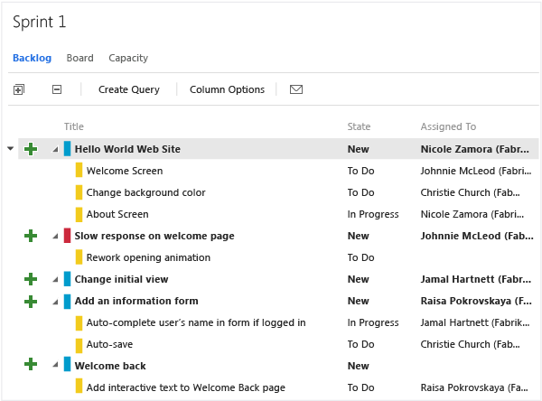

# Import, export, and manage work item types

[!INCLUDE [temp](../../_shared/customization-witadmin-plus-version-header.md)]

You can manage work item types for a project by using the following **witadmin** commands:  
-   **destroywitd**:  Destroys a work item type, and destroys every work item of that type permanently without recovery.    
-   **exportwitd**:  Exports the definition of a work item type to an XML file, or to the Command Prompt window.    
-   **importwitd**:  Imports work item types from an XML definition file into a project on a server that runs Team Foundation Server. If a work item type with the same name already exists, the new work item type definition overwrites the existing one. If the work item type does not already exist, this command creates a new work item type. To validate the XML that defines a work item type, but not import the file, you use the **/v** option.   
-   **listwitd**:  Displays the names of the work item types in the specified project in the Command Prompt window. 
-   **renamewitd**:  Changes the display name of a work item type within a specific project. After you run this command, work items of this type show the new name.  
  

[!INCLUDE [temp](../../_shared/witadmin-run-tool.md)]  
 
[!INCLUDE [temp](../../_shared/process-editor.md)]


## Prerequisites  
  
For the project where the work item types are defined, you must have the following permissions set:   
-   To export or list work item types, you must be a member of the **Project Administrators** group or have your **View project-level information** permission set to **Allow**.    
-   To destroy, import, or rename work item types, you must be a member of the **Team Foundation Administrators** security group or the **Project Administrators** security group.  
  
For more information, see [Add an administrator](../../organizations/security/set-project-collection-level-permissions.md).  
  
> [!NOTE]
>  Even if you sign in with administrative permissions, you must open an elevated Command Prompt window to perform this function on a server that is running Windows Server 2008. To open an elevated Command Prompt window, choose **Start**, open the shortcut menu for the **Command Prompt**, and then choose **Run as Administrator**. For more information, see the Microsoft Web site: [User Access Control](http://go.microsoft.com/fwlink/?LinkId=111235).  
  
## Syntax  
  
```  
witadmin destroywitd /collection:CollectionURL /p:Project /n:TypeName [/noprompt]   
witadmin exportwitd /collection:CollectionURL /p:Project /n:TypeName [/f:FileName] [/e:Encoding] [/exportgloballists]  
witadmin importwitd /collection:CollectionURL [/p:Project] /f:FileName [/e:Encoding] [/v] 
witadmin listwitd /collection:CollectionURL /p:Project    
witadmin renamewitd /collection:CollectionURL /p:Project /n:TypeName /new:NewName [/noprompt]   
```  

  
#### Parameters  
  
|**Parameter**|**Description**|  
|-------------------|---------------------|  
|**/collection**:`CollectionURL`|Specifies the URI of the project collection. The format for the URI is the following: **http**://*ServerName:Port/VirtualDirectoryName/CollectionName*<br /><br /> If no virtual directory is used, then the format for the URI is the following:<br /><br />**http**://*ServerName:Port/CollectionName*|  
|**/p:** *Project*|The project for which the types of work items are to be managed. This project must be defined in the project collection specified by the **/collection** parameter.<br /><br /> The **/p** parameter is required unless you run the **importwitd** command with the **/v** option.|  
|**/n:** `TypeName`|The name of the work item type to destroy, export, import, or rename.|  
|**/f:** `FileName`|The path and file name of the XML definition file that contains the types of work items to be exported or imported. If you omit this parameter when you use the **exportwitd** command, the XML appears in the Command Prompt window.<br /><br /> **Note:**  If you are using Windows Vista you might not have permissions to certain folders. If you try to export the work item type to a location where you do not have permissions, the registry virtualization technology automatically redirects the exported file and saves it to the virtual store. To avoid this redirection, you can export the file to a location where you have permissions. For more information about registry virtualization, see the Microsoft Web site: [Registry Virtualization](http://go.microsoft.com/fwlink/?LinkId=92325) and [Common file and registry virtualization issues in Windows Vista](http://go.microsoft.com/fwlink/?LinkId=92323).|  
|**/e:** *Encoding*|The name of a .NET Framework 2.0 encoding format. The command uses the specified encoding to export or import the XML data. For example, `/e:utf-7` specifies Unicode (UTF-7) encoding. If you omit this parameter, **witadmin** tries to detect the encoding, and if detection fails, **witadmin** uses UTF-8.|  
|**/exportgloballists**|Exports the definitions of global lists referenced by the work item type. The definitions for global lists will be embedded into the work item type definition XML. When not specified, the definitions for global lists are omitted.|  
|**/v**|Validates the XML that defines the work item type, but does not import the XML definition file. **Note:**  You can validate the type definition without specifying a project. References to project-scoped groups is ignored.|  
|**/new:** *NewName*|The new name of the work item type.|  
|**/noprompt**|Disables the prompt for confirmation.|  
|**/?** or **help**|Displays help about the command in the Command Prompt window.|  
  
## Remarks  

When you use the **destroywitd** command, it destroys all the following objects:  
  
- The work item type   
- All work items of that type    
- Corresponding entries in the work item tables, the long text tables, and the link tables   
- Objects in the work item type metadata cache  
  
## Examples  

Unless otherwise specified, the following values apply in each example:  
  
-   URI for the project collection: http://AdventureWorksServer:8080/tfs/DefaultCollection    
-   Project name: AdventureWorks    
-   Input or output file name: myworkitems.xml  
-   Work item type name: myworkitem   
-   Default encoding: UTF-8  
  
### Export the definition of a WIT  

The following command exports the definition for myworkitem to the file, myworkitems.xml.  
  
```  
witadmin exportwitd /collection:http://AdventureWorksServer:8080/tfs/DefaultCollection /p:AdventureWorks /f:myworkitems.xml /n:myworkitem  
```  
  
The following example exports the work item by using Unicode (UTF-7) encoding.  
  
```  
witadmin exportwitd /collection:http://AdventureWorksServer:8080/tfs/DefaultCollection /p:AdventureWorks /f:myworkitems.xml /n:myworkitem /e:utf-7  
```  
  
### Export the definition of a WIT and its referenced global lists  

The following example exports the work item type and its referenced global lists.  
  
```  
witadmin exportwitd /collection:http://AdventureWorksServer:8080/tfs/DefaultCollection /p:AdventureWorks /f:myworkitems.xml /n:myworkitem /exportgloballists  
```  
  
### List the definition of a WIT  

The following example displays the definition of the work item type the Command Prompt window.  
  
```  
witadmin exportwitd /collection:http://AdventureWorksServer:8080/tfs/DefaultCollection /p:AdventureWorks /n:myworkitem  
```  
  
### Import the definition of WITs  

The following example imports the work item definition from the XML file.  
  
```  
witadmin importwitd /collection:http://AdventureWorksServer:8080/tfs/DefaultCollection /f:myworkitem.xml /p:AdventureWorks  
```  
  
### Validate the XML definition of a WIT  
 The following example validates the XML that defines the work item type but does not import the definition.  
  
```  
witadmin importwitd /collection:http://AdventureWorksServer:8080/tfs/DefaultCollection /f:myworkitem.xml /p:AdventureWorks /v  
```  
  
## Q & A  
  
### Q: What customizations can I make and still use the Configure Features Wizard to update my project after a TFS upgrade?  

**A:** You can add custom WITs and change the form layout. The [Configure Features Wizard](../configure-features-after-upgrade.md) will update your projects and you'll get access to the latest features.  
  
Changing the workflow or renaming a WIT might require you to perform some manual operations when updating your project. To learn about which customizations you can safely make and which you should avoid, see [Customize the work tracking experience: Before you customize, understand the maintenance and upgrade implications](../on-premises-xml-process-model.md#before-you-customize).  
  
<a name="color"></a> 

###  Q: How do I change the color associated with a WIT?  

**A:** In the web portal, work items appear in query results and on the backlog and board pages of the Agile planning tools. To change the color associated with an existing WIT or add the color to use for a new WIT, [edit the process configuration](../xml/process-configuration-xml-element.md).  
  
   
  
### Q: How do I deactivate or disable a WIT? How do I restrict users from creating work items of a certain type?  
**A:** If you have a WIT that you want to retire, but maintain the work items that have been created based on that type, you can add a rule that disables all valid users from saving the work item type.  
  
> [!div class="tabbedCodeSnippets"]
```XML  
	<TRANSITION from=" " to="New">  
	   <FIELDS>  
	     <FIELD refname="System.CreatedBy">  
	          <VALIDUSER not="[Team Project Name]Project Valid Users" />  
	     </FIELD>  
	   </FIELDS>  
	</TRANSITION>  	  
```  
  
If you want to restrict creation of a specific WIT to a group of users, there are two ways to restrict access:  
  
- [Add the WIT to the Hidden Categories group](../xml/use-categories-to-group-work-item-types.md) to prevent the majority of contributors from creating them. If you want to allow a group of users access, you [can create a hyperlink to a template](../../boards/backlogs/work-item-template.md) that opens the work item form and share that link with those team members who you do want to create them.  
- Add [a field rule to the workflow](../xml/apply-rule-work-item-field.md) for the System.CreatedBy field to effectively restrict a group of users from creating a work item of a specific type. As the following example shows, the user who creates the work item must belong to the `Allowed Group` in order to save the work item.  
  
> [!div class="tabbedCodeSnippets"]
```XML 
<TRANSITION from=" " to="New">  
   <FIELDS>  
     <FIELD refname="System.CreatedBy">  
         <VALIDUSER for="Allowed Group" not="Disallowed Group" />  
     </FIELD>  
   </FIELDS>  
</TRANSITION>  
```  


<a name="delete"></a>  

### Q: How do I delete a WIT?  

**A:** To prevent team members from using a specific WIT to create a work item, you can remove it from the project. When you use `witadmin destroywitd`, you permanently remove all work items that were created using that WIT as well as the WIT itself. For example, if your team doesn't use Impediment you can delete the WIT labeled Impediment from the Fabrikam Web Site project.  
  
```  
witadmin destroywitd /collection:"http://FabrikamPrime:8080/tfs/DefaultCollection" /p:"Fabrikam Web Site" /n:"Impediment"   
```  
  
When you delete a WIT that belongs to a category, you must update the categories definition for the project to reflect the new name. In particular, the [Agile planning tools](../../boards/get-started/what-is-azure-boards.md) will not work until you update the categories definition.  
  
For more information, see [Import and export categories](witadmin-import-export-categories.md).  
  
## Related articles  
-  [Customize your work tracking experience](../customize-work.md)   
