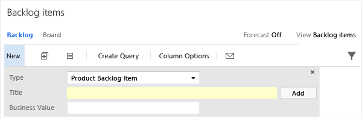

# Import and export process configuration

[!INCLUDE [version-lt-eq-azure-devops-plus-witadmin](../../includes/version-lt-eq-azure-devops-plus-witadmin.md)]

You customize the process configuration to modify the display of the web portal Agile tools. A few additional tools require that you map workflow states to metastate mappings.  

> [!NOTE]  
> If you receive error message TF400917, an invalid configuration has occurred. Re-import the process configuration file to your project using `witadmin importprocessconfig`. You'll get the messages you need to resolve the error.  

To manage the process configuration for a project, use the `witadmin` command line tool to export and import the process configuration XML definition file. To learn about process configuration, see [ProcessConfiguration](../xml/process-configuration-xml-element.md).   
- `exportprocessconfig`:  Exports the process configuration definition to an XML file or the Command Prompt window.    
- `importprocessconfig`:  Imports the process configuration definition XML file.  

[!INCLUDE [temp](../../includes/witadmin-run-tool.md)]

[!INCLUDE [temp](../../includes/process-editor.md)]


## Prerequisites  

- To export process configuration definitions, you must be a valid user of the project or collection.    
- To import process configuration definitions, you must be a member of the following security groups: **Team Foundation Administrators** or **Project Administrators**.  

For more information, see [Change project collection-level permissions](../../organizations/security/change-organization-collection-level-permissions.md).  

## Syntax  

```  
witadmin exportprocessconfig /collection:CollectionURL /p:ProjectName [/f:FileName] [/e:encoding]    
witadmin importprocessconfig /collection:CollectionURL [/p:ProjectName] /f:FileName [/e:encoding] [/v]  
```  

#### Parameters  

:::row:::
   :::column span="1":::
   **Parameter**
   :::column-end:::
   :::column span="3":::
   **Description**
   :::column-end:::   
:::row-end:::

:::row:::
   :::column span="1":::
   `/collection:CollectionURLx`
   :::column-end:::
   :::column span="3":::
   Specifies the URI of the project collection. For example:     
   
   **On-premises Azure DevOps format:** `http://ServerName:Port/VirtualDirectoryName/CollectionName`  
   
   If no virtual directory is used, then the format for the URI is the following: `http://ServerName:Port/CollectionName`.
   :::column-end:::   
:::row-end:::

:::row:::
   :::column span="1":::
   `/p:ProjectName`
   :::column-end:::
   :::column span="3":::
   Required. Specifies the project for which you want to export or import the process configuration. This project must be defined in the collection that you specified by using the /collection parameter. You do not need to specify a project when you specify the `/v` switch.
   :::column-end:::   
:::row-end:::

:::row:::
   :::column span="1":::
   `/f**:FileName`
   :::column-end:::
   :::column span="3":::
   The path and the name of the XML definition file for the process configuration to export or import.<br /><br />
   > [!NOTE]  
   >If the client computer is running Windows Vista, you might not have permissions to certain folders. If you try to export the global list to a location where you do not have permissions, the registry virtualization technology automatically redirects the exported file and saves it to the virtual store. For more information, see the [Registry Virtualization](/windows/win32/sysinfo/registry-virtualization) page on the Microsoft website. To avoid this redirection, you can export the file to a location where you have permissions.
   :::column-end:::   
:::row-end:::
:::row:::
   :::column span="1":::
   `/e:Encoding`
   :::column-end:::
   :::column span="3":::
   Optional. The name of a .NET Framework 2.0 encoding format. The specified encoding will be used to export or import the XML data. For example, `/e utf-7` specifies Unicode (UTF-7) encoding. If you omit this parameter, **witadmin** attempts to detect the encoding and uses UTF-8 if detection fails.
   :::column-end:::   
:::row-end:::
:::row:::
   :::column span="1":::
   `/v`
   :::column-end:::
   :::column span="3":::
   Optional. Validates the XML that defines the process configuration but doesn't import the definition file.
   :::column-end:::   
:::row-end:::
:::row:::
   :::column span="1":::
  `/?` or `help`
   :::column-end:::
   :::column span="3":::
   Displays help about the command in the Command Prompt window.
   :::column-end:::   
:::row-end:::

## Remarks  

Installing the latest version of Azure DevOps upgrades existing projects. If you are updating an upgraded project, see [Configure features after an upgrade](/previous-versions/azure/devops/reference/upgrade/configure-features-after-upgrade?view=tfs-2017&preserve-view=true).  

If you encounter problems accessing existing test plans or test suites after an upgrade, see [Manual updates to support test management](/previous-versions/azure/devops/reference/upgrade/update-a-team-project-manually-to-support-test-management).  

## Examples  

The following values apply in each example:  

-   URL for the collection: `http://AdventureWorksServer:8080/tfs/DefaultCollection`    
-   Project: `Contoso`   
-   Port number for the server website: `8080`  

<a name="quick_add"></a>   

### To add a field to the quick add panel  

You can add fields for any quick add panel. For example, the following example adds **Business Value** to the product backlog panel.  

  

The panel only displays fields that are included in the `FIELDS` section of the WIT definition for the WIT selected. For example, if you select the bug WIT, then only Title displays, as Business Value isn't defined for bugs. To add another WIT to the panel, you add it to the Requirements Category. See [Add a work item type to a backlog and board](../add-wits-to-backlogs-and-boards.md).  

1.  If you don't have administrative permissions for your project, [get them](../../organizations/security/change-organization-collection-level-permissions.md).  

2.  Open a Command Prompt window according to the instructions provided in [How to run the witadmin command-line tool](#run-witadmin-tool). For example:   

    ```
    cd %programfiles(x86)%\Microsoft Visual Studio\2017\Community\Common7\IDE\CommonExtensions\Microsoft\TeamFoundation\Team Explorer
    ```    

3.  Export the process configuration file.  

    ```  
    witadmin exportprocessconfig /collection:CollectionURL /p:ProjectName /f:"DirectoryPath\ProcessConfiguration.xml"  
    ``` 

    An example of a *CollectionURL* is http://MyServer:8080/tfs/TeamProjectCollectionName.  

4.  Add the field reference name to the `AddPanel` section.  

     For example, the following syntax adds the **Priority** element to the panel.  

    ```xml
    <AddPanel>  
       <Fields>  
          <Field refname="System.Title" />  
          <Field refname="Microsoft.VSTS.Common.BusinessValue" />  
       </Fields>  
    </AddPanel>  
    ```  

     > [!TIP]    
    > -  You can look up the reference name for a field using this [index](../../boards/work-items/guidance/work-item-field.md).    
    > -  Add all required fields for work item types defined for the Requirements Category. That way, you avoid having to open the work item form to fill them in when you add backlog items through the panel.  

5.  Import the process configuration file.  

    ```  
    witadmin importprocessconfig /collection:CollectionURL /p:ProjectName /f:"DirectoryPath\ProcessConfiguration.xml"  
    ```  

6.  Refresh your backlog page to view the updated panel.  

<a name="test_manager"></a> 

### Update metastate mappings to support Test Manager  

 If you customize the `WORKFLOW` section of the test plan or test suite, you must map the states to metastates.  

 In the following example, the test plan workflow has been updated to use the Design, Testing, and Signed Off states. To support backward compatibility, the `TestPlanWorkItems` is added to the `ProjectProcessConfiguration` section of the process configuration definition.  


**Workflow**

> [!div class="tabbedCodeSnippets"]
> ```XML
> <WORKFLOW>
>       <STATES>
>         <STATE value="Design" />
>         <STATE value="Testing" />
>         <STATE value="Signed Off" />
>       </STATES>
>       <TRANSITIONS>
>         <TRANSITION from="" to="Design">
>           <REASONS>
>             <DEFAULTREASON value="New test plan" />
>           </REASONS>
>         </TRANSITION>
>      <TRANSITION from="Design" to="Testing">
>           <REASONS>
>             <DEFAULTREASON value="Authoring complete" />
>           </REASONS>
>         </TRANSITION>        
>      <TRANSITION from="Testing" to="Signed Off">
>           <REASONS>
>             <DEFAULTREASON value="Signed Off testing" />
>           </REASONS>
>         </TRANSITION>
>         <TRANSITION from="Signed Off" to="Design">
>           <REASONS>
>             <DEFAULTREASON value="Reactivating to authoring phase" />
>           </REASONS>
>         </TRANSITION>
>         <TRANSITION from="Signed Off" to="Testing">
>           <REASONS>
>             <DEFAULTREASON value="Reactivating to run tests" />
>           </REASONS>
>         </TRANSITION>
>         <TRANSITION from="Testing" to="Design">
>           <REASONS>
>             <DEFAULTREASON value="Back to authoring" />
>           </REASONS>
>         </TRANSITION>
>       </TRANSITIONS>
>     </WORKFLOW>
> ```

**Metastate mappings**

> [!div class="tabbedCodeSnippets"]
> ```XML
> <TestPlanWorkItems category="Microsoft.TestPlanCategory" pluralName="Test Plans" singularName="Test Plan">
>     <States>
>       <State type="InProgress" value="Design" />
>       <State type="InProgress" value="Testing" />
>       <State type="Complete" value="Signed Off" />
>     </States>
>   </TestPlanWorkItems>
> <TestSuiteWorkItems category="Microsoft.TestSuiteCategory" pluralName="Test Suites" singularName="Test Suite">
>     <States>
>       <State type="Proposed" value="In Planning" />
>       <State type="InProgress" value="In Progress" />
>       <State type="Complete" value="Completed" />
>     </States>
>   </TestSuiteWorkItems>
> ```

If you modify the test suite workflow, then you have to make a similar update if you want to map new states. You would add it within a `TestSuiteWorkItems` section.  See [ProcessConfiguration](../xml/process-configuration-xml-element.md).  

## Q & A  

::: moniker range="< azure-devops-2019"
### Q: What customizations can I make and still use the Configure Features Wizard to update my project after a TFS upgrade?  

**A:** You can customize the quick add panel. The [Configure Features Wizard](/previous-versions/azure/devops/reference/upgrade/configure-features-after-upgrade?view=tfs-2017&preserve-view=true) will update your projects and you'll get access to the latest features.  

Other changes might require you to perform some manual operations when updating your project. To learn about which customizations you can safely make and which you should avoid, see [Customize the work tracking experience: Before you customize, understand the maintenance and upgrade implications](../customize-work.md).  
::: moniker-end

### Q: When do I need to map workflow states to metastates?  

**A:** When you add or remove workflow states to the following work item types, you should consider updating the process configuration to add or remove corresponding metastate mappings.  

- **Work item types that belong to the Requirement Category or Task Category**: Metastate mappings support the display of the Agile planning tools.  

- **Work item types that belong to the Bug Category**: Metastate mappings to support **My Work** tool (Agile and CMMI-based projects).  

- **Test Plan and Test Suite**: Updates to the workflow of these work item types must be mapped only when you support team members connecting to Azure DevOps from a version of Test Manager that is based on Visual Studio 2013.2 or earlier version.  

    Update the metastate mappings if you receive an **Application detected an unexpected fault** error when you connect to your project.  

      

### How do I resolve process configuration errors?  

**A:**  When you make one of the following changes to a project, you'll need to update the definitions for the work item type, categories, or process configuration. To avoid errors, always make your changes in this order: (1) work item types, (2) categories, and (3) process configuration.

:::row:::
   :::column span="1":::   
   **Customization**
   :::column-end:::
   :::column span="1":::   
   **Update or verify the work item type definition**
   :::column-end:::
   :::column span="1":::   
   **Update or verify the process configuration definition**
   :::column-end:::
:::row-end:::
:::row:::
   :::column span="1":::
   Add a work item type to the Requirements Category  
   
   (A work item type can belong to the Requirements Category or the Task Category, but not both.)
   :::column-end:::
   :::column span="1":::
   To include the following fields:  
   - Backlog Priority (Scrum) or Stack Rank (Agile or CMMI)<br/><br/>
     (must match the field value assigned to type=Order in the process configuration file)
   - Effort (Scrum), Story Points (Agile), or Size (CMMI)<br/><br/>
     (must match the field value assigned to `type=Effort` in the process configuration file)
   - Area path or the field value assigned to `type=Team` in the process configuration file<br/><br/>
   - All fields that are included in the `AddPanel` section of the process configuration file (fields must be defined within the `FIELDS` section but don't have to be included within the `FORM` section.   
   :::column-end:::
   :::column span="1":::
   To contain the necessary metastate mappings:  
   - Map the start of each workflow state to `type="Proposed"` 
   - Map each intermediate workflow state you want to have show up on the Kanban board to `type="InProgress"` 
   - Map the end of each workflow state to `type="Complete"`  
     You can have only one State mapped to  `type="Complete"`<br/><br/>
     To contain an entry to define the color codes associated with the WIT. For example:  
     `<WorkItemColor primary="FF009CCC" secondary="FFD6ECF2"  
     name="Product Backlog Item" />`
   :::column-end:::
:::row-end:::
:::row:::
   :::column span="1":::
   Change the workflow of a work item type in the Requirements Category
   :::column-end:::
   :::column span="1":::
   N/A
   :::column-end:::
   :::column span="1":::
   To contain the necessary metastate mappings as described above for adding a work item type to the Requirements Category. 
   :::column-end:::
:::row-end:::
:::row:::
   :::column span="1":::
   Add a work item type to the Task Category

   :::column-end:::
   :::column span="1":::
   To include the following fields:  
   - Backlog Priority (Scrum) or Stack Rank (Agile or CMMI)  
   - Activity (Scrum or Agile) or Discipline (CMMI)  
     (must match the field value assigned to `type=Activity` in the process configuration file)  
   - Remaining Work  
     (must match the field value assigned to `type=RemainingWork` in the process configuration file)
   - Area path or the field value assigned to `type=Team` in the process configuration file 
   - (Optional) Original Work and Completed Work (Agile and CMMI only)
   :::column-end:::
   :::column span="1":::
   To contain the necessary metastate mappings:  
   - Map the start of each workflow state to type="Proposed" 
   - Map each intermediate workflow state that you want to have show up on the task board to `type="InProgress"` 
   - Map the end of each workflow state to `type="Complete`"<br/><br/>
     You can have only one State mapped to `type="Complete"`
     
   To contain an entry to define the color codes associated with the WIT. For example: 

   `<WorkItemColor primary="FFF2CB1D" secondary="FFF6F5D2"  
   name="Task" />`
   :::column-end:::
:::row-end:::
:::row:::
   :::column span="1":::
   Change the workflow of a work item type in the Task Category
   :::column-end:::
   :::column span="1":::
   N/A
   :::column-end:::
   :::column span="1":::
   To contain the necessary metastate mappings as described above for adding a work item type to the Task Category. 
   :::column-end:::
:::row-end:::

:::row:::
   :::column span="1":::
   Add a work item type to the Bug Category (Agile and CMMI only)   
   Change the workflow of a work item type in the Bug Category (Agile and CMMI only)
   :::column-end:::
   :::column span="1":::
   N/A
   :::column-end:::
   :::column span="1":::
   To contain the necessary metastate mappings:  
   - Map the start of each workflow state to  `type="Proposed"`
   - Map each intermediate workflow state you want to have show up for My Work to `type="InProgress"`
   - Map the end of each workflow state  type="Complete"  
   
   You can have only one State mapped to `type="Complete"`  
   
   To learn more, see [Support bug update status using My Work](../xml/support-bug-update-status-using-my-work.md).
   :::column-end:::
:::row-end:::
:::row:::
   :::column span="1":::
   Remove a work item type from the Requirements Category or Task Category
   :::column-end:::
   :::column span="1":::
   N/A
   :::column-end:::
   :::column span="1":::
   To remove any metastate mappings that are only associated with that work item type
   :::column-end:::
:::row-end:::
:::row:::
   :::column span="1":::
   Remove a work item type from a project

   :::column-end:::
   :::column span="1":::
   To remove the work item type from the categories file.
   :::column-end:::
   :::column span="1":::
   To remove any metastate mappings that are only associated with the work item type that you removed and the `WorkItemColor` element that defines the color codes for the work item type you removed.
   :::column-end:::
:::row-end:::


### Q: Do you want to work with two or more portfolio backlogs?  

**A:** The default experience supports one level of portfolio backlog. You can add up to five levels as described in [Add portfolio backlogs to Agile tools](../add-portfolio-backlogs.md).  

### Q: Do you want to add or change the work item types that appear on your task board or product backlog?  

**A:** If you've added a custom work item type and want to add that to either the backlog or task board, you can. You just can't have them appear in both places. Learn how by reading [Add work item types to backlogs and boards](../add-wits-to-backlogs-and-boards.md).


## Related articles
- [Configure features after an upgrade](/previous-versions/azure/devops/reference/upgrade/configure-features-after-upgrade?view=tfs-2017&preserve-view=true) 
- [Control XML element reference](/previous-versions/azure/devops/reference/xml/control-xml-element-reference?view=tfs-2015&preserve-view=true)  
- [Change the work item form layout](../xml/change-work-item-form-layout.md)   
- [Edit a work item type definition to add web content to a work item form](..//xml/edit-wit-definition-add-web-content-form.md)
- [Customizing your work tracking experience](../customize-work.md)   
- [Work item field index](../../boards/work-items/guidance/work-item-field.md)   
- [witAdmin: Customize and manage objects for tracking work](witadmin-customize-and-manage-objects-for-tracking-work.md)