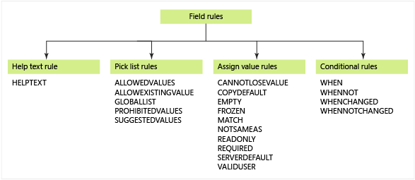

# Add a rule to a work item type  
 
[!INCLUDE [temp](../../_shared/customization-phase-0-and-1-plus-version-header.md)]

Depending on a field's data type, you can set various restrictions on what data can be entered into that field. You can specify values for a pick list (drop-down menu), set default values, clear entries, or restrict changes. With conditional rules, you can apply rules to a field based on dependencies between different fields' values. You can also restrict who can modify a field or scope a rule to only apply to a group.

All of these rule elements can be defined within the **FIELD** definition of a work item type (WIT) definition, subject to some [restrictions for System fields](#system). And, with the exception of **HELPTEXT**, you can specify these rules to take affect during a workflow transition or as child elements within a **FIELD** (Global workflow) element.

 

You can define any combination of rules to a field, subject to the constraints as described in this topic.

- [Help text](#help-text): Use to specify tool-tip text to appear in a work item form for a field 
- [Pick list](#pick-list): Use to specify a drop-down menu or pick list of allowed, suggested, or prohibited values 
- [Assign value](#assign-value-rules): Use to define run-time behaviors and constraints that clear field values, copy values, match a pattern, make a field read-only and more 
- [Conditional](#conditional-rules): Use to specify when a set of rules will be applied to a parent field.


Field rules are one component you have to customize work item tracking. To learn more, see [Customize work tracking objects to support your team's processes](../customize-work.md).

For information on modifying fields or adding field rules to a WIT definition file, see [Add or modify a field](../add-modify-field.md).


[!INCLUDE [temp](../../_shared/update-xml-wit.md)] 

<a id="help-text" /> 
## Help text

You can customize the help text or tooltip text that appears when a user points to a field that appears on a work item form. You can customize and localize the Help text for the same field that appears in different WITs and different projects. Help text is restricted to 255 Unicode characters.

The following example shows the assignment of Help text to a custom Business Justification field:

> [!div class="tabbedCodeSnippets"]
```XML
<FIELD name="Business Justification" refname="Fabrikam.BusinessJustification" type="String">
   <HELPTEXT>Only required when you set the Urgency field to Need Immediately. </HELPTEXT>
</FIELD>
```

To provide users guidance that exceeds the 255 characters limit, see [Provide help text, hyperlinks, or web content on a work item form](provide-help-text-hyperlinks-web-content-form.md).

> [!NOTE]    
>The presence of `HELPTEXT` adds to the size of your data store and can impact scalability. If you support several hundreds of projects within a single TFS collection or instance, be conservative in your use of `HELPTEXT` rules.

<a id="pick-list" /> 
## Pick list rules

Pick list rules define the values that a user can or can't choose for a String field. Values defined in a pick list appear on a work item form and the query editor. You can combine lists, and expand or contract lists. 

<table>
<thead>
<tr>
<th><p>Rule</p></th>
<th><p>Usage</p></th>
</tr>
</thead>
<tbody>
<tr>
<td><p><strong>ALLOWEDVALUES</strong></p></td>
<td><p>Limits the values a user can choose based on the specified values.</p></td>
</tr>
<tr>
<td><p><strong>ALLOWEXISTINGVALUE</strong></p></td>
<td><p>Allows a field to retain an existing value, even if it is no longer in a pick list. Including this rule is recommended when you change the field values in a pick list or for pick lists that contain person names.</p>
<p></p></td>
</tr>
<tr>
<td><p><strong>GLOBALLIST</strong></p></td>
<td><p>Specifies the name of a global list that contains values maintained for a project or project collection.</p></td>
</tr>
<tr>
<td><p><strong>PROHIBITEDVALUES</strong></p></td>
<td><p>Prevents specified values from being assigned. The work item can't be saved if the field contains a prohibited value.</p>
<p></p></td>
</tr>
<tr>
<td><p><strong>SUGGESTEDVALUES</strong></p></td>
<td><p>Defines a list of values that users can choose from, but are not restricted to selecting. Users can specify values other than those in this list.</p></td>
</tr>
</tbody>
</table>

For examples of using pick lists, see [Define pick lists](define-pick-lists.md).


<a id="value-rules" /> 
## Assign value rules

Assign value rules define runtime behavior and constraints, such as specifying default values, clearing fields, requiring fields to be defined, and more. 

<a id="clear" /> 
### Clear, set defaults, copy, or match a pattern

These rules support setting defaults, copying values from one field to another, or enforcing a field value to match a prescribed pattern.

<table>
<thead>
<tr>
<th><p>Rule</p></th>
<th><p>Usage</p></th>
</tr>
</thead>
<tbody>
<tr>
<td><p><strong>COPY</strong></p></td>
<td><p>Copies a specified value to a field when a user creates or modifies a work item.</p></td>
</tr>
<tr>
<td><p><strong>DEFAULT</strong></p></td>
<td><p>Specifies a value for a field that is empty when a user creates or modifies a work item. If a field already has a value, the <strong>DEFAULT</strong> rule is ignored.</p></td>
</tr>
<tr>
<td><p><strong>EMPTY</strong></p></td>
<td><p>Clears the field of any value that it contains and then makes the field read-only when a user saves the work item. You shouldn't use <strong>EMPTY</strong> with <strong>READONLY</strong>.</p>
<p><strong>EMPTY</strong> is primarily used [during state transition](transition-xml-element.md) to clear fields that apply to the state to which the item is transitioning.</p></td>
</tr>
<tr>
<td><p><strong>MATCH</strong></p></td>
<td><p>Forces entries made to a String field to conform to a [specified pattern of characters or numbers](apply-pattern-matching-to-string-field.md).</p></td>
</tr>
<tr>
<td><p><strong>SERVERDEFAULT</strong></p></td>
<td><p>Copies either the current user name or the server clock value to a field when a user saves a work item. These fields usually appear as read-only on the form.</p></td>
</tr>
</tbody>
</table>

For the syntax structure and examples, see [Define a default value or copy a value to a field](define-default-copy-value-field.md).

> [!NOTE]    
>Field rules don't support assigning values that are the sum of two other fields or performing other mathematical calculations.


<a id="require" /> 
### Require, read-only, and restrict values  

These rules specify restrictions on specifying or changing the value of a field.

<table>
<thead>
<tr>
<th><p>Rule</p></th>
<th><p>Usage</p></th>
</tr>
</thead>
<tbody>
<tr>
<td><p><strong>CANNOTLOSEVALUE</strong></p></td>
<td><p>Prevents users from clearing a field of a value once a value has been specified.</p></td>
</tr>
<tr>
<td><p><strong>FROZEN</strong></p></td>
<td><p>Prevents users from changing the value of a field once it contains a value. As soon as a user saves the work item with a value in that field, the value can no longer be modified.</p></td>
</tr>
<tr>
<td><p><strong>NOTSAMEAS</strong></p></td>
<td><p>Prevents a field from being assigned the same value as that which was assigned to another field.</p></td>
</tr>
<tr>
<td><p><strong>READONLY</strong></p></td>
<td><p>Prevents a field from being modified at all. You might want to apply this rule under certain conditions. For example, after a work item is closed, you want to make a field read-only to preserve the data for reporting purposes.</p>
<p>Do not use <strong>READONLY</strong> with the <strong>EMPTY</strong> element because <strong>EMPTY</strong> also makes a field read-only. If you combine these elements, results will be inconsistent.</p>
<p>In addition, you can make a field appear as read-only from the work item form using the `Control` element `ReadOnly` attribute. The field can be written to by other clients, but not through the work item form.</p></td>
</tr>
<tr>
<td><p><strong>REQUIRED</strong></p></td>
<td><p>Requires a user to specify a value for the field. Users cannot save a work item until they have assigned values to all required fields.</p></td>
</tr>
</tbody>
</table>

For the syntax structure, see [All FIELD XML elements reference](field-definition-element-reference.md).

<!--- This section used to be valid, but is no longer valid for TFS 2017 and later versions. 

<a id="scope" /> 

### Restrict who can create or modify a work item

You can control who can create or modify a work item by applying the **VALIDUSER** element to person-name fields. When you specify this element, you indicate which user or group of users can be assigned as a value for the field. You can set this element to support the optional **group** attribute, which requires that the person who is assigned to the field must be a direct or indirect member of the group that you specify. By default, all members of the **Team Foundation Valid Users** group can be specified in the field.

The **VALIDUSER** element is valid only for String field types. You can [allow or restrict whether the rule applies to the user who is modifying the work item](#scope) by specifying a user or group for the **for** or **not** attributes, respectively.

    <VALIDUSER group="groupName" for="userName" not="userName" />

You can use the **VALIDUSER** rule only when you refer to person-name fields. The following system fields are examples of person-named fields:

-   Activated By (System.ActivatedBy)  
-   Assigned To (System.AssignedTo)  
-   Authorized As (System.AuthorizedAs)  
-   Changed By (System.ChangedBy)  
-   Closed By (System.ClosedBy)  
-   Created By (System.CreatedBy)  
 
In addition to the system fields, you can create a custom string field and use it as a person-named field. Also, you can synchronize custom person-named fields with Active Directory (specify syncnamechanges="true").

Work item fields do not distinguish between user identities in different domains. Therefore, "Fabrikam\\ctsoapo" and "Contoso\\ctsoapo" are treated as the same user when they are entered into a field that uses the **VALIDUSER** rule.

-->

<a id="conditional-rules" /> 
## Conditional rules

Conditional rules let you specify when a set of rules will be applied to a parent field. You can set conditions based on whether another field is assigned (or not assigned) a specified value or when another field changes (or doesn't change). You can include pick list and assign value rules within a conditional rule element.

<table>
<thead>
<tr>
<th width="22%"><p>Rule</p></th>
<th width="78%"><p>Usage</p></th>
</tr>
</thead>
<tbody>
<tr>
<td><p><strong>WHEN</strong></p></td>
<td><p>Specifies the rules to apply to the parent field when another field is assigned a specified value.</p></td>
</tr>
<tr>
<td><p><strong>WHENNOT</strong></p></td>
<td><p>Specifies the rules to apply to the parent field when another field isn't assigned a specified value.</p></td>
</tr>
<tr>
<td><p><strong>WHENCHANGED</strong></p></td>
<td><p>Specifies the rules to apply to the parent field when a specified field's value changes.</p></td>
</tr>
<tr>
<td><p><strong>WHENNOTCHANGED</strong></p></td>
<td><p>Specifies the rules to apply to the parent field when a specified field's value doesn't change.</p></td>
</tr>
</tbody>
</table>

You can specify multiple conditional rules per field. However, you can only specify a single driving field per conditional rule. You can't nest conditional rules. For the syntax structure and examples, see [Assign conditional-based values and rules](assign-conditional-based-values-and-rules.md).

<a id="apply-ignore" /> 
## Apply or ignore rules based on user or group  
You can make a pick list or assign value rule to apply or not apply to a group of users by using the **for** or **not** attributes. Scope the rule to a group. To have the rule scoped to multiple groups, you must create a parent TFS group that includes the set of groups that you want to use.  

-   **Make a field required only for a specified group:**

    Use **for** to apply a rule to a group. This example requires any user in the Junior Analysts group to complete the Second Approver field.

        <FIELD name="Second Approver">
        <REQUIRED for="Example1\Junior Analysts"/>
        </FIELD>

-   **Restrict modification of a field to a group of users:**

    Use **not** to exclude a group from a rule. This example defines the Triage Description field as read-only for everyone except those users in the Triage Committee group.

        <FIELD name="Triage Description">
        <READONLY not="[Project]\Triage Committee" />
        </FIELD>

-   **Make a field required for some users and not for others:**

    Use a combination of **for** and **not** to simultaneously apply a rule to some and not for others. This example defines Severity as a required field for users in the Project Members group, but not for those in the Project Admins group.

        <FIELD name="Severity">
        <REQUIRED for="[Project]\Project Members" not="[Global]\Project Admins"/>
        </FIELD>

    If a user is in both groups, the "for" statement would be enforced, and the field would be required.

<a id="tokens" /> 
### Use tokens to reference groups

When you restrict a rule to a group, you must indicate the domain or scope of the group. For some values, you can use tokens.

Person-name fields can accept values that reference both users and groups. Field attributes, for and not, apply to groups. You can use the following tokens when specifying values for these items.

-   **Scope to a group within a project &mdash;[Project]:**

    The [Project] token is used to specify a group that is defined for a project. This could correspond to a team, built-in TFS group, such as the [Project]\Contributors group, a custom TFS group you create at the project level, or a Windows group that you added to a TFS group. 

	> [!NOTE]    
	>[Project] is used as is. You don't replace it with the name of your project.
        
	Some examples:

    -   Team: `[Project]\Fabrikam Team`
      
        When you create a team, a TFS group is created that contains the members assigned to the team.

    -   Project group: `[Project]\Contributors`

    -   Windows group added to a project: `[Project]\Triage Committee`

    > [!TIP]  
    >You can view a list of valid groups by [opening the Security page](../../organizations/security/set-project-collection-level-permissions.md) in the web portal administration context.

-   **Scope to a project collection &mdash;[GLOBAL]:**

    Use [GLOBAL] to reference a collection-scoped TFS group, such as the Project Collection Administrators group or a Windows group you add to a collection. For example:

        <FIELD name="Title">
        <READONLY for="[GLOBAL]\Project Collection Valid Users"/>
        </FIELD>

-   **Scope to a server instance &mdash;[Team Foundation]:**

    Use the [Team Foundation] token to reference a server-scoped TFS group, such as a built-in group or a Windows group you add to a server-level group. For example:

        <FIELD name="Title">
        <READONLY for="[Team Foundation]\Team Foundation Valid Users"/>
        </FIELD>

-   **Specify a domain qualified account or group:**

    Domain-qualified account name, such as the one shown in the following example, can be used to reference a domain user or group. Note that some rules only support groups and do not support referencing domain users.

        <LISTITEM value="FABRIKAM\Christie Church's Direct Reports"/>

All users and groups must be qualified by one of these tokens. For example, the following XML isn't valid because it doesn't qualify the specified group with a valid token.

    <FIELD name="Title">
    <READONLY for="Dev Team"/>
    </FIELD>

To learn more about built-in groups, see [Permissions and groups](../../organizations/security/permissions.md) 


<a name="system"></a>
##System field rules

System fields have System.*Name* reference names, for example System.Title and System.State. TFS restricts customization of these fields, except for these instances:

-    **HELPTEXT**  rule can be assigned to all fields.

-    **READONLY**  rule can be assigned to the State and Reason fields.

-   Most rules can be assigned to the Title, Assigned To, Description or Changed By System fields.


## Related articles
  
- [Add or modify a field](../add-modify-field.md)   
- [All WITD XML elements reference](all-witd-xml-elements-reference.md)


### Person-named fields and validation errors

To avoid validation errors that would otherwise occur when members leave the team and are no longer registered as project contributors, include the **ALLOWEXISTINGVALUE** element for the Assigned To field.

> [!div class="tabbedCodeSnippets"]
```XML
<FIELD name="Assigned To" refname="System.AssignedTo" type="String" syncnamechanges="true" reportable="dimension">
      <HELPTEXT>The user who is working on this work item</HELPTEXT>
      <ALLOWEXISTINGVALUE />
      <VALIDUSER />
      <ALLOWEDVALUES expanditems="true" filteritems="excludegroups">
      <LISTITEM value="Active" />
      <LISTITEM value="[project]\Contributors" />
      </ALLOWEDVALUES>
      <DEFAULT from="field" field="System.CreatedBy" />
</FIELD>
```

### Apply rules to State and Reason fields

The State and Reason fields are defined within the `WORKFLOW` section of the WIT definition. You can specify most field rules to apply to a field during a change of state, selection of a reason, or for a specific transition. To learn more, see [Change the workflow for a work item type](../add-modify-wit.md).


### Where to apply a field rule 

When you want a rule to apply to a field throughout the life of the work item, specify it within the **FIELD** definition. For example, a field that is required for a bug that is new and active remains required until the bug is closed.

Otherwise, specify a rule to be evaluated only during a change in state. These rules are defined within the **WORKFLOW** section under the **STATE**, **REASON**, or **TRANSITION** elements. All rules, except for **HELPTEXT**, can be applied within a **FIELD** (Workflow) element.

Field rules are additive. That is, you can specify four sets of rules for the same field which will all be evaluated by the rule-engine.

-   **Work item type-specific** rules apply regardless of the location of a work item in its state model. For example, a `<REQUIRED \>` rule performs the following check:

    `"MyField Value" != NULL`

-   **State-specific** rules are scoped to a work item instance when it is in a certain state. A state-specific rule is enforced when the following condition is true:

    `State field value == "MyState" && "MyField Value" != NULL`

-   **Transition-specific** rules that you specify for a specific transition are scoped to a work item that is undergoing a certain transition. These rules are enforced when the following conditions are true:

    `State field value == "ToState"  &&`

    `"Previous State Before Edit/New" == "FromState"`

    `&& "MyField Value" != NULL`

-   **Reason-specific** rules that you specify for a specific reason are scoped to a particular reason for a particular transition. They are processed when the following conditions are true:

    `Reason field == "MyReason" &&`

    `State field value == "ToState"  &&`

    `"Previous State Before Edit/New" == "FromState" && "MyField Value" != NULL`

The following example restricts modification of the customer severity field when the work item is in the Active state.

> [!div class="tabbedCodeSnippets"]
```XML
<STATE name="Active">
      <FIELDS>
      <FIELD refname="MyCorp.Severity" >
         <READONLY />
      </FIELD>
      </FIELDS>
</STATE>
```


### Order in which rules are evaluated 

Rules are typically processed in the sequence in which they are listed. However, when you use the **WHEN**, **DEFAULT**, and **COPY** elements, additional behaviors may apply.

You can gain some idea of how rules are evaluated when you apply multiple rules to a field. How rules are evaluated is not completely deterministic. This section describes the expected behavior and interactions when you are using the **WHEN**, **DEFAULT**, and **COPY** rules.

The following steps show, in the correct sequence, the interactions that TFS performs and by the user of a work-item form. Only steps 1, 8, and 13 are performed by the user.

1.  From a Team Foundation client&mdash;such as the web portal, Visual Studio, Team Explorer, or Team Explorer Everywhere&mdash;a user creates a new work item or edits an existing work item.

2.  Fill in field defaults. For all fields, use any **DEFAULT** rules that are outside **WHEN** rules.

3.  Copy field values. For all fields, use any **COPY** rules that are outside **WHEN** clauses.

4.  For all fields with a **WHEN** rule that matches, first do **DEFAULT** and then **COPY** rules inside.

5.  For all fields with a **WHENNOT** rule that matches, first do **DEFAULT** and then **COPY** rules inside.

    The system always processes **WHEN** rules before **WHENNOT** rules.

6.  For all fields that have had their values changed since step 1 and that contain **WHENCHANGED** rules, first do **DEFAULT** and then **COPY** rules inside.

7.  Allow the user to start editing.

8.  The user changes a field value and then moves focus from the field.

9.  Raise any **WHEN** rules for that field that match the new value.

10. Raise any **WHENNOT** rules for that field that match the new value.

11. Raise any **WHENCHANGED** rules for that field that match the new value.

12. Return editing ability to the user.

13. The user saves the changes to the database.

14. For all fields, perform **SERVERDEFAULT** operations that are defined for the field either directly or indirectly under a **WHEN** or a **WHENNOT** rule.

### Keystroke entries and rule evaluation 

The system sets a new value for a field every time a user enters a keystroke within a field through the UI work item form. This means that a conditional rule can occur unexpectedly whenever the rule's prerequisite conditions are met.

In the following XML example, SubStatus will be emptied as you type "Approved Again" into the Status field because the **WHEN** rule occurs as soon as the user types the letter "e" in Approved, even if the intended final value is not "Approve". For this reason, think carefully when you are using conditional rules.

> [!div class="tabbedCodeSnippets"]
```XML
<FIELD refname="MyCorp.SubStatus" />
   <WHEN field="MyCorp.Status" value="Approve" >
      <EMPTY />
   </WHEN>
</FIELD>
```

<!--- 
#### Q: When would I define field rules using global workflow?

**A:** Use global workflow only when you are tasked with maintaining many fields with the same definitions and rules across multiple projects. Similar to global lists, using global workflow can minimize the work required when you have to update field definitions. For more information, see [Customize global workflow](global-workflow-xml-element-reference.md).


-->