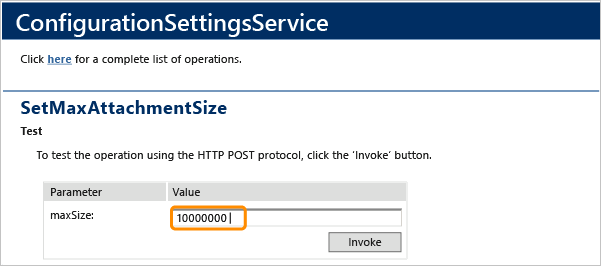

# Change the maximum attachment size for work items

[!INCLUDE [temp](../../_shared/version-header-tfs-only.md)]

By default, Azure DevOps and Team Foundation Server (TFS) limit the size of work item attachments to 4 MB. For on-premises deployments, you can use the web service to increase the size of files you attach to up to 2GB. 
  
1.  If you're not a member of the TFS **Administrators** group, [get added as one](../../organizations/security/set-project-collection-level-permissions.md).    
  
2.  Log on to the application-tier server for TFS.  
  
3.  In a supported web browser, open the following URL:  
  
     `http://localhost:8080/tfs/DefaultCollection/WorkItemTracking/v1.0/ConfigurationSettingsService.asmx?op=SetMaxAttachmentSize`  
  
     If the project resides on a different project collection, specify the name of the collection in place of *DefaultCollection*.  
  
4.  Enter the size in bytes, and then choose **Invoke**.  
  
       
  
     The maximum size you can specify is 2 gigabytes (or `2000000000`).  

## Alternative solutions to increasing the attachment size   

Increasing the attachment size increases the amount of data in storage and the time it takes to save a work item. To work around the size limit, add the attachment to source control and [add a link in the work item to the source control file](../../boards/queries/link-work-items-support-traceability.md) using the *Versioned Item* link type.  

## Federal Information Processing Standard (FIPS) exception

If you receive an error message similar to the one listed below, you may need to disable the FIPS service in order to avoid the exception. To learn more, see [System cryptography: Use FIPS compliant algorithms for encryption, hashing, and signing" security setting effects in Windows XP and in later versions of Windows](https://support.microsoft.com/en-us/help/811833/system-cryptography-use-fips-compliant-algorithms-for-encryption-hashi). 

```
Application: csc.exe
Framework Version: v4.0.30319
Description: The process was terminated due to an unhandled exception.
Exception Info: System.InvalidOperationException
   at System.Security.Cryptography.SHA256Managed..ctor()

Exception Info: System.Reflection.TargetInvocationException
   at System.RuntimeMethodHandle.InvokeMethod(System.Object, System.Object[], System.Signature, Boolean)
   at System.Reflection.RuntimeConstructorInfo.Invoke(System.Reflection.BindingFlags, System.Reflection.Binder, System.Object[], System.Globalization.CultureInfo)
   at System.Security.Cryptography.CryptoConfig.CreateFromName(System.String, System.Object[])
   at System.Security.Cryptography.SHA256.Create()
   at Microsoft.CodeAnalysis.CommandLine.DesktopBuildClient.GetBasePipeName(System.String)
   at Microsoft.CodeAnalysis.CommandLine.DesktopBuildClient.GetPipeNameForPath(System.String)
   at Microsoft.CodeAnalysis.CommandLine.DesktopBuildClient.GetSessionKey(Microsoft.CodeAnalysis.CommandLine.BuildPaths)
   at Microsoft.CodeAnalysis.CommandLine.BuildClient.RunCompilation(System.Collections.Generic.IEnumerable`1<System.String>, Microsoft.CodeAnalysis.CommandLine.BuildPaths, System.IO.TextWriter)
   at Microsoft.CodeAnalysis.CommandLine.DesktopBuildClient.Run(System.Collections.Generic.IEnumerable`1<System.String>, System.Collections.Generic.IEnumerable`1<System.String>, Microsoft.CodeAnalysis.CommandLine.RequestLanguage, Microsoft.CodeAnalysis.CommandLine.CompileFunc, Microsoft.CodeAnalysis.IAnalyzerAssemblyLoader)
   at Microsoft.CodeAnalysis.CSharp.CommandLine.Program.Main(System.String[], System.String[])
   at Microsoft.CodeAnalysis.CSharp.CommandLine.Program.Main(System.String[])
```

  
## Related articles

- [Requirements and compatibility, Supported web browsers](/azure/devops/server/compatibility#supported-browsers)
