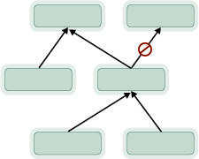

# LinkTypes elements reference 

[!INCLUDE [temp](../../_shared/version-vsts-tfs-all-versions.md)]

> [!IMPORTANT]  
>This topic provides a reference of link types defined for Azure DevOps Services and TFS. For the On-premises XML process model, you can add custom link types. Custom link types are not supported for Hosted XML or Inheritance process models. For an overview of process models and supported customizations, see [Customize your work tracking experience](../customize-work.md).  

You use different link types to form link relationships between different work item types (WITs). There are three categories of link types: system-defined, process-defined, and user-defined or custom. The link types defined in the default processes support link relationships among the test management WITs.  
  
Each link type defines the link labels, topology type, and restrictions that are used when links between work items are constructed. For example, the parent-child link type defines two labels (Parent and Child), supports a hierarchical or tree topology, and prevents circular references from being created between work items.  
  
You can customize an existing link type or create a link type to meet your project tracking requirements. Before you start to add or modify a link type, you should assess the link types available and how they are used in your project. See [Manage dependencies, link work items](../../boards/queries/link-work-items-support-traceability.md). Links are added through the work item form, which contains the links control. See [Link controls, restrictions, and fields](../../boards/queries/linking-attachments.md).  

> [!NOTE]  
>  You cannot customize the system-defined link types that correspond to the Related, Parent-Child, and Successor-Predecessor links.  
  
You may want to modify or create a link type for one of the following reasons:  
  
-   Change the link labels that are used to match your team's naming conventions.  
-   Add a link type to track a particular relationship that is unique to your team's process.  


The link type is specified in a type definition XML file that you import to a project collection. To customize or create a link type, use **witadmin importlinktype** to import the link type definition file to the project collection that hosts your project. With the **witadmin** command-line tool, you can deactivate, delete, export, import, list, and reactivate link types. See [Manage link types](../witadmin/manage-link-types.md).   

<a name="SyntaxStructure"></a>   
##  Syntax structure  
You can define additional link types by adding them to the link types that are defined for a project collection. 

You can define valid link types for use in your process based on the structure that the link type definition schema provides. A link type is defined by the following XML syntax in the link types XML file.  
  
> [!div class="tabbedCodeSnippets"]
```XML 
<LinkTypes>  
      <LinkType ReferenceName="LinkTypeName" ForwardName="ForwardName" ReverseName="ReverseName" Topology="TopologyType" />  
</LinkTypes>  
```  

The descriptions in the following table apply to the previous syntax:

|Attribute | Description |
|---|---|
|*ReferenceName*&#160;&#160;&#160;&#160;|Name of the link type. This name is used internally when you create a link between two work items.|
|*ForwardName*|Name of the link at the source work item. This name appears when you add links to the source work item.|
|*ReverseName*|Name of the link at the target work item. This name appears when a listing of the links at the target work item appears.|
|*TopologyType*|Specifies the **DirectedNetwork**, **Network**, **Tree**, or **Dependency** [topology](#topology). The first three topologies are directional, and you use them to define subordinate or sequential relationships. You use **Network** to define relationships between peers or where no implied subordination exists.|

Link directionality is determined by the assignments made to the **ForwardName** and **ReverseName** attributes. If you create a custom link and assign the same name to the forward and reverse names, you should set the link type to **Network** because it is the only non-directional topology.

<a name="Requirements"></a>
### Requirements

Each link type has a reference name and two optional friendly names, or name labels, which must be unique within the project collection. Each link type name must meet the following requirements:

-   Names can have up to 254 Unicode characters  
-   Names must not be empty  
-   Names cannot have leading or trailing white spaces  
-   Names cannot contain backslash (\\) characters  
-   Names cannot contain two consecutive white spaces.


<a id="topology"></a>
### Link type topologies and restrictions 

The topology types described in the following table determine the restrictions placed on the usage of each link type.


<table width="100%"> 
<tbody valign="top">
<tr>
<th width="55%">Topology type</th>
<th width="45%">Illustration</th>

</tr>
<tr>
<td><p>**Dependency**: You can use dependency links to create relationships between work items that have directionality and to restrict circular relationships. The link name is different at the end points.</p><p>**Example usage**: Use a dependency link to record the features that must be completed to deliver a user requirement. You can't create a dependent link between two work items that are linked to the same work items via dependent links. </p></td>
<td> </td>
</tr>


<tr>
<td><p>**Directed Network**: You can use directed network links to create relationships between work items that indicate directionality. The link name is different at the end points. Circular relationships are allowed.</p>
<p>**Example usage**: Use a directed network link to record a relationship between two features that might share dependencies and which you want to distinguish from each other in some way.  </p></td>
<td></td>
</tr>

<tr>
<td><p>**Network**: You can use network links to create basic relationships between work items that are non-restrictive. The link is the same at both end points. Circular relationships are allowed.</p>
<p>**Example usage**: Use a network link, such as Related, to record a relationship between two features that might share dependencies.</p></td>
<td></td>
</tr>

<tr>
<td><p>**Tree**: You can use tree links to create hierarchical relationships among work items. Tree links support multi-level hierarchical views, have directionality, and restrict circular relationships. The link name is different at the end points. Tree links are the only type of link that is supported by the **Tree of Work Items** query. With Parent/Child links, you can't assign two parents to a child.</p>
<p>**Example usage**: Use a tree link to record tasks and subtasks from your team that must be completed to deliver a user story or backlog item. Or, [map backlog items to features, and features to epics](../../boards/backlogs/organize-backlog.md). </p></td>
<td></td>
</tr>

</tbody>
</table>
 

<a id="custom-link-type"></a>
## Create a custom link type 

> [!NOTE]    
>**Feature availability**: Creating a custom link type is only supported for the On-premises XML process model. You can't add custom link types when you use the Hosted XML process model.

To create a custom link type, define the link type XML definition file according to the syntax provided earlier in this topic, and then import it using  [**witadmin importlinktype**](../witadmin/manage-link-types.md). Each process-defined link type is associated with an XML definition file. These files are defined in the ```WorkItem Tracking\LinkTypes``` folder of the [process set of files and folders](../process-templates/customize-process.md). 

For example, the following syntax defines the Microsoft.VSTS.Common.TestedBy link type provided via the TestedBy.xml file:

> [!div class="tabbedCodeSnippets"]
```XML
<?xml version="1.0" encoding="utf-8"?>
<LinkTypes>
   <LinkType ReferenceName="Microsoft.VSTS.Common.TestedBy" ForwardName="Tested By" ReverseName="Tests" Topology="Dependency" />
</LinkTypes>
```

When you create or update a project, the link type definitions defined for the reference process are imported into the project collection.

## Test management links    
Using the web portal or Test Manager, you can view which test cases are defined for a test suite, and which test suites are defined for a test plan. However, these objects aren't linked to each other through link types.  


## Customize the links control 

In addition to defining link types, you can customize the work item type definition to accept or prohibit specific links based on link type. You use the `LinksControlOptions` element to define the options that control what links can be added to a work item and to which work item types. Also, you can specify the default columns that you want to appear for the list of links in a work item. For more information, see [Define link controls to restrict link relationships](define-link-controls.md).  

## Related articles  
-  [Link type reference](../../boards/queries/link-type-reference.md)
-  [Link work items to track dependencies](../../boards/queries/link-work-items-support-traceability.md)    
-  [Customizing your work tracking experience](../customize-work.md)

To programmatically interact with link types, see [Artifact Link Types API](/rest/api/azure/devops/wit/artifact%20link%20types/list).


 
  
