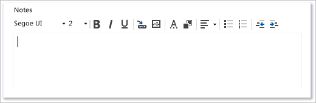

# Specify work item form controls

[!INCLUDE [temp](../../_shared/version-tfs-2013-2015.md)]

> [!IMPORTANT]  
>This topic applies to project customization for the On-premises XML process model. For the Hosted XML process model, see [WebLayout and Control elements](weblayout-xml-elements.md). For the Inheritance process model, see [Customize a process](../../organizations/settings/work/customize-process.md).
>
>For an overview of process models, see [Customize your work tracking experience](../customize-work.md).  

For each field or form control that you want to display on a work item form, you add a `Control` element. You can customize a work item form to display information to help your team use the form correctly. You can add the work item fields and controls that enable you to enter and view the data that you want to track.  
  
 The `Control` element provides several data-type values for the `Type` attribute that you can use to add fields or to display plain or hyperlinked text or fields. In addition, you can define special controls to add links and attachments, display Web-based content, or create your own control and add it to a work item form.

You can control the label name, position, size of text box, and other display controls of plain text, integer, number, date, and tree path work item fields on your work item form. To display these fields, you must specify the correct `Control` element `Type` attribute, from the following options:  

-   `FieldControl`: Used to display plain textual or numeric fields and lists of values for fields that have a field type of `Boolean`, `String`, `Identity`, `Integer`, `Double`, and `PlainText`.  
  
-   `HtmlFieldControl`: Used to display multiline, rich-text format of fields that have a field data type of `HTML`.  
  
-   `DateTimeControl`: Used to display formatted date fields that have a field type of `DateTime`.  
   
-   `WorkItemClassificationControl` Used to display the hierarchical path fields that have a field type of `TreePath`.  
  
  
<a name="fields"></a>
##Add work item fields  
 When you customize your work item form, you typically add a subset of the work item fields that are defined for the work item type that you want to appear on the form. The field definitions control many aspects of which data displays or which data that you can enter into the form. For more information, see [Modify a field or add a custom field](../add-modify-field.md).  
  
 Each work item field is associated with a data type. Use the `Label` attribute to specify the text that displays next to the control. Use the related `LabelPosition` attribute to specify where the label appears relative to the control.  
  
> [!NOTE]  
> You can't change the values of system fields, which are updated automatically. For example, the Created Date and Created By fields are defined when a work item is first saved. However, you can use these fields in search criteria.  For a description of each system field, see [Work item field index](../../boards/work-items/guidance/work-item-field.md). 


## Add a numeric field  

Use `FieldControl` to provide a control field for an Integer field.

```xml
<Control FieldName="System.Id" Type="FieldControl" Label="Id" LabelPosition="Left" />
```  

Use `FieldControl` to provide a text field for the input or display of Double fields.

```xml
<Control FieldName="ABC_Company.Statistics.Analysis" Type="FieldControl" Label="Analysis %" LabelPosition="Left" />
```  

## Add a plain text or string field  

Specify the `String` control when you want to add a string field, such as used in pick lists or short text, that is limited to 255 characters. 

```xml
<Control FieldName="Microsoft.VSTS.DocName" Type="FieldControl" Label="Vision Doc Location" LabelPosition="Left" />
```

Specify the `PlainText` control when you want to capture text that contains descriptions that may be larger than 255 characters.
  
```xml
<Control FieldName="System.Title" Type="FieldControl" Label="Title" LabelPosition="Left" />
``` 


<a id="boolean-field">  </a>
### Add a checkbox or Boolean field 

> [!NOTE]    
>**Feature availability:**The Boolean data type is supported for Hosted XML (Azure DevOps Services) and for On-Premises XML, for TFS 2017.2 and later versions. 

Use the following syntax to add a Boolean field within the **FIELDS** section of the WIT definition. 

```xml
<FIELD name="Triage" refname="Fabrikam.Triage" type="Boolean" >
  <DEFAULT from="value" value="False" />
  <HELPTEXT>Triage work item</HELPTEXT>
</FIELD>
```

And then add the following syntax within the **FORM** section to have the field appear on the form. 

```xml
<Control Label="Triage" Type="FieldControl" FieldName="Fabrikam.Triage" /> 
```
 
The field will appear as a checkbox on the form. 


 
<a name="Date"></a> 
##Add Date or Calendar fields  
You use the `DateTimeControl` type to give users a calendar picker to select a date for a `DateTime` field. By using this control, you can quickly select a date and time for the field.  
 
**Calendar Field with Format="Short"**  
  
  
For example, you can specify a preferred start date or a review date that is in the future.  
  
```xml
<Control Type="DateTimeControl" FieldName="MyCompany.EnvironmentCR.PreferredStart"  
Label="Preferred Start Date:" LabelPosition="Left" Format="Short" />  
<Control Type="DateTimeControl" FieldName="MyCompany.EnvironmentCR.PreferredStartTime"  
Label="Preferred Start Time:" LabelPosition="Left" Format="Time" />  
```  
  
 You can control the format of the `DateTime` field by using the optional attributes that are described in the following table.  
  
|Attribute|Description|  
|---------------|-----------------|  
|`Format`|Specifies the format for the date-time field that corresponds to one value of the DateTimePickerFormat enum. Valid values are as follows: `Custom`, `Long`, `Short`, `Time`.<br /><br /> When you specify `Custom`, you must also set the `CustomFormat` attribute.|  
|`CustomFormat`|Specifies the custom format that is used for the date-time field that corresponds to the syntax that is defined for the DateTimePicker.CustomFormat property. For example:<br /><br /> Format="Custom"<br /><br /> CustomFormat = "MMM dd, 'of the year' yyyy"<br /><br /> For more information, see the Microsoft Web site: [DateTimePicker.CustomFormat Property](http://go.microsoft.com/fwlink/?LinkId=148757).|  
 

## Add a rich-text (HTML) field  

Specify the `HTMLControl` to add an `HTML` field to capture rich-text formatting, as shown in the following illustration.

`<Control Type="HtmlFieldControl" FieldName="Microsoft.VSTS.Notes" Label="Notes" Dock="Fill" />`  



> [!TIP]  
>  When you add several `HTMLFieldControl` elements on a form that will be stacked vertically, you should specify the `MinimumSize` attribute for each field control. In this manner, you can make the text boxes all a similar size. Otherwise, the last HTML control element is sized to fill the form, and the previous elements appear together with smaller text boxes.  

## Add a plain or hyperlinked text control 

Use the `LabelControl` to display plain or hyperlinked text that is not associated with a field, as shown in the following illustration.

You use the `LabelText` and `Link` child and container elements to specify the text, hyperlink, and position of a field or label whose text is partly associated with a hyperlink. For more information, see [Provide help text, hyperlinks, or web content](provide-help-text-hyperlinks-web-content-form.md), [LabelText and Text](labeltext-and-text-xml-elements-reference.md), and [Link and Param](link-param-xml-elements-reference.md).


 

## Add a web page control  
Use `WebpageControl`to display Web content in a work item form. This control is usually contained in its own tab group. You use the `WebpageControlOptions` and `Link` child elements to specify the controls that are required to load the Web page target in the work item form.

For more information, see [Edit a WIT definition to add web content to a work item form](edit-wit-definition-add-web-content-form.md), [WebpageControlOptions](webpagecontroloptions-xml-elements-reference.md), and [Link and Param](link-param-xml-elements-reference.md).  
  

## Add a links control 

You use `LinksControl` to create and manage links between work items. This control is usually contained in its own tab group, as shown in the following illustration.


You can also use the `LinksControlOptions` to define the link filters and layout of column fields that are used to display the list of links. For more information, see [Define link controls to restrict link relationships](define-link-controls.md) and [LinksControlOptions](linkscontroloptions-xml-elements.md).

## Add a Storyboards control 

Use the `StoryboardsControl` to open PowerPoint Storyboarding from a work item and link to Storyboard files saved to a network share. This control is usually contained in its own tab group, as shown in the following illustration.


To add the `StoryboardsControl` to the `FORM` section, add the following code snippet:

```xml
<Tab Label="Storyboards">
     <Control Name="StoryboardsControl" Type="LinksControl">
        <LinksControlOptions>
           <WorkItemLinkFilters FilterType="excludeAll" />
           <ExternalLinkFilters FilterType="include">
              <Filter LinkType="Storyboard" />
           </ExternalLinkFilters>
           <LinkColumns>
              <LinkColumn RefName="System.Title" />
              <LinkColumn LinkAttribute="System.Links.Comment" />
           </LinkColumns>
        </LinksControlOptions>
     </Control>
  </Tab>
```
  
 
<a name="AreaIteration"></a> 
## Add area and iteration paths (TreePath control)   
 
You use the `WorkItemClassificationControl` type to add fields whose data type is `TreePath`. This control provides support to display area path fields and iteration path fields in a hierarchical, nested tree format. The tree shows hierarchical nodes that you can expand and collapse.  
  
```xml
<Control Type="WorkItemClassificationControl" FieldName="System.AreaPath" Label="Area"LabelPosition="Left" />  
```  
  
> [!NOTE]  
>  You can use the `WorkItemClassificationControl` to display the `System.AreaPath` and `System.IterationPath` fields. You cannot display any other type of field or custom field by using this control.  


## Add the history control  

You use the `WorkItemLogControl` to provide a control field for the History field that tracks discussion threads and other historical information, as shown in the following illustration.


You can use this control only to support the display of the history field of a work item, the System.History work item field. By using this control, you can expand and collapse details about historical revisions to a work item. You can also format text that you add to the history field.

```xml
<Control Type="WorkItemLogControl" FieldName="System.History" Label="Detailed Description and History" LabelPosition="Top" Dock="Fill" />
```  

## Add the attachment control  

Use the `AttachmentsControl` to attach files to a work item form. This control is usually contained in its own tab group, as shown in the following illustration.


For more information, see [Add the Attachments control](add-the-attachments-control.md).

  
## Related articles

<a name="custom"></a> 
In addition to the built-in controls provided, you may find additional controls you can use from the [Visual Studio Marketplace](https://marketplace.visualstudio.com/search?target=AzureDevOps&category=Azure%20Boards&visibilityQuery=all&sortBy=Downloads). Or, you can create your own control. See [Extend the work item form](../../extend/develop/add-workitem-extension.md). 

-  [Control XML element reference](control-xml-element-reference.md)    
-  [WebLayout and Control elements](weblayout-xml-elements.md)     
-  [Change the work item form layout](change-work-item-form-layout.md)   
-  [Edit a WIT definition to add web content to a work item form](edit-wit-definition-add-web-content-form.md)
-  [Provide help text, hyperlinks, or web content](provide-help-text-hyperlinks-web-content-form.md)   
-  [Define link controls to restrict link relationships](define-link-controls.md)   
-  [Add the Attachments control](add-the-attachments-control.md)  
 
 

<a name="Labeling">  </a> 
###  Label fields and add fields in two places on the form  
 For each form control, you can specify an optional label and the position of the label by using the `Label` and `LabelPosition` attributes. The label can specify a different name than the friendly name that is assigned by the `FIELD` element. If you do not specify a label, the friendly name is used. However, note that the friendly name is always used when a team member runs a query to search for work items. The maximum label size is 80 characters.  
  
> [!NOTE]  
> You must define the same label position to all controls that are defined in the same group.  
  
If you want to add the field in more than one area of the form, such as on the top of the form and on a tab, you can do so by using the `Name` attribute. The `Name` attribute just identifies the control as distinct from the other control that is added to the form.  
  
<a name="ReadOnly"></a> 
### Make a field Read-Only  
You can mark a field as read-only in one of two ways. In the first method, you add the `READONLY` element as a child to the `FIELD` element in the `FIELDS` section of the type definition. By using the `READONLY` element, you can specify whether certain users can modify the field. As shown in the following example, only program managers can modify a Sub-Title field.  
  
```xml
<FIELD name="Sub-Title" refname="ACME.ACE.SubTitle" type="String" >  
<READONLY for="[Global]\Team Foundation Valid Users" not="Program Managers"/>  
</FIELD>  
  
```  
 
In the second method, you specify the `ReadOnly` attribute for the `CONTROL` element. In this method, all users are restricted from modifying the field.  
  
```xml
<Control FieldName=" ACME.ACE.SubTitle" Type="FieldControl" Label="Sub-Title" LabelPosition="Left" ReadOnly="True" />  
  
```  

<a name="Size"></a> 
 
### Optional control element field attributes for all control types  
 The following optional attributes can be specified only for those control types that are listed.  

> [!NOTE]  
> The overall size of each data entry field is determined by several factors: the attributes that are assigned to the field, the size of the container, and the area that is allocated to other fields on the form. Default values are assigned to fields when you do not specify a minimum size. However, attributes that are assigned to other fields in the form can affect the size of fields. The number of columns and the horizontal size that you allocate to the largest field in each column determine the horizontal dimension of a form. The number of fields that you specify in a vertical group and the vertical size that you allocate to each field determine the size of the top of the form and also the size of the bottom of the form.  

  
|Attribute|Description|  
|---------------|-----------------|  
|`Field`|Specifies the control that is associated with the work item field.|  
|`Label`|Specifies the visible text on the form that identifies the control. Specify a string of no more than 80 characters.<br /><br /> **Note:** You can attach a hyperlink to the label of a field that is added to the work item form by using `FieldControl`. This control is useful for providing a link to information about how the field is used. For more information, see [Provide help text, hyperlinks, or web content](provide-help-text-hyperlinks-web-content-form.md).|  
|`LabelPosition`|Specifies the position of the label that is relative to the control data. Specify a string from one of the following values: `Top`, `Bottom`, `Left`, and `Right`.|  
|`Dock`|Specifies the alignment of the label with the specified side of the container, or stretches the field to fill the container. Specify a string from one of the following values: `Fill`, `Top`, `Bottom`, `Left`, and `Right`.|  
|`Padding`|Specifies the amount of space, in pixels, around the inside border of the control. Four values are provided that correspond to the top, bottom, left, and right. For example: (2,0,2,0).|  
|`Margin`|Specifies the amount of space, in pixels, around the outside border of the control. Four values are provided that correspond to the top, bottom, left, and right. For example: (2,0,2,0).|  
|`ReadOnly`|Specifies that the field is read-only. Specify `True` or `False`.|  
|`MinimumSize`|Specifies the minimum size, in pixels, that the control should occupy in the form. Two values are specified that correspond to the width and height. For example: (100,100).|  
|`Name`|Uniquely identifies a control. The `Name` attribute is required if more than one control on the form is associated with the same work item field.<br /><br /> **Note:** You use the `Name` attribute to display the same field in more than one area on the form. You specify a unique value for the `Name` attribute for both control entries so that the system identifies each control uniquely. It is useful to show the same control in various locations based on the context of tabs.|  
  
### Optional control element field attributes for specific control types  
 The following optional attributes can be specified only for those control types that are listed.  
  
|Attribute|Control types|Description|  
|---------------|-------------------|-----------------|  
|`NumberFormat`|`FieldControl`|Specifies the characters that you can enter in the field control. The following values are valid: `WholeNumbers`, `SignedWholeNumbers`, `DecimalNumbers`, and `SignedDecimalNumbers`.|  
|`MaxLength`|`FieldControl`|Specifies the maximum length of characters that you can use for a field control.|  
|`Format`|`DateTimeControl`|Specifies the format for the date-time field that corresponds to one value of the DateTimePickerFormat enum. The following values are valid: `Custom`, `Long`, `Short`, `Time`.|  
|`CustomFormat`|`DateTimeControl`|Specifies the custom format that is used for the date-time field that corresponds to the syntax that is defined for the DateTimePicker.CustomFormat property.|  
  
  
