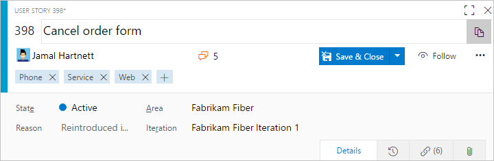

# WebLayout and Control elements  

[!INCLUDE [temp](../../_shared/version-header-hosted-plus-tfs.md)]

You use the **WebLayout** element to define the layout and controls that appear on work item forms displayed through the web portal. It supports the [new work item experience](../process/new-work-item-experience.md). It is in addition to the [**Layout** element](all-form-xml-elements-reference.md) which defines the form elements that appear when viewed through Visual Studio and other non-web clients.

> [!IMPORTANT]  
> This topic applies to project customization for Hosted XML and On-premises XML (TFS 2017 and later versions) process models. For TFS 2015 and earlier versions, see [Layout XML element reference](layout-xml-element-reference.md). 
>
> For the Inheritance process model, see [Customize a process](../../organizations/settings/work/customize-process.md). For an overview of process models, see [Customize your work tracking experience](../customize-work.md).  

The **WebLayout** element is a required child element of the **FORM** element. This topic documents the **WebLayout** element and its child elements. Use this as a guide to further customize a WIT definition that contains the new **WebLayout** section. To learn more about these changes, see the blog post, [Announcing the deprecation of the old Work Item Form in TFS](https://blogs.msdn.microsoft.com/devops/2017/05/22/announcing-the-deprecation-of-the-old-work-item-form-in-tfs/).

<a id="customize"></a>
To modify the web layout, use the information provided in this topic to modify the XML definition file for a specific work item type. To import and export your changes, see [Customize the work tracking web form](../customize-wit-form.md).     

To customize the windows client layout, see [Layout XML element](layout-xml-element-reference.md).  

## Enablement of the new form and WebLayout section

When the new form roll out is enabled, the XML definitions for all work item types (WITs) in the collection are updated to include a **WebLayout** section within the **FORM** section.  

The new form makes available several new features as described in [New work item experience](../process/new-work-item-experience.md). Your account or project collection administrator manages the [switch to the new form](../manage-new-form-rollout.md).  
- For the [Inheritance process model](../../organizations/settings/work/manage-process.md), the switch to the new form is automatic for all user accounts.  
- For the [Hosted XML process model](../../organizations/settings/work/import-process/import-process.md), an admin must [enable the new form](../manage-new-form-rollout.md). <br/>
- For TFS 2017, the new form is automatically available when you add projects to a new collection. For existing projects, an admin must [enable the new form](../manage-new-form-rollout.md). <br/>
- For TFS 2015 the new form isn't available. You must [upgrade to TFS 2017 or a later version](https://visualstudio.microsoft.com/downloads/) to access the new form.
 

## Element and attribute summary

The **WebLayout** and updated **Control** elements introduce several new elements and deprecate several elements and attributes. Overall, it's a much simpler syntax structure than its predecessor. 

> [!div class="mx-tdBreakAll"]  
> |New elements  |Maintained elements  |Deprecated elements  |Deprecated attributes  |
> |-------------------------|--------------------|----------------------|----------------------|
> |- ControlContribution<br/>- GroupContribution<br/>- Input<br/>- Inputs<br/>- Page<br/>- PageContribution<br/>- Section<br/>- SystemControls<br/>- WebLayout|- FORM<br/>- Layout<br/>- Group<br/>- Control |- Column<br/>- Splitter<br/>- Tab<br/>- TabGroup |- ControlSpacing<br/>- FixedWidth<br/>- LabelPosition<br/>- LabelSpacing<br/>- Margin<br/>- MinimumSize<br/>- Padding<br/>- PercentWidth |


> [!TIP]  
> The **Page** element is similar to the deprecated **Tab** element. However, a **Page** element can't be grouped or nested. One page defines one tab within the web form.  

<a id="header-customization" />
## Header customization

In the new web form layout, the system manages several header elements within the **SystemControls** element. These include: 
- **Fields**: Work item ID, Title, Assigned To, State, Reason, Area Path, Iteration Path, and tags
- **Pages**:  History,  Links, and  Attachments.  



When you export a WIT definition, you'll see a **SystemControls** section at the beginning of the **WebLayout** section, similar to the following:

> [!div class="tabbedCodeSnippets"]
```XML
<WebLayout ShowEmptyReadOnlyFields="true"> 
    <SystemControls>
      <Control Type="FieldControl" FieldName="System.Title" EmptyText="Enter title" />
      <Control Label="Assi&amp;gned To" Type="FieldControl" FieldName="System.AssignedTo" />
      <Control Label="Stat&amp;e" Type="FieldControl" FieldName="System.State" />
      <Control Label="Reason" Type="FieldControl" FieldName="System.Reason" />
      <Control Label="&amp;Area" Type="WorkItemClassificationControl" FieldName="System.AreaPath" />
      <Control Label="Ite&amp;ration" Type="WorkItemClassificationControl" FieldName="System.IterationPath" />
      <Control Label="History" Type="WorkItemLogControl" FieldName="System.History" />
      <Control Label="Links" Type="LinksControl" Name="Links" />
      <Control Label="Attachments" Type="AttachmentsControl" Name="Attachments" />
    </SystemControls>
...
```

> [!NOTE]  
> The [**Link** element](link-param-xml-elements-reference.md) is not an allowed element within the **SystemControls** section. 


**For TFS 2017, On-premises XML process model**:  You can modify select elements within the **SystemControls** section, such as changing the *EmptyText* attribute value for the **System.Title** field. In general, we recommend you don't customize this section much more than that. For example, you can't remove fields from or add other fields within this section.  

**For TFS 2018, On-premises XML and Azure DevOps Services, Hosted XML process models**:  You can specify the **ShowEmptyReadOnlyFields** attribute, or select to hide or replace select fields defined within the **SystemControls** section.  

For example, to hide the Reason field, you modify the **Control** element with the `Visible` attribute.
   
> [!div class="tabbedCodeSnippets"]
```XML
<Control Label="Reason" Type="FieldControl" FieldName="System.Reason" Visible="false" />
```

To replace the Reason field with another field, use the `Replaces` attribute. Also, remove the entry for the Reason field from within the section. 


> [!div class="tabbedCodeSnippets"]
```XML
<Control Label="Milestone" Type="FieldControl" FieldName="Fabrikam.Milestone" Replaces="System.Reason" />
```

You can hide or replace the Reason, Area Path, and Iteration Path fields. You can add these fields, if you want, to the Details page, or other custom page. You can't hide or replace the Title, Assigned To, or State fields. 

 

## WebLayout example

The following example shows the overall structure of the **WebLayout** section within the **FORM** section. The  **WebLayout** specifies a **Control** element for each field you want to have appear on the form. 

You group elements to appear within a **Page** by using the **Section** and **Group** elements. You use a **Control** element to define each field or control that you want to appear on the form.  

The following example specifies the syntax for the Details page shown previously in this topic. 

> [!div class="tabbedCodeSnippets"]
```XML
<FORM>
. . .
  <WebLayout>
       <SystemControls>
	      <Control Type="FieldControl" FieldName="System.Title" EmptyText="Enter title" />
	      <Control Label="Assi&amp;gned To" Type="FieldControl" FieldName="System.AssignedTo" />
	      <Control Label="Stat&amp;e" Type="FieldControl" FieldName="System.State" />
	      <Control Label="Reason" Type="FieldControl" FieldName="System.Reason" />
	      <Control Label="&amp;Area" Type="WorkItemClassificationControl" FieldName="System.AreaPath" />
	      <Control Label="Ite&amp;ration" Type="WorkItemClassificationControl" FieldName="System.IterationPath" />
	      <Control Label="History" Type="WorkItemLogControl" FieldName="System.History" />
	      <Control Label="Links" Type="LinksControl" Name="Links" />
	      <Control Label="Attachments" Type="AttachmentsControl" Name="Attachments" />
        </SystemControls>
	<Page Label="Details" LayoutMode="FirstColumnWide">
		<Section>
		  <Group Label="Description">
             <Control Label="Description" Type="HtmlFieldControl" FieldName="System.Description" />
          </Group>
		</Section>
		<Section>
      <Group Label="Planning">
          <Control Label="Story Points" Type="FieldControl" FieldName="Microsoft.VSTS.Scheduling.StoryPoints" />
          <Control Label="Priority" Type="FieldControl" FieldName="Microsoft.VSTS.Common.Priority" />
        </Group>
        <Group Label="Classification">
          <Control Label="Value area" Type="FieldControl" FieldName="Microsoft.VSTS.Common.ValueArea" />
        </Group>
      </Section>
      <Section>
        <Group Label="Development">
          <Control Type="LinksControl" Name="Development">
            <LinksControlOptions ViewMode="Dynamic" ZeroDataExperience="Development" ShowCallToAction="true">
              <ListViewOptions GroupLinks="false">
              </ListViewOptions>
              <LinkFilters>
                <ExternalLinkFilter Type="Build" />
                <ExternalLinkFilter Type="Pull Request" />
                <ExternalLinkFilter Type="Branch" />
                <ExternalLinkFilter Type="Fixed in Commit" />
                <ExternalLinkFilter Type="Fixed in Changeset" />
                <ExternalLinkFilter Type="Source Code File" />
              </LinkFilters>
            </LinksControlOptions>
          </Control>
        </Group>
       <Group Label="Related Work">
          <Control Type="LinksControl" Name="Related Work">
            <LinksControlOptions>
              <LinkFilters>
                <WorkItemLinkFilter Type="System.LinkTypes.Hierarchy-Reverse" />
                <WorkItemLinkFilter Type="System.LinkTypes.Hierarchy-Forward" />
                <WorkItemLinkFilter Type="System.LinkTypes.Related" />
              </LinkFilters>
              <Columns>
                <Column Name="System.State" />
                <Column Name="System.ChangedDate" />
                <Column Name="System.Links.Comment" />
              </Columns>
            </LinksControlOptions>
          </Control>
        </Group>
      </Section>
    </Page>
  </WebLayout>
</FORM>
```


<a id="weblayout-element">  </a>  

## WebLayout element syntax

You can specify how information and work item fields are grouped and appear in a work item form using the elements that are described in the following table.

> [!div class="tabbedCodeSnippets"]
```XML
<WebLayout ShowEmptyReadOnlyFields="true | false">
   ...
</WebLayout>
```

  
### Attributes  
  
|Attribute|Description|  
|---------------|-----------------|    
|`ShowEmptyReadOnlyFields`|Optional `WebLayout` attribute. Specify a value of `true` to display read-only and empty fields (default), and `false` to hide these fields.|  


### Nest elements 

Within a **Page** element within the **WebLayout** element, you can nest the following elements: 

- **Page** elements within a single **WebLayout** element  
- **Section** elements within a **Page**  element, limit the number of **Section**  elements to four within a **Page**  
- **Group** elements within a **Section** element  
- **Control** elements within a **Group** element.  
 
Within a **PinnedControls** element within the WebLayout element, you can nest the following elements (requires TFS 2018 (RC2) or Hosted XML process model): 

- **Section** elements within a single **PinnedControls** element, limit the number of **Section** elements to three 
- **Control** elements within a **Section** element, limit the number of **Control** elements to three  

> [!TIP]  
> The schema definition for work item tracking defines all **FORM** child elements as camel case and all other elements as all capitalized. If you encounter errors when validating your type definition files, check the case structure of your elements. Also, the case structure of opening and closing tags must match according to the rules for XML syntax. For more information, see [Control XML element reference](control-xml-element-reference.md).    


<table width="100%" >
<thead>
<tr>
<th>Element</th>
<th>Description</th>
</tr>
</thead>
<tbody valign="top">
<tr>
	<td>**Control**</td>
	<td>Optional child element for a **Group** within **WebLayout**. Defines a field, text, hyperlink, or other control element to appear on the work item form.
<pre><code>&lt;Control FieldName=&quot;FieldName&quot; Type=&quot;DateTimeControl | ExtensionsControl | 
FieldControl | HtmlFieldControl | LabelControl | WebpageControl&quot; 
Label=&quot;LabelText&quot; EmptyText=&quot;TextString&quot;
ReadOnly=&quot;True | False&quot; Name=&quot;InstanceName&quot; /&gt;
</code></pre>

<p>See [Control element attributes](#control-attributes) and [control type](#control-types) for information about each attribute.</p></td>
</tr>


<tr>
	<td><p>**ControlContribution**</p></td>
	<td><p>Optional child element of **Group** within **WebLayout** used to specify a field-level work item extension to appear on the form.   </p>
<pre><code>&lt;ControlContribution Id="ContributionId" Label="Name"  &gt;
   &lt;Inputs&gt;
      &lt;Input Id="FieldName" Value="Value" /&gt;
   &lt;/Inputs&gt;
&lt;/ControlContribution&gt;
</code></pre>
<p>The *ContributionId* you specify must be installed on the account or project collection. The WIT definition files that you export contain a [list of installed contributions](#extensions).</p>
</td>
</tr>

<tr>
	<td><p>**Extension**</p></td>
	<td><p>Required child element for **Extensions**. Use to specify an extension ID of a work item control extension to display in the work item form. You must specify each extension that is used in the layout for a **ControlContribution**, **GroupContribution**, or **PageContribution** element. </p>
<pre><code>&lt;Extension Id="ExtensionId" /&gt;
</code></pre>

<p>The *ExtensionId* you specify must be installed on the account or project collection. The WIT definition files that you export contain a [list of installed extensions](#extensions).</p>
<p> </p>

</td>
</tr>

<tr>
	<td><p>**Extensions**</p></td>
	<td><p>Optional container child element of **WebLayout** used to support specifying one or more **Extension** elements. If extensions are used in the form, specify them prior to a **Page** element. </p>
<pre><code>&lt;WebLayout &gt;
   &lt;Extensions &gt;
       &lt;Extension Id="ExtensionId" /&gt;
      . . . 
   &lt;/Extensions &gt;
. . .
&lt;/WebLayout &gt;
</code></pre>

</td>
</tr>

<tr>
<td><p>**FORM**</p></td>
<td><p>Required child element of **WITD** used to specify the layout and controls to appear on the work item form. Parent element for both the **Layout** (client form layout) and **WebLayout** (web form layout) elements. </p>
<pre><code>&lt;FORM&gt;
      &lt;Layout&gt; . . . &lt;/Layout&gt;
      &lt;WebLayout&gt; . . . &lt;/WebLayout&gt;
&lt;/FORM&gt;</code></pre></td>
</tr>


<tr>
<td><p>**Group** </p></td>
<td><p>Required child element of **Section**. Provides a visual grouping of elements within a section which you can label. </p>
<pre><code>&lt;Group Label=&quot;LabelText&quot; 
   &lt;Control&gt; . . . &lt;/Control&gt;
&lt;/Group &gt;</code></pre></td>
</tr>

<tr>
	<td><p>**GroupContribution**</p></td>
	<td><p>Optional child element of **Section** within  **WebLayout** used to specify a group-level work item extension to appear on the form. The extension will appear as a group within the form.   </p>
<pre><code>&lt;GroupContribution Id="ContributionId" Label="Name" /&gt;
</code></pre>
<p>The *ContributionId* you specify must be installed on the account or project collection. The WIT definition files that you export contain a [list of installed contributions](#extensions).</p>
</td>
</tr>

<tr>
	<td><p>**Input**</p></td>
	<td><p>Required child element for **Inputs** that specifies input data for an extension.  </p>
<pre><code>&lt;Input Id="FieldName" Value="Value" /&gt;
</code></pre>
</td>
</tr>


<tr>
	<td><p>**Inputs**</p></td>
	<td><p>Optional container child element for **ControlContribution** used to support specification of input data for an extension.   </p>
<pre><code>&lt;Inputs&gt;
   &lt;Input Id="FieldName" Value="Value" /&gt;
&lt;/Inputs&gt;
</code></pre>
</td>
</tr>

<tr>
	<td><p>**Page**</p></td>
	<td><p>Required child element of **WebLayout**. Defines the layout of a page within the web form.  </p>
<p>Specify the name of the page and the layout to use. 
<pre><code>&lt;Page Label="PageName" LayoutMode="FirstColumnWide | EqualColumns "&gt;  
      &lt;Section&gt;  
	      &lt;Group&gt; . . . 
		      &lt;Control&gt; . . . &lt;/Control&gt;
		      &lt;Control&gt; . . . &lt;/Control&gt;
	      &lt;/Group&gt;
      &lt;/Section&gt;
&lt;/Page&gt;</code></pre>
</td>
</tr>

<tr>
	<td><p>**PageContribution**</p></td>
	<td><p>Optional child element of **WebLayout** used to specify a page-level work item extension to appear on the form. The extension will appear as a page within the form. </p>
<pre><code>&lt;PageContribution Id="ContributionId" Label="Name"  /&gt;
</code></pre>
<p>The *ContributionId* you specify must be installed on the account or project collection. The WIT definition files that you export contain a [list of installed contributions](#extensions).</p>
</td>
</tr>

<tr>
	<td><p>**Section**</p></td>
<td><p>Required child element of **Page**. Defines the layout of a section within a page of the web form. Sections form groups that [support variable resizing](../customize-wit-form.md#resizing). A limit of four sections can be defined within a **Page**. </p>
<pre><code>&lt;Page&gt;  
      &lt;Section&gt;  
	      &lt;Group&gt; . . . 
		      &lt;Control&gt; . . . &lt;/Control&gt;
		      &lt;Control&gt; . . . &lt;/Control&gt;
	      &lt;/Group&gt;
      &lt;/Section&gt;
&lt;/Page&gt;</code></pre>
</td>
</tr>


<tr>
<td>**SystemControls**</td>
<td><p>Required child element for **WebLayout**. Defines the labels and empty text values for controls present in the header of the web form . This also includes, the labels for the History, Links, and Attachments pages.</p>
<pre><code>&lt;SystemControls&gt;  
	&lt;Control Type="FieldControl" FieldName="System.Title" EmptyText="Enter title" /&gt; 
	&lt;Control Label="Assi&amp;gned To" Type="FieldControl" FieldName="System.AssignedTo" /&gt;
	&lt;Control Label="Stat&amp;e" Type="FieldControl" FieldName="System.State" /&gt;
	&lt;Control Label="Reason" Type="FieldControl" FieldName="System.Reason" /&gt;
	&lt;Control Label="&amp;Area" Type="WorkItemClassificationControl" FieldName="System.AreaPath" /&gt;
	&lt;Control Label="Ite&amp;ration" Type="WorkItemClassificationControl" FieldName="System.IterationPath" /&gt;
	&lt;Control Label="History" Type="WorkItemLogControl" FieldName="System.History" /&gt;
	&lt;Control Label="Links" Type="LinksControl" Name="Links" /&gt;
	&lt;Control Label="Attachments" Type="AttachmentsControl" Name="Attachments" /&gt;
&lt;/SystemControls&gt;</code></pre>

</td>
</tr>
<tr>
	<td>**WebLayout**</td>
	<td>Required child element of **FORM**. Defines the layout of the work item form displayed in the web portal. Includes one or more **Page** elements.
<pre><code>&lt;WebLayout&gt; 
      &lt;Page&gt;  
	      &lt;Section&gt;  
		      &lt;Group&gt; . . . 
			      &lt;Control&gt; . . . &lt;/Control&gt;
			      &lt;Control&gt; . . . &lt;/Control&gt;
		      &lt;/Group&gt;
	      &lt;/Section&gt;
      &lt;/Page&gt;
. . .
&lt;/WebLayout&gt;</code></pre>
</td>
</tr>
</tbody>
</table>


<a id="control-element">  </a>  
## Control element syntax 

You use the **Control** element to define a work item field, text, hyperlink, or other form type to display in a work item form. The **Control** element you specify within the **WebLayout** section should conform to the following syntax:


> [!div class="tabbedCodeSnippets"]
```XML
<Control FieldName="FieldRefName" Type="DateTimeControl | FieldControl | 
HtmlFieldControl | LabelControl | WebpageControl&quot; Label="LabelText" 
LabelPosition="Top | Bottom | Left | Right" EmptyText="TextString" 
ReadOnly="True | False" Name="InstanceName" [Visible="false" | 
FieldName="ReplacementFieldRefName" Replaces="FieldRefName"] />
```


<a id="control-attributes">  </a>
## Control element attribute syntax  


<table width="100%" >
<tbody valign="top" >
<tr>
<th>Attribute</th>
<th>Description</th>
</tr>
<tr>
<td><p><strong>FieldName</strong> </p></td>
<td>
<p>Optional. Specifies the work item field with which the control is associated. Specify the reference name of the field which should be between 1 and 70 characters. </p>
</td>
</tr>
<tr>
<td><p> <strong>Type</strong> </p></td>
<td><p>Required. Specifies the data type of the control. Specify a string from one of these built-in types: </p>
<ul>
<li><strong>DateTimeControl</strong>: Use to display formatted date fields with a field type of <strong>DateTime</strong>.</li>
<li><strong>FieldControl</strong>: Use to display Boolean, plain text, numeric fields, person-name fields, and pick lists. Supports fields with a data type of <strong>Boolean</strong>, <strong>Double</strong>, <strong>Identity</strong>, <strong>Integer</strong>,<strong>PlainText</strong>m and <strong>String</strong>.
<blockquote>**Feature availability:** The Boolean data type field is supported for TFS 2017 and later versions.    
</blockquote></li>
<li><strong>HtmlFieldControl</strong>: Use to display multi-line, rich-text format of fields with a field type of <strong>HTML</strong>.</li>
<li><strong>LabelControl</strong>: Use to display text that is not associated with a field. The text can be plain or hyperlinked. You can specify additional controls using the <strong>LabelText</strong>, <strong>Link</strong> and <strong>Text</strong> elements.</li>
<li><strong>WebpageControl</strong>: Use to display HTML-based content defined by a URI or embedded within a CDATA tag. This control does not have an associated field or field type. You specify the content and links to display using the <strong>WebpageControlOptions</strong> element.</li>
</ul>
</td>
</tr>

<tr>
<td><p><strong>EmptyText</strong> </p></td>
<td>
<p>Optional. Specifies a text string between 1 and 255 characters in length that appears when a field is empty.</p></td>
</tr>
<tr>
<td><strong>Label</strong></td>
<td>Optional. Specifies the visible text on the form that identifies the control. Specify a string of no more than 80 characters. If unspecified, the friendly name of the ```FieldName``` is used. </td>
</tr>
<tr>
</tr>

<tr>
<td><strong>ReadOnly</strong></td>
<td>Optional. Specifies that the field is read-only:
<ul>
<li><strong>True</strong>: Control field is read-only.</li>
<li><strong>False</strong>: Control field isn't read-only.</li>
</ul>
</td>
</tr>
<tr>
<td><p><strong>Name</strong> </p></td>
<td><p>Optional. Identifies a control uniquely. The <strong>Name</strong> is important if more than one control on the form is associated with the same work item field.  </p>
<blockquote><b>Note:</b> You use the <strong>Name</strong> attribute when you want to have the same field displayed on more than one **Page** on the form. You specify a unique value for the <strong>Name</strong> attribute for both control entries so that the system identifies each control uniquely.   
</blockquote>      
</td>
</tr>

<tr>
<td><strong>Visible</strong></td>
<td>Optional. Specify `Visible="false"` when you want to hide a field normally included within the header area. You can only specify this attribute in conjunction with the System.Reason, System.AreaPath, or System.IterationPath fields. If you specify this attribute, you can't specify the `Replaces` attribute. 
</td>
</tr>

<tr>
<td><strong>Replaces</strong></td>
<td>Optional. Specify `FieldName="ReplacementFieldRefName" Replaces="FieldRefName"` when you want to replace a field within the header area with another field. You can only specify this attribute in conjunction with the System.Reason, System.AreaPath, or System.IterationPath fields. If you specify this attribute, you can't specify the `Visible` attribute. Also, you need to remove the entry for the field you are replacing from within the section. 
</td>
</tr>

</tbody> 
</table>


<a id="control-types" />

## Control element Type attribute syntax


<table width="100%">
<tr>
<th>Type</th>
<th>Description</th>
</tr>
<tbody valign="top">
<tr>
<td>**DateTimeControl**</td>
<td>Use to display formatted date fields with a data type of `DateTime`. 
<p>Use `FieldControl` to provide a text field for the input or display of a DateTime field.</p>
<pre><code>&lt;Control FieldName=&quot; MyCompany.Group1.StartDate &quot; Type=&quot;FieldControl&quot; 
Label=&quot;Start Date&quot; LabelPosition=&quot;Left&quot; /&gt;
</code></pre>
<p>Use ```DateTimeControl``` to provide a calendar picker to select a date for a field, as shown in the following illustration.</p>
   
<pre><code>&lt;Control Type=&quot;DateTimeControl&quot; FieldName=&quot;FabrikamFiber.Schedule.SubmittedDate&quot; 
Label=&quot;Submitted Date:&quot; LabelPosition=&quot;Left&quot;  Format=&quot;Short&quot; /&gt;</code></pre>
<blockquote>**Note:**The date-time format displayed matches the [user profile user profile](/azure/devops/organizations/settings/set-your-preferences). The WebLayout section doesn't not accept the **Layout** element `CustomFormat` property.  
</blockquote>
</td>
</tr>

<tr>
<td>**FieldControl**</td>
<td>Use to display fields with a data type of Boolean, String, Identity, Integer, Double, and PlainText. For example:  
<pre><code>&lt;Control Type=&quot;FieldControl&quot; FieldName=&quot;FabrikamFiber.Milestone&quot; 
Label=&quot;Milestone&quot; Name=&quot;Milestone&quot; LabelPosition=&quot;Left&quot; /&gt;
</code></pre>
<blockquote>
**Feature availability:** The Boolean data type field is only supported for TFS 2017 and later versions. Within a client work item form, such as Visual Studio or Eclipse, a value of True or False will display.</blockquote>
<p>A Boolean field displays as a checkbox within the web work item form.</p>

 
</td>
</tr>

<tr>
<td>**HTMLFieldControl**</td>
<td>Use to display multi-line, rich-text formatted control. Specify this control type for fields of `Type=HTML`.  

  

For example:  
<pre><code>&lt;Control Type=&quot;HtmlFieldControl&quot; FieldName=&quot;FabrikamFiber.ReleaseNotes&quot; 
Label=&quot;Release Notes&quot; Dock=&quot;Fill&quot; /&gt;
</code></pre>

</td></tr>

<tr>
<td>**LabelControl**</td>
<td>Use to display text that is not associated with a field. The text can be plain or hyperlinked. You can specify additional controls using the **LabelText**, **Link** and **Text** elements. See [LabelText and Text XML elements reference](labeltext-and-text-xml-elements-reference.md) and [Link and Param XML elements reference](link-param-xml-elements-reference.md).</td>
</tr>

<tr>
<td>**WebpageControlOptions**</td>
<td><p>Use to display HTML-based content defined by a URI or embedded within a CDATA tag. This control does not have an associated field or field type.  You specify the content and links to display using the **WebpageControlOptions** element.</p>
<p>The **WebpageControlOptions** element and its child elements have the following syntax structure:</p>
 
<pre><code>&lt;WebpageControlOptions AllowScript="true | false" ReloadOnParamChange="true | false" &gt;  
      &lt;Link UrlRoot=&quot;UrlRoot&quot; UrlPath =&quot;UrlPathWithParameters&quot; &gt;  
      &lt;Param index=&quot;IndexValue&quot; value=&quot;ParamValue&quot; type =&quot;Original | Current&quot;&gt;  
      &lt;/Link&gt;  
      &lt;Content&gt;  
      &lt;![CDATA[Contents of HTML]]/&gt;  
      &lt;Content/&gt;  
&lt;WebpageControlOptions/&gt;</code></pre>  


<p>You use the **Content**, **LabelText**, and **Link** elements to define plain text or hyperlinked labels, add hyperlinks to a field, or display Web page content in a work item form. See [Provide help text, hyperlinks, or web content on a work item form](provide-help-text-hyperlinks-web-content-form.md) for details about the syntax.</p>

</td>
</tr>
</tbody>
</table>


## Related articles
If you're just getting started with the new form, see these additional topics to manage the roll out or customize it: 
- [Manage new form rollout](../manage-new-form-rollout.md)
- [New work item experience](../process/new-work-item-experience.md)
- [Customize the new form](../customize-wit-form.md) (Hosted XML and On-premises XML process models)
- [LinksControlOptions elements](linkscontroloptions-xml-elements.md) 

To learn more about process models and what's supported with each, see [Customize your work tracking experience](../customize-work.md). 

<a id="marketplace-extensions">  </a>
## Marketplace extensions  

Visit the [VSTS Marketplace](https://marketplace.visualstudio.com/search?target=VSTS&category=Plan%20and%20track&sortBy=Downloads) to find extensions you can start using.  

<a id="extensions">  </a>
## Form extensions 


The **ControlContribution**, **GroupContribution**, and **PageContribution** elements reference the ```Id``` of contributions from the extensions that have been installed for a project collection or account. You install an extension from [Visual Studio Marketplace](https://marketplace.visualstudio.com/azuredevops). To create an extension, see [Create your first extension](../../extend/get-started/node.md).

Once the extensions have been installed, you add the <b>Contribution</b> element to the XML definition for a work item type. You export these files either by [exporting a process](../../organizations/settings/work/import-process/import-process.md#export-a-process) or [exporting a WIT definition file](../customize-wit-form.md#witadmin). 

When you export the XML definition, it will contain a comment section that lists the installed extensions, their IDs, and any required inputs. For example: 

> [!div class="tabbedCodeSnippets"]
```XML
<!--**********************Work Item Extensions**********************
Extension:
	Name: color-control-dev
	Id: mariamclaughlin.color-control-dev
	Control contribution:
		Id: mariamclaughlin.color-control-dev.color-control-contribution
		Description: 
		Inputs:
			Id: FieldName
			Description: The field associated with the control.
			Type: Field
			IsRequired: true
			Id: Labels
			Description: The list of values to select from.
			Type: String
			IsRequired: false
			Id: Colors
			Description: The field associated with the control.
			Type: String
			IsRequired: false  
Extension:
	Name: vsts-workitem-recentlyviewed
	Id: mmanela.vsts-workitem-recentlyviewed  
	Group contribution:
		Id: mmanela.vsts-workitem-recentlyviewed.recently-viewed-form-group
		Description: Recently viewed work item form group  
Extension:
	Name: vsts-extensions-multi-values-control
	Id: ms-devlabs.vsts-extensions-multi-values-control   
	Control contribution:
		Id: ms-devlabs.vsts-extensions-multi-values-control.multi-values-form-control
		Description: Multi Values Selection Control.
		Inputs:
			Id: FieldName
			Description: The field associated with the control.
			Type: Field
			IsRequired: true
			Id: Values
			Description: The list of values to select from.
			Type: String
			IsRequired: false
Extension:
	Name: vsts-extension-workitem-activities
	Id: ms-devlabs.vsts-extension-workitem-activities   
Extension:
	Name: vsts-uservoice-ui
	Id: ms-devlabs.vsts-uservoice-ui   
	Group contribution:
		Id: ms-devlabs.vsts-uservoice-ui.vsts-uservoice-ui-wi-group
		Description: Shows User Voice details on the work item form
--> 
```


Given the above example, you can add the following code snippet to your work item type definition to turn on the user voice group ```vsts-uservoice-ui``` extension by specifying the extension Id:

> [!div class="tabbedCodeSnippets"]
```XML
<WebLayout>
... 
 <Extensions>
     <Extension Id="ms-devlabs.vsts-uservoice-ui" /> 
 </Extensions> 
...
</WebLayout> 
```

Upon import of the updated WIT definition, the group extension will automatically appear on your work item form.

The next time you export your WIT definition, you'll see that a ```GroupContribution``` element has been added. You can move this element within the ```WebLayout``` section just as you would any other control. 
 
