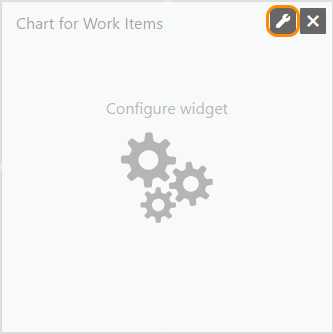
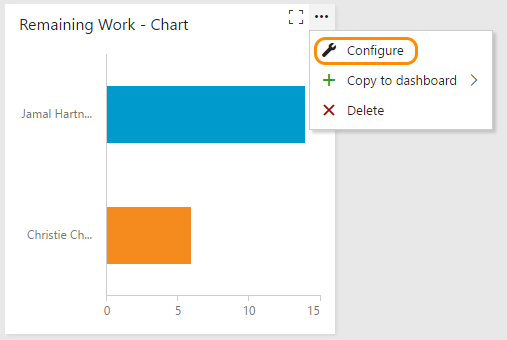

# Add widgets to a dashboard

<b>VSTS | TFS 2017 | TFS 2015.1-2015.3</b>  


Widgets smartly format data to provide access to easily consumable data. You add widgets to your team dashboards to gain visibility into the status and trends occurring as you develop your software project. 

Each widget provides access to a chart, user-configurable information, or a set of links that open a feature or function. 

You can add one or more charts or widgets to your dashboard. You add several widgets at a time simply by selecting each one. See [Manage dashboards](dashboards.md#manage) to determine the permissions you need to add and remove widgets from a dashboard.    

>[!IMPORTANT]  
><b>Feature availability: </b> You can access the [widget catalog](widget-catalog.md) from the web portal for VSTS or TFS 2015.1 or later version. The widget catalog provides widgets for all tiles supported in previous releases of TFS for the team homepage. For on-premises TFS 2015, you can add select charts to the team home page using the [Pin to home page](team-dashboard.md) feature.   
>
>To determine the platform and version you're on, see [Provide product and content feedback, Platforms and version support](../provide-feedback.md#platform-version).   


## Connect to your team project web portal 

To add a widget to a dashboard, you connect to your team project using a [supported web browser](../accounts/requirements.md#supported-browsers).  If you don't have a team project yet, create one in [Visual Studio Team Services](../accounts/create-account-with-personal-msa.md) or set one up in an [on-premises TFS](../accounts/create-team-project.md).

Open a browser window and click the **Dashboards** hub. If you haven't been added as a team member, [get added now](../work/scale/multiple-teams.md#add-team-members).

The URL follows this pattern: 
- Visual Studio Team Services: ```https://{account name}.visualstudio.com/{project name}/_backlogs```  
- Team Foundation Server (on-premises): ```http://{server}:8080/tfs/DefaultCollection/{project name}/_backlogs```  

If you don't see the team or team project you want, click the  Team Services icon to [browse all team projects and teams](../connect/account-home-pages.md).  

## Add a widget to a dashboard  
 
> [!NOTE]  
> Widget images may vary depending on which platform you access. This topic shows images that appear in VSTS. However, the widget title and functionality described in this topic are valid for both VSTS and TFS. For example, dashboard edit mode controls shown below are valid for VSTS and TFS 2015.2 and later version. Some functionality differs when you connect to TFS 2015.1 or earlier versions.  
 
Click  to modify a dashboard. Click  to add a widget to the dashboard.  

The [widget catalog](widget-catalog.md) describes all the available widgets, many of which are scoped to the selected team context.  

>[!NOTE]  
><b>Feature availability: </b>For VSTS and TFS 2017 and later versions, you can drag and drop a widget from the catalog onto the dashboard.    


## Configure a widget  

To configure a widget, add the widget to a dashboard and then click the  configure icon. 

  

Click the delete icon to remove the tile from the dashboard. 
 
Once you've configured the widget, you can edit it by opening the actions menu. 

 


## Try this next 

> [!div class="nextstepaction"]
> [Review the widget catalog](widget-catalog.md)
> or
> [Review Marketplace widgets](https://marketplace.visualstudio.com/search?term=widget&target=VSTS&category=All%20categories&sortBy=Relevance)


