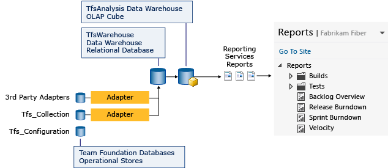

# Add reports to a team project

[!INCLUDE [temp](../_shared/tfs-report-platform-version.md)]

By adding a report server to your TFS (on-premises) deployment, you can access a wealth of data about your team's projects, such as build quality, bug trends, burndown, and test progress. SQL Server Reporting Services (SSRS) reports provide insight to help teams manage work and improve processes.

The sequence of tasks is as follows:

 

[!INCLUDE [temp](../_shared/tfs-header-17-15.md)]

If your reports don't appear as expected, review the checklists provided under [Review team activities](review-team-activities-for-useful-reports.md) for the necessary team activities to generate useful reports. Also, access information that describes healthy and unhealthy versions of each report.

After completing the sequence of tasks, you'll be able to access the default reports provided with the process template used to create your team project. 
TFS SSRS data flow and report architecture

> [!IMPORTANT]  
> Build reports are only applicable for XAML builds, which are deprecated for TFS 2018 and later versions. If your build process isn't based on XAML builds, this report and the TFS Warehouse for builds won't yield any meaningful data.   