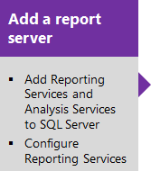
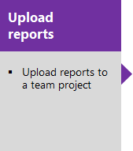
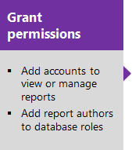
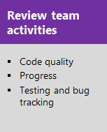

# Add reports to a team project

[!INCLUDE [version-lt-azure-devops](../../includes/version-lt-azure-devops.md)]

By adding a report server to your on-premises Azure DevOps Server deployment, you can access a wealth of data about your team's projects, like:
- Build quality
- Bug trends
- Burndown
- Test progress

SQL Server Reporting Services (SSRS) reports provide insight to help teams manage their work and improve processes.

The sequence of tasks is as follows:

 

> [!IMPORTANT]  
> Excel reports, Reporting Services reports, and SharePoint dashboards are only supported for on-premises deployments of Azure DevOps Server or TFS. For information on what is supported for Azure DevOps, see [Dashboards, charts, & widgets](../dashboards/overview.md).
> 
> TFS 2018 and later versions no longer support native integration with SharePoint products. If you're planning to upgrade to TFS 2018, read [About SharePoint integration](/previous-versions/azure/devops/report/sharepoint-dashboards/about-sharepoint-integration) to learn about the options available to you.

If your reports don't appear as expected, review the checklists provided under [Review team activities](review-team-activities-for-useful-reports.md) for the necessary team activities to generate useful reports. Also, access information that describes healthy and unhealthy versions of each report.

After completing the sequence of tasks, you'll be able to access the default reports provided with the process template used to create your team project. 
TFS SSRS data flow and report architecture

> [!IMPORTANT]  
> Build reports are only applicable for XAML builds, which are deprecated for TFS 2018 and later versions. If your build process isn't based on XAML builds, this report and the TFS Warehouse for builds won't yield any meaningful data.   