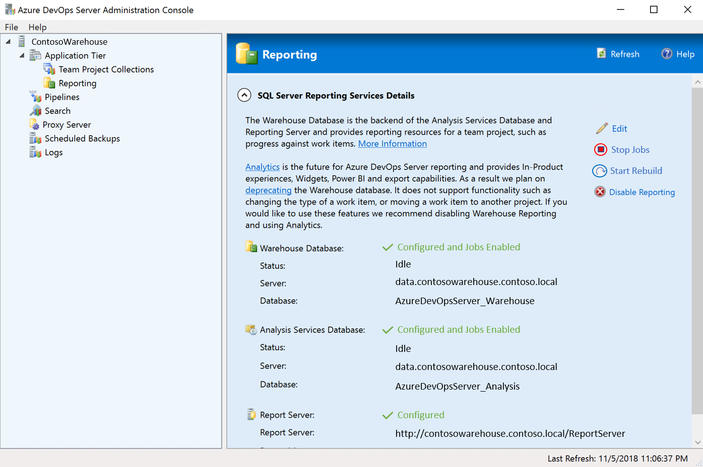
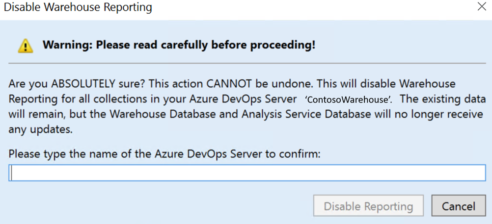
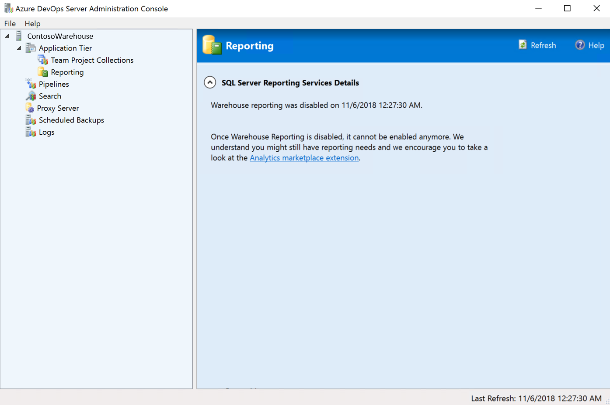

# Disable the data warehouse and cube

[!INCLUDE [temp](../_shared/tfs-report-platform-version.md)]

Follow the steps below to disable the data warehouse and cube on your Azure DevOps Server instance.

## Prerequisites 

In order to disable the data warehouse and cube, you must have an Azure DevOps Server instance already [set up](/azure/devops/server/install/get-started).

> [!NOTE]  
> Your Azure DevOps Server instance does not need to be provisioned with [SQL Server Reporting Services (SSRS)](https://docs.microsoft.com/azure/devops/report/sql-reports/?view=tfs-2018) to disable the data warehouse and cube.

1. Launch the **Azure DevOps Server Adminstration Console** on your Azure DevOps Server instance.
2. Navigate to **Reporting**.

    

3. Select **Disable Reporting** on the right hand column. You will be prompted with an alert window.

    

> [!WARNING]  
> Please note that disabling the warehouse CANNOT be undone!

4. After the warehouse is disabled, the **Azure DevOps Server Adminstration Console** will display a confirmation message.

    

## Try this next

For future reporting needs, please take a look at our [Analytics Service](../powerbi/what-is-analytics.md).

 