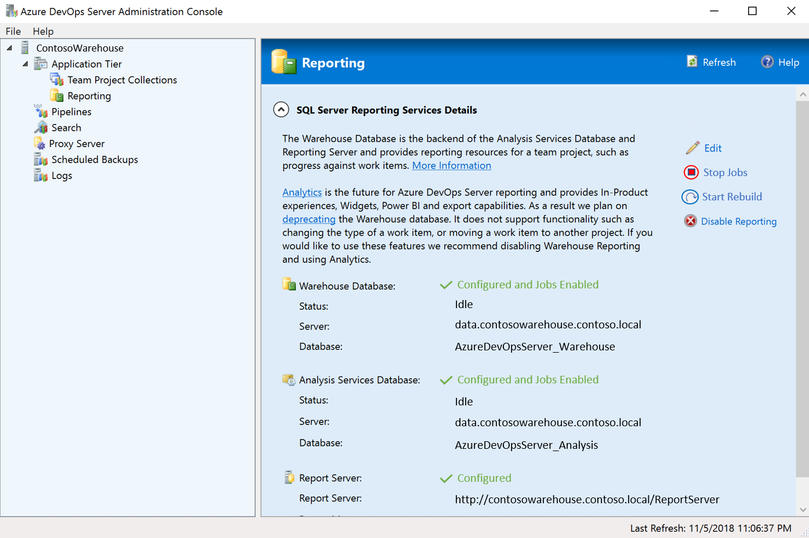
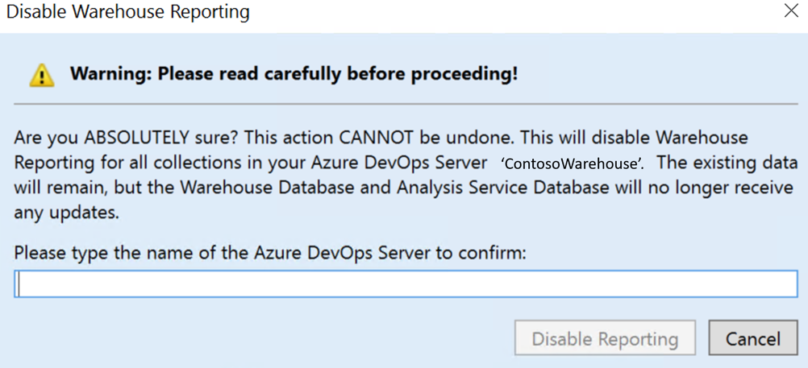
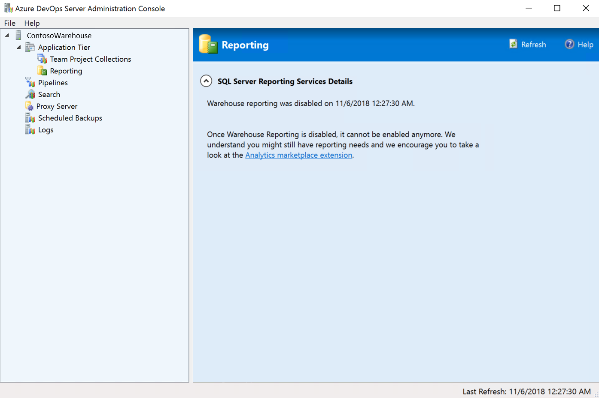

# Disable the data warehouse and cube

[!INCLUDE [temp](../includes/tfs-report-platform-version.md)]

To disable the data warehouse and cube on your Azure DevOps Server instance, follow the steps provided in this article.

## Prerequisites 

In order to disable the data warehouse and cube, you must have an Azure DevOps Server instance already [set up](/azure/devops/server/install/get-started).

> [!NOTE]  
> Your Azure DevOps Server instance does not need to be provisioned with [SQL Server Reporting Services (SSRS)](/azure/devops/report/sql-reports) to disable the data warehouse and cube.

1. Opeh the **Azure DevOps Server Adminstration Console** on your Azure DevOps Server instance.  

2. Navigate to **Reporting**.  

    

3. Select **Disable Reporting**. You will be prompted with an alert window.

    

	> [!WARNING]  
	> Once disabled, you can't reenable the data warehouse.  

4. After the warehouse is disabled, the **Azure DevOps Server Adminstration Console** displays a confirmation message.

    

## Try this next

For future reporting needs, see [Analytics Service](../powerbi/what-is-analytics.md).

