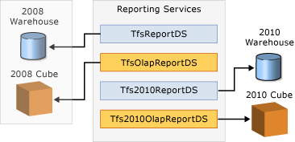
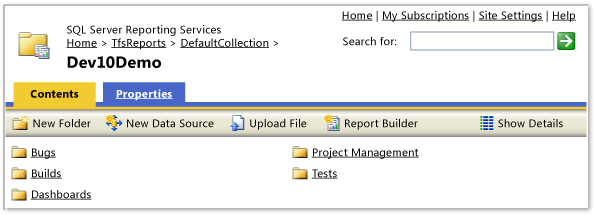

# Locate reports after the upgrade to TFS 2010

[!INCLUDE [temp](../_shared/tfs-report-platform-version.md)]

Upgrading your Team Foundation deployment to Visual Studio Team Foundation Server 2010 introduces several changes that affect the location and operations of reports that are accessed through SQL Server Reporting Services. Specifically, you will have access to both pre-existing or pre-upgrade reports, and new or post-upgrade reports that are based on the data warehouse schema for Team Foundation Server 2010.

The following are the immediate effects that you will notice: 
- If your upgraded team project was based on version 4.2 of a Microsoft Solutions Framework (MSF) process template, you have access to a set of post-upgrade reports. These reports can be accessed from the  **Reports** node in Team Explorer or from the **Reports** link in the web portal.  
- You cannot access pre-upgrade reports from the  **Reports** node in Team Explorer or from the web portal. You can still access pre-existing reports from a Web browser.
- Data that has been added since the upgrade does not appear in pre-existing reports. All new data flows into the new data warehouse that was created during the upgrade. All pre-existing data is maintained in a data warehouse that is based on the earlier schemas.

To view a pre-upgrade report, you may have to modify it to address changes that were introduced by SQL Server 2008. To use a pre-upgrade report to support reporting on your upgraded team project, you must modify each report to connect to the new data warehouse and address the schema changes that were introduced by Team Foundation Server 2010.

Two sets of data warehouse resources

The following table lists the names that are automatically assigned to the Reporting Services data resources that are used by reports.

| Database resource|Name assigned to resources based on earlier versions of Team Foundation Server|Name assigned to resources for Team Foundation Server 2010|
|-----------|------------------|----------------|
|Data warehouse relational database| TfsReportsDS | Tfs2010ReportsDS|
|Analysis Services cube| TfsOlapReportsDS |Tfs2010OlapReportsDS |

The 2010-based names support the upgrade of a server where you have an existing set of reports that were designed to work with schemas that were designed for Visual Studio 2005 Team Foundation Server or Team System 2008 Team Foundation Server. An upgrade to Team Foundation Server 2010 creates a new warehouse and cube that use a different schema that is incompatible with the previous data warehouses. The new data sources point to the new warehouse and cube and leave the previous data sources intact.

You can continue to view pre-upgrade reports. However, no new data will be added to the pre-upgrade data warehouse and cube. The use of new data source names allows the pre-upgrade reports (which use the old data sources) to continue to render pre-upgrade data.

## Team project collections and report hierarchy

With the introduction of team project collections and report folders, reports are now organized on the server that hosts Reporting Services in a hierarchy that resembles the following:

**TfsReports > Project Collection > Team Project > Report Folder > Report**

The following illustration shows this structure for the project that is named Dev10Demo.

 
## View post-upgrade reports

To view post-upgrade reports
 
0. Open Internet Explorer, type the following string in the Address bar, and press ENTER:

	`http://ReportServerName/TFSReports/ProjectCollectionName/ProjectName/`

	If you have deployed a named instance on the data-tier server, type the following string instead:

	`http://ReportServerName/TFSReports_TFSInstance/ProjectCollectionName/ProjectName/`

0. Click the folder that contains the report that you want to view.

0. Click the report that you want to view.

## View pre-upgrade reports

To view pre-upgrade reports

0. Open Internet Explorer, type the following string in the Address bar, and then press ENTER:

	`http://ReportServerName/Reports/ProjectName/`

	If you have deployed a named instance on the data-tier server, type the following string instead:

	`http://ReportServerName/Reports_TFSInstance/ProjectName/`

0. Click the report that you want to view.

 The **Reports** page in Team Explorer provides a tree view of the reports defined for your team project. To open a report, choose it and press Enter.  
  
> [!NOTE]
>  The  **Reports** option appears only when the team project collection that contains your team project is provisioned with Reporting Services. For more information, see [Add a Report Server to a Team Project Collection](../admin/add-reports-to-a-team-project.md).  
  
 The **Reports** page for your team project shows the reports and organizes them under a set of folders. The default set of reports are based on the process template that was used to create the team project. You can manage these reports using Report Manager. For more information, see [Report Server Content (Native Mode)](http://go.microsoft.com/fwlink/?LinkId=263963).  
  
 The reports that TFS provides with the default process templates provide a view of the current state of your project by aggregating and summarizing the metrics from such things as work items, version control, test results, and builds. You can use the default reports, or you can customize each report to fit your specific needs.  
  
 Most of these reports provide filters that you can use to specify contents to include in the report. Filters include time period, iteration and area paths, work item types, and work item states. The questions that they answer relate to all types of work items such as user stories, test cases, tasks, and bugs. For more information about the purpose, layout, or use of each report, see [Reporting Services Reports](../sql-reports/reporting-services-reports.md).  
  
 Team project reports are stored in Reporting Services, and you can access them through Team Explorer or Report Manager. As the number of reports listed on the **Reports** page increases, you may want to create subfolders for grouping or organizing the reports.  
  
 You use Report Manager to manage reports and report folders. To access the team report site from Team Web Access, on the Home page, click  **Reports**.  
  
 **Requirements**  
  
-   To open a report from Team Explorer, your **View project-level information** permission on the team project must be set to **Allow**. You must also be a member of the SQL Server Reporting Services **Browser** role.  
  
-   To manage reports from Report Manager, you must be a member of the SQL Server Reporting Services **Team Foundation Content Manager** role. For more information, see [Grant permissions to view or create reports in TFS](../admin/grant-permissions-to-reports.md).  
  
    > [!NOTE]
    >  If you are running Windows Server 2008 or Windows Vista, you might have trouble opening Web pages or sites from Team Explorer. For example, you might not be able to open the project portal by right-clicking a team project in Team Explorer and then clicking **Show Project Portal**. For more information about access issues that may occur with Windows Server 2008 or Windows Vista, see the following page on the Microsoft Web site: [User Account Control](http://go.microsoft.com/fwlink/?LinkId=111235).  
  
##    
  
#### To view a report from Team Explorer  
  
1.  From the  home page in Team Explorer, choose **Reports**.  
  
> [!NOTE]
>  If a red X icon appears next to **Reports**, you might not have permissions to access the reports, or Team Explorer might have lost communication with the server that hosts Reporting Services. In these instances, check with your project administrator to make sure that you have permissions to access the reports and that the server that hosts Reporting Services is running.  
  
 Also, a red X icon might appear next to **Reports** if both of the following conditions are true:  
  
-   Team Explorer is running on the same computer as Reporting Services.  
  
-   You are not logged on as an administrator, or enhanced security is enabled for Internet Explorer.  
  
 To correct this issue, log onto your computer as an administrator, or open Internet Explorer, open Internet Options, choose the **Security** tab, and clear the **Enabled Protected Mode** check box.  
  
1.  Choose the report and then press Enter.  
  
     A web browser window opens and shows the report.  
  
2.  At the top of the report, specify your filter parameters, and then choose **View Report**.  
  
#### To view a report from Report Manager  
  
1.  From the  home page in Team Explorer, choose  **Reports**, and then choose the **Go to site** link.  
  
     Or, choose **Team, Show Report Site** from the Visual Studio toolbar.  
  
2.  In **Report Manager**, choose the folder that contains the report you want to view.  
  
3.  Choose the report that you want to open.  
  
4.  At the top of the report, specify your filter parameters, and then choose **View Report**.  
  
## Related notes
-  [Reporting Services Reports](../sql-reports/reporting-services-reports.md)   
-  [Create and manage Reporting Services reports](../sql-reports/create-and-manage-reporting-services-reports.md)