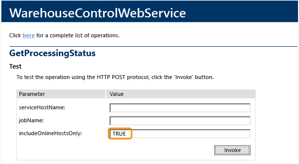

# Manually process the TFS data warehouse and analysis services cube

[!INCLUDE [temp](../_shared/tfs-report-platform-version.md)] 

When you need the freshest data in your reports, when errors have occurred, or after you've resolved schema conflicts, you can manually process the Team Foundation Server (TFS) relational database (Tfs\_Warehouse) or SQL Server Analysis Services cube (Tfs\_Analysis).

During typical operations, the warehouse is processed within two minutes of changes made to an operational store, and the cube is processed every two hours. By manually processing the warehouse, you help ensure that queries and reports are up-to-date with data that depends on the warehouse.

You use the Warehouse Control Web Service to process the warehouse or cube or perform other maintenance operations. If you know that you want to perform a full rebuild of both databases, then use the [Administration console](rebuild-data-warehouse-and-cube.md) or the [TFSConfig RebuildWarehouse command](https://msdn.microsoft.com/library/ee349264.aspx). 

 

> [!NOTE]  
> Do not use SQL Server Management Studio (SSMS) to manually process the cube. Processing the cube using that tool is not supported. 

 
## Process the warehouse or cube

Processing the warehouse or cube depends on how much data is involved; it can take minutes or hours. Before you process either database, determine the processing status for the synchronization job or jobs that you want to run. Make sure that the status returns **Idle** 

### To access the web services

1. If you aren't a member of the **Administrators** security group on the application-tier server for TFS, [get added now](/tfs/server/admin/add-administrator-tfs).  

	Also, make sure that your server-level **Administer warehouse** permission must be set to **Allow**.

2. Log on to the application-tier server and open the Warehouse Control Web Service by entering the following URL in a supported web browser:  

	```http://localhost:8080/tfs/TeamFoundation/Administration/v3.0/WarehouseControlService.asmx``` 

	If another name was used other than **tfs** for the virtual directory, then type the *IIS Virtual Directory* that was specified when Team Foundation Server was installed.  

3. The **WarehouseControlWebService** page opens.

	If the page doesn't open, verify that the TFS Application Pool is running.
 
### To check the process status

Choose  **GetProcessingStatus**.



A new browser window opens. It indicates the following job's processing status:

* **Common Structures Warehouse Sync**  
* **Full Analysis Database Sync**  
* **Incremental Analysis Database Sync**  

And, the status for the following jobs for each team project collection are provided:

* **Build Warehouse Sync**  
* **Common Structures Warehouse Sync**  
* **Test Management Warehouse Sync**  
* **Version Control Warehouse Sync**  
* **Work Item Tracking Warehouse Sync**  

A value of **Idle** indicates that the synchronization job is currently not running. You should process the data warehouse or the cube only when the processing status for these jobs is **Idle**. If a different value is returned, repeat this step until **Idle** is returned for the job that you want to process.

### To process the data warehouse

1. Choose **ProcessWarehouse**, and optionally specify the team project collection to process. If you leave **collectionName** blank, all collections are processed. 

	The service returns **True** when it successfully starts the processing of the warehouse and **False** if it is not successful. A value of **False** indicates that the warehouse is currently being processed.

2. To determine the processing status of the warehouse choose **GetProcessingStatus** as described earlier in to [check the process status](#to-check-the-process-status).

	Warehouse processing is completed when the **GetProcessingStatus** service returns a value of **Idle**, and a value of **Succeeded** for **Common Structures Warehouse Sync** and for each warehouse for each team project collection.

### To process the Analysis Services cube

1. Choose **ProcessAnalysisDatabase**.

2. For **processingType**, type either **Incremental** or **Full**.

	If you specify **Incremental**, data is processed only if it has been added since the most recent processing. 

	If you specify **Full**, all data is processed as if the warehouse were being rebuilt. Full processes take longer to perform and should be performed only when required (for example, when a team project or project collection has been removed or deleted).

	The service returns **True** when it successfully starts the processing of the cube and **False** if it is not successful. A value of **False** indicates that the cube is currently being processed.

3. To determine the processing status of the warehouse choose **GetProcessingStatus** as described earlier in [to check the process status](#to-check-the-process-status).

	Cube processing is completed when the **GetProcessingStatus** service returns a value of **Idle**, and a value of **Succeeded** for the following jobs.  

	* **Full Analysis Database Sync**  
	* **Incremental Analysis Database Sync**  

## Process dimensions for expanded capacity
 
You should run the **ProcessDimensionsForExpandedCapacity** web service when you receive one of the following error messages: 

# [Work Item (dimWorkItem)](#tab/dim-work-item)

```
Microsoft.TeamFoundation.Warehouse.WarehouseException: TF221122: An error occurred running job Full Analysis Database Sync for team project collection or Team Foundation server TEAM FOUNDATION.

Microsoft.TeamFoundation.Warehouse.WarehouseException: Failed to Process Analysis Database 'Tfs_Analysis'.

You should run the ProcessDimensionsForExpandedCapacity web service when you receive the following error message:
Microsoft.TeamFoundation.Warehouse.WarehouseException: TF221122: An error occurred running job Full Analysis Database Sync for team project collection or Team Foundation server TEAM FOUNDATION.
Microsoft.TeamFoundation.Warehouse.WarehouseException: Failed to Process Analysis Database 'Tfs_Analysis'.
Microsoft.TeamFoundation.Warehouse.WarehouseException: File system error: A string store or binary store with a compatibility level of '1050' is at the maximum file size of 4 gigabytes. To store additional strings, you can change the StringStoresCompatibilityLevel property of the associated dimension or distinct count measure to '1100' and reprocess. This option is only available on databases with a compatibility level of '1100' or higher.
Physical file: \?\I:\OLAP\Data\Tfs_Analysis.0.db\vDimWorkItemOverlay.5.dim\7.WorkItemSK.asstore.
``` 

This service changes the StringStoresCompatibilityLevel to 1100 for the **Work Item** dimension and performs a full cube reprocess.

1. From the Warehouse Control Web Service, choose **ProcessDimensionsForExpandedCapacity**.  

2. Enter the name of the dimension. From the above error message, the dimension name is ```dimWorkItem```.  
 
3. The service returns **True** when it successfully resets the value to 1100. 

	Wait until the cube processing has succeeded.

# [Version Control (dimFile)](#tab/dim-file)

```
Microsoft.TeamFoundation.Warehouse.WarehouseException: TF221122: An error occurred running job Full Analysis Database Sync for team project collection or Team Foundation server TEAM FOUNDATION.  

Microsoft.TeamFoundation.Warehouse.WarehouseException: Failed to Process Analysis Database 'Tfs_Analysis'.  

You should run the ProcessDimensionsForExpandedCapacity web service when you receive the following error message: 
Microsoft.TeamFoundation.Warehouse.WarehouseException: TF221122: An error occurred running job Full Analysis Database Sync for team project collection or Team Foundation server TEAM FOUNDATION.
Microsoft.TeamFoundation.Warehouse.WarehouseException: Failed to Process Analysis Database 'Tfs_Analysis'. 
Microsoft.TeamFoundation.Warehouse.WarehouseException: File system error: A string store or binary store with a compatibility level of '1050' is at the maximum file size of 4 gigabytes. To store additional strings, you can change the StringStoresCompatibilityLevel property of the associated dimension or distinct count measure to '1100' and reprocess. This option is only available on databases with a compatibility level of '1100' or higher.
Physical file: \\?\E:\OLAP\Data\TFS_Analysis.0.db\File.0.dim\232.FileSK.asstore.
```


This service changes the StringStoresCompatibilityLevel to 1100 for the **Version Control**  dimension and performs a full cube reprocess.

1. From the Warehouse Control Web Service, choose **ProcessDimensionsForExpandedCapacity**.  

2. Enter the name of the dimension. From the above error message, the dimension name is ```dimFile```.  
 
3. The service returns **True** when it successfully resets the value to 1100. 

	Wait until the cube processing has succeeded.

--- 

## Related notes  
You should process a database manually for one of the following reasons:

* Incrementally process the cube when reports don't show the latest data and you need them up-to-date for an upcoming meeting.  
* Process each team project collection within the data warehouse to verify resolution of all [schema conflicts](resolve-schema-conflicts.md).  
* Process each team project collection within the data warehouse to collect information to diagnose issues appearing in the event viewer related to warehouse jobs.  

Perform a [full rebuild of the warehouse and cube](rebuild-data-warehouse-and-cube.md) when you move, restore, rename, or fail over the TFS data-tier server.

As needed, [change the refresh processing interval or other processing parameters](change-a-process-control-setting.md).
