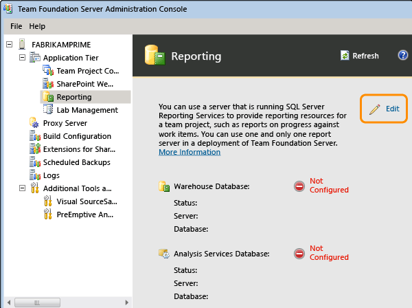

# Rebuild the data warehouse and cube

[!INCLUDE [temp](../_shared/tfs-report-platform-version.md)]

Whenever you move, restore, rename, or fail over the data-tier server for Team Foundation Server (TFS), you should rebuild the data warehouse and cube to access high-level reports. Also, if you move, attach, detach, or delete a team project collection, you should rebuild the warehouse and cube.  

The data warehouse aggregates all operational data, such as version control, work item tracking, build, and test. The warehouse corresponds to the relational database, Tfs_Warehouse, and the cube corresponds to Tfs_Analysis, the SQL Server Analysis Services database. 

You should not have to rebuild the data warehouse during normal operations. If you want to refresh the data warehouse data, you can manually process the warehouse and cube on demand. See [Manually process the TFS data warehouse and analysis services cube](manually-process-data-warehouse-and-cube.md). Depending on the amount of data in the data warehouse, the rebuild operation can take several hours to finish, during which time reports are not available. 

To rebuild the TFS data warehouse, perform this sequence of steps:

1. [Verify that services and application pools are running and that TCP/IP is enabled for SQL Server](#verify-services)  
2. [Rebuild the data warehouse](#create-datawarehouse)  
3. [Verify that reports can be accessed](#verify-reports)  

**Requirements** 

You must be a member of these security groups or have the corresponding permissions:

* **sysadmin** security group on the server or servers that are running the instance of SQL Server that hosts the databases for Team Foundation Server 

* **sysadmin** security group on the server for the Analysis Services database for Team Foundation 

* Tfs_Warehouse relational database and **TFSEXECROLE** database role 

* **Team Foundation Administrators** security group and the **Administrators** security group on the server or servers that are running the administration console for Team Foundation

* Your server-level **Administer warehouse** permission must be set to **Allow** 

* Your **View project-level information** permission on the team project must be set to **Allow** to run and view a report. Also, you must be a member of the **Browser** role in SQL Server Reporting Services 

For more information, see [Add accounts to administer TFS](/azure/devops/server/admin/add-administrator-tfs).

In addition to these permissions, you might need to address these requirements on a computer that is running Windows Server 2008 or Windows Vista:

* To follow a command-line procedure, you might need to open an elevated Command Prompt by choosing **Start**, opening the context menu for **Command Prompt**, and choosing **Run as Administrator**.  

* To follow a procedure that requires Internet Explorer, you might need to start it as an administrator by choosing **Start**, **All Programs**, opening the context menu for **Internet Explorer**, and then choosing **Run as administrator**.  

* To access Report Manager, reports, or websites for Reporting Services, you might need to add these sites to the list of trusted sites in Internet Explorer or start Internet Explorer as an administrator.  

For more information, see [User Account Control](/previous-versions/windows/it-pro/windows-server-2008-R2-and-2008/cc772207(v=ws.10)).

With the rebuild operation, you re-create both the relational database and the cube. TFS rebuilds the relational database from the operational data stores. It then re-creates the SQL Server Analysis Services cube and processes the cube to populate it by using data from the relational database. If you want to rebuild just the cube, you can use the **TFSConfig RebuildWarehouse** command-line tool. See [RebuildWarehouse Command](/previous-versions/visualstudio/visual-studio-2013/ee349264(v=vs.120)).
 
<a id="verify-services">  </a>

##1. Verify that services and application pools are running and that TCP/IP is enabled for SQL Server
To complete the steps in this procedure, the services that SQL Server requires must be running. You stop Reporting Services so that users do not access reports while you are rebuilding the data warehouse. Also, for a dual-server deployment, the TCP/IP protocol must be enabled for each instance of a SQL Server database. 

By default, TCP/IP is disabled when you install SQL Server.

1. Log on to the appropriate server, open Computer Manager, and then verify that the services and application pools in the following table are running: 

	<table>
	<tr valign="top">
	<th>Log on to the server that hosts this program</th>
	<th>Component</th>
	</tr>
	<tr>
	<td>SQL Server Analysis Services</td>
	<td>- SQL Server Analysis Services (MSSQLSERVER or <i>TFSInstance</i>)</td>
	</tr>
	<tr>
	<td>Team Foundation databases</td>
	<td>- SQL Server (MSSQLSERVER or <i>TFSInstance</i>)<br/>
	- SQL Server Agent (MSSQLSERVER or <i>TFSInstance</i>)
	</td>
	</tr>
	<tr>
	<td>Application tier</td>
	<td>- TFS Application Pool</td>
	</tr>
	</table>

	For more information, see [Stop and start services, application pools, and websites](/azure/devops/server/admin/stop-start-stuff).

2. Log on to the server that hosts Reporting Services, and stop the SQL Server Reporting Services (*TFSINSTANCE*) service.  Use the [report reader account](/azure/devops/server/requirements#accounts). 

3. Make sure that TCP/IP has been enabled for SQL Server on the data-tier server. For more information, see [Enable the TCP/IP Protocol for a Database Instance](https://msdn.microsoft.com/library/bb909712.aspx).  


<a id="create-datawarehouse">  </a> 

##2. Rebuild the data warehouse and restart services

1. [Open the Team Foundation administration console](/azure/devops/server/admin/config-tfs-resources).

2. Under **Application Tier>Reporting**, choose **Start Rebuild**.  
	
	The **Take Offline** dialog box opens.  

3. Choose **OK** to take the data warehouse and Analysis Services cube offline.  

	The **Rebuild the Warehouse and Analysis Services Databases** dialog box opens.  

4. Choose **OK** to initiate the rebuild process.  

	When you rebuild the warehouse or cube, TFS performs this sequence of actions:

	* Takes the databases offline.  
	* Drops the schema for both databases.   
	* Re-creates the schema for both databases.  
	* Brings both databases back online.  
	* Restarts the warehouse adapter jobs.  
	* Processes the cube according to its regular processing interval.  

	The rebuild process starts first for the warehouse and then for the cube. The time that is required to rebuild the databases is based on the amount of data that is stored in the data warehouse. When the databases have been rebuilt, the jobs for processing the databases are automatically started. 

	> [!NOTE]  
	> While the warehouse and the cube are being rebuilt, the administration console for Team Foundation may stop responding. You might need to refresh the administration console after the warehouse and the cube have been rebuilt. 

5. (Optional) To check the status of the rebuild process, you can use the Warehouse Control Web service. For more information, see [Manually process the TFS data warehouse and analysis services cube](manually-process-data-warehouse-and-cube.md).  

6. Log on to the server that hosts Reporting Services, open Computer Manager, and then start the SQL Server Reporting Services (*TFSINSTANCE*) service.  

<a id="verify-reports">  </a>

##3. Verify that reports can be accessed

1. Log on to the server that hosts Reporting Services, open Internet Explorer, type the following string in the Address bar, and then press ENTER:

	```http://localhost/Reports  ```

	> [!TIP]  
	> You may need to start Internet Explorer as an administrator by choosing **Start**, **All Programs**, open the context menu of Internet Explorer, and then choosing **Run as administrator**.   

	If you have deployed a named instance on the data-tier server, type this string instead:

	```http://localhost/Reports_***TFSInstance*   ```

2. In Contents, choose TFSReports, choose the folder of the team project collection that stores your team project, choose the folder that corresponds to your team project, and then choose the folder that contains a report that you want to view.

3. Choose the folder that contains a report that you want to view. 

4. Choose a report, and verify that the report appears correctly. 

5. Check the date when the report was last updated. This information appears in the lower-left corner of the report. 

##Q & A
<!-- BEGINSECTION class="md-qanda" -->

####Q: How do I resolve schema conflicts?
**A:** If you encounter schema conflicts, you cannot resolve this by rebuilding the data warehouse. Instead, you must resolve the conflicts first and then rebuild the data warehouse. See [Resolve schema conflicts that are occurring in the data warehouse](resolve-schema-conflicts.md).

####Q: How can I resolve failure errors that occur when rebuilding or processing the data warehouse?
**A:** The following actions can cause failure errors to occur.  

* You manually modified a TFS database or edited a SQL table. You should not manually modify any of the TFS databases unless you're either instructed to do so by Microsoft Support or when you're following the procedures described for manually backing up the databases ([Manually back up Team Foundation Server](/azure/devops/server/admin/backup/manually-backup-tfs)). Any other modifications can invalidate your service agreement, block upgrades and patches, and result in data loss or corruption.  

* A detach/attach operation resulted in a misconfiguration of a team project collection. For example, a collection has become attached to two different data-tier servers, which is an unsupported scenario. Correcting the configuration and then rebuilding the data warehouse should resolve the errors.  

* You've performed an unsupported backup or restore operation as described in [Back up and restore TFS](/azure/devops/server/admin/backup/back-up-restore-tfs).   

####Q: How do I modify the reporting configuration?
**A:** To modify the reporting configuration for team project collections, use the **Edit** function that is provided on the Reporting page of the administration console for Team Foundation.



####Q: What happens to data that has been purged or destroyed before a rebuild?
**A:** Data associated with builds or work items that have been permanently deleted from the database will be permanently removed from the data warehouse when you rebuild it. 

Also, data in the warehouse or cube that originates from third-party sources might also be lost. Even though most third-party tools are capable of republishing data, that capability depends on the individual vendor. Contact your vendor to determine what (if any) data might be lost.

For details of what data doesn't get deleted from the database when you delete builds, see [this blog post](http://blogs.msdn.com/b/adamroot/archive/2009/06/12/working-with-deleted-build-data-in-team-foundation-server-2010-beta-1.aspx).

Deleting builds doesn't remove all associated data from the database. To do that, you must destroy the builds. You use the **TFSBuild destroy** [command to destroy builds](https://msdn.microsoft.com/library/ee794689.aspx) and to save space in the data warehouse. 

<!-- ENDSECTION -->


##Related content

- [RebuildWarehouse Command](/previous-versions/visualstudio/visual-studio-2013/ee349264(v=vs.120))  
- [Components of the TFS data warehouse](../dashboards/choose-source-data-authoring-tool.md)  
- [Manage TFS reports, data warehouse, and analysis services cube](manage-reports-data-warehouse-cube.md)
- [Add reports to a team project](add-reports-to-a-team-project.md).    
