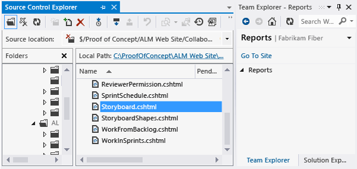
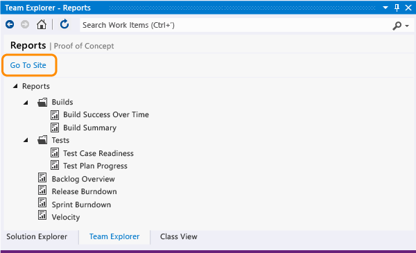
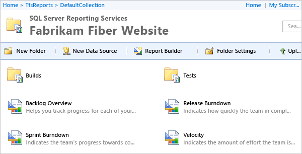

#Upload reports to a team project

[!INCLUDE [temp](../_shared/tfs-report-platform-version.md)]

This is the second task in the four-task sequence to add reports to your team project. You can use the procedures in this article to upload reports for the first time, or to upload updated reports provided with the latest process templates. 

[](add-a-report-server.md)
[](upload-reports.md)
[](grant-permissions-to-reports.md) 
[](review-team-activities-for-useful-reports.md)

> [!IMPORTANT]
>**Feature availability**: You can only add a report server to an on-premises TFS. If you're using Azure DevOps, adding a report server isn't a supported option, instead, you can use the [Analytics Service](../powerbi/what-is-analytics.md?toc=/azure/devops/report/powerbi/toc.json&bc=/azure/devops/report/powerbi/breadcrumb/toc.json).


By adding a report server to your TFS (on-premises) deployment, you can access a wealth of data about your team's projects, such as build quality, bug trends, burndown, and test progress. SQL Server Reporting Services (SSRS) reports provide insight to help teams manage work and improve processes.  

 
After you've added a report server, you'll want to add reports to your team project. You can upload reports when connecting to an on-premises deployment of TFS 2010, TFS 2012, TFS 2013, TFS 2015, or TFS 2017.1.

If the Reports page in Team Explorer appears empty, then you'll want to upload reports.  

  

If the Reports page doesn't appear at all, then you'll want to [add a report server](add-a-report-server.md).  

##Upload reports to your team project (TFS 2017.1 (RC2) and later versions) 
You use the **TFSConfig addProjectReports** command line tool to upload reports.

1. Verify that you have the following tools, configurations, and permissions. 

	* If you aren't an administrator for the team project, [get added now](/azure/devops/server/admin/add-administrator-tfs).  
	* If you haven't been added to the Content Manager or Team Foundation Content Manager role for SQL Server Reporting Services, [get added now](grant-permissions-to-reports.md).  
	* If you haven't installed [Team Foundation Server](https://visualstudio.microsoft.com/downloads/download-visual-studio-vs), install it now. This is the only way to obtain the latest version of the default process templates, which contains the latest version of the reports.  

2. Open a Command Prompt in administrative mode and change to the following directory:   

	```
	%programfiles%\TFS 15.0\Tools
	```
 	On a 64-bit edition of Windows, replace **%programfiles%** with **%programfiles(x86)%**.

3. Upload the reports. The process template you specify must be compatible with the one used to create the team project. And, it must have been uploaded to the team project collection that hosts your team project. 

	```
	TFSConfig addprojectreports /collection:"http://myServer:8080/tfs/DefaultCollection" /teamproject:MyProject /template:"TemplateName"
	```  

	To overwrite reports that were previously uploaded, specify the **/force** option. These are the names of the default process templates available with TFS 2017:
	
	* Agile  
	* CMMI  
	* Scrum	


##Upload reports to your team project (TFS 2015 and earlier versions) 
You use the **tfpt** command line tool that TFS Power Tools provides. 

1. Verify that you have the following tools, configurations, and permissions. 

	* If you haven't installed TFS power tools, [install them now](http://go.microsoft.com/fwlink/?LinkId=320602).  
	* If you haven't installed Visual Studio, [install a version of them now](https://visualstudio.microsoft.com/downloads/download-visual-studio-vs). You can download Visual Studio Community for free. Each version of Visual Studio installs Team Explorer, which must be present on the same machine where you run the **tfpt** command line tool.  
	* If you aren't an administrator for the team project, [get added now](/azure/devops/server/admin/add-administrator-tfs).  
	* If you haven't been added to the Content Manager or Team Foundation Content Manager role for SQL Server Reporting Services, [get added now](grant-permissions-to-reports.md).  
	* If you haven't installed [Team Foundation Server](https://visualstudio.microsoft.com/downloads/download-visual-studio-vs), install it now. This is the only way to obtain the latest version of the default process templates, which contains the latest version of the reports.  

2. From Team Explorer, download the latest process template that is compatible with the one used to create your team project.  

	  

	To determine the type of process template that was used to create your team project, review the work item types that appear in the **New Work Item** menu for Team Explorer and then compare them with the work item types shown in [Process template correlation with an existing team project](../../boards/work-items/guidance/manage-process-templates.md#wit_correlation). If your work item types differ from those shown listed, then a custom process template might have been used.

	> [!NOTE]  
	>In general, you can use the most recent version of the process template that was used to create your team project. For example, you can upload reports from Scrum, even if your team project was created with Visual Studio Scrum 2.0.  <br/><br/>
	To download a process template, you need to be an administrator for the team project collection, and you must connect to TFS using the same version of Visual Studio. For example, connect to TFS 2015 from Visual Studio Community 2015. <br/><br/>
	>To learn more about process templates and work item types, see [Choose a process](../../boards/work-items/guidance/choose-process.md). 

3. Open a Command Prompt in administrative mode and change to the directory where you installed the power tools.  

	```
	cd %programfiles%\TFS 2015 Power Tools
	```

On a 64-bit edition of Windows, replace **%programfiles%** with **%programfiles(x86)%**.

4. Upload the reports. The process template you specify must be compatible with the one used to create the team project. And, it must have been uploaded to the team project collection that hosts your team project. 

	```
	tfpt addprojectreports /collection:"http://MyServer:8080/tfs/DefaultCollection" /teamproject:MyProject /processtemplate:"TemplateName" 
	```

	These are the names of the process templates uploaded with TFS 2015:
	
	* Agile  
	* CMMI  
	* Scrum  
	
	To overwrite reports that were previously uploaded, specify the **/force** option.

5. Open the report site from the  **Reports** page in Team Explorer. You might need to  refresh the page to see the newly uploaded reports.  
	
	  
	
	And, here's a view of uploaded reports for a Scrum project in Report Manager.  

	  

	Depending upon the amount of data that has been collected for your team project, it can take several minutes to several hours for the data warehouse and cube to build. Once they do, however, you can view progress for your team project since TFS was first deployed. 

##Try this next

[Grant permissions to view or create reports](grant-permissions-to-reports.md).

##Related notes

To learn about which reports are provided with which process templates, see [Review team activities to support useful reports](review-team-activities-for-useful-reports.md).
 

<!-- BEGINSECTION class="md-qanda" -->

####Q: How can I determine if my report is up to date?
**A:** To see when a report was last updated, check the **Date Last Updated** time stamp, which appears in the lower-right corner of each report.

####Q: How often are reports refreshed?
**A:** Reports access data from the relational data warehouse (Tfs_Warehouse), which is updated every two minutes, and the cube (Tfs_Analysis), which is updated every two hours.

####Q: How do I resolve issues causing reports to be out of date?
**A:** Reports will be out of date when all or some data stops flowing into the data warehouse. To verify the data flow, run the **GetProcessStatus** of the [Warehouse Control Web service](manually-process-data-warehouse-and-cube.md). Also, fix any [schema conflicts that may be occurring](resolve-schema-conflicts.md).

####Q: What tasks does tfpt addprojectreports perform?
**A:** The **tfpt addprojectreports** command performs the instructions contained in the [ReportTasks file of the process template](../../reference/process-templates/add-reports-to-the-process-template.md). This file is located in the Reports folder of the process template. The tasks include creating report folders, setting report parameters and data sources for each report, and uploading reports to the report server.

####Q: What if I just want to upload a single report?
**A:** You can upload a single report using **Upload file** in Report Manager. You'll need to define the report's data source and possibly other parameters.

####Q: What are the names of the data sources?
**A:** The names of the reporting services data sources are **Tfs2010ReportsDS** and **Tfs2010OlapReportsDS**. Even though you may have installed or upgraded to a later version of TFS, these names, which were assigned to the data sources for a TFS 2010 installation, are in use. 

You can always check the names by opening the context menu for any report, choose **Manage**, and then choose **Data Sources**.

####Q: Can I upload reports from another process template?
**A:** Most reports are customized based on the work item types and workflow states used in each process template. You might need to customize the reports you copy from another process template to fit the type definitions for your team project. 

####Q: What about uploading Excel reports?
**A:** For TFS 2015 and earlier versions, you can use **tfpt addprojectportal** command to add a project portal and Excel reports once you have [added a SharePoint web application](https://msdn.microsoft.com/library/ee805928.aspx) to your team project collection. 

####Q: Can I get these same reports using Azure DevOps Services?
**A:** Not at this time. Uploading reports is only supported for an on-premises TFS. You can, however, [chart the results of a flat-list query](../charts.md) or use the [Analytics Service](../powerbi/what-is-analytics.md?toc=/azure/devops/report/powerbi/toc.json&bc=/azure/devops/report/powerbi/breadcrumb/toc.json).

####Q: How do I customize a report?
**A:** You can customize the reports you uploaded using [SQL Server Report Builder 2012](https://www.microsoft.com/download/details.aspx?id=29072). To learn more, see [Creating Reports for Team Foundation Server 2010](https://msdn.microsoft.com/library/ff730837.aspx) and [Customizing Reports for Team Foundation Server 2010](https://msdn.microsoft.com/library/ff730838.aspx). Even though these articles are based on TFS 2010, they are valid for TFS 2013 and later versions. 

####Q: How can I learn more about the TFS cube?
**A:** See [Perspectives and measure groups provided in the Analysis Services cube for Visual Studio](https://msdn.microsoft.com/library/ms244710.aspx).

####Q: Where can I go if I have more questions?
**A:** Search for an answer or post a question in the [Team Foundation Server - Reporting & Warehouse forum](http://go.microsoft.com/fwlink/?LinkId=95680).

<!-- ENDSECTION -->
