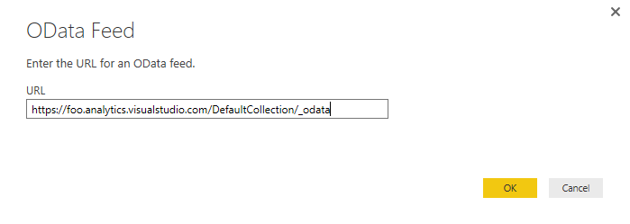
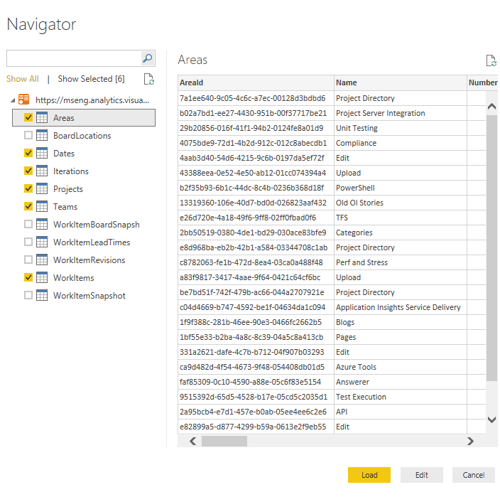
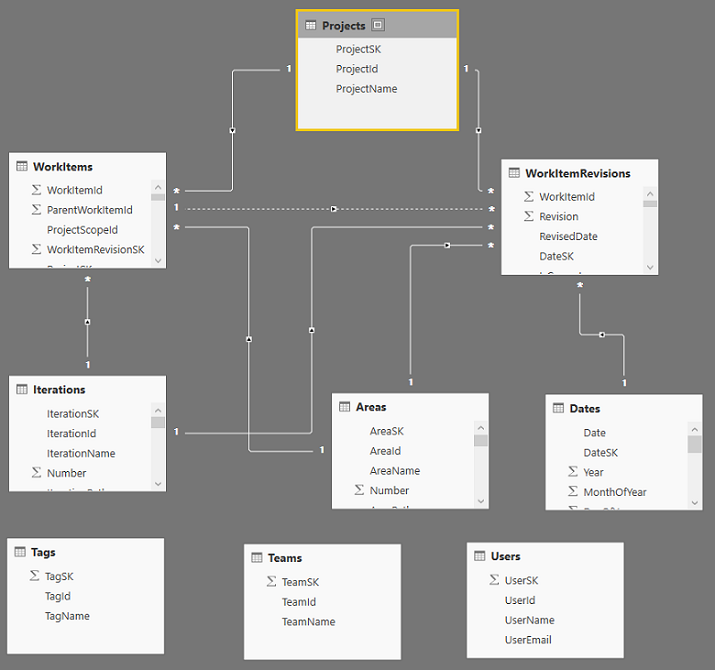
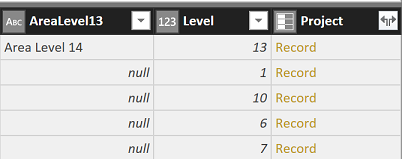
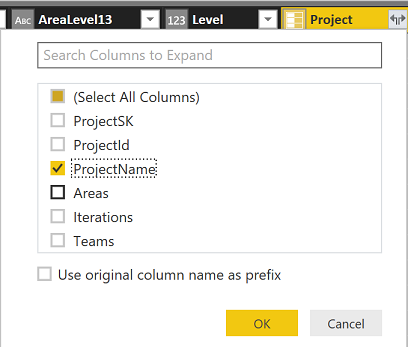

#Access data through Power BI desktop 

**Team Services**  

[!INCLUDE [temp](../_shared/analytics-preview.md)]

You can access the Analytics Service data through the Power BI Desktop and then publish it to PowerBI.com. (For any account that has alternate credentials enabled - OAuth (Organizational Accounts) is currently not supported). Unlike the [Power BI Content Pack](https://www.visualstudio.com/en-us/get-started/report/report-on-vso-with-power-bi-vs) which we previously published, no pre-configured file is required. You can simply just start working in Power BI Desktop.

##Retrieve data manually

1. To get started, Open Power BI Desktop. If you need to install it, [do that now](https://powerbi.microsoft.com/desktop).  

2. Click Get Data from either the welcome page or the Home ribbon.  

	  

3. Next, select Other > OData Feed and click Connect.  

	  

4.	Enter the URL in the format:  

	```
	https://[account].analytics.visualstudio.com/DefaultCollection/_odata
	```  

	  

	If the *AccountName* is "foo" then the URL is ```https://foo.analytics.visualstudio.com/DefaultCollection/_odata```.

	<blockquote style="font-size: 13px">**Note:  ** Alternatively, you can enter the URL ```https://[account].analytics.visualstudio.com/DefaultCollection/[project]/_odata``` which will trim the results by the specified team project across all entities related to that project. </blockquote>

5. At this point you will be prompted to authenticate against the service. If you have not done so previously, see this topic: [Client Authentication Options](client-authentication-options.md).  
6. Next, select the entities you want to retrieve data for by checking those entities.

	<blockquote style="font-size: 13px">**Important:** Do *not* select any entity with the name **Snapshot** in it. These entities contain the state of every work item on every day since each work item was created. For repositories of any size this will lead to tens or hundreds of millions of work items which will not load correctly. In order to perform trend analysis, narrow the scope of data being retrieved to the specific items and time frame and pull this information in with a separate OData query.</blockquote>  

	  

	At this point, if you click **Load**, Power BI Desktop will load all of the data in each entity. However, this may be more data than you want. To filter the data, select the entity to filter and click Edit. This brings up the Query Editor. For each column you want to filter on, select it and set your filter. When this is complete click Close & Apply in the upper left corner.  

###Handle relationships
 
By default, when basic data is returned from the Analytics Service, the data is related as shown in the figure below:

  

You will note that the Tags, Teams and Users are not related to any of the other data. This is due to how those entities
are related. They are related by either many-to-many relationships which are not easily handled in these models or 
there are multiple relationships between the entities such as between users and work items (they are related by Assigned To,
Created By, Changed By, and others).

Multiple relationships can be handled in fairly simply. For example, in the default model you can edit the query, select the
AssignedTo column of the WorkItems table and expand the column to include all of the data from the Users table and you can repeat
this process for the Created By and Changed By columns as well. This gets you around having multiple links from one table to another
which is not allowed.

Another reason for expanding columns in this way is to handle circular relationships which are also not allowed. For example, 
take the following path: Projects > Areas > Work Items > Projects. This presents a typical circular problem. What if you
wanted to see which ares were part of a given project? The model as it is build has relationships between Areas and Work Items and 
Projects and Work Items but Projects cannot be related to Areas because that completes the circular relationship and so it is 
not allowed. To handle this, you could expand the Project column in the Areas table. To do that, take the following steps:

1. Select **Edit Queries** from the **Home tab**  
2. Select the **Areas query**  
3. Scroll to the **Project column** (the last column) and click the Expand icon at the top of the column  

     

4. Uncheck all of the columns except for the ProjectName and click OK

     

Now you can list Areas by Project and get a count of Areas in each project.

##Use a Power BI template

In April of 2016, Power BI Desktop added a new capability - the ability to create a templated Power BI file and prompt
the user for various parameters. We have created such a file with several basic capabilities for reporting on the current
state of work items to get you started. As we include additional data types, we will improve this file.

The current Team Services work items template file supports a single project only.

**What's included**

* A basic bug status report with five charts  
* Area hierarchy  
* Iteration hierarchy  
* Age in Days column in the WorkItems table  

**How to use this file**

1. [Download Power BI Desktop](https://go.microsoft.com/fwlink/?LinkId=521662&clcid=0x409), the April version or later.  

2. Download the [Team Services work items template file](http://go.microsoft.com/fwlink/?LinkId=797544).  

3. Double-click the downloaded file to open it and enter the account and project as noted here:  

      

4. Click **OK**.  

	After the data is downloaded you can create your own reports.

