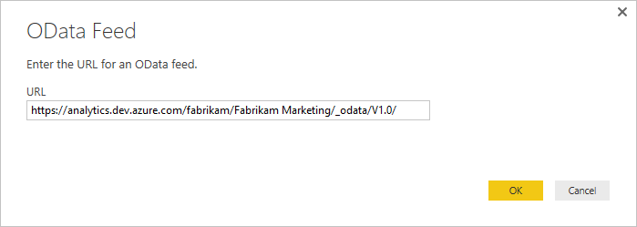
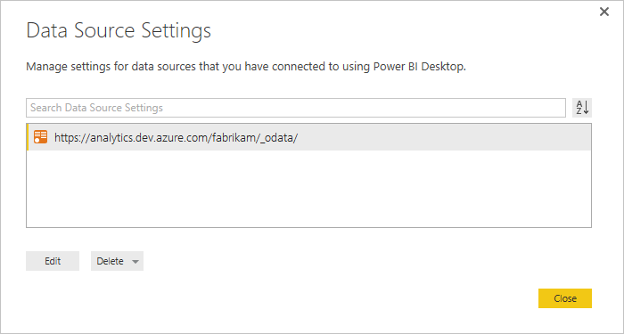
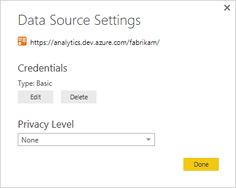

# Client authentication options 

**VSTS**  

[!INCLUDE [temp](../_shared/analytics-preview.md)]

In general, the order of authentication options should be the following (in order from most secure to least secure): Azure Active Directory (**AAD**) then Personal Access Tokens (**PAT**s) then Alternate Access Credentials (**AAC**s).

<!---

> [!NOTE]  
> If you are using Team Foundation Server, you should use Integrated Authentication wherever possible as that is the most secure authentication scheme.
 
--> 

## Azure Active Directory (AAD) 

"Azure Active Directory" is also known as "Organizational Credential" in Power BI Desktop. You can use it in  [PowerBI.com](https://powerbi.microsoft.com) through “OAuth2” selection when configuring data refresh.

When connecting with Power BI Desktop you will be prompted to enter your credentials for the data source. Click Organizational account as shown here:

 

Click the Sign in button and you will be prompted to enter your AAD credentials. After that, you're done.

To change an existing URL to use AAD instead of a PAT or AAC, see [Change authentication credentials](#update-credentials) later in this topic.

### Publish to PowerBI.com

After you have created the model and loaded it with data you can [publish it to Power BI](publishing-power-bi-desktop-to-power-bi.md). When using AAD, make sure to select
the **oAuth2** option. 

## Create a Personal Access Token  

 Why use a Personal Access Token over an Alternate Access Credential? For these three reasons:

- As part of good password management, these tokens automatically expire so you don't have to remember to change your password
- Since PATs are a generated password, you won't use a common password as part of your AAC, which means a more limited surface area for attack  
- If you need to provide a diagnostic trace and forget to replace the value, you can simply revoke the credential thereby maintaining secure access to VSTS.

0. Log in to VSTS, and choose My security from your account menu options.  

	 

0. From the Personal access tokens page, click Add:  

	  

0. Click Add, and fill out the required information: 
	- Add a description  
	- Set the expiration period  
	- Select the account 
	- Choose Selected scopes
	- Check the **Analytics (read)**
	
	And, then click Create Token.  

	   

0. Copy the token that displays. If you navigate away from the page, you won't  be able to retrieve it later.  

	  

0. If you need to revoke a token, simply navigate to this page and click the **Revoke** link. That token will immediately be deniedaccess to VSTS.
	
	These tokens are your identity. When used, the token is acting as you. Keep your tokens secret and treat them like your password. To help keep your token more secure, consider using credential managers so that you don't have to enter your credentials every time you push.  

## Create an Alternate Access Credential 

Alternate Access Credentials should be used as a last resort, but if you have to use them, do the following:

0. From the Security page, open Alternate authentication credentials.

	

0. Check Enabled alternate access credentials, enter a password, confirm the password and then click Save.

## Enter credentials within a client

Both Power BI and Excel work using Power Query when accessing OData, therefore the authentication mechanism, including the various
authentication screens are identical. This walkthrough is done using Power BI Desktop, however it also applies to Excel.

1. Open **Power BI Desktop**.  

2. Click **Get Data**.  

3. Click **OData Feed** (or More > Other > OData Feed).  

4. Enter the URL for the OData endpoint and click **OK**.  

	  

5. In the authentication dialog, click Basic, enter your credentials, and then click **Connect**:  
	- If you are using an AAC, enter your username and password  
	- If you are using a PAT, enter a text string, such as "test" or "user" for the username and enter the token in the password field.      

	  

## Change authentication credentials

If you receive an access denied message, you may need to change your authentication credentials. Power Query caches your credential information so you only have to enter it once. However, Personal Access Tokens expire and you may need to update or change your authentication information. 

### Update credentials in Power BI Desktop

1. Open **Power BI Desktop**.  

2. Click **File** > **Options and Settings** > **Data Source Settings**. Select the correct URL to the OData Feed and click **Edit**.  

	   

3. In the next **Data Source Settings** dialog, click the Edit button under the Credentials setting.   

	

5. Edit the credentials as noted above, click **Save**, then **Done**, then **Close**. 

### Update credentials in Excel 

1. Open **Excel** and click the **Data** tab.  

2. Click **New Query** > **Data Source Settings...**

	

3. Select the correct URL to the OData Feed and click **Edit**.  

	  

5. In the next **Data Source Settings** dialog, click the Edit button under the Credentials setting. 
 
	  

6. Edit the credentials as noted above, click **Save**, then **Done**, then **Close**.

## Related notes

- [Analytics service overview](overview-analytics-service.md)  
- [Authenticate your identity with personal access tokens](../../accounts/use-personal-access-tokens-to-authenticate.md)  
- [Access data through Excel](access-analytics-excel.md)  
- [Access data through Power BI desktop](access-analytics-power-bi.md)  
- [Publish a Power BI Desktop file to PowerBI.com](publishing-power-bi-desktop-to-power-bi.md)  

