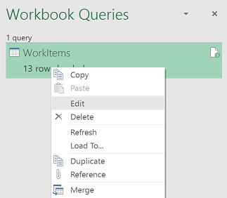
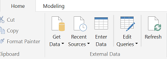
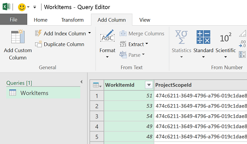
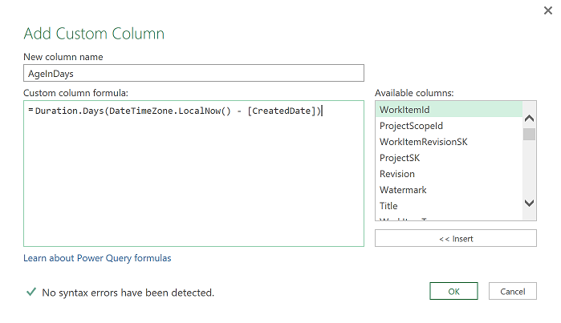
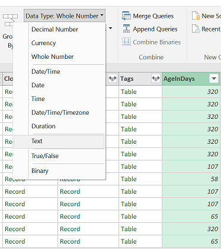
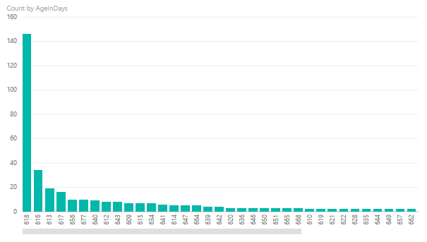

#Create custom calculations with Power Query

**VSTS**  

[!INCLUDE [temp](../_shared/analytics-preview.md)]

One of the benefits of using Power BI or Excel is the ability to add calculated fields to the
data set. There are several ways to add a calculated column and you can use either [Power Query](https://msdn.microsoft.com/en-us/library/mt211003.aspx) or 
[DAX](https://support.office.com/article/Data-Analysis-Expressions-DAX-in-Power-Pivot-BAB3FBE3-2385-485A-980B-5F64D3B0F730).  

In this topic we'll add a simple but useful column - an Age In Days column.  

1. First, navigate to the correct location within the file:  
	- For Excel: [Access data through Excel](access-analytics-excel.md)   
	- For Power BI: [Access data through Power BI desktop](access-analytics-power-bi.md).  

2. Choose to Edit Queries:  

	**For Excel:**  

	In the Workbook Queries pane (if this is not visible, select the Data tab and Show Queries), right-click WorkItems and click Edit.  

	  

	**For Power BI** 

	From the Home tab, click Edit Queries.  

	  

3. Select the **WorkItems** query from the query list  

4. On the **Add column** tab, click **Add Custom Column**  

      

5. Enter the calculation as shown in the following image:  

      

    This formula simply calculates the duration between the current date and time and when the work item was created. It then turns the duration into days.  

6. Click **OK** then click the **Home** tab.  

7. Select the AgeInDays column and change the data type to **Text**.  

      

    We need to do this otherwise the application tries to sum this value when applied to axis which does not produce the desired results  

6. Click **Close & Apply**

	Then you can create a chart similar to the one below which shows a histogram of open bugs by age in days.

	  

