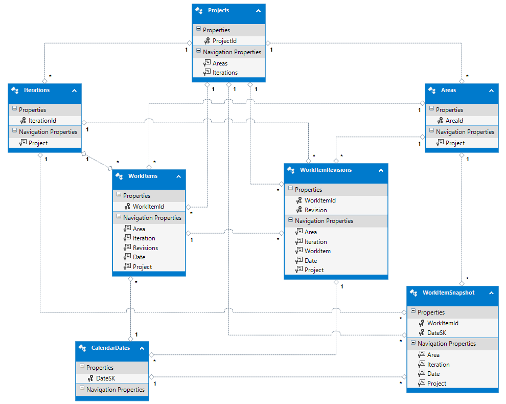

#Data model for the Analytics service  

**Team Services**  

[!INCLUDE [temp](../_shared/analytics-preview.md)]


The Analytics service data model consists of data sets, counts, and measures, as well as how data sets relate to each other.  

##Entities  

<blockquote style="font-size: 13px">**Note:** Information listed may differ from the entities shown as```https://[collection].analytics.visualstudio.com/DefaultCollection/_odata/$metadata```.</blockquote>  

The entities support by the data model are as follows:  

| Entity | Description|  
|--------|------------|  
|Areas | A discrete list of area paths |  
|BoardLocations | A discrete list of Kanban board columns |  
|Dates | A date table for use in retrieving dates in a specific format (or filtering by dates) on related entities|  
|Iterations | A discrete list of iteration paths|  
|Projects | Contains a list of all of the projects|  
|Tags | A discrete list of tags related to work items|  
|Teams | Contains a list of all teams|  
|WorkItemBoardSnapshot | A list of all revisions for all work items (including the current revision)|  
|WorkItemLeadTime |  |  
|WorkItemLinks | Contains link information (all types are supported) for work items only (no hyperlinks for example)|  
|WorkItemRevisions | A list of all revisions for all work items (including the current revision)|  
|WorkItemLinks | Contains link information (all types are supported) for work items only (no hyperlinks for example)|  
|WorkItems | The current list of work items|  
|WorkItemSnapshot | The state of each work item on each calendar. Use this entity for trend reporting. |  
|Users | A discrete list of users related to various work item fields (i.e. assigned to, created by, etc.)|  


##Relationships

The entity model for this is fairly complex and is difficult to understand without an interactive model. This is because entities play
different roles depending on the starting point. For example, a Project contains Teams, Areas and Iterations. However, Teams also "own" a subset of these Iterations and Areas and they can overlap a given team. 

The following image proves a snapshot of the current data model; only keys and navigation properties are shown here.




##Related notes 

- [WIT analytics](wit-analytics.md)  
- [Aggregate data](aggregated-data-analytics.md)
- [Overview of the analytics service](overview-analytics-service.md)


