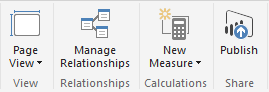
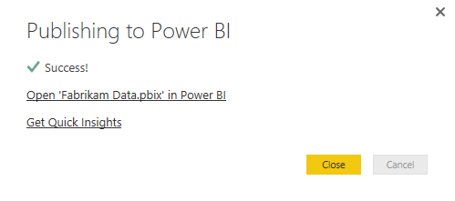
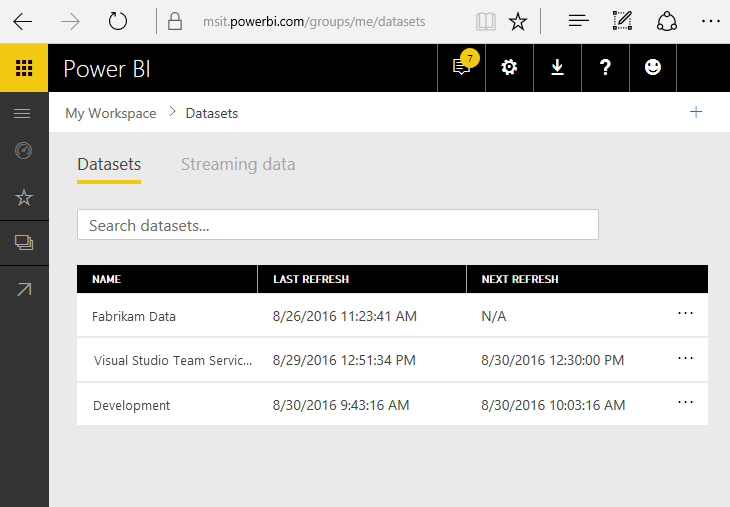
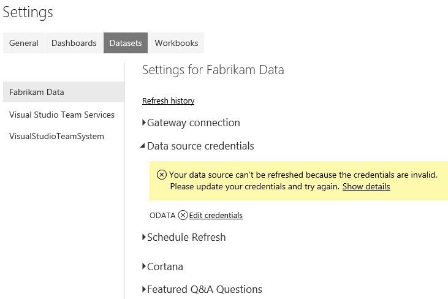
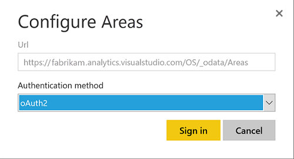
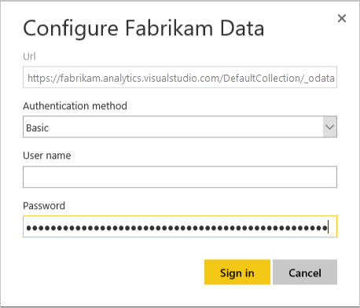

# Publish a Power BI Desktop file to PowerBI.com 

**Team Services**  

[!INCLUDE [temp](../_shared/analytics-preview.md)]

Once you've [created a Power BI Desktop file](access-analytics-power-bi.md) and the associated charts and tables, you can share those with others by creating a dashboard on PowerBI.com. This process walks you through how to do that.

0. Open the **Power BI Desktop** file with your data.  

0. Click **Publish** on the **Home** tab. 

     

0. You will be prompted to Sign in or create and if you don't have a Power BI account you can create one. Click **Sign in**
    
    If you are already signed in, the dialog will go away and you will see a Publishing to Power BI message.
    After the publishing is complete you'll see a success message.

     

0. Click the **Open 'file name' in Power BI** link

0. Expand the navigation pane in Power BI and select the work space that you selected when you published the report.  

0. Click **Datasets** in the upper right corner.

0.  Click the ellipsis next to the dataset that represents the report you just loaded (this is typically the file name.   

     

0. Click **Schedule Refresh**.  

0. Click the Edit credentials link next to ODATA under Data source credentials as shown here:

     

0. Select the appropriate authentication option (as discussed in [Client Authentication Options](client-authentication-options.md)). 
* Use **oAuth2**  for Azure Active Directory (AAD) credentials.

    
 
* Use **Basic** for PAT credentials   

    

	See [Client Authentication Options](client-authentication-options.md) for more information on acquiring credentials.  

0. Click **Sign in**.  

At this point the data will update on your scheduled basis using the credentials entered.

<blockquote style="font-size: 13px">
    **Important:** If you are using a Personal Access Token, remember that the token expires on a set interval. When it expires you'll need to [update the credentials](client-authentication-options.md#update-credentials). Otherwise the report, while still displaying data, won't update with the latest data.
</blockquote>

## Related notes

- [Analytics service overview](overview-analytics-service.md)  
- [Client Authentication Options](client-authentication-options.md)
- [Authenticate your identity with personal access tokens](../../setup-admin/team-services/use-personal-access-tokens-to-authenticate.md)  
- [Access data through Excel](access-analytics-excel.md)  
- [Access data throughPower BI desktop](access-analytics-power-bi.md)  
