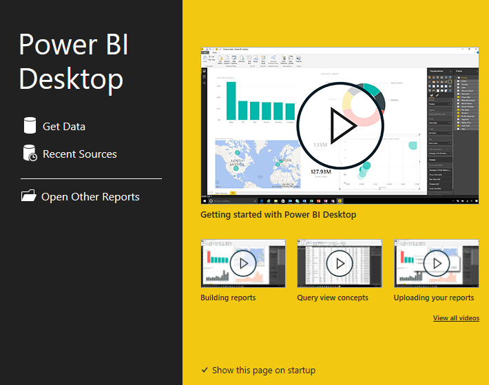
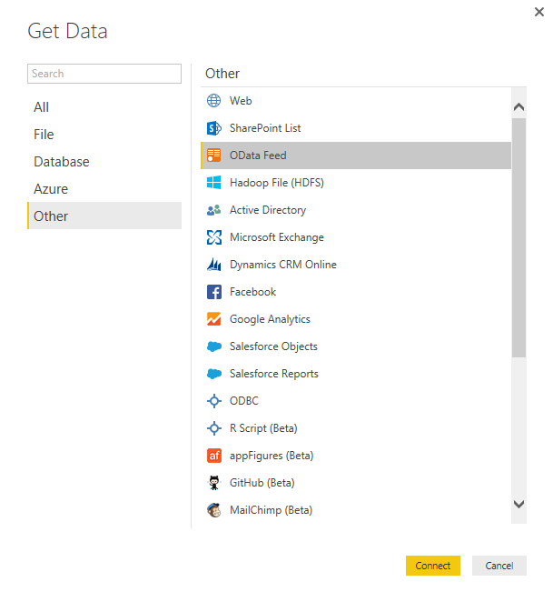
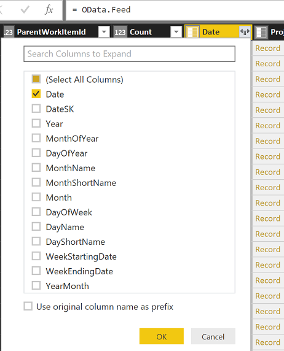
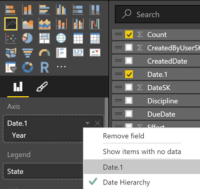
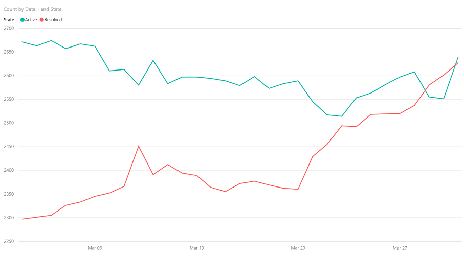

#Query for trend data

**Team Services**  

[!INCLUDE [temp](../_shared/analytics-preview.md)]

Examining trends in data and making period-over-period comparisons are two of the most interesting aspects of data analysis. The Analytics service supports this capability fully. It does, depending on what you are trying to accomplish, require some manual work at this point in time.

Trend data is captured in the WorkItemSnapshot and WorkItemBoardSnapshot entities. They are constructed such that every work item, from the day it was created until today, exists for each day. This means that for an account with only one work item that was created a year ago, there are 360 rows in this entity.  

For any project of size, this entity will be far too large to load into a client tool.  

What is the solution? Aggregation Extensions. 

Using the OData Aggregation Extensions, you can distill the data 
on the server and return only the aggregated data thereby making the data manageable. Let's
take a basic scenario - showing bug trends for the month of March. Bug trends are a common and critical part of managing any project so you can put this to good use immediately.

See the topic [Aggregate data](aggregated-data-analytics.md) for more detailed information on
constructing aggregation queries.

##Construct the basic query    
There are some basic requirements you need to effectively query the WorkItemSnapshot table:  
* The data needs to be filtered by date  
* The aggregation should group by, at the very least, date  

With this in mind, the query to create a bug trend report looks like the following: 

```
https://[account].analytics.visualstudio.com/DefaultCollection/[project]/_odata/WorkItemSnapshot?$apply=filter(Date/Date ge 2016-03-01 and Date/Date le 2016-03-31 and WorkItemTyp eq 'Bug')/groupby((Date/Date,State), aggregate(Count with sum as Count))&$orderby=Date/Date
```

This query will produce at most, 31 * number of bug states. The default bug has three states 
(Active, Resolved and Closed) which means at most, this query will return 93 rows no matter 
how many thousands of records actually exist. This provides a much more compact form of returning data and it also loads faster into client tools.  

Before walking you through how to use this in a client tool, let's look at a variation on this example. You want to see the bug trend for an iteration or a release which starts with one iteration and ends with another.  

To construct that query, do the following:  

```
https://[account].analytics.visualstudio.com/DefaultCollection/[project]/_odata/WorkItemSnapshot?$apply=filter(Iteration/IterationName eq 'Sprint 99')/filter(Date/Date ge Iteration/StartDate and Date/Date le Iteration/EndDate and WorkItemType eq 'Bug')/groupby((Date/Date,State), aggregate(Count with sum as Count))&$orderby=Date/Date
```

In this query, there are two key differences. We added a filter clause to filter the data to a specific iteration and the dates are now being compared to the iteration start and end dates versus a hard coded date.  

<blockquote style="font-size: 13px">
**Note:** Using Power Query you can craft the query such that it provides a rolling chart using a formal, such as, todays date minus 30 days for a rolling 30 day chart.
</blockquote>

Now that we have a basic query that we can use, it's time to jump into a client tool. For this walkthrough I will use Power BI, but the same applies to Excel.  

##Query for trend data in Power BI Desktop

1. Open Power BI Desktop and select Get Data.   

	  

2. For this step you can choose either Web or OData Feed. Each has benefits over the other. For simplicity, we'll choose OData Feed.  

	  

3. For the query, enter the query you crafted for your project which matches one of the above queries and click OK.  

4. When the preview is shown, click **Edit**.  

    You'll note that this loads as "Query 1" rather than the WorkItemSnapshot table. You can rename this query in the Query Editor.

    What's unique about this approach is that the table that is created (Query1) will contain all of the columns from the WorkItemSnapshot entity even though it only shows data in the Date, Count and State columns.  

5. Find the Date column and expand it, selecting only the Date column as shown below (it will also rename the column to Date.1).  

	  

6. Click **OK**.  

7. Click **Close and Apply**.  

    Now we can construct the chart.

8. In the Field List, select Count (this will create a bar chart).

9. Drag the State to the Legend area.  

10. Add Date.1 to the Axis area, click the drop down next to the date and select Date.1 as shown here.  

	    

	This removes the date hierarchy which otherwise acts as a drilldown function which we do not want here.

11. Change the chart to a line chart and you now have an excellent bug trend chart as shown here. 

	  

	Note that the Closed state has been filtered out for presentation purposes.