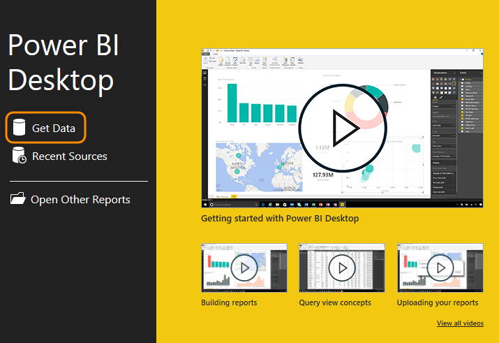
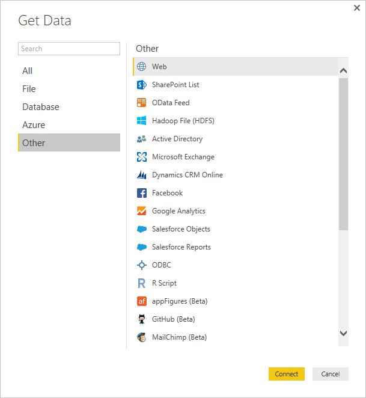
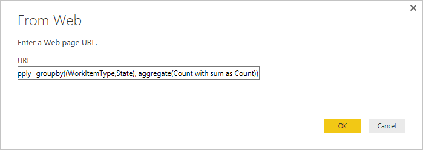
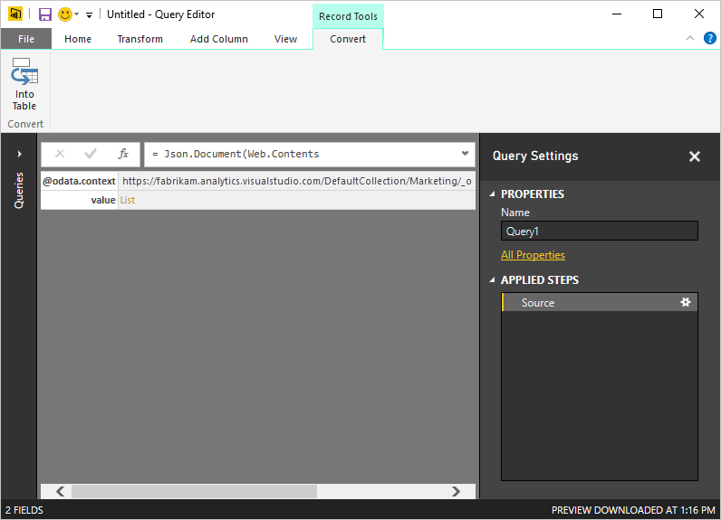
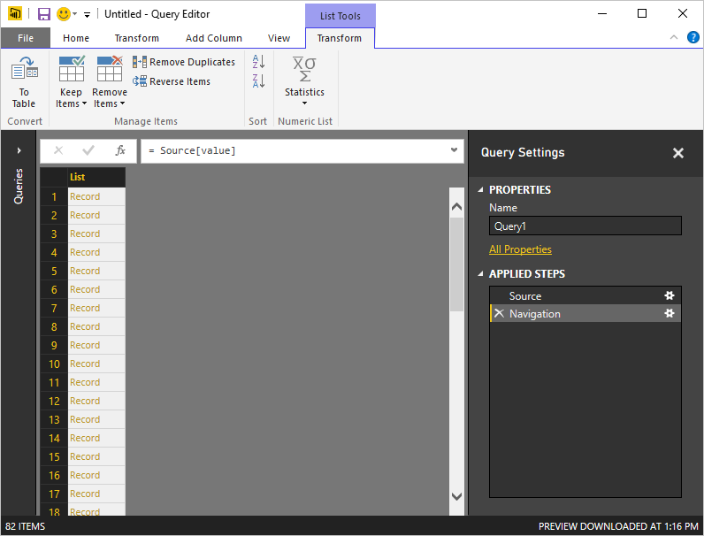
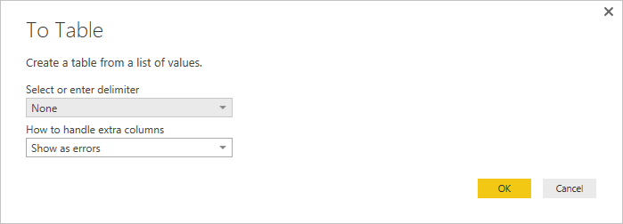
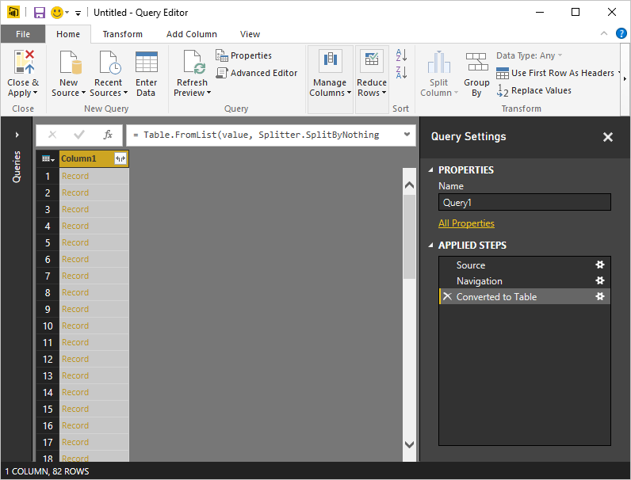
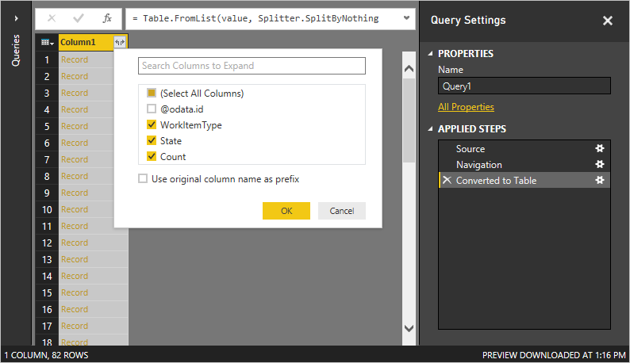
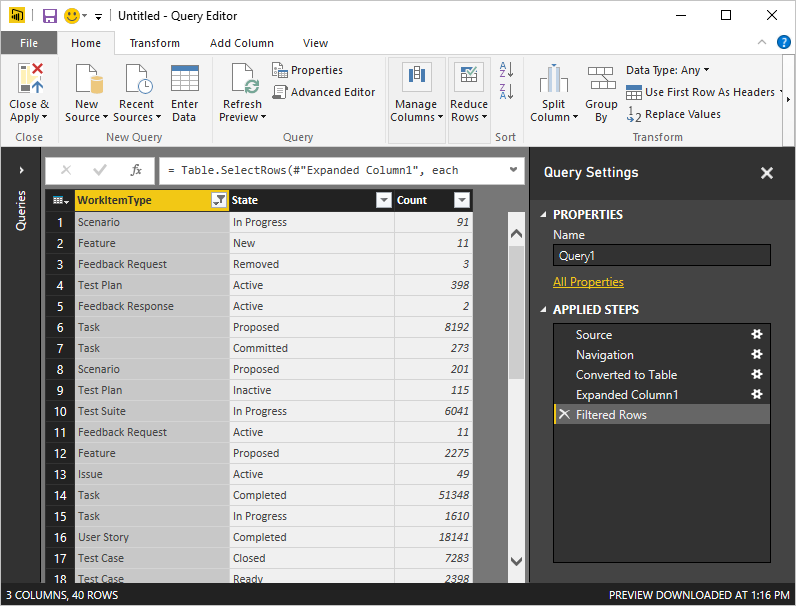
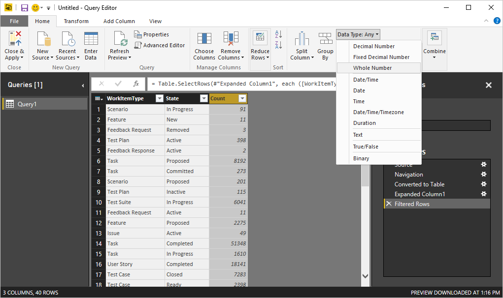

#Using OData Aggregations with Power BI desktop  

**VSTS**  

Currently, Power Query (the underlying technology in both Power BI Desktop and  
Excel) does not support OData Aggregation Extensions. However, Power Query is  
extremely flexible and as such has an easy mechanism for allowing this content  
to be used. This article walks you through this process.

[!INCLUDE [temp](../_shared/analytics-preview.md)]

In order to use Aggregation Extensions with Power BI Desktop, you must manually create the URL which requires knowledge of [OData on Analytics Service](../extend-analytics/index.md) and the
[Aggregation Extensions](../extend-analytics/aggregated-data-analytics.md) specifically. Please review these two topics before continuing.

For the purposes of this walkthrough, we'll create a simple aggregation query which returns the count of work items by Work Item Type and State. The URL for this query is shown below.

```OData
https://{account}.analytics.visualstudio.com/{project}/_odata/v1.0-preview/WorkItems?$apply=groupby((WorkItemType,State), aggregate($count as Count))  
```

Execute this query in your browser to make sure it works first. Replace the account and project names with the appropriate values.

Now that we have the query, it's time to make use of it. Follow these steps to be able to retrieve this data in Power BI Desktop:

1. Open **Power BI Desktop**  

2. Click **Get Data**  

     

3. Select **Other** > **Web**  

      

4. In the **From Web** dialog, paste the URL for the query and click **OK**  

      

5. If prompted for credentials, see the article [Client Authentication Options](client-authentication-options.md) and enter the appropriate credentials.  

	The query editor will open and look like the following:  

      

6. Click the **list** link in the query results.  

7. Click **To Table** from the **Transform** tab.  

      

8. Click **OK** on the **To Table** dialog.  

      

9. Click the **Column Expander** in the query results.  

	

10. In the Expand dialog, uncheck @odata.id and uncheck the Use original column name as prefix checkbox and click **OK**.  

      
   
    This will result in the data being shown, nicely formatted in columns without any extraneous information. At this point, you can rename the query (on the right under Properties) to something more meaningful but that isn't required.  

    

11. Finally, change the data type of the Count column from Any to Whole Number.

      

12. Click **Close & Apply** from the **Home** tab.

At this point you can now create charts and graphs based on the data and publish this file to Power BI by following the topic [Publishing Power BI Desktop to Power BI](publishing-power-bi-desktop-to-power-bi.md).