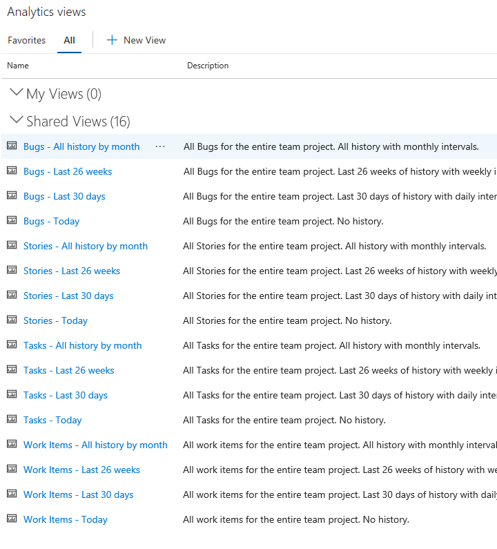

# What are Analytics views?

[!INCLUDE [temp](../../_shared/version-vsts-only.md)]

An Analytics view provides a simplified way to specify the filter criteria for a Power BI report based on the Analytics Service data store. The Analytics Service provides the reporting platform for Azure DevOps.

Each view defines a dataset designed to support viewing, sharing, and publishing work tracking data for Azure DevOps Services through Power BI. You can use default Analytics views or create custom views and open the view using the [Power BI Data Connector](../powerbi/data-connector-connect.md). You create custom views in the web portal for Azure DevOps Services. 

[!INCLUDE [temp](../_shared/analytics-view-availability.md)]

## Analytics Marketplace extension 

When you install the [Analytics Marketplace extension](https://marketplace.visualstudio.com/items?itemName=ms.vss-analytics), the following actions occur: 
- The **Analytics views** pages appear in your web portal for your Azure DevOps projects
- Several [Analytics widgets](analytics-widgets.md) become available for use on your Azure DevOps Services dashboards 
- Several default Analytics views are created as described in the next section. 

[!INCLUDE [temp](../_shared/boards-disabled.md)]

## Default Analytics views

The default Analytics views shown in the following image provide a great way to get started and are immediately accessible from Power BI. These views are automatically created when you install the [Analytics Marketplace extension](https://marketplace.visualstudio.com/items?itemName=ms.vss-analytics). The view you select determines the set of records, fields, and history that are pulled into Power BI.  

Here we show the default views created for a project based on the Agile process. 

> [!div class="mx-imgBorder"] 
> 

[!INCLUDE [temp](../_shared/analytics-image-differences.md)] 

When using the Power BI Data Connector, these same default views appear in the Navigator dialog. The view you select determines the set of records, fields, and history which are loaded into Power BI. 

Default Analytics views work well for customers with small datasets. To learn more, see [Default Analytics views](analytics-default-views.md).

If the default Analytics views do not meet your needs, you can create custom views to fine-tune the records, fields, and history returned to Power BI.

## Custom Analytics views

Customers that need to fine-tune the records, fields, and history of data they view in Power BI can create custom Analytics views. A custom view supports defining the following options:
- Sharing options
- Work item filters 
- Team and area path filters
- Backlog and work item type filters
- Field specific filters 
- Fields to display 
- View history and trend options 

To learn more, see [Create an Analytics view](./analytics-views-create.md).

## Simplify creation of your Power BI reports using Analytics views 

By using a default or custom Analytics view, you'll find it easy to generate Power BI reports of your work tracking data. The dataset built for Analytics views in Power BI is modeled to make it easy to get started with Power BI reports.

For more information on how the dataset is modeled when using the Power BI Data Connector, see [dataset design for the Power BI Data Connector](../powerbi/data-connector-dataset.md).

## Try this next
> [!div class="nextstepaction"]
> [Data available from the Analytics Service](data-available-in-analytics.md)

 
