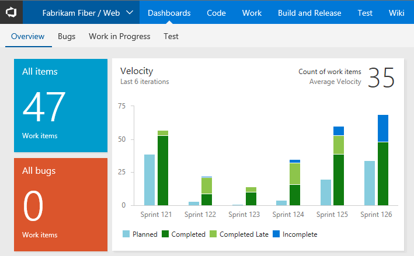

# What is the Analytics Service?

[!INCLUDE [temp](../../_shared/version-azure-devops.md)]

The Analytics Service provides the reporting platform for Azure DevOps and Azure DevOps Server. Use it to answer quantitative questions about the past or present state of your projects. This service provides a concise data model over Azure DevOps. Built for reporting, the Analytics Service is optimized for fast read-access and server-based aggregations.

To gain access to the Analytics Service for your Azure DevOps organization, install the [Analytics extension](../analytics/analytics-extension.md). Once installed, the Analytics Service populates itself with all available Azure DevOps data. Once populated, it updates itself as data changes occur. For more information, read [Data available in Analytics Service](./data-available-in-analytics.md) and [Performance and latency](performance-latency.md).

> [!NOTE]
> **The Analytics Service is in public preview**. While in preview, it is available to everyone free of charge. Analytics is also available in all regions. We encourage you to use it and provide us feedback. As we add features, we will post them on the [Microsoft DevOps Blog](https://blogs.msdn.microsoft.com/devops/tag/reporting/).

You can access the Analytics Service through dashboard widgets, OData, and Power BI.

In addition, you can [analyze test results](../../pipelines/test/test-analytics.md?toc=/azure/devops/report/analytics/toc.json&bc=/azure/devops/report/analytics/breadcrumb/toc.json) via the test analytic charts for builds and releases. 

## Dashboard widgets

In Azure DevOps, you can create [dashboards](../dashboards/dashboards.md) and [add widgets to them](../dashboards/add-widget-to-dashboard.md). We provide several [widgets based on the Analytics Service](analytics-widgets.md). These widgets take advantage of the power of the Analytics Service. 

For example, the Velocity widget shown in the following dashboard image provides insights into a team's historical performance over six iterations. 

Here, the Velocity widget shows that this team has a history of closing stories late. It also shows a discrepancy between planned and completed work across all the sprints displayed. The team can drill into the data to determine the root causes. After implementing new practices, the team can use the Velocity widget to track their effectiveness.

Widgets provide the easiest way to get insights from your data. Check out [Enable and use the Analytics Services](enable-analytics-velocity.md) for a step-by-step guide to get started with the Velocity Widget.

If you want to develop your own widget based on the Analytics Service, see [Create an Analytics widget for Azure DevOps](../extend-analytics/example-analytics-widget.md).

## Power BI
[Power BI](https://powerbi.microsoft.com) is a suite of business analytics tools. Use it to do ad-hoc analysis, produce beautiful reports, and publish for enterprise consumption.

The easiest way to pull Azure DevOps data into Power BI is to use the [Power BI Data Connector](../powerbi/data-connector-connect.md). The Azure DevOps Power BI Data connector works with Analytics views. For more information, read [What are Analytics views](./what-are-analytics-views.md).
 
::: moniker range="vsts"

::: moniker-end

::: moniker range="azdevserver-2019"

::: moniker-end

Also, you'll find additional ways to pull Azure DevOps data into Power BI as described in [Power BI integration overview](../powerbi/overview.md).

## OData
The Analytics Service is fully accessible via OData. If you would like to prepare custom queries and tooling with our OData API, see [Extend on Analytics](../extend-analytics/index.md).

## Data available in the Analytics Service

**The Analytics Service is in public preview.** At this point, not all data is available via the Analytics Service.

For more information read [Data available in Analytics](./data-available-in-analytics.md).

## Availability for Azure DevOps Server

Azure DevOps Server 2019 and later versions support Analytics. 

**TFS 2018 and earlier versions do not support Analytics.**

For TFS 2018 and earlier, you may use [Dashboards](../dashboards/dashboards.md) with a [variety of widgets](../dashboards/widget-catalog.md) that don't require the Analytics Service. You may also use [SQL Server Reporting](../sql-reports/index.md). 

## Try this next
> [!div class="nextstepaction"]
> [Analytics widgets](analytics-widgets.md) or [What are Analytics views?](what-are-analytics-views.md) 
