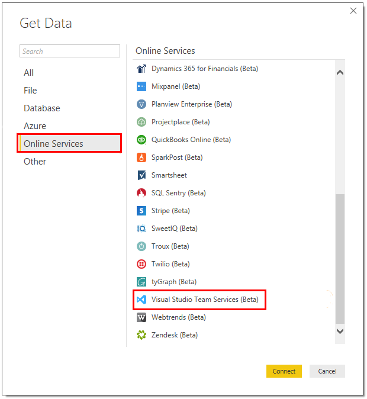

# What is the Analytics Service?

[!INCLUDE [temp](../../_shared/version-vsts-only.md)]

The Analytics Service provides the reporting platform for Azure DevOps. Use it to answer quantitative questions about the past or present state of your projects. This service provides a concise data model over Azure DevOps Services. Built for reporting, the Analytics Service is optimized for fast read-access and server-based aggregations.

To gain access to the Analytics Service for your Azure DevOps Services organization, install the [Analytics extension](https://marketplace.visualstudio.com/items?itemName=ms.vss-analytics). Once installed, the Analytics Service populates itself with all available Azure DevOps Services data. Once populated, it updates itself as data changes occur. For more information, read [Data available in Analytics Service](./data-available-in-analytics.md) and [Performance and latency](performance-latency.md).

> [!NOTE]
> **The Analytics Service is in public preview**. While in preview, it is available to everyone free of charge. Analytics is also available in all regions. We encourage you to use it and provide us feedback. As we add features, we will post them on the [Microsoft DevOps Blog](https://blogs.msdn.microsoft.com/devops/tag/reporting/).

You can access the Analytics Service through dashboard widgets, OData, and Power BI.

In addition, you can [analyze test results](../../pipelines/test/test-analytics.md?toc=/azure/devops/report/analytics/toc.json&bc=/azure/devops/report/analytics/breadcrumb/toc.json) via the test analytic charts for builds and releases. 

## Dashboard widgets

In Azure DevOps Services, you can create [dashboards](../dashboards/dashboards.md) and [add widgets to them](../dashboards/add-widget-to-dashboard.md). We provide several [widgets based on the Analytics Service](analytics-widgets.md). These widgets take advantage of the power of the Analytics Service. 

For example, the Velocity widget shown in the following dashboard image provides insights into a team's historical performance over six iterations. 

Here, the Velocity widget shows that this team has a history of closing stories late. It also shows a discrepancy between planned and completed work across all the sprints displayed. The team can drill into the data to determine the root causes. After implementing new practices, the team can use the Velocity widget to track their effectiveness.

Widgets provide the easiest way to get insights from your data. Check out [Enable and use the Analytics Services](enable-analytics-velocity.md) for a step-by-step guide to get started with the Velocity Widget.

If you want to develop your own widget based on the Analytics Service, see [Create an Analytics widget for Azure DevOps Services](../extend-analytics/example-analytics-widget.md).

## OData
The Analytics Service is fully accessible via OData. If you would like to prepare custom queries and tooling with our OData API, see [Extend on Analytics](../extend-analytics/index.md).

## Power BI
[Power BI](https://powerbi.microsoft.com) is a suite of business analytics tools. Use it to do ad-hoc analysis, produce beautiful reports, and publish for enterprise consumption.

The easiest way to pull Azure DevOps Services data into Power BI is to use the [Power BI Data Connector](../powerbi/data-connector-connect.md). The Azure DevOps Services Power BI Data connector works with Analytics views. For more information, read [What are Analytics views](./what-are-analytics-views.md).
 

Also, you'll find additional ways to pull Azure DevOps Services data into Power BI as described in [Power BI integration overview](../powerbi/overview.md).

## Data available in the Analytics Service

**The Analytics Service is in public preview.** At this point, not all data is available via the Analytics Service.

For more information read [Data available in Analytics](./data-available-in-analytics.md).

## Availability for Team Foundation Server (TFS)

**The Analytics Service is not yet available for our on-premises product, Team Foundation Server (TFS).** 

We are working on a plan to bring Analytics to the next major release of TFS.

When we have information on when it will be available, we will update this page. Look for announcements on the [Microsoft DevOps Blog](https://marketplace.visualstudio.com/items?itemName=ms.vss-analytics).

For TFS reporting, you may use [Dashboards](../dashboards/dashboards.md) with a [variety of widgets](../dashboards/widget-catalog.md) that don't require the Analytics Service. You may also use [SQL Server Reporting](../sql-reports/index.md). 

The future of reporting for both Azure DevOps Services and TFS, however, is the Analytics Service. 

## Try this next
> [!div class="nextstepaction"]
> [Analytics widgets](analytics-widgets.md) or [What are Analytics views?](what-are-analytics-views.md) 
