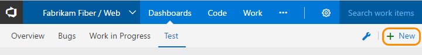
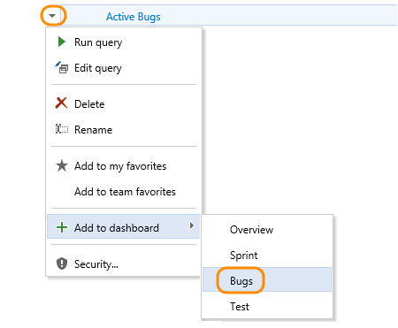
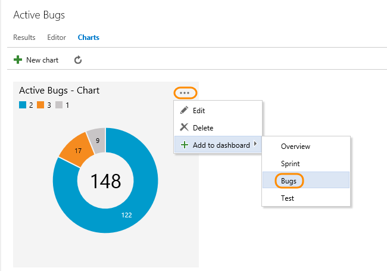
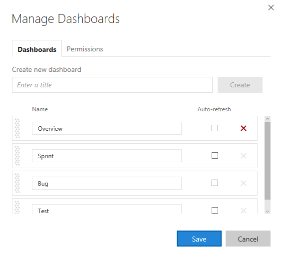
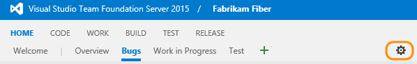
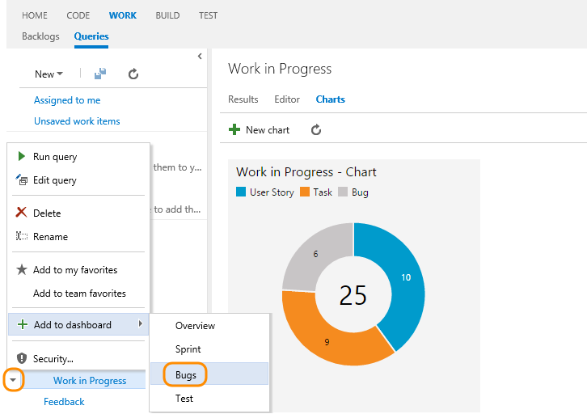

# Dashboards

<b>Team Services | TFS 2017 | TFS 2015.1-2015.3 | [TFS 2015 | TFS 2013](team-dashboard.md)</b>

>[!NOTE]  
><b>Feature availability: </b>Multiple team dashboards and the [widget catalog](widget-catalog.md) are available from Visual Studio Team Services and from the web portal for TFS 2015.1 or later version. 
>
>If you connect to an on-premises TFS running TFS 2015 or earlier version, you don't have access to multiple team dashboards. Instead, your home page serves as a [single team dashboard](team-dashboard.md) For information on SharePoint dashboards, see [Project portal dashboards](sharepoint-dashboards/project-portal-dashboards.md).  

Share progress and status with your team using configurable team dashboards. Dashboards provide easy-to-read, easy access, real-time information. At a glance, you can make informed decisions without having to drill down into other parts of your team project site. 

The Overview page provides access to a default team dashboard which you can customize by adding, removing, or rearranging the tiles. Each tile corresponds to a widget that provides access to one or more features or functions.  

   

Anyone with access to the team project, including [stakeholders](../quickstart/get-started-stakeholder.md), can view dashboards. However, only team admins can add or modify dashboards. 

If you need to add a team first, see [Multiple agile teams](../work/scale/multiple-teams.md). 

##Add and name your dashboard 

From the dashboards tab, click the  and enter a dashboard name. 

 

If you don't see the , then you're not a team admin for the currently selected team. Either [switch the context to your team](#switch-team-context), or request you be added as a [team admin](../work/scale/add-team-administrator.md). 

With the dashboard selected, you can add [widgets and charts to the dashboard](add-widget-to-dashboard.md). Or, you can [add charts to a team dashboard from the Work, Build, or Test hubs](add-widget-to-dashboard.md#add-charts).

###Edit dashboard  

>[!NOTE]  
><b>Feature availability: </b>Dashboard edit mode controls shown appear from Team Services or TFS 2015.2 or later version. Some functionality differs when you connect to an application server running TFS 2015.1 or later version.   

###Add a widget  

Click  to modify a dashboard. Click  to add a widget to the dashboard.
  
>[!NOTE]  
><b>Feature availability: </b>From Team Services and TFS 2017 and later versions, you can drag and drop a widget from the catalog onto the dashboard. 

The [widget catalog](widget-catalog.md) describes all the available widgets, many of which are scoped to the selected team context.  

 

>[!TIP]  
>When you're in dashboard edit mode, you can remove, rearrange, and configure widgets, as well as add new widgets. Once you leave edit mode, the widget tiles remain locked, reducing the chances of accidentally moving a widget.  

### Configure a widget  
After you add the widget, you may need to configure it. For example, to configure the Query tile widget, click the  to open the configuration dialog.

And then select the query and specify any rules you want. (For TFS 2015.1 and later versions, you can only specify the green and red flag limits.)  

#### Team Services configuration dialog for query tile  

  

 
###Add an item or a chart to your dashboard 

You add an item to a dashboard from the code, work, and build pages. 

First, make sure you have the team context selected from the Queries page to which you want to add a query or chart. 

For example, select the context menu of a query that you want to add to the dashboard. This is the same as adding a query tile widget. 

  

And, you can add a chart to a team dashboard in a similar way.  

  

## Copy a widget 

>[!NOTE]  
>**Feature availability:**  This feature is currently only available from Team Services.    

To copy a configured widget to another team dashboard, click the  actions icon and select Add to dashboard. 

  

## Move or delete a widget from a dashboard  

>[!NOTE]  
>Just as you have to be a team or project admin to add items to a dashboard, you must have admin permissions to remove items.  

Click  to modify your dashboard. You can then drag tiles to reorder their sequence on the dashboard. 

To remove a widget, click the widget's  or  delete icons. 

When you're finished with your changes, click  to exit dashboard editing.

 
##Manage dashboards

>[!NOTE]  
>**Feature availability:**  You can  configure the auto-refresh setting for each dashboard on Team Services and for TFS 2015.2 and later versions. For Team Services and TFS 2017.1 and later versions, you can [set dashboard permissions](#set-permissions). 

You can rename, reorder, or delete a dashboard. Also, you can enable auto-refresh, and the dashboard will automatically update every 5 minutes.  

From Team Services and TFS 2017, you can also manage dashboard permissions.  

<ul class="nav nav-pills" style="padding-right:15px;padding-left:15px;padding-bottom:5px;vertical-align:top;font-size:18px;">
<li style="float:left;" data-toggle="collapse" data-target="#manage-dashboards">Manage dashboards </li>
<li style="float: right;"><a style="max-width: 374px;min-width: 120px;vertical-align: top;background-color:#AEAEAE;margin: 0px 0px 0px 8px;min-width:90px;color: #fff;border: solid 2px #AEAEAE;border-radius: 0;padding: 2px 6px 0px 6px;outline-style:none;height:32px;font-size:14px;font-weight:400" data-toggle="pill" href="#manage-dashboards-tfs">TFS 2015.1-2015.3</a></li>
<li class="active" style="float: right"><a style="max-width: 374px;min-width: 120px;vertical-align: top;background-color:#007acc;margin: 0px 0px 0px 0px;min-width:90px;color: #fff;border: solid 2px #007acc;border-radius: 0;padding: 2px 6px 0px 6px;outline-style:none;height:32px;font-size:14px;font-weight:400" data-toggle="pill" href="#manage-dashboards-team-services">Team Services, TFS 2017</a></li>
</ul>

  

To manage dashboards, click the  wrench icon.

   

<h3>Reorder and auto-refresh </h3> 

<ol>
<li>
Drag and drop the dashboards into the sequence you want them to appear.

  
</li>

<li>
Click  to delete a dashboard and then click Save. 
</li> 

<li>
Select the Auto-refresh checkbox when you want the dashboard to refresh every five minutes. 
</li> 
</ol>

<h3>Set permissions</h3> 

From the Permissions tab you can grant or restrict permissions to your team members to edit and manage your team dashboards.  The default setting provides all team members permissions to edit and manage dashboards. 
 
 
  

<ol>
<li>
Click the  gear icon to open manage dashboards.
  

  
</li>

<li>
Drag and drop the dashboards into the sequence you want them to appear.  

  

</li>

<li>
Click  to delete a dashboard and then click Done.
</li>  

<li>
Select the Auto-refresh checkbox when you want the dashboard to refresh every five minutes.

<blockquote style="font-size: 13px"><b>Feature availability: </b>The Auto-refresh feature is available from TFS 2015 Update 2 or later version.  </blockquote>  
</li>
</ol>

 

##Related notes

As you can see, you can use team dashboards to provide guidance and keep your team in sync, providing visibility across the org as to status, trends, and progress. See these additional  resources to help you support your team:  
- [Multiple teams](../work/scale/multiple-teams.md) 
- [Manage team assets](../work/scale/manage-team-assets.md)  
- [Share queries with your team](../work/track/using-queries.md) 
- [Create team alerts](../work/track/alerts-and-notifications.md)
- [Widget catalog](widget-catalog.md)

Also, you can [create a dashboard widget ](https://www.visualstudio.com/en-us/extend/develop/add-dashboard-widget) using the REST API service. 

### Required permissions
 
If you don't see the , then you don't have permission to edit your team dashboards. In general, you need to be a team admin for the currently selected team to edit dashboards. Request your current team or project admin to add you as a [team admin](../work/scale/add-team-administrator.md). 

If you work in Team Services, you can ask your team admin to change dashboard permissions to allow you and other team members to edit dashboards as described in [Set permissions](#set-permissions) earlier in this topic. 

[!INCLUDE [temp](../_shared/switch-team-context.md)]

<!---  
Only dashboard owners can change the configuration of their dashboards.  

To add a widget, click . The [Widget catalog](widget-catalog.md) provides descriptions of each available widget.   
To add an item, see [add items to the dashboard](#pin-items). 

You can reorder dashboard widgets through drag-and-drop. And remove widgets or items.

Click  to [add another dashboard.  

 Or add items to this dashboard and re-sequence tiles. Each tile provides team members quick access to the progress of their builds, work item status and trends, Git repositories or version control folders.

##Add items to a dashboard 

You add an item to the team dashboard from the code, work, and build pages.  

1.  If you aren't a team administrator, [get added as one](#add-team-admin).  

2.	Add a work item query from its context menu.

	

	To add a source control folder or a build definition, open the corresponding page and access the pin feature in the same way.    

3.	To add a chart, go to the query's Charts page and add it to your selected dashboard or the team homepage.  

	  

4.	Drag tiles or widgets to reorder their sequence on the dashboard.    

	Using Internet Explorer 10 or Internet Explorer 11, you can also tab to a tile and press Shift+L or Shift+R to move the selected tile to the left or to the right.

5.	Click a tile, widget, or link to open it. 

--> 

### Extensibility 

Using the REST API service, you can [add a dashboard](../../integrate/api/dashboard/dashboards.md). 

To learn more about the REST APIs for dashboards and widgets, see [Dashboards (API)](../../integrate/api/dashboard/overview.md).  

[!INCLUDE [temp](_shared/help-support-shared.md)]  