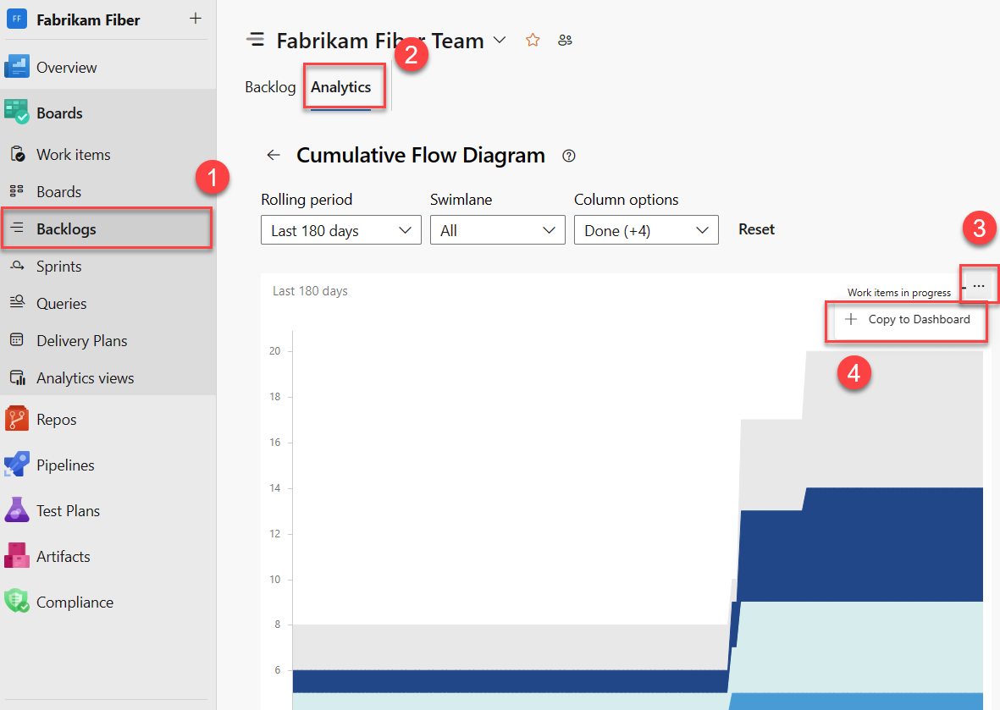
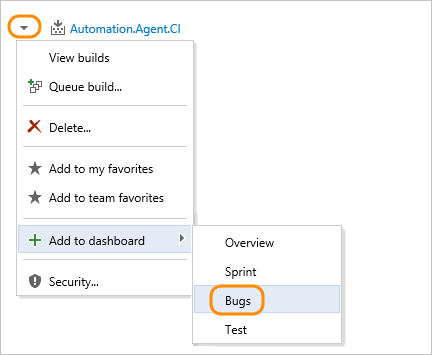
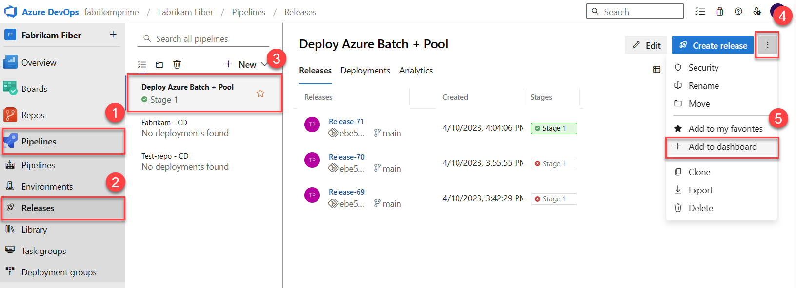
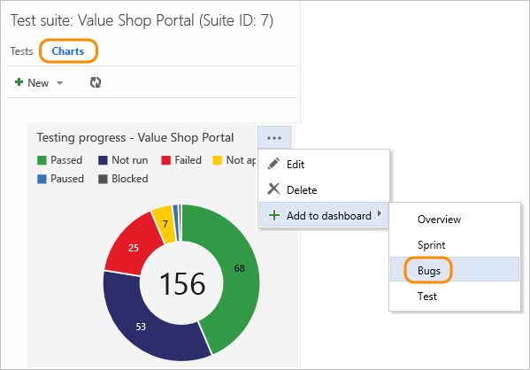
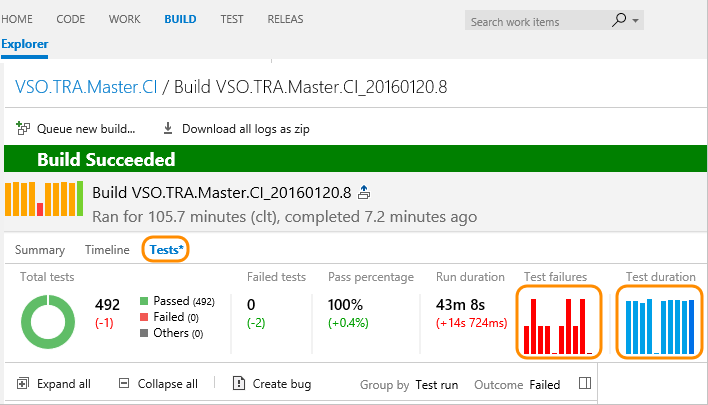
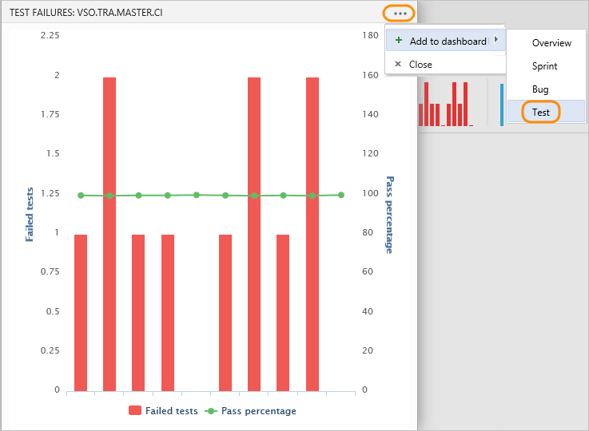
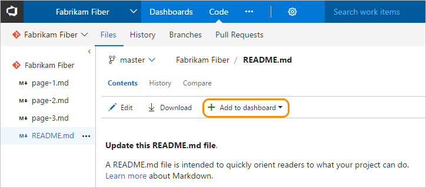

# Add charts to a dashboard

[!INCLUDE [version-lt-eq-azure-devops](../../includes/version-lt-eq-azure-devops.md)] 

::: moniker range=">= azure-devops-2020"
This article describes how to add query-based charts and in-context reports to a dashboard from their functional page. For example, you can add the Team Velocity in-context Analytics report to a dashboard. Once you've added the report, go ahead and modify the corresponding widget configuration parameters.
::: moniker-end

::: moniker range="< azure-devops-2020"
You can add the charts described in this article to a dashboard from their corresponding functional page, like: 
- Builds
- Releases
- Queries
::: moniker-end

## Prerequisites  

::: moniker range="azure-devops"

- You must be a member of a project. If you don't have a project yet, [create one](../../organizations/accounts/set-up-vs.md). 
- You must have [created the team dashboard](dashboards.md) to which you want to add a chart.  
- If you haven't been added as a project member, [get added now](../../organizations/accounts/add-organization-users.md).
- Anyone with access to a project, including [stakeholders](../../organizations/security/get-started-stakeholder.md), can view dashboards.
- To add, edit, or manage a team dashboard, you must have **Basic** access or greater and be a [team admin](../../organizations/settings/add-team-administrator.md), a project admin, or have [dashboard permissions](./dashboard-permissions.md). In general, you need to be a member of the team to edit a team dashboard.

::: moniker-end

::: moniker range="< azure-devops"

- You must be a member of a project. If you don't have a project yet, [create one](../../organizations/projects/create-project.md). 
- You must have [created the team dashboard](dashboards.md) to which you want to add a chart.  
- If you haven't been added as a project member, [get added now](../../organizations/security/add-users-team-project.md).
- To add, edit, or manage a team dashboard, you must have **Basic** access or greater and be a team admin, a project admin, or have [dashboard permissions](./dashboard-permissions.md). In general, you need to be a member of the team to edit a team dashboard.
 Request your current team or project admin to add you as a [team admin](../../organizations/settings/add-team-administrator.md).  
::: moniker-end

To learn more, see [Default permissions and access for charts and dashboards](charts-dashboard-permissions-access.md).

## Add a work item query or chart  

You add work item queries and charts to a dashboard from the Queries page. Queries and charts must be associated with queries under the Shared queries folder.  

> [!NOTE]  
> You can also add a [work item query chart widget](widget-catalog.md#build-history-widget) to a team dashboard.  

1. First, make sure you've selected your team context. Only those dashboards created for a team appear in the context menu for each query or chart. [Switch team context](../../project/navigation/go-to-project-repo.md?toc=/azure/devops/report/toc.json&bc=/azure/devops/report/breadcrumb/toc.json) as needed.  

2. If you aren't a team administrator, [get added as one](../../organizations/settings/add-team-administrator.md). Only team and project admins can add and customize team dashboards.  

3. If you haven't yet created the dashboard, [do that now](dashboards.md).  

4. From the charts Actions menu, select the team dashboard.  

	  

	You can only add charts associated with shared queries. Charts associated with queries under My Queries folder won't display the **Add to dashboard** option.  

## Add an in-context work tracking report  

::: moniker range=">= azure-devops-2020"
You can add each of the in-context **Analytics** reports to a dashboard. 

1. Open the report, select the :::image type="icon" source="media/icons/actions-icon.png" border="false"::: actions icon, and select **Copy to Dashboard**.

	> [!div class="mx-imgBorder"]  
	>   

	To open a report, see [Cumulate Flow Diagram](cumulative-flow.md#view-the-cfd-in-context-report), [Velocity](team-velocity.md#view-the-velocity-in-context-report), or [Sprint burndown](configure-sprint-burndown.md#view-context-report).

1. Select the dashboard and select **OK**. 

	> [!div class="mx-imgBorder"]  
	>   

1. (Optional) Open the dashboard and select :::image type="icon" source="media/icons/actions-icon.png" border="false"::: **More actions** for the widget to configure the size or change other chart properties. 

::: moniker-end

::: moniker range="< azure-devops-2020"

There are many in-context reports that you can access from the web portal, but can't add to a dashboard. However, you may find a comparable widget listed in the [widget catalog](widget-catalog.md) that tracks the same or similar data. If you find a widget that works, add it to the dashboard: 

- [Add Markdown to a dashboard](add-markdown-to-dashboard.md)
- [Team velocity](./team-velocity.md)
- [View/configure sprint burndown](configure-sprint-burndown.md), see [Sprint burndown widget](widget-catalog.md#sprint-burndown-widget)
- [Cumulative flow](./cumulative-flow.md), see [CFD widget](widget-catalog.md)

::: moniker-end

## Add a build history chart

Each time you run a build, it logs information about the build, including:
- The run time.
- Errors and warnings.
- Whether it successfully completed or failed.   

> [!NOTE]  
> You can also add this chart to a team dashboard from the [widget catalog](widget-catalog.md#build-history-widget).  

1. Select your [team context](../../project/navigation/go-to-project-repo.md) and then open **Pipelines>Builds** to add a build history chart to a team dashboard.  

	  

	If you aren't a team administrator, [get added as one](../../organizations/settings/add-team-administrator.md). The **Add to dashboard** menu selection is disabled when you don't have permissions to add it to the dashboards of the selected team context.  

2. Build summary charts look like this:  

	  

	Hover over a bar to view build information and run time. Select a bar to go to the build summary page.   

 
 
## Add a release summary chart  

Each time a release is deployed, it logs information about the release to each of its environments. You can add a release tile to your team dashboard to monitor release progress and gain quick access to each release. 

::: moniker range=">= azure-devops-2019"  

> [!NOTE]  
> You can also add this chart to a team dashboard from the [widget catalog](widget-catalog.md#release-definition-widget).  

1. Open **Pipelines>Releases** to add a release definition chart to a team dashboard.   
 
	> [!div class="mx-imgBorder"]  
	>    

2. Release pipeline charts show the success (green), in progress (blue), cancellation (red), or non-deployment (grey) to an environment for the current and last four releases:  

	  

::: moniker-end

::: moniker range="tfs-2018"  

> [!NOTE]  
> You can also add this chart to a team dashboard from the [widget catalog](widget-catalog.md).    

1. Open **Pipelines>Releases** to add a release definition chart to a team dashboard.   

      

2. Release pipeline charts show the success (green), in progress (blue), cancellation (red), or non-deployment (grey) to an environment for the current and last four releases:  

	  

::: moniker-end

::: moniker range="tfs-2018"
  

## Add a manual test status or result chart  

As you create and run tests, you can track your status by defining [lightweight charts of test plans and test results](../../test/track-test-status.md).  

> [!NOTE]  
> You can also add a [Chart for test plans widget](widget-catalog.md) to a dashboard. 

1. Select your [team context](../../project/navigation/go-to-project-repo.md?toc=/azure/devops/report/toc.json&bc=/azure/devops/report/breadcrumb/toc.json), make sure you're a [team admin](../../organizations/settings/add-team-administrator.md).  

1. Open **Test>Test Plans** and then **Charts** and select the dashboard to add the test chart to.  

	  
::: moniker-end

  

## Add a test quality trend chart   

You can add trends to the dashboard of the failures and duration of those [tests that were run as part of a build](../../pipelines/ecosystems/dotnet-core.md#run-your-tests).

> [!NOTE]  
> You can also add a [test result trend chart widget](widget-catalog.md#test-results-widget) to a dashboard. 

1. Select your [team context](../../project/navigation/go-to-project-repo.md?toc=/azure/devops/report/toc.json&bc=/azure/devops/report/breadcrumb/toc.json), make sure you're a [team admin](../../organizations/settings/add-team-administrator.md).  

2. Open a build summary for a build pipeline to which you've added tests.

1. Open the **Tests** page

1. Select the bar chart for either Test failures or Test duration.    

	  

3. Open the :::image type="icon" source="media/icons/actions-icon.png" border="false"::: **Actions** menu and select the dashboard to add the chart to.  

	  

	Learn more about [reviewing automated test results after a build](../../pipelines/test/review-continuous-test-results-after-build.md).  

## Add a markdown repository file to a dashboard  

Open the Markdown file defined in your repository and make sure you are in your team context. 

Select **Add to dashboard**, and then select the team dashboard to add the Markdown file to. As you update the Markdown file, changes will automatically appear on the dashboard upon refresh. See [Dashboards](dashboards.md) for more info.  

 
## Related articles

::: moniker range=">= azure-devops-2019"

- [Burndown guidance](burndown-guidance.md)
- [Cumulative flow & lead/cycle time guidance](cumulative-flow-cycle-lead-time-guidance.md)
- [Analyze test results](../../pipelines/test/test-analytics.md)
::: moniker-end

::: moniker range="tfs-2018"
- [Burndown guidance](burndown-guidance.md)
- [Cumulative flow & lead/cycle time guidance](cumulative-flow-cycle-lead-time-guidance.md)
::: moniker-end
