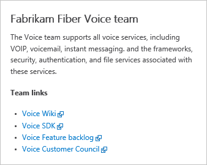
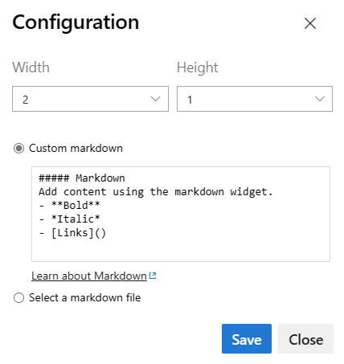
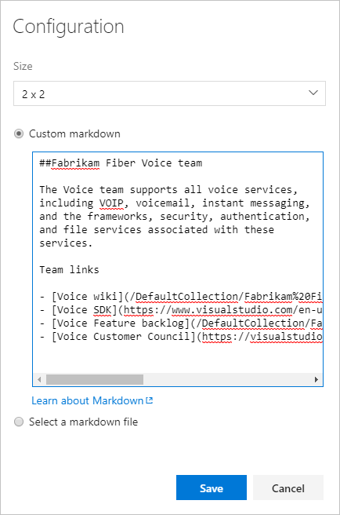

# Add Markdown to a dashboard

[!INCLUDE [version-lt-eq-azure-devops](../../includes/version-lt-eq-azure-devops.md)]

 

Use the Markdown widget to support your team and stakeholders by adding information such as:  
- Team goals. 
- Links to:
   - Team backlogs or boards.
   - Metrics.
   - Other items located in a network share such as a OneNote, SharePoint site, or wiki pages.
- Important dates or target deadlines.

Here's an example:  
 

[!INCLUDE [temp](../includes/dashboard-prerequisites.md)]  

## Supported Markdown syntax

The Markdown widget supports CommonMark standard features, such as: 
- Headings 
- Paragraphs and line breaks
- Blockquotes
- Horizontal rule 
- Emphasis (bold, italics, strikethrough)
- Tables
- Lists, both ordered and unordered  
- Links
- Images 
- Escaping characters

For details on usage, see [Syntax guidance for basic Markdown usage](../../project/wiki/markdown-guidance.md).

For performance reasons, the Markdown widget doesn't add support for many extended features, many of which are supported in the wiki. Extended capabilities would impede widget load time. For example, the following extended Markdown features aren't supported in the Markdown widget:
- Embedded HTML syntax  
- Code highlighting (wiki/others support language-syntax aware color coding, CommonMark just renders code as plain preformatted text)
- Checklists
- Emoji characters  
- Attachments
- Math formulas

## Connect to your project 

To add the Markdown widget to a dashboard, you connect to your project using a [supported web browser](/azure/devops/server/compatibility#supported-browsers). 

::: moniker range=">= azure-devops-2019"  
Open a web browser, connect to your project, and  select **Overview>Dashboards**. 

> [!div class="mx-imgBorder"]  
> 

If you need to switch to a different project, select the :::image type="icon" source="../../media/icons/project-icon.png" border="false"::: Azure DevOps logo to [browse all projects](../../project/navigation/go-to-project-repo.md).  

::: moniker-end  

::: moniker range="tfs-2018"

Open a web browser, connect to your project, and  select **Dashboards**. 

 

If you need to switch to a different project, select the :::image type="icon" source="../../media/icons/project-icon.png" border="false"::: Azure DevOps logo to [browse all projects and teams](../../project/navigation/go-to-project-repo.md).  

::: moniker-end

## Add the Markdown widget

If you need to add a dashboard, see [Add, rename, and delete dashboards](dashboards.md).  

::: moniker range=">= azure-devops-2019"
To add the Markdown widget to the dashboard, select :::image type="icon" source="media/icons/edit-icon.png" border="false"::: **Edit**. The widget catalog will automatically open.  

1. Add or drag the Markdown widget onto the dashboard where you want it located.  

	  

1. Select **Done Editing** to exit dashboard editing. This will dismiss the widget catalog. You can then configure the Markdown widget as needed.

2. Select the  gear icon to open the configuration dialog for the widget. 

	To edit a Markdown widget, you may need to be a team admin, a member of the Project Administrators group, or be granted permissions. To learn more, see [Set dashboard permissions](dashboard-permissions.md). 

3. Adjust the widget size as needed to fit the contents of the Markdown you'll enter. The largest size is 10 tiles wide by 10 tiles tall. You can always adjust this later. 

	  

4. Enter the text and Markdown syntax into the configuration the configuration dialog. For supported syntax, see [Syntax guidance for Markdown files, widgets, wikis, and pull request comments](../../project/wiki/markdown-guidance.md).

	Here we show some simple text with a bulleted list of four links

	 

	> [!TIP]  
	> To link to a wiki page,use the following syntax: 
	> `/ProjectName/_wiki/wikis/WikiRepositoryName?pagePath=/FileName` 
	> 
	> To link to a repository file, page, or image within the project, rich-click the file and use the full URL.

	This renders the following widget: 

	 

	> [!NOTE]  
	> Links to documents on file shares using `file://` are not supported. This restriction has been implemented for security purposes.
	
5. Optionally, you can select to point to a file in your repository.  

	 

::: moniker-end

::: moniker range="tfs-2018"  

1. Select :::image type="icon" source="media/edit-dashboard-icon.png" border="false"::: **Edit** to modify a dashboard.  

1. Select :::image type="icon" source="media/add-widget-icon.png" border="false"::: to open the widget catalog.  

2. Drag the Markdown widget onto the dashboard where you want it located.  

	  

3. Select the  gear icon to open the configuration dialog for the widget. 

	To edit a Markdown widget, you may need to be a team admin, a member of the Project Administrators group, or be granted permissions. To learn more, see [Set dashboard permissions](dashboard-permissions.md). 

4. Adjust the widget size as needed to fit the contents of the Markdown you'll enter. The largest size is 10 tiles wide by 10 tiles tall. You can always adjust this later. 

	  

5. Enter the text and Markdown syntax into the configuration the configuration dialog. For supported syntax, see [Syntax guidance for Markdown files, widgets, wikis, and pull request comments](../../project/wiki/markdown-guidance.md).

	Here we show some simple text with a bulleted list of four links

	 

	To link to a wiki page, repository file, or page within the project, use this format: 

	`/DefaultCollection/Fabrikam%20Fiber/Voice/_wiki?pagePath=%2FHome`
	`/DefaultCollection/Fabrikam%20Fiber/Voice/_git/Fabrikam%20Fiber?path=%2FREADME.md`
	`/DefaultCollection/Fabrikam%20Fiber/Voice/_backlogs?level=Backlog%20items&showParents=false&_a=backlog`

	This renders the following widget: 

	 

	> [!NOTE]  
	> Links to documents on file shares using `file://` are not supported. This restriction has been implemented for security purposes.
	
6. Optionally, you can select to point to a file in your repository.

	 

7. If you haven't closed the widget catalog yet, do that now.

8. If you want to reposition the Markdown widget or other widgets on the dashboard, do that now while you're still in dashboard edit mode. 

9. When you're finished with your changes, select  to exit dashboard editing.

::: moniker-end

## Related articles
- [Add and manage dashboards](dashboards.md)
- [Add a widget to a dashboard](add-widget-to-dashboard.md)
- [Syntax guidance for Markdown files, widgets, wikis, and pull request comments](../../project/wiki/markdown-guidance.md)
- [Marketplace widgets](https://marketplace.visualstudio.com/search?term=widget&target=VSTS&category=All%20categories&sortBy=Relevance)

