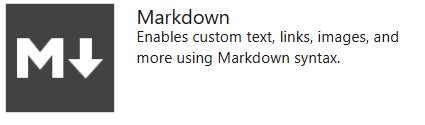
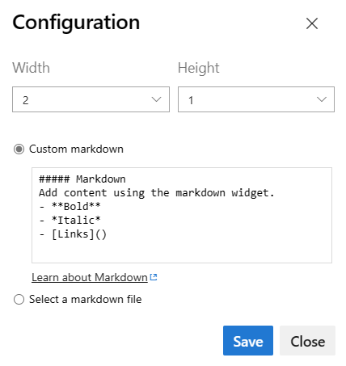

# Add Markdown to a dashboard

[!INCLUDE [version-lt-eq-azure-devops](../../includes/version-lt-eq-azure-devops.md)]

 

Add the Markdown widget to a dashboard to share useful information with your team and stakeholders. Use it to display:

- Team goals and important dates
- Links to backlogs, boards, or metrics
- Links to items on a network share, such as a OneNote notebook, SharePoint site, or wiki page

The following example shows team information and links:

:::image type="content" source="../../project/wiki/media/markdown-guidance/markdown-widget-configured.png" alt-text="Screenshot of sample Markdown widget.":::

## Prerequisites

[!INCLUDE [temp](../includes/dashboard-prerequisites.md)]  

## Supported Markdown syntax

The Markdown widget supports CommonMark standard features, such as:
- Headings
- Paragraphs and line breaks
- Blockquotes
- Horizontal rule
- Emphasis (bold, italics, strikethrough)
- Tables
- Lists, both ordered and unordered
- Links
- Images
- Character escaping

For more information, see [Syntax guidance for basic Markdown usage](../../project/wiki/markdown-guidance.md).

For performance reasons, the Markdown widget doesn't support the following extended features that the wiki supports:
- Embedded HTML
- Code highlighting (CommonMark renders code as plain preformatted text)
- Checklists
- Emoji characters
- Attachments
- Math formulas

## Add the Markdown widget

To add a dashboard, see [Add, rename, and delete dashboards](dashboards.md).  

1. Sign in to your project (`https://dev.azure.com/{Your_Organization/Your_Project}`).
1. Select **Dashboards**.
1. Select :::image type="icon" source="media/icons/edit-icon.png" border="false"::: **Edit**. The widget catalog opens.  
1. Add or drag the **Markdown** widget onto the dashboard.  

    

1. Select **Done Editing** to exit dashboard editing and dismiss the widget catalog.
1. Select :::image type="icon" source="../../media/icons/actions-icon.png" border="false"::: **More actions** >  **Configure**.

   :::image type="content" source="media/widget-more-actions-configure.png" alt-text="Screenshot shows three dots for more actions, and the highlighted Configure button.":::

1. (Optional) Adjust the widget size. The maximum size is 10 tiles wide by 10 tiles tall. You can adjust the size later. 
1. Enter text and Markdown syntax. For supported syntax, see [Syntax guidance for Markdown files, widgets, wikis, and pull request comments](../../project/wiki/markdown-guidance.md).

   

   > [!NOTE]  
   > - For security reasons, links to documents on file shares using `file://` aren't supported. 
   > - To link to a wiki page, use the following syntax:
   > `/ProjectName/_wiki/wikis/WikiRepositoryName?pagePath=/FileName`
   > - To link to a repository file, page, or image within the project, select **Select a markdown file**, and then choose your **Repository**, **Branch**, and **Path**.

1. **Save** your changes.

## Related content
- [Add and manage dashboards](dashboards.md)
- [Add a widget to a dashboard](add-widget-to-dashboard.md)
- [Get syntax guidance for Markdown files, widgets, wikis, and pull request comments](../../project/wiki/markdown-guidance.md)
- [Browse marketplace widgets](https://marketplace.visualstudio.com/search?term=widget&target=VSTS&category=All%20categories&sortBy=Relevance)

