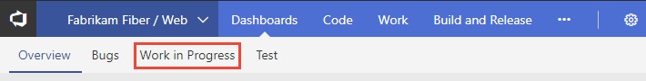
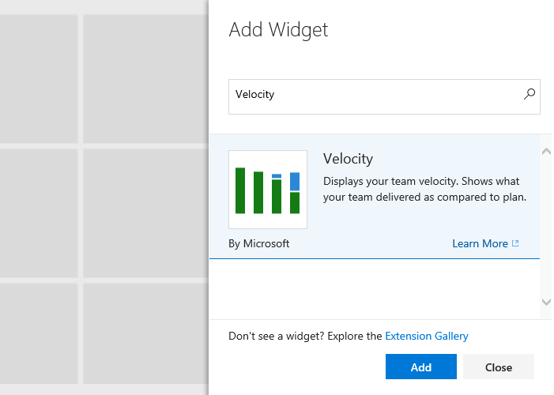
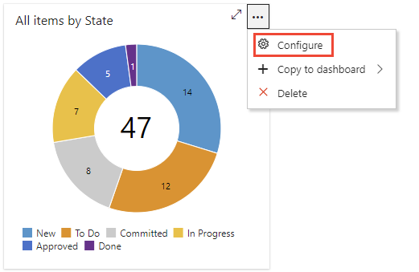
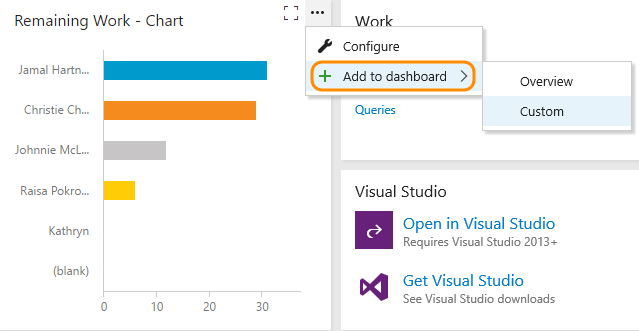
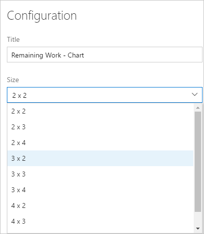

# Add widgets to a dashboard

[!INCLUDE [temp](../_shared/version-ts-tfs-2015-2016.md)] 

Widgets smartly format data to provide access to easily consumable data. You add widgets to your team dashboards to gain visibility into the status and trends occurring as you develop your software project. 

Each widget provides access to a chart, user-configurable information, or a set of links that open a feature or function. 
You can add one or more charts or widgets to your dashboard. Up to 200 widgets total. You add several widgets at a time simply by selecting each one. See [Manage dashboards](dashboards.md#manage) to determine the permissions you need to add and remove widgets from a dashboard.  

[!INCLUDE [temp](../_shared/dashboard-prerequisites.md)]  

::: moniker range=">= azure-devops-2019"

> [!NOTE]  
> Widgets specific to a service are disabled if the service they depend on has been disabled. For example, if **Boards** is disabled, New Work item and all Analytics widgets are disabled and won't appear in the widget catalog. To re-enable a service, see [Turn an Azure DevOps service on or off](../../organizations/settings/set-services.md).  

::: moniker-end

## Select a dashboard 
All dashboards are associated with a team. You need to be a team administrator, project administrator, or a team member with permissions to modify a dashboard. 

::: moniker range=">= azure-devops-2019"

0. Open a web browser, connect to your project, and choose **Overview>Dashboards**. The dashboard directory page opens.  

	> [!div class="mx-imgBorder"]  
	> 

	If you need to switch to a different project, choose the  Azure DevOps logo to [browse all projects](../../project/navigation/go-to-project-repo.md).  

0. Choose the dashboard you want to modify. 

::: moniker-end

::: moniker range=">= tfs-2015 <= tfs-2018"  
Open a web browser, connect to your project, and choose **Dashboards**. 

 

Select the team whose dashboards you want to view. To switch your team focus, see [Switch project or team focus](../../project/navigation/go-to-project-repo.md).

Choose the name of the dashboard to modify it. 

For example, here we choose to view the Work in Progress dashboard. 

> [!div class="mx-imgBorder"]  
>   

If you need to switch to a different project, choose the  Azure DevOps logo to [browse all projects](../../project/navigation/go-to-project-repo.md).  
::: moniker-end  

## Add a widget   
::: moniker range=">= azure-devops-2019"

To add widgets to the dashboard, choose  **Edit**. 

The widget catalog will automatically open.  Add all the widgets that you want and drag their tiles into the sequence you want. 

When you're finished with your additions, choose  **Done Editing** to exit dashboard editing. This will dismiss the widget catalog. You can then [configure the widgets](#configure) as needed.

> [!TIP]   
> When you're in dashboard edit mode, you can remove, rearrange, and configure widgets, as well as add new widgets. Once you leave edit mode, the widget tiles remain locked, reducing the chances of accidentally moving a widget.

To remove a widget, choose the  actions icon and select the **Delete** option from the menu.  

> [!div class="mx-imgBorder"]  
>  

::: moniker-end

::: moniker range=">= tfs-2015 <= tfs-2018"  
Choose  to modify a dashboard. Choose  to add a widget to the dashboard.  

The [widget catalog](widget-catalog.md) describes all the available widgets, many of which are scoped to the selected team context.  

::: moniker-end

::: moniker range=">= tfs-2017 <= tfs-2018"
Or, you can drag and drop a widget from the catalog onto the dashboard.

::: moniker-end

<a id="add-analytics-widget" />
::: moniker range="azure-devops-2019"
## Add an Analytics widget

This example shows how to add the Velocity widget available from the Analytics service to a dashboard. 

0. Connect to the web portal for your project and choose **Overview>Dashboards**. 

	> [!div class="mx-imgBorder"]  
	> 

	If you need to switch to a different project, choose the  Azure DevOps logo to [browse all projects and teams](../../project/navigation/go-to-project-repo.md).  
0. Make sure that the [Analytics Marketplace extension](../dashboards/analytics-extension.md) has been installed. The Analytics widgets won't be available until it is installed.  

0. [Choose the dashboard](dashboards.md#choose-dashboard) that you want to modify. 

0. Choose  **Edit** to modify a dashboard. The widget catalog opens.  

0. In the right pane search box, type **Velocity** to quickly locate the Velocity widget within the widget catalog.  

	> [!div class="mx-imgBorder"]  
	> 

0. Choose the widget, then **Add** to add it to the dashboard. Or, you can drag-and-drop it onto the dashboard. 

0. Next, configure the widget. For details, see the following articles: 
	- [Configure burndown or burnup](configure-burndown-burnup-widgets.md)
	- [Configure cumulative flow](cumulative-flow.md)  
	- [Configure lead/cycle time](cycle-time-and-lead-time.md)  
	- [Configure velocity](team-velocity.md)  
	- [Configure test trend results](configure-test-results-trend.md)  

::: moniker-end

<a id="configure" />

## Configure a widget  
Most widgets support configuration, which may include specifying the title, setting the widget size, and other widget-specific variables.

::: moniker range=">= tfs-2018"

To configure a widget, add the widget to a dashboard, choose open the  menu, and select **Configure**.  

> [!div class="mx-imgBorder"]  
>  

::: moniker-end

::: moniker range="azure-devops"

Additional information is provided to configure the following widgets: 
- [Burndown/burnup](configure-burndown-burnup-widgets.md)
- [Cumulative flow](cumulative-flow.md)
- [Lead time or cycle time](cycle-time-and-lead-time.md)
- [Velocity widget](team-velocity.md)
- [Test trend results](configure-test-results-trend.md)

::: moniker-end

::: moniker range="azure-devops-2019"

Additional information is provided to configure the following widgets: 
- [Burndown/burnup](configure-burndown-burnup-widgets.md)
- [Cumulative flow](cumulative-flow.md)
- [Lead time or cycle time](cycle-time-and-lead-time.md)
- [Velocity widget](team-velocity.md)

::: moniker-end

::: moniker range=">= tfs-2015 <= tfs-2017"

To configure a widget, add the widget to a dashboard and then choose the  configure icon. 
  
 
Once you've configured the widget, you can edit it by opening the actions menu. 

 

::: moniker-end

<a id="move-delete" />
## Move or delete a widget 
To move a widget, you need to enable the dashboard edit mode. To delete a widget, simply select the delete option provided from the widget's options menu. 

::: moniker range="tfs-2015"
Just as you have to be a team or project admin to add items to a dashboard, you must have admin permissions to remove items. 
::: moniker-end

::: moniker range=">= azure-devops-2019"
Choose  **Edit** to modify your dashboard. You can then add widgets or drag tiles to reorder their sequence on the dashboard. 

To remove a widget, choose the  actions icon and select the **Delete** option from the menu.  

> [!div class="mx-imgBorder"]  
>  

When you're finished with your changes, choose  **Done Editing** to exit dashboard editing.
  
::: moniker-end

::: moniker range=">= tfs-2015 <= tfs-2018"  
Choose  to modify your dashboard. You can then drag tiles to reorder their sequence on the dashboard. 

::: moniker-end

::: moniker range="tfs-2018"

To remove a widget, choose the  actions icon and select the **Delete** option from the menu.  

> [!div class="mx-imgBorder"]  
>  

::: moniker-end

::: moniker range=">= tfs-2015 <= tfs-2017"

To remove a widget, choose the widget's  or  delete icons.  

::: moniker-end

::: moniker range=">= tfs-2015 <= tfs-2018"  

When you're finished with your changes, choose  to exit dashboard editing.

::: moniker-end

::: moniker range=">= tfs-2018"

<a id="copy" />
## Copy a widget
You can copy a widget to the same dashboard or to another team dashboard. If you want to move widgets you have configured to another dashboard, this is how you do it. Before you begin, add the dashboard you want to copy or move the widget to. Once you've copied the widget, you can delete it from the current dashboard.  
::: moniker-end

::: moniker range=">= azure-devops-2019"
To copy a configured widget to another team dashboard, choose the  actions icon and select **Copy to dashboard** and then the dashboard to copy it to. 

> [!div class="mx-imgBorder"]  
>  

::: moniker-end

::: moniker range="tfs-2018"

To copy a configured widget to another team dashboard, choose the  actions icon and select **Add to dashboard** and then the dashboard to copy it to. 

  
::: moniker-end

## Widget size
Some widgets are pre-sized and can't be changed. Others are configurable through their configuration dialog. 

For example, the Chart for work items widget allows you to select an area size ranging from 2 x 2  to 4 x 4 (tiles).  

  

## Extensibility and Marketplace widgets

In addition to the widgets described in the Widget catalog, you can add widgets from the [Marketplace](https://marketplace.visualstudio.com/search?term=widget&target=AzureDevOps&category=All%20categories&sortBy=Relevance), or create your own widgets using the [Widget REST APIs](../../extend/develop/add-dashboard-widget.md). 

### Disabled Marketplace widget 
If your organization owner or project collection administrator disables a marketplace widget, you'll see the following image: 

   

To regain access to it, request your admin to reinstate or reinstall the widget. 

## Try this next 
> [!div class="nextstepaction"]
> [Review the widget catalog](widget-catalog.md)
> or
> [Review Marketplace widgets](https://marketplace.visualstudio.com/search?term=widget&target=VSTS&category=All%20categories&sortBy=Relevance)
 
## Related articles

::: moniker range=">= azure-devops-2019"
- [Widgets based on the Analytics Service](../dashboards/analytics-widgets.md)
- [What is the Analytics Service?](../powerbi/what-is-analytics.md)
- [Burndown guidance](burndown-guidance.md)
- [Cumulative flow & lead/cycle time guidance](cumulative-flow-cycle-lead-time-guidance.md)
- [Velocity guidance](velocity-guidance.md)
::: moniker-end

::: moniker range=">= tfs-2015 <= tfs-2018"
- [Burndown guidance](burndown-guidance.md)
- [Cumulative flow & lead/cycle time guidance](cumulative-flow-cycle-lead-time-guidance.md)
- [Velocity guidance](velocity-guidance.md)
::: moniker-end

