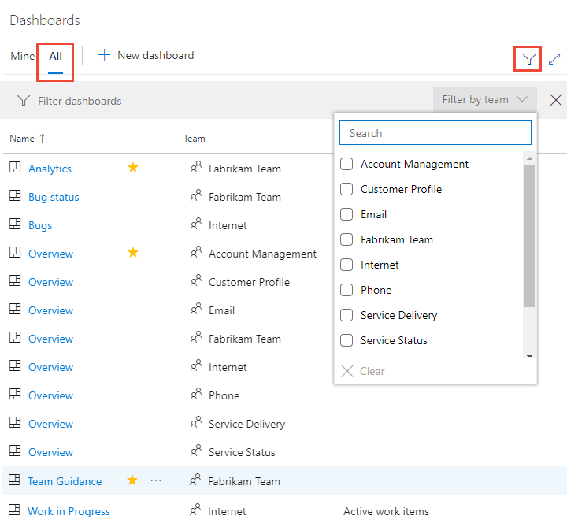

# Add widgets to a dashboard

**VSTS | TFS 2018 | TFS 2017 | TFS 2015.1**

::: moniker range=">= tfs-2015"

Widgets smartly format data to provide access to easily consumable data. You add widgets to your team dashboards to gain visibility into the status and trends occurring as you develop your software project. 

Each widget provides access to a chart, user-configurable information, or a set of links that open a feature or function. 
You can add one or more charts or widgets to your dashboard. Up to 200 widets total. You add several widgets at a time simply by selecting each one. See [Manage dashboards](dashboards.md#manage) to determine the permissions you need to add and remove widgets from a dashboard.  

::: moniker-end

::: moniker range="vsts"
[!INCLUDE [temp](../_shared/dashboard-prerequisites-vsts.md)]
::: moniker-end

::: moniker range=">= tfs-2017 <= tfs-2018"
[!INCLUDE [temp](../_shared/dashboard-prerequisites-tfs-2017-18.md)]
::: moniker-end

::: moniker range="tfs-2015"
[!INCLUDE [temp](../_shared/dashboard-prerequisites-tfs-2015.md)]
::: moniker-end

::: moniker range=">= tfs-2015"

## Connect to the web portal for your team project 

To add a widget to a dashboard, you connect to your team project using a [supported web browser](/tfs/server/compatibility#supported-browsers).  If you don't have a team project yet, create one in [VSTS](../../organizations/accounts/create-account-msa-or-work-student.md)<!--- or set one up in an [on-premises TFS](../../organizations/accounts/create-team-project.md)-->.

Open a browser window and click the **Dashboards** hub. If you haven't been added as a team member, [get added now](../../work/scale/multiple-teams.md#add-team-members).

 

If you don't see the team or team project you want, click the  project icon to [browse all team projects and teams](../../user-guide/account-home-pages.md).  

    
::: moniker-end

::: moniker range=">= tfs-2015"

## Select a dashboard to modify 

All dashboards are associated with a team. You need to be a team administrator, project administrator, or a team member with permissions to modify a dashboard. 

::: moniker-end

# [New Dashboards Experience](#tab/new-query-exp) 

::: moniker range="vsts"

To enable the New Dashboard experience, see [Enable preview features](../../project/navigation/preview-features.md).  

1. From the **Dashboards** hub, open the selector and choose  the **Browse all dashboards** option. 
 
	> [!div class="mx-imgBorder"]  
	>   

2. The **All** page lists all dashboards defined for the team project in alphabetical order. You can filter the list by team or by keyword.   
 
	> [!div class="mx-imgBorder"]  
	>   
   
::: moniker-end

::: moniker range=">= tfs-2015 <= tfs-2018"
The New Dashboard experience is only available from VSTS at this time. 

::: moniker-end

# [Old Dashboards Experience](#tab/old-query-exp)

::: moniker range=">= tfs-2015"

1. Select the team whose dashboards you want to view. To switch your team focus, see [Switch team project or team focus](../../organizations/settings/switch-team-context.md).

2. Click the **Dashboards** hub.

3. Click the name of the dashboard to modify it. 

	For example, here we choose to view the Work in Progress dashboard. 

	> [!div class="mx-imgBorder"]  
	>   

::: moniker-end

---

## Add a widget to a dashboard  

<!---
Widget images may vary depending on which platform you access. This topic shows images that appear in VSTS. However, the widget title and functionality described in this topic are valid for both VSTS and TFS. For example, dashboard edit mode controls shown below are valid for VSTS and TFS 2015.2 and later version. Some functionality differs when you connect to TFS 2015.1 or earlier versions.  
-->

 
# [New Dashboards Experience](#tab/new-query-exp) 

::: moniker range="vsts"

To enable the New Dashboard experience, see [Enable preview features](../../project/navigation/preview-features.md).  

To add widgets to the dashboard, click . 

The widget catalog will automatically open.  Add all the widgets that you want and drag their tiles into the sequence you want. 

When you're finished with your additions, click  **Done Editing** to exit dashboard editing. This will dismiss the widget catalog. You can then [configure the widgets](#configure) as needed.

> [!TIP]   
> When you're in dashboard edit mode, you can remove, rearrange, and configure widgets, as well as add new widgets. Once you leave edit mode, the widget tiles remain locked, reducing the chances of accidentally moving a widget.

To remove a widget, click the  actions icon and select the **Delete** option from the menu.  

> [!div class="mx-imgBorder"]  
>  

::: moniker-end

::: moniker range=">= tfs-2015 <= tfs-2018"
The New Dashboard experience is only available from VSTS at this time. 
::: moniker-end

# [Old Dashboards Experience](#tab/old-query-exp)

::: moniker range=">= tfs-2015"

Click  to modify a dashboard. Click  to add a widget to the dashboard.  

The [widget catalog](widget-catalog.md) describes all the available widgets, many of which are scoped to the selected team context.  

::: moniker-end

::: moniker range=">= tfs-2017 <= tfs-2018"
Or, you can drag and drop a widget from the catalog onto the dashboard.

::: moniker-end

---

::: moniker range=">= tfs-2015"

<a id="configure" />

## Configure a widget  

Most widgets support configuration, which may include specifying the title, seeting the widget size, and other widget-specific variables.   

::: moniker-end

::: moniker range="vsts || >= tfs-2018"

To configure a widget, add the widget to a dashboard, click open the  menu, and select **Configure**.  

> [!div class="mx-imgBorder"]  
>  

::: moniker-end

::: moniker range=">= tfs-2015 <= tfs-2017"

To configure a widget, add the widget to a dashboard and then click the  configure icon. 

  
 
Once you've configured the widget, you can edit it by opening the actions menu. 

 

::: moniker-end

::: moniker range=">= tfs-2015"

## Move or delete a widget from a dashboard 

To move a widget, you need to enable the dashboard edit mode. To delete a widget, simply select the delete option provided from the widget's options menu. 

::: moniker-end

::: moniker range="tfs-2015"
Just as you have to be a team or project admin to add items to a dashboard, you must have admin permissions to remove items. 
::: moniker-end

# [New Dashboards Experience](#tab/new-query-exp) 

::: moniker range="vsts"

Click  to modify your dashboard. You can then add widgets or drag tiles to reorder their sequence on the dashboard. 

To remove a widget, click the  actions icon and select the **Delete** option from the menu.  

> [!div class="mx-imgBorder"]  
>  

When you're finished with your changes, click  **Done Editing** to exit dashboard editing.
  
::: moniker-end

# [Old Dashboards Experience](#tab/old-query-exp)

::: moniker range=">= tfs-2015"

Click  to modify your dashboard. You can then drag tiles to reorder their sequence on the dashboard. 

::: moniker-end

::: moniker range=">= tfs-2018"

To remove a widget, click the  actions icon and select the **Delete** option from the menu.  

> [!div class="mx-imgBorder"]  
>  

::: moniker-end

::: moniker range=">= tfs-2015 <= tfs-2017"

To remove a widget, click the widget's  or  delete icons.  

::: moniker-end

::: moniker range=">= tfs-2015"

When you're finished with your changes, click  to exit dashboard editing.

::: moniker-end

---

::: moniker range=">= tfs-2018"

## Copy a widget to another dashboard

You can copy a widget to another dashboard defined for your team. If you want to move widgets you have configured to another dashboard, this is how you do it. Before you begin, add the dashboard you want to copy or move the widget to. Once you've copied the widget, you can delete it from the current dashboard.  

::: moniker-end

::: moniker range="vsts"

To copy a configured widget to another team dashboard, click the  actions icon and select **Copy to dashboard** and then the dashboard to copy it to. 

> [!div class="mx-imgBorder"]  
>  

::: moniker-end

::: moniker range="tfs-2018"

To copy a configured widget to another team dashboard, click the  actions icon and select **Add to dashboard** and then the dashboard to copy it to. 

  

::: moniker-end

::: moniker range="vsts"
## Analytics Service widgets 
The Analytics Service is in preview and provides access to several widgets. To learn more, see these topics: 
- [Widgets based on the Analytics Service](../analytics/analytics-widgets-vsts.md)
- [Add an Analytics widget to a dashboard](../analytics/enable-analytics-velocity.md)
- [What is the Analytics Service?](../analytics/what-is-analytics.md)

::: moniker-end

::: moniker range=">= tfs-2015"

## Try this next 

> [!div class="nextstepaction"]
> [Review the widget catalog](widget-catalog.md)
> or
> [Review Marketplace widgets](https://marketplace.visualstudio.com/search?term=widget&target=VSTS&category=All%20categories&sortBy=Relevance)

### Extensibility  
In addition to the widgets described in the Widget catalog, you can create your own widgets using the [Widget REST APIs](../../extend/develop/add-dashboard-widget.md). 

### Widget size

Some widgets are pre-sized and can't be changed. Others are configurable through their configuration dialog. 

For example, the Chart for work items widget allows you to select an area size ranging from 2 x 2  to 4 x 4 (tiles).  

  

### Disabled Marketplace widget 

If your account or project collection administrator disables a marketplace widget, you'll see the following image: 

   

To regain access to it, request your admin to reinstate or reinstall the widget.  

::: moniker-end